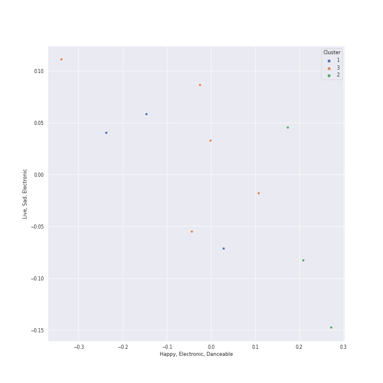

# Clusters in SEULGI

## Cluster #1

4 tracks

| Art | Track | Album | Artists | Label | Score | 💚 | 🔗 |
|:---|:---|:---|:---|:---|---:|:---|:---|
|  | Who Are You (Feat. SEULGI of Red Velvet) | Who Are You | BamBam, [SEULGI](../../overview.md) | ABYSS COMPANY | 0 | | [🔗](https://open.spotify.com/track/1IjWbIMe1uXqp9tDfC3QLL) |
|  | 28 Reasons | 28 Reasons - The 1st Mini Album | [SEULGI](../../overview.md) | [SM Entertainment](../../../../labels/sm_entertainment) | 12006 | 💚 | [🔗](https://open.spotify.com/track/1dfsPqH09vnzUWEOsN98Ex) |
|  | Bad Boy, Sad Girl | 28 Reasons - The 1st Mini Album | [SEULGI](../../overview.md), BE'O | [SM Entertainment](../../../../labels/sm_entertainment) | 0 | | [🔗](https://open.spotify.com/track/4K08CJWZXj85wkMIvCrVFg) |
|  | SELFISH (Feat. SEULGI Of Red Velvet) | SELFISH | Moon Byul, [SEULGI](../../overview.md) | [RBW, Inc](../../../../labels/rbw_inc_) | 0 | | [🔗](https://open.spotify.com/track/4Lgd631IfDKMLPu6t7L0Tj) |
## Cluster #2

4 tracks

| Art | Track | Album | Artists | Label | Score | 💚 | 🔗 |
|:---|:---|:---|:---|:---|---:|:---|:---|
|  | Drop | School Rapper FINAL | MARK, [SEULGI](../../overview.md) | [Genie Music Corporation](../../../../labels/genie_music_corporation) | 0 | | [🔗](https://open.spotify.com/track/5ruVKc6a9Gq2YxFeuiHPJu) |
|  | Hot & Cold | 2022 Winter SMTOWN : SMCU PALACE | KAI, [SEULGI](../../overview.md), JENO, KARINA | [SM Entertainment](../../../../labels/sm_entertainment) | 0 | | [🔗](https://open.spotify.com/track/1oy2B6xsqSwCRBBynYtaUl) |
|  | Anywhere But Home | 28 Reasons - The 1st Mini Album | [SEULGI](../../overview.md) | [SM Entertainment](../../../../labels/sm_entertainment) | 0 | | [🔗](https://open.spotify.com/track/7vRodvsF37NGUYRSVMIRXj) |
|  | Wow Thing | Wow Thing | [SEULGI](../../overview.md), [CHUNG HA](../../../chung_ha/overview.md), SinB, [JEON SOYEON](../../../jeon_soyeon/overview.md) | [SM Entertainment](../../../../labels/sm_entertainment) | 1 | 💚 | [🔗](https://open.spotify.com/track/5MwfxCtqMFGYp9Nc1BkTrS) |
## Cluster #3

3 tracks

| Art | Track | Album | Artists | Label | Score | 💚 | 🔗 |
|:---|:---|:---|:---|:---|---:|:---|:---|
|  | Doll | Doll - SM STATION | [WENDY](../../../wendy/overview.md), [SEULGI](../../overview.md), KANGTA | [SM Entertainment](../../../../labels/sm_entertainment) | 0 | | [🔗](https://open.spotify.com/track/5Iy48VE6KN7Ywml5hlOd9u) |
|  | Crown | 28 Reasons - The 1st Mini Album | [SEULGI](../../overview.md) | [SM Entertainment](../../../../labels/sm_entertainment) | 4119 | 💚 | [🔗](https://open.spotify.com/track/4Y0EawuG8OtyYNyJulWnDu) |
|  | Dead Man Runnin’ | 28 Reasons - The 1st Mini Album | [SEULGI](../../overview.md) | [SM Entertainment](../../../../labels/sm_entertainment) | 3413 | 💚 | [🔗](https://open.spotify.com/track/5eFGkCXi83auDi0bcDBEKD) |