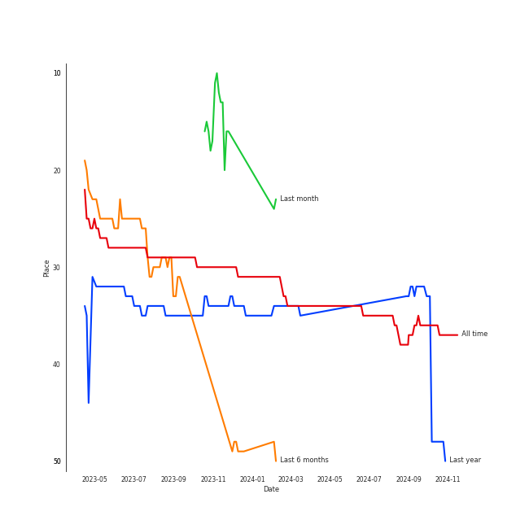
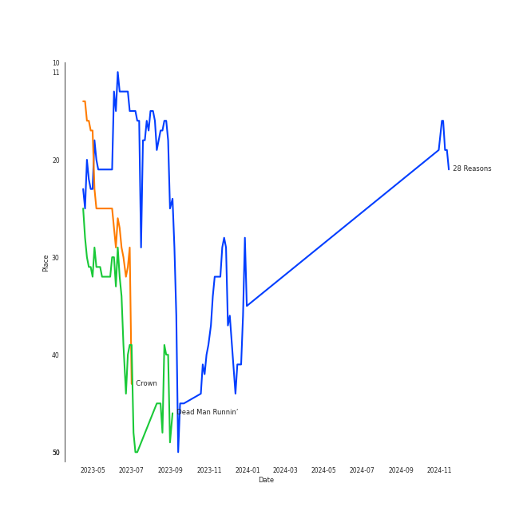

# SEULGI

[See Track Features](audio_features.md)

[See Clusters](clusters/overview.md)

## Relationships

SEULGI:
- is a member of [GOT the beat](../got_the_beat/overview.md)
- is a member of [Red Velvet](../red_velvet/overview.md)
- is a member of Red Velvet - IRENE & SEULGI

## Artist Rank

## Top Tracks

- 28 Reasons is:
    - the #38 track of all time

### Top tracks of the last 6 months over time

## Featured on Playlists
| Art | Tracks | Playlist |
|:---|---:|:---|
|  | 10 | [K-Pop](../../playlists/k-pop/overview.md) |
|  | 3 | [Halloween](../../playlists/halloween/overview.md) |
|  | 2 | [K-Pop Favorites](../../playlists/k-pop_favorites/overview.md) |
|  | 2 | [Chill](../../playlists/chill/overview.md) |
|  | 1 | [Check Out Later](../../playlists/check_out_later/overview.md) |
|  | 1 | [Sharon RPD](../../playlists/sharon_rpd/overview.md) |

## Top Albums

| Art | Tracks | 💚 | Album | Release Date | 🔗 |
|:---|---:|---:|:---|:---|:---|
|  | 5 | 3 | 28 Reasons - The 1st Mini Album | 2022-10-04 | [🔗](https://open.spotify.com/album/1t5a29WYbJj83iy3RNICHw) |
|  | 1 | 1 | Wow Thing | 2018-09-28 | [🔗](https://open.spotify.com/album/3xEPyp7h78uULpDPuKvokH) |
|  | 1 | 0 | Who Are You | 2021-12-28 | [🔗](https://open.spotify.com/album/7cvrTHkHU8UBnmhHLVUWnL) |
|  | 1 | 0 | School Rapper FINAL | 2017-04-01 | [🔗](https://open.spotify.com/album/1HlNyrcRkCbpi87jz6rY7y) |
|  | 1 | 0 | SELFISH | 2018-05-23 | [🔗](https://open.spotify.com/album/0HtGtnnnFeWmtvgNFg0dr1) |
|  | 1 | 0 | Doll - SM STATION | 2017-10-27 | [🔗](https://open.spotify.com/album/6YHteiOLrZ7gfQEqq2TeRM) |
|  | 1 | 0 | 2022 Winter SMTOWN : SMCU PALACE | 2022-12-26 | [🔗](https://open.spotify.com/album/1HwnXJfZx8N8qDfzwUbxcw) |

## Top Record Labels

| Tracks | 💚 | Label |
|---:|---:|:---|
| 8 | 4 | [SM Entertainment](../../labels/sm_entertainment/overview.md) |
| 1 | 0 | [RBW Inc.](../../labels/rbw_inc_/overview.md) |
| 1 | 0 | [Genie Music Corporation](../../labels/genie_music_corporation/overview.md) |
| 1 | 0 | Abyss Company |

## Genres

- [k-pop](../../genres/k-pop/overview.md)

## Credits

### Credits by Type

| Credit Type | Tracks |
|:---|---:|
| Vocal | 15 |

## Tracks

| Art | Track | Album | Artists | Label | Score | 💚 | 🔗 |
|:---|:---|:---|:---|:---|---:|:---|:---|
|  | 28 Reasons | 28 Reasons - The 1st Mini Album | [SEULGI](overview.md) | [SM Entertainment](../../labels/sm_entertainment) | 12006 | 💚 | [🔗](https://open.spotify.com/track/1dfsPqH09vnzUWEOsN98Ex) |
|  | Crown | 28 Reasons - The 1st Mini Album | [SEULGI](overview.md) | [SM Entertainment](../../labels/sm_entertainment) | 4119 | 💚 | [🔗](https://open.spotify.com/track/4Y0EawuG8OtyYNyJulWnDu) |
|  | Dead Man Runnin’ | 28 Reasons - The 1st Mini Album | [SEULGI](overview.md) | [SM Entertainment](../../labels/sm_entertainment) | 3413 | 💚 | [🔗](https://open.spotify.com/track/5eFGkCXi83auDi0bcDBEKD) |
|  | Wow Thing | Wow Thing | [SEULGI](overview.md), [CHUNG HA](../chung_ha/overview.md), SinB, [JEON SOYEON](../jeon_soyeon/overview.md) | [SM Entertainment](../../labels/sm_entertainment) | 1 | 💚 | [🔗](https://open.spotify.com/track/5MwfxCtqMFGYp9Nc1BkTrS) |
|  | Drop | School Rapper FINAL | MARK, [SEULGI](overview.md) | [Genie Music Corporation](../../labels/genie_music_corporation) | 0 | | [🔗](https://open.spotify.com/track/5ruVKc6a9Gq2YxFeuiHPJu) |
|  | Doll | Doll - SM STATION | [WENDY](../wendy/overview.md), [SEULGI](overview.md), KANGTA | [SM Entertainment](../../labels/sm_entertainment) | 0 | | [🔗](https://open.spotify.com/track/5Iy48VE6KN7Ywml5hlOd9u) |
|  | SELFISH (Feat. SEULGI Of Red Velvet) | SELFISH | Moon Byul, [SEULGI](overview.md) | [RBW, Inc](../../labels/rbw_inc_) | 0 | | [🔗](https://open.spotify.com/track/4Lgd631IfDKMLPu6t7L0Tj) |
|  | Who Are You (Feat. SEULGI of Red Velvet) | Who Are You | BamBam, [SEULGI](overview.md) | ABYSS COMPANY | 0 | | [🔗](https://open.spotify.com/track/1IjWbIMe1uXqp9tDfC3QLL) |
|  | Anywhere But Home | 28 Reasons - The 1st Mini Album | [SEULGI](overview.md) | [SM Entertainment](../../labels/sm_entertainment) | 0 | | [🔗](https://open.spotify.com/track/7vRodvsF37NGUYRSVMIRXj) |
|  | Bad Boy, Sad Girl | 28 Reasons - The 1st Mini Album | [SEULGI](overview.md), BE'O | [SM Entertainment](../../labels/sm_entertainment) | 0 | | [🔗](https://open.spotify.com/track/4K08CJWZXj85wkMIvCrVFg) |

See all tracks

| Art | Track | Album | Artists | Label | Score | 💚 | 🔗 |
|:---|:---|:---|:---|:---|---:|:---|:---|
|  | Hot & Cold | 2022 Winter SMTOWN : SMCU PALACE | KAI, [SEULGI](overview.md), JENO, KARINA | [SM Entertainment](../../labels/sm_entertainment) | 0 | | [🔗](https://open.spotify.com/track/1oy2B6xsqSwCRBBynYtaUl) |

