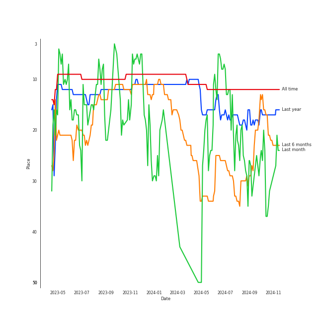
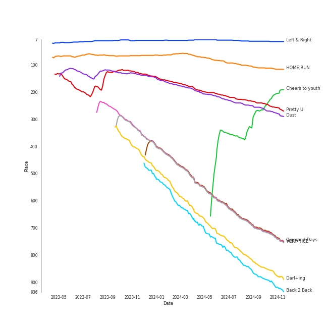
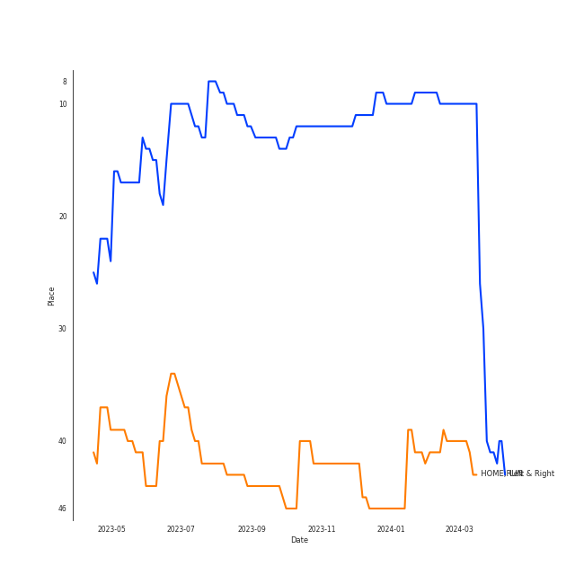
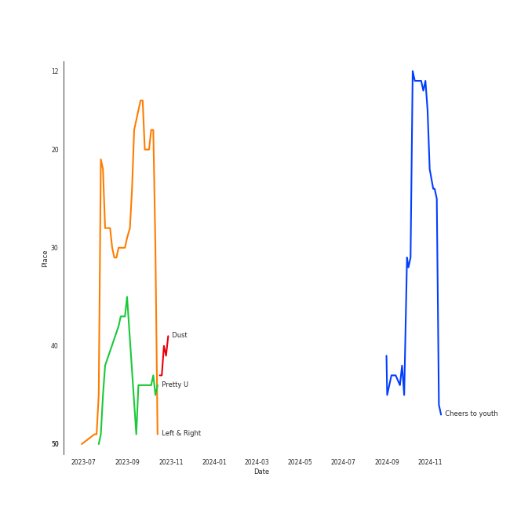
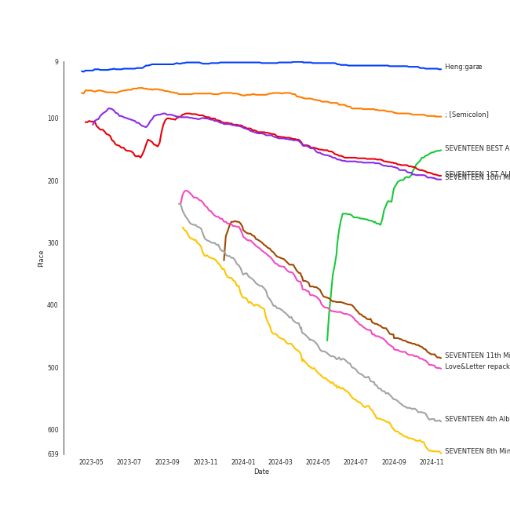
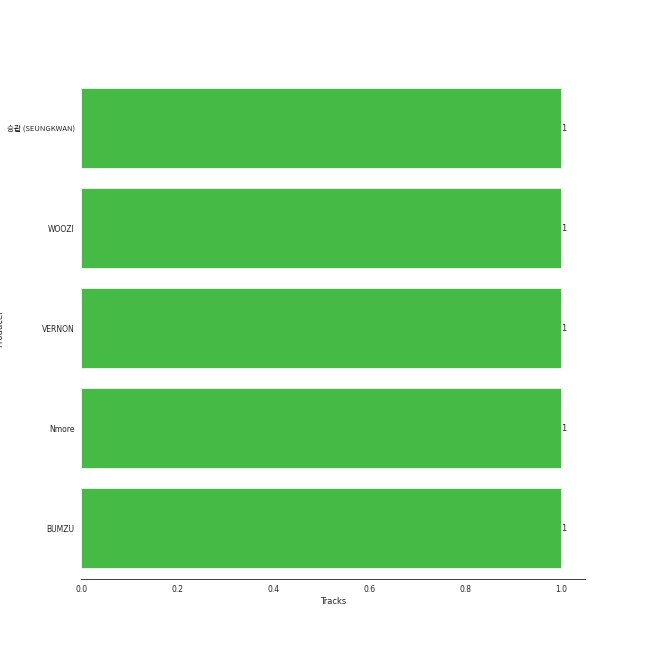

# SEVENTEEN

[See Track Features](audio_features.md)

[See Clusters](clusters/overview.md)

## Relationships

SEVENTEEN:
- has member DINO
- has member DK
- has member HOSHI
- has member 정한 (JEONGHAN)
- has member JOSHUA
- has member MINGYU
- has member S.COUPS
- has member 승관 (SEUNGKWAN)
- has member THE 8
- has member VERNON
- has member WONWOO
- has member WOOZI
- has member 文俊辉 (Wen, Junhui)

## Artist Rank
SEVENTEEN is currently:
- The #23 artist of the last 6 months
- The #17 artist of the last year
- The #12 artist of all time

## Top Tracks

### Top tracks of all time

Top tracks of the last year over time

Top tracks of the last 6 months over time

## Top Albums

| Art | Rank | Tracks | 💚 | Album | Release Date | 🔗 |
|:---|---:|---:|---:|:---|:---|:---|
|  | 588 | 4 | 2 | SEVENTEEN 4th Album 'Face the Sun' | 2022-05-27 | [🔗](https://open.spotify.com/album/4lfFgz2rD1irxf7dZhNJht) |
|  | 481 | 4 | 2 | SEVENTEEN 11th Mini Album 'SEVENTEENTH HEAVEN' | 2023-10-23 | [🔗](https://open.spotify.com/album/1rE0Gy69MFUh4GuXafWd0f) |
|  | 154 | 2 | 2 | SEVENTEEN BEST ALBUM '17 IS RIGHT HERE' | 2024-04-29 | [🔗](https://open.spotify.com/album/2Jrp37x38qZqtyrIrfxN4H) |
|  | 637 | 2 | 2 | SEVENTEEN 8th Mini Album 'Your Choice' | 2021-06-18 | [🔗](https://open.spotify.com/album/79VvXTQNeLr8KmvcdxN0Pc) |
|  | 196 | 2 | 1 | SEVENTEEN 10th Mini Album 'FML' | 2023-04-24 | [🔗](https://open.spotify.com/album/1JBzeeCJ3axQMVkqWbKh0I) |
|  | 20 | 2 | 1 | Heng:garæ | 2020-06-22 | [🔗](https://open.spotify.com/album/3q6lN3kfsDgGaQUC7kVASH) |
|  | 665 | 1 | 1 | SEVENTEEN 9th Mini Album 'Attacca' | 2021-10-22 | [🔗](https://open.spotify.com/album/2PIReru2w5i4JXOzeZnamd) |
|  | 665 | 1 | 1 | SEVENTEEN 4th Mini Album ‘Al1’ | 2017-05-22 | [🔗](https://open.spotify.com/album/2BNimvLLlD89e4Sb7ZVX6I) |
|  | 190 | 1 | 1 | SEVENTEEN 1ST ALBUM [FIRST ‘LOVE&LETTER’] | 2016-04-25 | [🔗](https://open.spotify.com/album/50BrkBakrLWufmTLjCVBwn) |
|  | 96 | 1 | 1 | ; [Semicolon] | 2020-10-19 | [🔗](https://open.spotify.com/album/1EMYSiKKTSKLZrOC2nTStL) |

See all albums

| Art | Rank | Tracks | 💚 | Album | Release Date | 🔗 |
|:---|---:|---:|---:|:---|:---|:---|
|  | 665 | 1 | 0 | SEVENTEEN 2ND ALBUM 'TEEN, AGE' (2) | 2017-11-06 | [🔗](https://open.spotify.com/album/5aHdNainJWMc3n2AqfiOg5) |
|  | 665 | 1 | 0 | SEVENTEEN 1st Mini Album ’17 CARAT’ | 2015-05-29 | [🔗](https://open.spotify.com/album/0H2K2JrzdvJcxBEPyxC2sl) |
|  | 498 | 1 | 0 | Love&Letter repackage album | 2016-07-04 | [🔗](https://open.spotify.com/album/7mP7AFehQDonPKEQiXvpvB) |
|  | 665 | 1 | 0 | 24H | 2020-08-24 | [🔗](https://open.spotify.com/album/24Uj6VdVytaReqt1KJWxfc) |

## Featured on Playlists
| Art | Tracks | Playlist |
|:---|---:|:---|
|  | 24 | [K-Pop](../../playlists/k-pop/overview.md) |
|  | 7 | [Workout](../../playlists/workout/overview.md) |
|  | 6 | [Summer](../../playlists/summer/overview.md) |
|  | 4 | [K-Pop Favorites](../../playlists/k-pop_favorites/overview.md) |
|  | 2 | [Your Top Songs 2022](../../playlists/your_top_songs_2022/overview.md) |
|  | 1 | [Retro Kpop](../../playlists/retro_kpop/overview.md) |
|  | 1 | [K-Pop 101](../../playlists/k-pop_101/overview.md) |
|  | 1 | [Sharon RPD](../../playlists/sharon_rpd/overview.md) |
|  | 1 | [Halloween](../../playlists/halloween/overview.md) |
|  | 1 | [애교！](../../playlists/애교！/overview.md) |
|  | 1 | [Chill](../../playlists/chill/overview.md) |

## Top Record Labels

| Tracks | 💚 | Label |
|---:|---:|:---|
| 24 | 14 | [PLEDIS Entertainment](../../labels/pledis_entertainment/overview.md) |

## Genres

- [k-pop](../../genres/k-pop/overview.md)
- [k-pop boy group](../../genres/k-pop_boy_group/overview.md)

## Credits

### Member Credits

| | VERNON | WOOZI | 승관 (SEUNGKWAN) |
|:---|---:|---:|---:|
| Lyricist | 1 | 1 | 1 |
| Songwriter | 0 | 1 | 0 |
### Production Credits

| Art | Track | Members | Credit Types |
|:---|:---|:---|:---|
|  | HOME;RUN | WOOZI, VERNON, 승관 (SEUNGKWAN) | Lyricist, Songwriter |

## Top Producers

| Art | Producer | Tracks | Credit Types |
|:---|:---|---:|:---|
| | WOOZI | 1 | Lyricist, Songwriter |
| | BUMZU | 1 | Arranger, Lyricist, Songwriter |
| | Nmore | 1 | Arranger, Songwriter |
|  | VERNON | 1 | Lyricist |
| | 승관 (SEUNGKWAN) | 1 | Lyricist |

## Tracks

| Art | Track | Album | Artists | Label | Rank | 💚 | 🔗 |
|:---|:---|:---|:---|:---|---:|:---|:---|
|  | Left & Right | Heng:garæ | [SEVENTEEN](overview.md) | [PLEDIS Entertainment](../../labels/pledis_entertainment) | 14 | 💚 | [🔗](https://open.spotify.com/track/5QGooKayQPVZMUDc8Qt3Dm) |
|  | HOME;RUN | ; [Semicolon] | [SEVENTEEN](overview.md) | [PLEDIS Entertainment](../../labels/pledis_entertainment) | 116 | 💚 | [🔗](https://open.spotify.com/track/2iW0q5jJJT5HKlIs25AAgv) |
|  | Cheers to youth | SEVENTEEN BEST ALBUM '17 IS RIGHT HERE' | [SEVENTEEN](overview.md) | [PLEDIS Entertainment](../../labels/pledis_entertainment) | 204 | 💚 | [🔗](https://open.spotify.com/track/1XvOEvWtfa879Wk1wKHZ1M) |
|  | Pretty U | SEVENTEEN 1ST ALBUM [FIRST ‘LOVE&LETTER’] | [SEVENTEEN](overview.md) | [PLEDIS ENTERTAINMENT](../../labels/pledis_entertainment) | 259 | 💚 | [🔗](https://open.spotify.com/track/1117juaaAkSIUsQxTmmcKM) |
|  | Dust | SEVENTEEN 10th Mini Album 'FML' | [SEVENTEEN](overview.md) | [PLEDIS Entertainment](../../labels/pledis_entertainment) | 281 | 💚 | [🔗](https://open.spotify.com/track/7v8v911KfBuFkqXvuDOtNm) |
|  | Diamond Days | SEVENTEEN 11th Mini Album 'SEVENTEENTH HEAVEN' | [SEVENTEEN](overview.md) | [PLEDIS Entertainment](../../labels/pledis_entertainment) | 745 | | [🔗](https://open.spotify.com/track/6n5M2Al3QgTScpO4AZH9OI) |
|  | Super | SEVENTEEN 10th Mini Album 'FML' | [SEVENTEEN](overview.md) | [PLEDIS Entertainment](../../labels/pledis_entertainment) | 748 | | [🔗](https://open.spotify.com/track/3AOf6YEpxQ894FmrwI9k96) |
|  | VERY NICE | Love&Letter repackage album | [SEVENTEEN](overview.md) | [PLEDIS ENTERTAINMENT](../../labels/pledis_entertainment) | 750 | | [🔗](https://open.spotify.com/track/1Rrj7KyS2R6SP9CQMDJW1w) |
|  | Darl+ing | SEVENTEEN 4th Album 'Face the Sun' | [SEVENTEEN](overview.md) | [PLEDIS Entertainment](../../labels/pledis_entertainment) | 888 | 💚 | [🔗](https://open.spotify.com/track/2j1Es5qEl4pD8GEe2WsYgP) |
|  | Back 2 Back | SEVENTEEN 11th Mini Album 'SEVENTEENTH HEAVEN' | [SEVENTEEN](overview.md) | [PLEDIS Entertainment](../../labels/pledis_entertainment) | 930 | | [🔗](https://open.spotify.com/track/40PKBUQRjtW2pUg4zv3y7r) |

See all tracks

| Art | Track | Album | Artists | Label | Rank | 💚 | 🔗 |
|:---|:---|:---|:---|:---|---:|:---|:---|
|  | Ready to love | SEVENTEEN 8th Mini Album 'Your Choice' | [SEVENTEEN](overview.md) | [PLEDIS Entertainment](../../labels/pledis_entertainment) | 970 | 💚 | [🔗](https://open.spotify.com/track/2FymmKBuog0loCuNXMwQID) |
|  | MAESTRO | SEVENTEEN BEST ALBUM '17 IS RIGHT HERE' | [SEVENTEEN](overview.md) | [PLEDIS Entertainment](../../labels/pledis_entertainment) | 985 | 💚 | [🔗](https://open.spotify.com/track/2UE9XGbAzicJIyo4bB6sqM) |
|  | Adore U | SEVENTEEN 1st Mini Album ’17 CARAT’ | [SEVENTEEN](overview.md) | [PLEDIS Entertainment](../../labels/pledis_entertainment) | 1015 | | [🔗](https://open.spotify.com/track/6wtgR5ZVbOZPHIeMNQwugp) |
|  | Don't Wanna Cry | SEVENTEEN 4th Mini Album ‘Al1’ | [SEVENTEEN](overview.md) | [PLEDIS ENTERTAINMENT](../../labels/pledis_entertainment) | 1015 | 💚 | [🔗](https://open.spotify.com/track/6Upu6yjkdi0DVI8E3IBZEU) |
|  | CLAP | SEVENTEEN 2ND ALBUM 'TEEN, AGE' (2) | [SEVENTEEN](overview.md) | [PLEDIS ENTERTAINMENT](../../labels/pledis_entertainment) | 1015 | | [🔗](https://open.spotify.com/track/19t5GSN3XsLB7UOsZD8Fwv) |
|  | Fearless | Heng:garæ | [SEVENTEEN](overview.md) | [PLEDIS Entertainment](../../labels/pledis_entertainment) | 1015 | | [🔗](https://open.spotify.com/track/1bhuTWST1TYIVdrsEaQDKa) |
|  | 24H | 24H | [SEVENTEEN](overview.md) | [PLEDIS ENTERTAINMENT](../../labels/pledis_entertainment) | 1015 | | [🔗](https://open.spotify.com/track/3gAR6cBifLqbW8kOrMqZPr) |
|  | Anyone | SEVENTEEN 8th Mini Album 'Your Choice' | [SEVENTEEN](overview.md) | [PLEDIS Entertainment](../../labels/pledis_entertainment) | 1015 | 💚 | [🔗](https://open.spotify.com/track/12jngD7Hu6if6sIzPkO2k4) |
|  | Rock with you | SEVENTEEN 9th Mini Album 'Attacca' | [SEVENTEEN](overview.md) | [PLEDIS Entertainment](../../labels/pledis_entertainment) | 1015 | 💚 | [🔗](https://open.spotify.com/track/6LnEoRQKMcaFTR5UvaKuBy) |
|  | Domino | SEVENTEEN 4th Album 'Face the Sun' | [SEVENTEEN](overview.md) | [PLEDIS Entertainment](../../labels/pledis_entertainment) | 1015 | | [🔗](https://open.spotify.com/track/1sjObenL1HryPaQOiMDVZ9) |
|  | HOT | SEVENTEEN 4th Album 'Face the Sun' | [SEVENTEEN](overview.md) | [PLEDIS Entertainment](../../labels/pledis_entertainment) | 1015 | 💚 | [🔗](https://open.spotify.com/track/6I2tqFhk8tq69iursYxuxd) |
|  | Shadow | SEVENTEEN 4th Album 'Face the Sun' | [SEVENTEEN](overview.md) | [PLEDIS Entertainment](../../labels/pledis_entertainment) | 1015 | | [🔗](https://open.spotify.com/track/2rwJP8OEao5y3xexw52HfD) |
|  | God of Music | SEVENTEEN 11th Mini Album 'SEVENTEENTH HEAVEN' | [SEVENTEEN](overview.md) | [PLEDIS Entertainment](../../labels/pledis_entertainment) | 1015 | 💚 | [🔗](https://open.spotify.com/track/4MTNimMDRyFZv37Thcktwa) |
|  | Monster | SEVENTEEN 11th Mini Album 'SEVENTEENTH HEAVEN' | [SEVENTEEN](overview.md) | [PLEDIS Entertainment](../../labels/pledis_entertainment) | 1015 | 💚 | [🔗](https://open.spotify.com/track/1RMnVmHGSvxlexnenQEXSb) |

