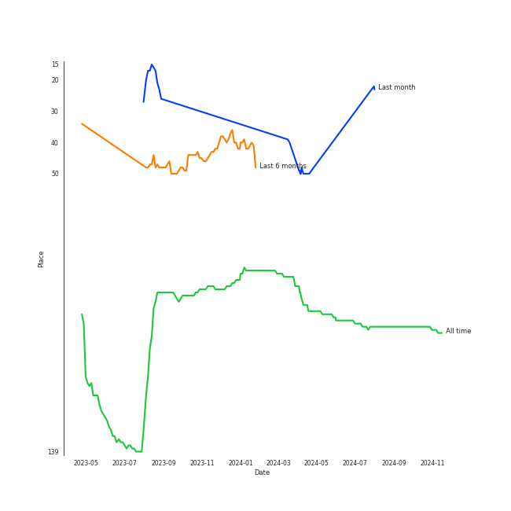
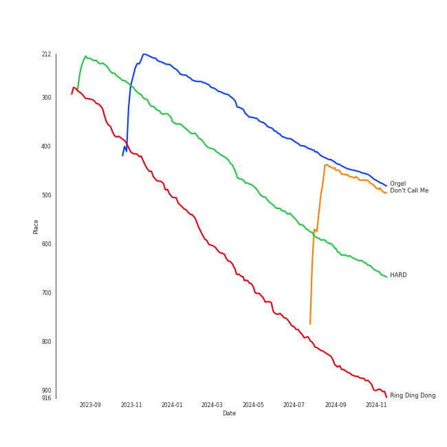
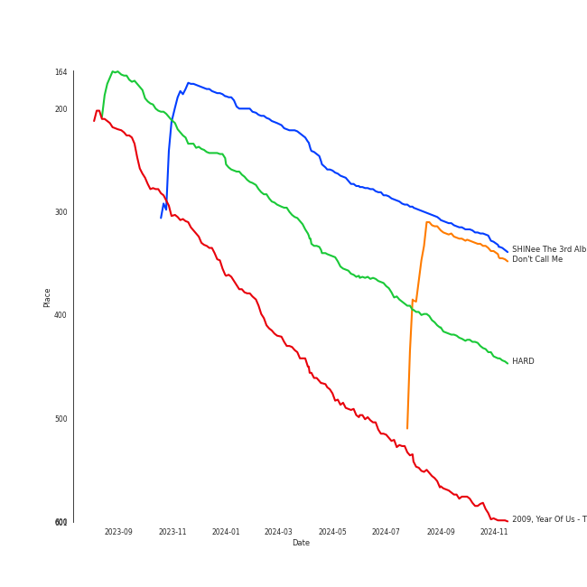

# SHINee

## Relationships

SHINee:
- has member JONGHYUN
- has member KEY
- has member MINHO
- has member ONEW
- has member [TAEMIN](../taemin/overview.md)

## Artist Rank
- The #99 artist of all time

## Top Tracks

### Top tracks of all time

## Top Albums

| Art | Rank | Tracks | 💚 | Album | Release Date | 🔗 |
|:---|---:|---:|---:|:---|:---|:---|
|  | 429 | 2 | 2 | HARD - The 8th Album | 2023-06-26 | [🔗](https://open.spotify.com/album/3JZJEeWr3LShx36FYbMc5E) |
|  | 320 | 1 | 1 | SHINee The 3rd Album 'The Misconceptions Of Us' | 2013-08-08 | [🔗](https://open.spotify.com/album/0f0brenHcU2NmUANeix9rN) |
|  | 650 | 1 | 1 | Odd - The 4th Album | 2015-05-18 | [🔗](https://open.spotify.com/album/47zSQLQWjPLmiEbCpOOEJa) |
|  | 331 | 1 | 1 | Don't Call Me - The 7th Album | 2021-02-22 | [🔗](https://open.spotify.com/album/6bfcHf3khPey88qjiiw8V3) |
|  | 589 | 1 | 1 | 2009, Year Of Us - The Third Mini Album | 2009-10-19 | [🔗](https://open.spotify.com/album/5AH7uBaxp7ojNCvImOeZvC) |
|  | 650 | 1 | 0 | The SHINee World - The First Album | 2008-08-28 | [🔗](https://open.spotify.com/album/2aiM53N5DGm5VXnfjswpI7) |
|  | 650 | 1 | 0 | Sherlock - The 4th Mini Album | 2012-03-21 | [🔗](https://open.spotify.com/album/2Mfisiv88pNRQNugqrEUHQ) |
|  | 650 | 1 | 0 | Lucifer - The 2nd Album | 2010-07-19 | [🔗](https://open.spotify.com/album/4jNPKKJ0NL349RXPx7y9f4) |

## Featured on Playlists
| Art | Tracks | Playlist |
|:---|---:|:---|
|  | 9 | [K-Pop](../../playlists/k-pop/overview.md) |
|  | 1 | [K-Pop 101](../../playlists/k-pop_101/overview.md) |
|  | 1 | [K-Pop Favorites](../../playlists/k-pop_favorites/overview.md) |
|  | 1 | [Workout](../../playlists/workout/overview.md) |
|  | 1 | [K-Memes](../../playlists/k-memes/overview.md) |
|  | 1 | [Halloween](../../playlists/halloween/overview.md) |

## Top Record Labels

| Tracks | 💚 | Label |
|---:|---:|:---|
| 9 | 6 | [SM Entertainment](../../labels/sm_entertainment/overview.md) |

## Genres

- [k-pop](../../genres/k-pop/overview.md)
- [k-pop boy group](../../genres/k-pop_boy_group/overview.md)

## Credits

### Member Credits

| | JONGHYUN | [TAEMIN](../taemin/overview.md) |
|:---|---:|---:|
| Lyricist | 2 | 0 |
| Songwriter | 1 | 2 |
### Production Credits

| Art | Track | Members | Credit Types |
|:---|:---|:---|:---|
|  | View | JONGHYUN | Lyricist |
|  | BREATHE | JONGHYUN | Lyricist, Songwriter |
|  | Sexy In The Air | [TAEMIN](../../taemin/overview.md) | Songwriter |
|  | Crush | [TAEMIN](../../taemin/overview.md) | Songwriter |

## Top Producers

| Art | Producer | Tracks | Credit Types |
|:---|:---|---:|:---|
| | JONGHYUN | 1 | Lyricist |
| | Adrian McKinnon | 1 | Arranger, Songwriter |
| | [Ryan S. Jhun](../../producers/ryan_s__jhun/overview.md) | 1 | Arranger, Songwriter |
| | [유영진 (Yoo, Young-jin)](../../producers/유영진_(yoo,_young-jin)/overview.md) | 1 | Lyricist, Songwriter |
| | [LDN Noise](../../producers/ldn_noise/overview.md) | 1 | Arranger, Songwriter |

## Tracks

| Art | Track | Album | Artists | Label | Rank | 💚 | 🔗 |
|:---|:---|:---|:---|:---|---:|:---|:---|
|  | Orgel | SHINee The 3rd Album 'The Misconceptions Of Us' | [SHINee](overview.md) | [SM Entertainment](../../labels/sm_entertainment) | 456 | 💚 | [🔗](https://open.spotify.com/track/5QW673bbf5BnFQcULXUUE5) |
|  | Don't Call Me | Don't Call Me - The 7th Album | [SHINee](overview.md) | [SM Entertainment](../../labels/sm_entertainment) | 468 | 💚 | [🔗](https://open.spotify.com/track/462OPOKW0VMbvW9H7HIb0U) |
|  | HARD | HARD - The 8th Album | [SHINee](overview.md) | [SM Entertainment](../../labels/sm_entertainment) | 640 | 💚 | [🔗](https://open.spotify.com/track/2VV1RIhTgeJ4PEMYz6TqDB) |
|  | Ring Ding Dong | 2009, Year Of Us - The Third Mini Album | [SHINee](overview.md) | [SM Entertainment](../../labels/sm_entertainment) | 886 | 💚 | [🔗](https://open.spotify.com/track/4vLqN0bIxIQjlet2mIMBnx) |
|  | Replay | The SHINee World - The First Album | [SHINee](overview.md) | [SM Entertainment](../../labels/sm_entertainment) | 987 | | [🔗](https://open.spotify.com/track/1rp986nzkyAX1wFpxzbwlC) |
|  | Lucifer | Lucifer - The 2nd Album | [SHINee](overview.md) | [SM Entertainment](../../labels/sm_entertainment) | 987 | | [🔗](https://open.spotify.com/track/7xAACq6jlGqXw4bNCTYcm6) |
|  | Sherlock (Clue + Note) | Sherlock - The 4th Mini Album | [SHINee](overview.md) | [SM Entertainment](../../labels/sm_entertainment) | 987 | | [🔗](https://open.spotify.com/track/2sVtrcj32v3fR8mLjqWziv) |
|  | View | Odd - The 4th Album | [SHINee](overview.md) | [SM Entertainment](../../labels/sm_entertainment) | 987 | 💚 | [🔗](https://open.spotify.com/track/46E1ic6n099e76t5J1TbHn) |
|  | JUICE | HARD - The 8th Album | [SHINee](overview.md) | [SM Entertainment](../../labels/sm_entertainment) | 987 | 💚 | [🔗](https://open.spotify.com/track/2ka8U0A2e93hBFA43mbgfy) |
