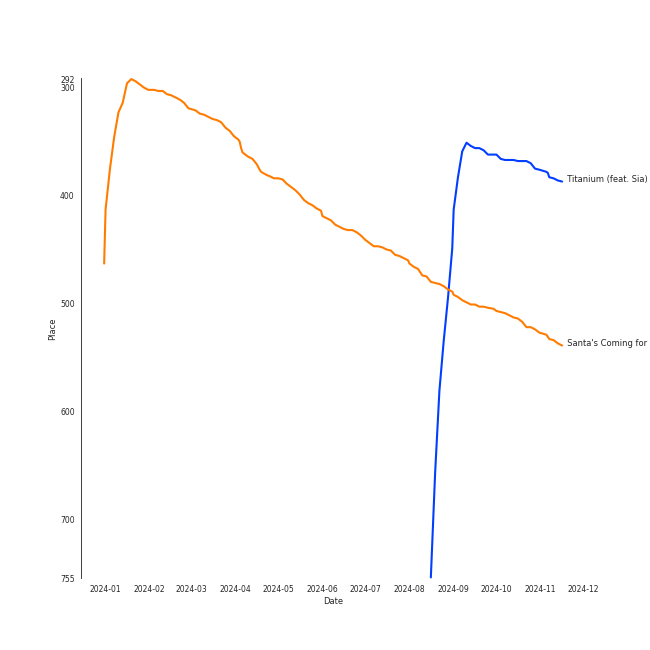
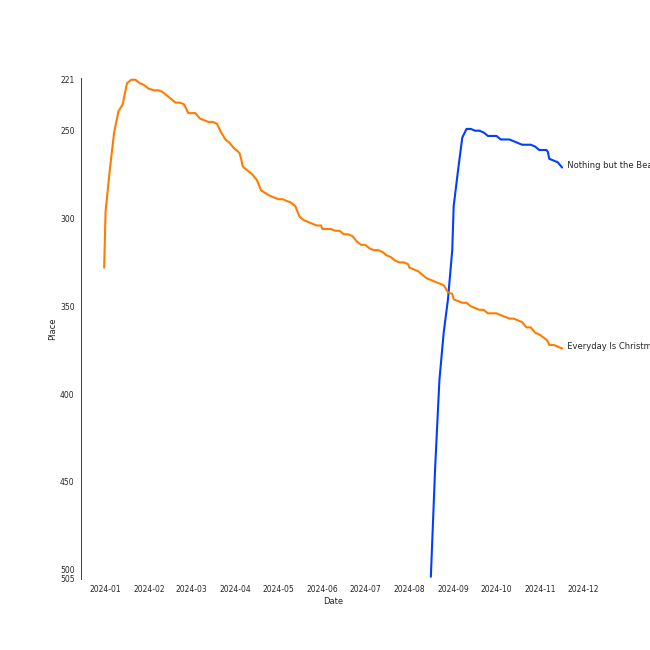
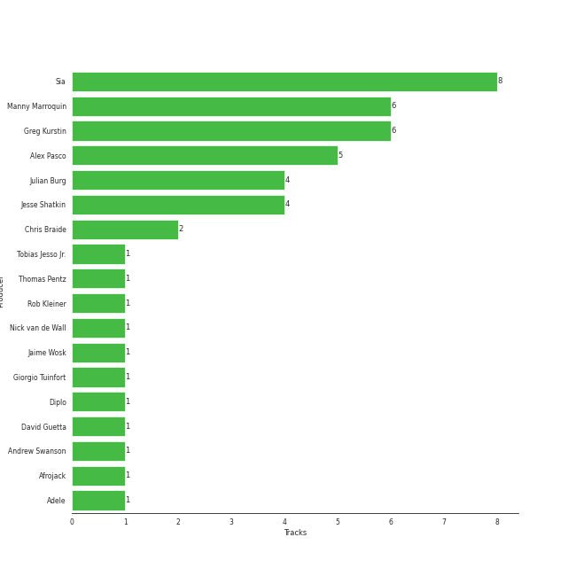

# Sia

[See Track Features](audio_features.md)

[See Clusters](clusters/overview.md)

## Artist Rank
- The #163 artist of all time

## Top Tracks

### Top tracks of all time

## Top Albums

| Art | Rank | Tracks | 💚 | Album | Release Date | 🔗 |
|:---|---:|---:|---:|:---|:---|:---|
|  | 603 | 4 | 4 | 1000 Forms Of Fear (Deluxe Version) | 2015-05-04 | [🔗](https://open.spotify.com/album/6FdNvoO5sF4EKwCX9je1MH) |
|  | 603 | 3 | 3 | This Is Acting (Deluxe Version) | 2016-10-21 | [🔗](https://open.spotify.com/album/2eV6DIPDnGl1idcjww6xyX) |
|  | 326 | 2 | 0 | Everyday Is Christmas (Deluxe Edition) | 2018-11-01 | [🔗](https://open.spotify.com/album/2vcGYJcPfXUmCdcXXqqukg) |
|  | 603 | 1 | 1 | Nothing but the Beat 2.0 | 2011-08-24 | [🔗](https://open.spotify.com/album/5aprcHwM1KJhaY9Kbxkfkn) |
|  | 603 | 1 | 1 | I Forgive You | 2024-04-12 | [🔗](https://open.spotify.com/album/3RPlxsjui6dOA6qMDBH70E) |

## Featured on Playlists
| Art | Tracks | Playlist |
|:---|---:|:---|
|  | 8 | [Pop](../../playlists/pop/overview.md) |
|  | 8 | [Alt-Pop](../../playlists/alt-pop/overview.md) |
|  | 4 | [A-Pop Favorites](../../playlists/a-pop_favorites/overview.md) |
|  | 2 | [Christmas](../../playlists/christmas/overview.md) |
|  | 1 | [Karaoke](../../playlists/karaoke/overview.md) |
|  | 1 | [Tarps](../../playlists/tarps/overview.md) |

## Top Record Labels

| Tracks | 💚 | Label |
|---:|---:|:---|
| 10 | 8 | [Monkey Puzzle](../../labels/monkey_puzzle/overview.md) |
| 7 | 7 | [RCA Records Label](../../labels/rca_records_label/overview.md) |
| 3 | 1 | [Atlantic Records](../../labels/atlantic_records/overview.md) |
| 1 | 1 | Parlophone (France) |

## Genres

- [pop](../../genres/pop/overview.md)

## Credits

### Credits by Type

| Credit Type | Tracks |
|:---|---:|
| Lyricist | 1 |
| Producer | 6 |
| Songwriter | 9 |
| Vocal | 3 |

### Production Credits

| Art | Track | Credit Types |
|:---|:---|:---|
|  | Titanium (feat. Sia) | Lyricist, Songwriter |
|  | Chandelier | Producer, Songwriter |
|  | Elastic Heart | Producer, Songwriter |
|  | Eye of the Needle | Producer, Songwriter |
|  | Big Girls Cry | Producer, Songwriter |
|  | Alive | Producer, Songwriter |
|  | Cheap Thrills | Songwriter |
|  | Bird Set Free | Producer, Songwriter |
| | nan | Songwriter |

## Top Producers

| Art | Producer | Tracks | Credit Types |
|:---|:---|---:|:---|
|  | [Sia](overview.md) | 8 | Lyricist, Songwriter, Producer |
| | [Greg Kurstin](../../producers/greg_kurstin/overview.md) | 6 | Producer, Songwriter |
| | [Manny Marroquin](../../producers/manny_marroquin/overview.md) | 6 | Producer |
| | Alex Pasco | 5 | Producer |
| | Jesse Shatkin | 4 | Producer, Songwriter |
| | Julian Burg | 4 | Producer |
| | Chris Braide | 2 | Producer, Songwriter |
|  | Diplo | 1 | Producer |
| | Giorgio Tuinfort | 1 | Producer, Songwriter |
| | Andrew Swanson | 1 | Producer, Songwriter |

View all

| Art | Producer | Tracks | Credit Types |
|:---|:---|---:|:---|
|  | [Adele](../adele/overview.md) | 1 | Songwriter |
| | Jaime Wosk | 1 | Producer |
| | Afrojack | 1 | Producer |
| | Rob Kleiner | 1 | Producer |
| | Tobias Jesso Jr. | 1 | Songwriter |
| | Nick van de Wall | 1 | Songwriter |
|  | David Guetta | 1 | Producer, Songwriter |
| | Thomas Pentz | 1 | Songwriter |

## Tracks

| Art | Track | Album | Artists | Label | Rank | 💚 | 🔗 |
|:---|:---|:---|:---|:---|---:|:---|:---|
|  | Santa's Coming for Us | Everyday Is Christmas (Deluxe Edition) | [Sia](overview.md) | [Atlantic Records](../../labels/atlantic_records), [Monkey Puzzle](../../labels/monkey_puzzle) | 456 | | [🔗](https://open.spotify.com/track/1N1ZpYUJc9fwrqk53FGgWv) |
|  | Titanium (feat. Sia) | Nothing but the Beat 2.0 | David Guetta, [Sia](overview.md) | Parlophone (France) | 900 | 💚 | [🔗](https://open.spotify.com/track/0lHAMNU8RGiIObScrsRgmP) |
|  | Big Girls Cry | 1000 Forms Of Fear (Deluxe Version) | [Sia](overview.md) | [Monkey Puzzle](../../labels/monkey_puzzle), [RCA Records Label](../../labels/rca_records_label) | 900 | 💚 | [🔗](https://open.spotify.com/track/7zE6pyXLjUCOy8PG0UL5SZ) |
|  | Chandelier | 1000 Forms Of Fear (Deluxe Version) | [Sia](overview.md) | [Monkey Puzzle](../../labels/monkey_puzzle), [RCA Records Label](../../labels/rca_records_label) | 900 | 💚 | [🔗](https://open.spotify.com/track/2s1sdSqGcKxpPr5lCl7jAV) |
|  | Elastic Heart | 1000 Forms Of Fear (Deluxe Version) | [Sia](overview.md) | [Monkey Puzzle](../../labels/monkey_puzzle), [RCA Records Label](../../labels/rca_records_label) | 900 | 💚 | [🔗](https://open.spotify.com/track/5S9lfZu1YF8xKkgSsqL2Bd) |
|  | Eye of the Needle | 1000 Forms Of Fear (Deluxe Version) | [Sia](overview.md) | [Monkey Puzzle](../../labels/monkey_puzzle), [RCA Records Label](../../labels/rca_records_label) | 900 | 💚 | [🔗](https://open.spotify.com/track/6H8UxS43KArEIu2vGZI9Dj) |
|  | Alive | This Is Acting (Deluxe Version) | [Sia](overview.md) | [Monkey Puzzle](../../labels/monkey_puzzle), [RCA Records Label](../../labels/rca_records_label) | 900 | 💚 | [🔗](https://open.spotify.com/track/25R5Tdr4K7ENb6umHzdCXn) |
|  | Bird Set Free | This Is Acting (Deluxe Version) | [Sia](overview.md) | [Monkey Puzzle](../../labels/monkey_puzzle), [RCA Records Label](../../labels/rca_records_label) | 900 | 💚 | [🔗](https://open.spotify.com/track/6MowG7MRVgPfGlCMsXKMJ2) |
|  | Cheap Thrills | This Is Acting (Deluxe Version) | [Sia](overview.md) | [Monkey Puzzle](../../labels/monkey_puzzle), [RCA Records Label](../../labels/rca_records_label) | 900 | 💚 | [🔗](https://open.spotify.com/track/3S4px9f4lceWdKf0gWciFu) |
|  | Snowman | Everyday Is Christmas (Deluxe Edition) | [Sia](overview.md) | [Atlantic Records](../../labels/atlantic_records), [Monkey Puzzle](../../labels/monkey_puzzle) | 900 | | [🔗](https://open.spotify.com/track/7uoFMmxln0GPXQ0AcCBXRq) |

See all tracks

| Art | Track | Album | Artists | Label | Rank | 💚 | 🔗 |
|:---|:---|:---|:---|:---|---:|:---|:---|
|  | I Forgive You | I Forgive You | [Sia](overview.md) | [Atlantic Records](../../labels/atlantic_records), [Monkey Puzzle](../../labels/monkey_puzzle) | 900 | 💚 | [🔗](https://open.spotify.com/track/2jh0kJheW38ljJucWMoaG6) |

