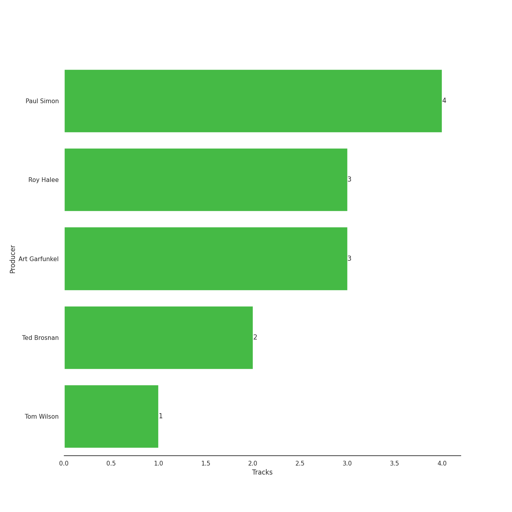

# Simon & Garfunkel

## Relationships

Simon & Garfunkel:
- has member Art Garfunkel
- has member Paul Simon

## Artist Rank
- The #430 artist of all time

## Top Albums

| Art | Rank | Tracks | 💚 | Album | Release Date | 🔗 |
|:---|---:|---:|---:|:---|:---|:---|
|  | 652 | 3 | 3 | Bridge Over Troubled Water | 1970-01-26 | [🔗](https://open.spotify.com/album/0JwHz5SSvpYWuuCNbtYZoV) |
|  | 652 | 1 | 1 | Wednesday Morning, 3 A.M. | 1964-10-19 | [🔗](https://open.spotify.com/album/5pnJrocLlZ3FWEbcr2PTz0) |
|  | 652 | 1 | 1 | Bookends | 1968-04-03 | [🔗](https://open.spotify.com/album/3bzgbgiytguTDnwzflAZr2) |

## Featured on Playlists
| Art | Tracks | Playlist |
|:---|---:|:---|
|  | 5 | [Classic Pop](../../playlists/classic_pop/overview.md) |
|  | 2 | [A-Pop Favorites](../../playlists/a-pop_favorites/overview.md) |
|  | 1 | [Summer](../../playlists/summer/overview.md) |
|  | 1 | [Karaoke](../../playlists/karaoke/overview.md) |
|  | 1 | [Tarps](../../playlists/tarps/overview.md) |

## Top Record Labels

| Tracks | 💚 | Label |
|---:|---:|:---|
| 5 | 5 | [Columbia](../../labels/columbia/overview.md) |

## Genres

- [classic rock](../../genres/classic_rock/overview.md)
- [folk](../../genres/folk/overview.md)
- folk rock
- melancholia
- [mellow gold](../../genres/mellow_gold/overview.md)
- [rock](../../genres/rock/overview.md)
- [soft rock](../../genres/soft_rock/overview.md)

## Credits

### Member Credits

| | Art Garfunkel | Paul Simon |
|:---|---:|---:|
| Instrument | 0 | 4 |
| Lyricist | 0 | 5 |
| Producer | 3 | 4 |
| Songwriter | 0 | 5 |
| Vocal | 4 | 5 |
### Production Credits

| Art | Track | Members | Credit Types |
|:---|:---|:---|:---|
|  | The Sound of Silence - Acoustic Version | Paul Simon | Lyricist, Songwriter |
|  | Mrs. Robinson - From "The Graduate" Soundtrack | Paul Simon, Art Garfunkel | Lyricist, Producer, Songwriter |
|  | Bridge Over Troubled Water | Paul Simon, Art Garfunkel | Lyricist, Producer, Songwriter |
|  | The Boxer | Paul Simon, Art Garfunkel | Lyricist, Producer, Songwriter |
|  | You Can Call Me Al | Paul Simon | Lyricist, Producer, Songwriter |

## Top Producers

| Art | Producer | Tracks | Credit Types |
|:---|:---|---:|:---|
|  | Paul Simon | 4 | Lyricist, Producer, Songwriter |
| | Roy Halee | 3 | Producer |
| | Art Garfunkel | 3 | Producer |
| | Ted Brosnan | 2 | Producer |
| | Tom Wilson | 1 | Producer |

## Tracks

| Art | Track | Album | Artists | Label | Rank | 💚 | 🔗 |
|:---|:---|:---|:---|:---|---:|:---|:---|
|  | The Sound of Silence - Acoustic Version | Wednesday Morning, 3 A.M. | [Simon & Garfunkel](overview.md) | [Columbia](../../labels/columbia) | 996 | 💚 | [🔗](https://open.spotify.com/track/5y788ya4NvwhBznoDIcXwK) |
|  | Mrs. Robinson - From "The Graduate" Soundtrack | Bookends | [Simon & Garfunkel](overview.md) | [Columbia](../../labels/columbia) | 996 | 💚 | [🔗](https://open.spotify.com/track/0iOZM63lendWRTTeKhZBSC) |
|  | Bridge Over Troubled Water | Bridge Over Troubled Water | [Simon & Garfunkel](overview.md) | [Columbia](../../labels/columbia) | 996 | 💚 | [🔗](https://open.spotify.com/track/6l8EbYRtQMgKOyc1gcDHF9) |
|  | Cecilia | Bridge Over Troubled Water | [Simon & Garfunkel](overview.md) | [Columbia](../../labels/columbia) | 996 | 💚 | [🔗](https://open.spotify.com/track/6QhXQOpyYvbpdbyjgAqKdY) |
|  | The Boxer | Bridge Over Troubled Water | [Simon & Garfunkel](overview.md) | [Columbia](../../labels/columbia) | 996 | 💚 | [🔗](https://open.spotify.com/track/76TZCvJ8GitQ2FA1q5dKu0) |
