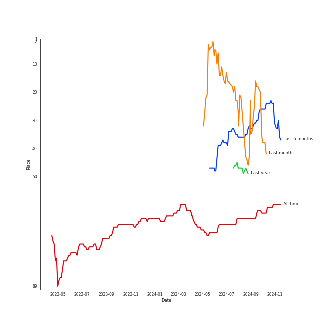
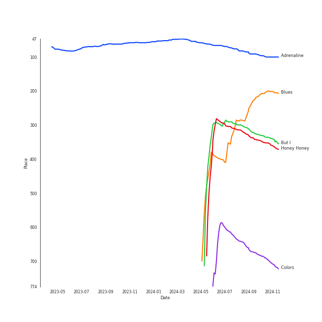

# Solar

## Relationships

Solar:
- is a member of [MAMAMOO](../mamamoo/overview.md)
- is a member of MAMAMOO+

## Artist Rank
Solar is currently:
- The #4 artist of the last month
- The #47 artist of the last 6 months

## Top Tracks

- Honey Honey is the #7 track of the last month
- But I is the #17 track of the last month
- Blues is the #18 track of the last month

### Top tracks, aggregated

### Top tracks of all time over time

## Featured on Playlists
| Art | Tracks | Playlist |
|:---|---:|:---|
|  | 7 | [K-Pop](../../playlists/k-pop/overview.md) |
|  | 4 | [Recent Comebacks](../../playlists/recent_comebacks/overview.md) |
|  | 2 | [K-Pop Favorites](../../playlists/k-pop_favorites/overview.md) |
|  | 1 | [Summer](../../playlists/summer/overview.md) |
|  | 1 | [Retro Kpop](../../playlists/retro_kpop/overview.md) |
|  | 1 | [Your Top Songs 2022](../../playlists/your_top_songs_2022/overview.md) |
|  | 1 | [Workout](../../playlists/workout/overview.md) |
|  | 1 | [K-OST](../../playlists/k-ost/overview.md) |

## Top Albums

| Art | Tracks | 💚 | Album | Release Date | 🔗 |
|:---|---:|---:|:---|:---|:---|
|  | 4 | 3 | COLOURS | 2024-04-30 | [🔗](https://open.spotify.com/album/5Q1cKPuB4vPk8bIdfZH7Fm) |
|  | 2 | 2 | 容 : FACE | 2022-03-16 | [🔗](https://open.spotify.com/album/6eSFX12WIqUtmGsD8UO3FT) |
|  | 1 | 1 | VINCENZO (Original Television Soundtrack) Pt. 3 | 2021-03-14 | [🔗](https://open.spotify.com/album/47ulDGfVUWUcUSWRQCzxr3) |
|  | 1 | 0 | SPIT IT OUT | 2020-04-23 | [🔗](https://open.spotify.com/album/1pLSlOXtHKPoSoB6ovnIAK) |

## Top Record Labels

| Tracks | 💚 | Label |
|---:|---:|:---|
| 7 | 5 | [RBW Inc.](../../labels/rbw_inc_/overview.md) |
| 1 | 1 | [Genie Music Corporation](../../labels/genie_music_corporation/overview.md) |

## Genres

- [k-pop](../../genres/k-pop/overview.md)

## Credits

### Credits by Type

| Credit Type | Tracks |
|:---|---:|
| Lyricist | 3 |
| Vocal | 1 |

### Production Credits

| Art | Track | Credit Types |
|:---|:---|:---|
|  | You’re the Best | Lyricist |
|  | Décalcomanie | Lyricist |
|  | Yes I Am | Lyricist |

## Tracks

| Art | Track | Album | Artists | Label | Rank | 💚 | 🔗 |
|:---|:---|:---|:---|:---|---:|:---|:---|
|  | Adrenaline | VINCENZO (Original Television Soundtrack) Pt. 3 | [Solar](overview.md) | [Genie Music Corporation](../../labels/genie_music_corporation) | 62 | 💚 | [🔗](https://open.spotify.com/track/6ZQmJVUuXk1Q27d8vkmgm8) |
|  | But I | COLOURS | [Solar](overview.md) | [RBW Inc.](../../labels/rbw_inc_) | 362 | 💚 | [🔗](https://open.spotify.com/track/3kHF06mERCHSLIq1AuSNdZ) |
|  | Blues | COLOURS | [Solar](overview.md) | [RBW Inc.](../../labels/rbw_inc_) | 415 | 💚 | [🔗](https://open.spotify.com/track/6ZVetYxDIVtNaZL4b8jQQ3) |
|  | Honey Honey | COLOURS | [Solar](overview.md) | [RBW Inc.](../../labels/rbw_inc_) | 456 | 💚 | [🔗](https://open.spotify.com/track/0F0GaAGEb8k1QcmxiUUDB6) |
|  | Spit it out | SPIT IT OUT | [Solar](overview.md) | [RBW, INC.](../../labels/rbw_inc_) | nan | | [🔗](https://open.spotify.com/track/5F6RrFgt1yvRhNCdAEumM6) |
|  | Big Booty | 容 : FACE | [Solar](overview.md) | [RBW Inc.](../../labels/rbw_inc_) | nan | 💚 | [🔗](https://open.spotify.com/track/5bwzsMhJZHSHM6M6qslOgd) |
|  | HONEY | 容 : FACE | [Solar](overview.md) | [RBW Inc.](../../labels/rbw_inc_) | nan | 💚 | [🔗](https://open.spotify.com/track/7JDiC68AKimlvMCmZQuA9n) |
|  | Colors | COLOURS | [Solar](overview.md) | [RBW Inc.](../../labels/rbw_inc_) | nan | | [🔗](https://open.spotify.com/track/6F5nwlaYT0TZatOHVMaBcZ) |
