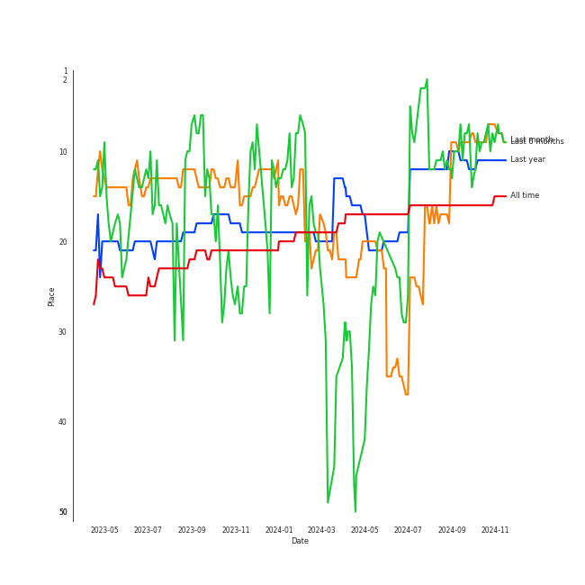
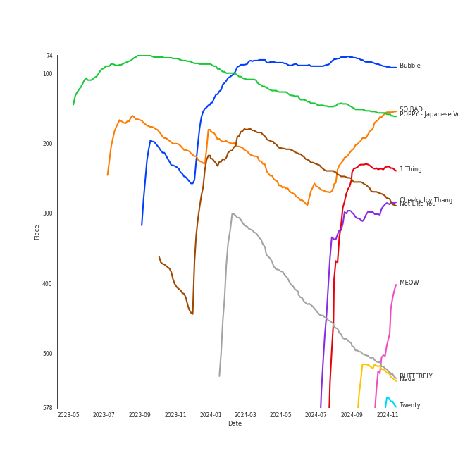
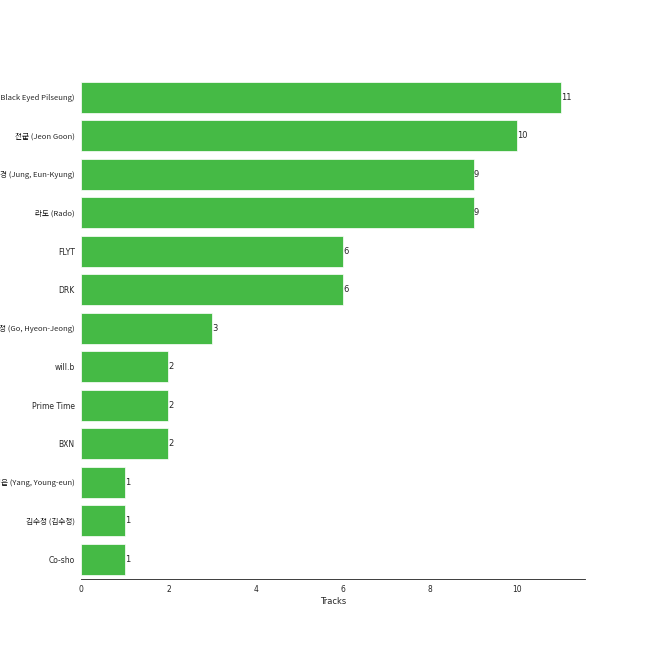

# STAYC

[See Track Features](audio_features.md)

[See Clusters](clusters/overview.md)

## Relationships

STAYC:
- has member 아이사 (ISA)
- has member 재이 (J)
- has member 세은 (SEEUN)
- has member 시은 (SIEUN)
- has member SUMIN
- has member 윤 (YOON)

## Artist Rank
STAYC is currently:
- The #29 artist of the last month
- The #22 artist of the last 6 months
- The #14 artist of all time

## Top Tracks

- Bubble is the #24 track of the last 6 months

### Top tracks, aggregated

### Top tracks of the last 6 months over time

## Featured on Playlists
| Art | Tracks | Playlist |
|:---|---:|:---|
|  | 15 | [K-Pop](../../playlists/k-pop/overview.md) |
|  | 6 | [Summer](../../playlists/summer/overview.md) |
|  | 6 | [K-Pop Favorites](../../playlists/k-pop_favorites/overview.md) |
|  | 4 | [Workout](../../playlists/workout/overview.md) |
|  | 4 | [Chill](../../playlists/chill/overview.md) |
|  | 3 | [Your Top Songs 2023](../../playlists/your_top_songs_2023/overview.md) |
|  | 3 | [애교！](../../playlists/애교！/overview.md) |
|  | 2 | [Sharon RPD](../../playlists/sharon_rpd/overview.md) |
|  | 2 | [Cursed English](../../playlists/cursed_english/overview.md) |
|  | 1 | [K-Pop 101](../../playlists/k-pop_101/overview.md) |
|  | 1 | [Repeat Rewind](../../playlists/repeat_rewind/overview.md) |
|  | 1 | [Your Top Songs 2022](../../playlists/your_top_songs_2022/overview.md) |
|  | 1 | [Recommendations for Jeff](../../playlists/recommendations_for_jeff/overview.md) |

## Top Albums

| Art | Tracks | 💚 | Album | Release Date | 🔗 |
|:---|---:|---:|:---|:---|:---|
|  | 5 | 4 | YOUNG-LUV.COM | 2022-02-21 | [🔗](https://open.spotify.com/album/2xPdgNkM4yIQmP7axJ1T1o) |
|  | 4 | 2 | TEENFRESH | 2023-08-16 | [🔗](https://open.spotify.com/album/4P5wnRQTBnnjNbjt7A6S6x) |
|  | 2 | 1 | STEREOTYPE | 2021-09-06 | [🔗](https://open.spotify.com/album/7HGjNJBj1NQGNwCzFD2LHj) |
|  | 2 | 1 | STAYDOM | 2021-04-08 | [🔗](https://open.spotify.com/album/71hjsg660uio3Z8bnbB6fS) |
|  | 1 | 1 | WE NEED LOVE | 2022-07-19 | [🔗](https://open.spotify.com/album/04EniWu488MF6louRYafKJ) |
|  | 1 | 1 | Teddy Bear | 2023-02-14 | [🔗](https://open.spotify.com/album/325MEzmbNCQvjsP3oaJh4x) |
|  | 1 | 1 | Star To A Young Culture | 2020-11-12 | [🔗](https://open.spotify.com/album/4PrRd0lIunUEiiE5rbZklR) |
|  | 1 | 1 | POPPY (Japanese Ver.) | 2022-11-16 | [🔗](https://open.spotify.com/album/2nei1QXcpDotdoMz3IQxr4) |

## Top Record Labels

| Tracks | 💚 | Label |
|---:|---:|:---|
| 16 | 11 | [High Up Entertainment](../../labels/high_up_entertainment/overview.md) |
| 1 | 1 | [Universal Music LLC](../../labels/universal_music_llc/overview.md) |

## Genres

- [k-pop](../../genres/k-pop/overview.md)
- [k-pop girl group](../../genres/k-pop_girl_group/overview.md)

## Credits

### Credits by Type

| Credit Type | Tracks |
|:---|---:|
| Performer | 13 |
| Vocal | 3 |

### Member Credits

| | SUMIN | 세은 (SEEUN) | 시은 (SIEUN) | 아이사 (ISA) | 윤 (YOON) | 재이 (J) |
|:---|---:|---:|---:|---:|---:|---:|
| Vocal | 13 | 10 | 13 | 13 | 13 | 13 |
## Top Producers

| Art | Producer | Tracks | Credit Types |
|:---|:---|---:|:---|
| | [블랙아이드필승 (Black Eyed Pilseung)](../../producers/블랙아이드필승_(black_eyed_pilseung)/overview.md) | 11 | Lyricist, Songwriter, Arranger, Producer |
| | [전군 (Jeon Goon)](../../producers/전군_(jeon_goon)/overview.md) | 10 | Lyricist, Songwriter, Producer |
| | [라도 (Rado)](../../producers/라도_(rado)/overview.md) | 9 | Arranger, Producer |
| | [정은경 (Jung, Eun-Kyung)](../../producers/정은경_(jung,_eun-kyung)/overview.md) | 9 | Producer |
| | DRK | 6 | Producer |
| | [FLYT](../../producers/flyt/overview.md) | 6 | Arranger, Songwriter, Producer |
| | 고현정 (Go, Hyeon-Jeong) | 3 | Producer |
| | will.b | 2 | Songwriter |
| | Co-sho | 1 | Lyricist |
| | 김수정 (김수정) | 1 | Producer |

View all

| Art | Producer | Tracks | Credit Types |
|:---|:---|---:|:---|
| | Prime Time | 1 | Songwriter |
| | [양영은 (Yang, Young-eun)](../../producers/양영은_(yang,_young-eun)/overview.md) | 1 | Producer |
| | BXN | 1 | Arranger, Lyricist, Songwriter |

## Tracks

| Art | Track | Album | Artists | Label | Rank | 💚 | 🔗 |
|:---|:---|:---|:---|:---|---:|:---|:---|
|  | Bubble | TEENFRESH | [STAYC](overview.md) | [High Up Entertainment](../../labels/high_up_entertainment) | 81 | 💚 | [🔗](https://open.spotify.com/track/4P5ozkI1bxiGxA5rZ27jlO) |
|  | POPPY - Japanese Ver. | POPPY (Japanese Ver.) | [STAYC](overview.md) | [Universal Music LLC](../../labels/universal_music_llc) | 120 | 💚 | [🔗](https://open.spotify.com/track/2gpwaAJnSDTevgZa4uyM0H) |
|  | Not Like You | TEENFRESH | [STAYC](overview.md) | [High Up Entertainment](../../labels/high_up_entertainment) | 186 | 💚 | [🔗](https://open.spotify.com/track/1HnJhU3MhAnRQzdkFm6xQr) |
|  | SO BAD | Star To A Young Culture | [STAYC](overview.md) | [High Up Entertainment](../../labels/high_up_entertainment) | 221 | 💚 | [🔗](https://open.spotify.com/track/13KR2yNRDrbKwR3dOKCDl4) |
|  | BUTTERFLY | YOUNG-LUV.COM | [STAYC](overview.md) | [High Up Entertainment](../../labels/high_up_entertainment) | 347 | 💚 | [🔗](https://open.spotify.com/track/1q97NRLZfQlXYvZJAQ7tln) |
|  | Teddy Bear | Teddy Bear | [STAYC](overview.md) | [High Up Entertainment](../../labels/high_up_entertainment) | 428 | 💚 | [🔗](https://open.spotify.com/track/4kSDi21MeOoSvpZs6MveI9) |
|  | RUN2U | YOUNG-LUV.COM | [STAYC](overview.md) | [High Up Entertainment](../../labels/high_up_entertainment) | 495 | 💚 | [🔗](https://open.spotify.com/track/3gFcGnU4kTdMYLXDjH1TK8) |
|  | STEREOTYPE | STEREOTYPE | [STAYC](overview.md) | [High Up Entertainment](../../labels/high_up_entertainment) | 505 | 💚 | [🔗](https://open.spotify.com/track/2bZIDMpzVooosmPHn0tHnd) |
|  | ASAP | STAYDOM | [STAYC](overview.md) | [High Up Entertainment](../../labels/high_up_entertainment) | nan | 💚 | [🔗](https://open.spotify.com/track/5BXr7hYZQOeRttkeWYTq5S) |
|  | LOVE FOOL | STAYDOM | [STAYC](overview.md) | [High Up Entertainment](../../labels/high_up_entertainment) | nan | | [🔗](https://open.spotify.com/track/2OhOkew9BkkLTGBG9cFOz5) |

See all tracks

| Art | Track | Album | Artists | Label | Rank | 💚 | 🔗 |
|:---|:---|:---|:---|:---|---:|:---|:---|
|  | I’ll BE THERE | STEREOTYPE | [STAYC](overview.md) | [High Up Entertainment](../../labels/high_up_entertainment) | nan | | [🔗](https://open.spotify.com/track/1aWnOcf3GE7xuu4rubVPYL) |
|  | 247 | YOUNG-LUV.COM | [STAYC](overview.md) | [High Up Entertainment](../../labels/high_up_entertainment) | nan | | [🔗](https://open.spotify.com/track/51XWwKV6VHCuFftFQLp4iA) |
|  | SAME SAME | YOUNG-LUV.COM | [STAYC](overview.md) | [High Up Entertainment](../../labels/high_up_entertainment) | nan | 💚 | [🔗](https://open.spotify.com/track/5mr1d04qe0s5ux5fQQcH2p) |
|  | YOUNG LUV | YOUNG-LUV.COM | [STAYC](overview.md) | [High Up Entertainment](../../labels/high_up_entertainment) | nan | 💚 | [🔗](https://open.spotify.com/track/7HGKvoju3ucB7UqVt1GoJu) |
|  | BEAUTIFUL MONSTER | WE NEED LOVE | [STAYC](overview.md) | [High Up Entertainment](../../labels/high_up_entertainment) | nan | 💚 | [🔗](https://open.spotify.com/track/56s2s5e8WuBsWVKnmz6J9L) |
|  | Bubble (English Ver.) | TEENFRESH | [STAYC](overview.md) | [High Up Entertainment](../../labels/high_up_entertainment) | nan | | [🔗](https://open.spotify.com/track/3bcqk74mnFzQF2bfOMG7iK) |
|  | Bubble (Sped Up) (English Ver.) | TEENFRESH | [STAYC](overview.md) | [High Up Entertainment](../../labels/high_up_entertainment) | nan | | [🔗](https://open.spotify.com/track/1e9uzZKeHabJ1kSDT7m3Np) |

