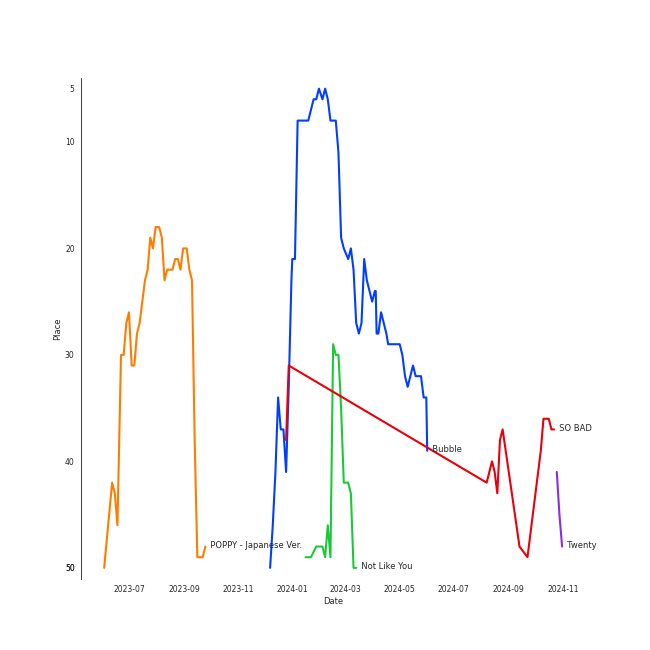

# STAYC

[See Track Features](audio_features.md)

[See Clusters](clusters/overview.md)

## Artist Rank
STAYC is currently:
- The #19 artist of all time
- The #12 artist of the last 6 months
- The #7 artist of the last month

## Top Tracks

- POPPY - Japanese Ver. is:
    - the #20 track of the last 6 months

### Top tracks of the last 6 months over time

### Top tracks of the last month over time

## Featured on Playlists
| Art | Tracks | Playlist |
|:---|---:|:---|
|  | 15 | [K-Pop](../../playlists/k_pop/overview.md) |
|  | 6 | [Summer](../../playlists/summer/overview.md) |
|  | 6 | [K-Pop Favorites](../../playlists/k_pop_favorites/overview.md) |
|  | 4 | [Workout](../../playlists/workout/overview.md) |
|  | 4 | [Chill](../../playlists/chill/overview.md) |
|  | 3 | [Recent Comebacks](../../playlists/recent_comebacks/overview.md) |
|  | 2 | [Sharon RPD](../../playlists/sharon_rpd/overview.md) |
|  | 2 | [Cursed English](../../playlists/cursed_english/overview.md) |
|  | 2 | [Aegyo](../../playlists/aegyo/overview.md) |
|  | 1 | [K-Pop 101](../../playlists/k_pop_101/overview.md) |
## Top Albums

| Art | Tracks | 💚 | Album | Release Date | 🔗 |
|:---|---:|---:|:---|:---|:---|
|  | 5 | 4 | YOUNG-LUV.COM | 2022-02-21 | [🔗](https://open.spotify.com/album/2xPdgNkM4yIQmP7axJ1T1o) |
|  | 5 | 2 | TEENFRESH | 2023-08-16 | [🔗](https://open.spotify.com/album/4P5wnRQTBnnjNbjt7A6S6x) |
|  | 2 | 1 | STEREOTYPE | 2021-09-06 | [🔗](https://open.spotify.com/album/7HGjNJBj1NQGNwCzFD2LHj) |
|  | 2 | 1 | STAYDOM | 2021-04-08 | [🔗](https://open.spotify.com/album/71hjsg660uio3Z8bnbB6fS) |
|  | 1 | 1 | WE NEED LOVE | 2022-07-19 | [🔗](https://open.spotify.com/album/04EniWu488MF6louRYafKJ) |
|  | 1 | 1 | Teddy Bear | 2023-02-14 | [🔗](https://open.spotify.com/album/325MEzmbNCQvjsP3oaJh4x) |
|  | 1 | 1 | Star To A Young Culture | 2020-11-12 | [🔗](https://open.spotify.com/album/4PrRd0lIunUEiiE5rbZklR) |
|  | 1 | 1 | POPPY (Japanese Ver.) | 2022-11-16 | [🔗](https://open.spotify.com/album/2nei1QXcpDotdoMz3IQxr4) |

## Top Record Labels

| Tracks | 💚 | Label |
|---:|---:|:---|
| 17 | 11 | [High Up Entertainment](../../labels/high_up_entertainment/overview.md) |
| 1 | 1 | [Universal Music LLC](../../labels/universal_music_llc/overview.md) |

## Genres

- [k-pop](../../genres/k_pop)
- [k-pop girl group](../../genres/k_pop_girl_group)

## Tracks

| Art | Track | Album | Artists | Label | 💚 | 🔗 |
|:---|:---|:---|:---|:---|:---|:---|
|  | SO BAD | Star To A Young Culture | [STAYC](overview.md) | [High Up Entertainment](../../labels/high_up_entertainment) | 💚 | [🔗](https://open.spotify.com/track/13KR2yNRDrbKwR3dOKCDl4) |
|  | ASAP | STAYDOM | [STAYC](overview.md) | [High Up Entertainment](../../labels/high_up_entertainment) | 💚 | [🔗](https://open.spotify.com/track/5BXr7hYZQOeRttkeWYTq5S) |
|  | LOVE FOOL | STAYDOM | [STAYC](overview.md) | [High Up Entertainment](../../labels/high_up_entertainment) | | [🔗](https://open.spotify.com/track/2OhOkew9BkkLTGBG9cFOz5) |
|  | I’ll BE THERE | STEREOTYPE | [STAYC](overview.md) | [High Up Entertainment](../../labels/high_up_entertainment) | | [🔗](https://open.spotify.com/track/1aWnOcf3GE7xuu4rubVPYL) |
|  | STEREOTYPE | STEREOTYPE | [STAYC](overview.md) | [High Up Entertainment](../../labels/high_up_entertainment) | 💚 | [🔗](https://open.spotify.com/track/2bZIDMpzVooosmPHn0tHnd) |
|  | 247 | YOUNG-LUV.COM | [STAYC](overview.md) | [High Up Entertainment](../../labels/high_up_entertainment) | | [🔗](https://open.spotify.com/track/51XWwKV6VHCuFftFQLp4iA) |
|  | BUTTERFLY | YOUNG-LUV.COM | [STAYC](overview.md) | [High Up Entertainment](../../labels/high_up_entertainment) | 💚 | [🔗](https://open.spotify.com/track/1q97NRLZfQlXYvZJAQ7tln) |
|  | RUN2U | YOUNG-LUV.COM | [STAYC](overview.md) | [High Up Entertainment](../../labels/high_up_entertainment) | 💚 | [🔗](https://open.spotify.com/track/3gFcGnU4kTdMYLXDjH1TK8) |
|  | SAME SAME | YOUNG-LUV.COM | [STAYC](overview.md) | [High Up Entertainment](../../labels/high_up_entertainment) | 💚 | [🔗](https://open.spotify.com/track/5mr1d04qe0s5ux5fQQcH2p) |
|  | YOUNG LUV | YOUNG-LUV.COM | [STAYC](overview.md) | [High Up Entertainment](../../labels/high_up_entertainment) | 💚 | [🔗](https://open.spotify.com/track/7HGKvoju3ucB7UqVt1GoJu) |

See all tracks

| Art | Track | Album | Artists | Label | 💚 | 🔗 |
|:---|:---|:---|:---|:---|:---|:---|
|  | BEAUTIFUL MONSTER | WE NEED LOVE | [STAYC](overview.md) | [High Up Entertainment](../../labels/high_up_entertainment) | 💚 | [🔗](https://open.spotify.com/track/56s2s5e8WuBsWVKnmz6J9L) |
|  | POPPY - Japanese Ver. | POPPY (Japanese Ver.) | [STAYC](overview.md) | [Universal Music LLC](../../labels/universal_music_llc) | 💚 | [🔗](https://open.spotify.com/track/2gpwaAJnSDTevgZa4uyM0H) |
|  | Teddy Bear | Teddy Bear | [STAYC](overview.md) | [High Up Entertainment](../../labels/high_up_entertainment) | 💚 | [🔗](https://open.spotify.com/track/4kSDi21MeOoSvpZs6MveI9) |
|  | Bubble | TEENFRESH | [STAYC](overview.md) | [High Up Entertainment](../../labels/high_up_entertainment) | 💚 | [🔗](https://open.spotify.com/track/4P5ozkI1bxiGxA5rZ27jlO) |
|  | Be Mine | TEENFRESH | [STAYC](overview.md) | [High Up Entertainment](../../labels/high_up_entertainment) | | [🔗](https://open.spotify.com/track/3g4jq4wctEo0fVaTDKjk3Q) |
|  | Bubble (English Ver.) | TEENFRESH | [STAYC](overview.md) | [High Up Entertainment](../../labels/high_up_entertainment) | | [🔗](https://open.spotify.com/track/3bcqk74mnFzQF2bfOMG7iK) |
|  | Bubble (Sped Up) (English Ver.) | TEENFRESH | [STAYC](overview.md) | [High Up Entertainment](../../labels/high_up_entertainment) | | [🔗](https://open.spotify.com/track/1e9uzZKeHabJ1kSDT7m3Np) |
|  | Not Like You | TEENFRESH | [STAYC](overview.md) | [High Up Entertainment](../../labels/high_up_entertainment) | 💚 | [🔗](https://open.spotify.com/track/1HnJhU3MhAnRQzdkFm6xQr) |

