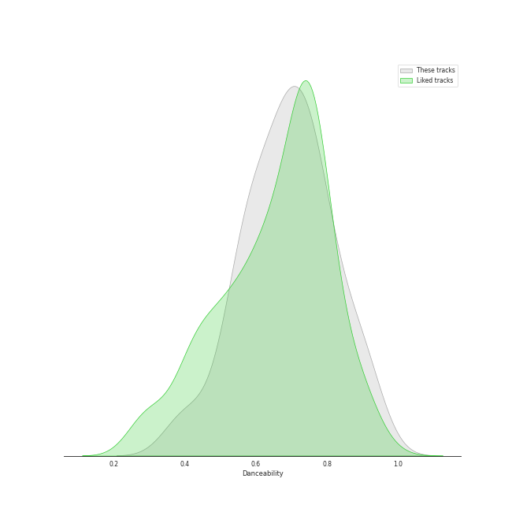
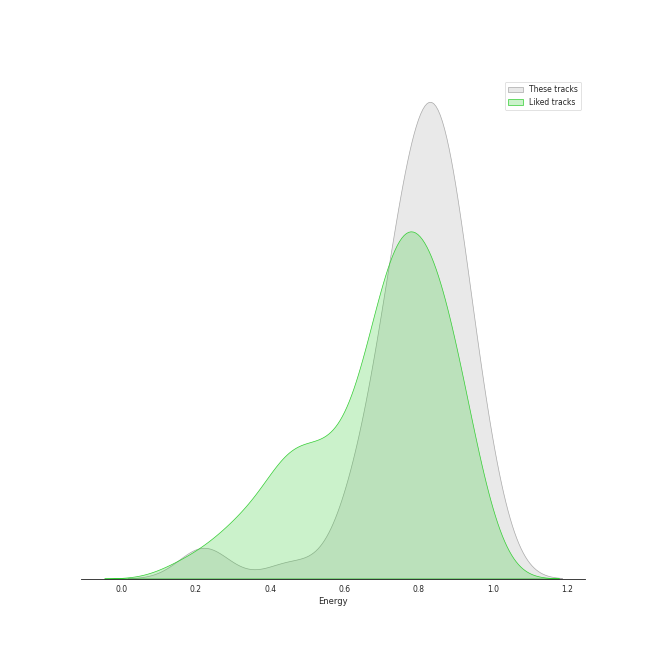
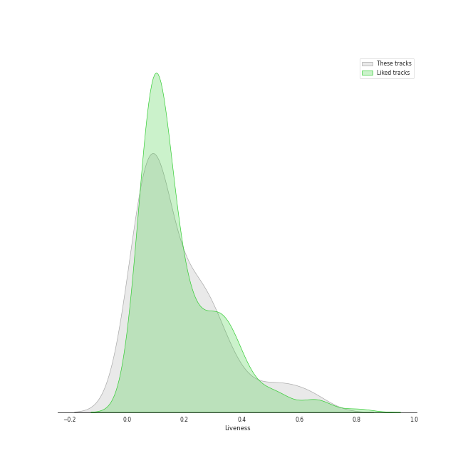
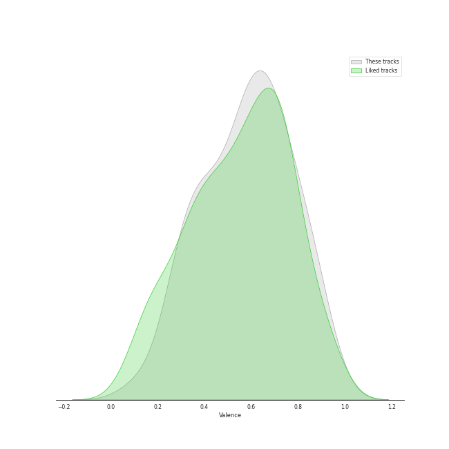
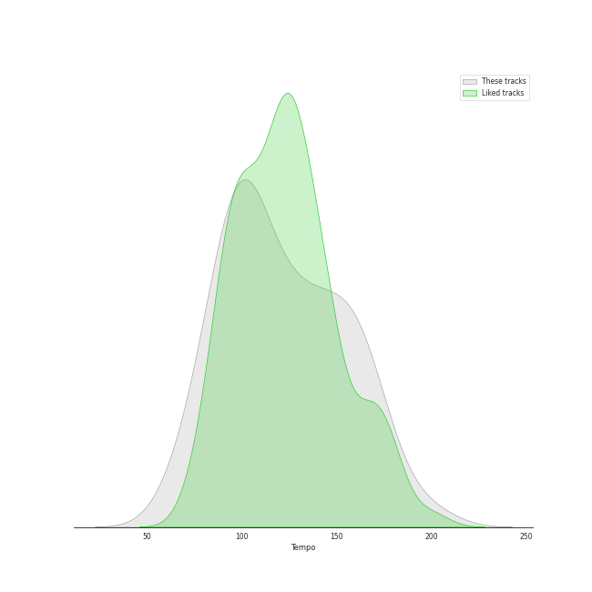

# Track Features for Stray Kids

## Danceability

| ​ | 10 most Danceable tracks | ​​ | 10 least Danceable tracks |
|:---|:---|:---|:---|
|  | RUN (HAN) (0.929) |  | CHEESE (0.376) |
|  | HEYDAY (Prod. Czaer) (0.892) |  | Side Effects (0.444) |
|  | S-Class (0.886) |  | Deep end (Felix) (0.485) |
|  | Any (0.879) |  | Hellevator (0.515) |
|  | Christmas EveL (0.878) |  | i hate to admit (Bang Chan) (0.523) |
|  | Maknae On Top (I.N) (0.834) |  | District 9 (0.529) |
|  | DLC (0.832) |  | Mixtape : Time Out (0.555) |
|  | Back Door (0.82) |  | MIROH (0.564) |
|  | VENOM (0.812) |  | Awkward Silence (0.577) |
|  | CASE 143 (0.812) |  | Levanter - English Ver. (0.581) |

## Energy

| ​ | 10 most Energetic tracks | ​​ | 10 least Energetic tracks |
|:---|:---|:---|:---|
|  | MIROH (0.979) |  | i hate to admit (Bang Chan) (0.217) |
|  | Side Effects (0.977) |  | Deep end (Felix) (0.223) |
|  | DLC (0.965) |  | miss you (Hyunjin) (0.226) |
|  | District 9 (0.956) |  | 24 to 25 (0.455) |
|  | CHEESE (0.946) |  | Maknae On Top (I.N) (0.619) |
|  | Mixtape : Time Out (0.945) |  | Hug Me (I.N) (0.623) |
|  | Awkward Silence (0.915) |  | There (0.631) |
|  | CASE 143 (0.89) |  | RUN (HAN) (0.69) |
|  | Chronosaurus (0.883) |  | Drive (Bang Chan, Lee Know) (0.703) |
|  | DOMINO - English Ver. (0.877) |  | Levanter - English Ver. (0.727) |

## Speechiness

| ​ | 10 most Speechy tracks | ​​ | 10 least Speechy tracks |
|:---|:---|:---|:---|
|  | MANIAC (0.411) |  | 24 to 25 (0.0288) |
|  | I GOT IT (HAN) (0.365) |  | Drive (Bang Chan, Lee Know) (0.0314) |
|  | VENOM (0.339) |  | Stars and Raindrops (Seungmin) (0.0329) |
|  | S-Class (0.333) |  | Up All Night (Bang Chan, Changbin, Felix, Seungmin) (0.0386) |
|  | 3RACHA (Bang Chan, Changbin, HAN) (0.301) |  | Hug Me (I.N) (0.0414) |
|  | Back Door (0.272) |  | DOMINO - English Ver. (0.0425) |
|  | CHEESE (0.268) |  | miss you (Hyunjin) (0.0434) |
|  | District 9 (0.265) |  | Maknae On Top (I.N) (0.0465) |
|  | RUN (HAN) (0.238) |  | DOMINO (0.0466) |
|  | Thunderous (0.234) |  | DLC (0.0468) |

## Acousticness

| ​ | 10 most Acoustic tracks | ​​ | 10 least Acoustic tracks |
|:---|:---|:---|:---|
|  | Deep end (Felix) (0.879) |  | Easy (0.000219) |
|  | miss you (Hyunjin) (0.826) |  | Super Bowl (0.00406) |
|  | i hate to admit (Bang Chan) (0.794) |  | SUPER BOARD (0.00653) |
|  | RUN (HAN) (0.703) |  | FREEZE (0.00674) |
|  | 24 to 25 (0.533) |  | God’s Menu (0.00776) |
|  | Hug Me (I.N) (0.358) |  | Hellevator (0.00816) |
|  | Drive (Bang Chan, Lee Know) (0.311) |  | MIROH (0.0091) |
|  | Muddy Water (Changbin, Hyunjin, HAN, Felix) (0.306) |  | Levanter - English Ver. (0.00912) |
|  | TOPLINE (Feat. Tiger JK) (0.291) |  | District 9 (0.0122) |
|  | Chronosaurus (0.289) |  | Voices (0.0205) |

## Instrumentalness

| ​ | 10 most Instrumental tracks | ​​ | 10 least Instrumental tracks |
|:---|:---|:---|:---|
|  | Maknae On Top (I.N) (1.97e-05) |  | SUPER BOARD (0.0) |
|  | Charmer (1.04e-05) |  | Winter Falls (0.0) |
|  | Easy (1.03e-05) |  | Red Lights (Bang Chan, Hyunjin) (0.0) |
|  | Hug Me (I.N) (6.13e-06) |  | Mixtape : Time Out (0.0) |
|  | District 9 (3.49e-06) |  | i hate to admit (Bang Chan) (0.0) |
|  | CHEESE (0.0) |  | Back Door (0.0) |
|  | Hellevator (0.0) |  | DOMINO - English Ver. (0.0) |
|  | Give Me Your TMI (0.0) |  | Up All Night (Bang Chan, Changbin, Felix, Seungmin) (0.0) |
|  | Awkward Silence (0.0) |  | Drive (Bang Chan, Lee Know) (0.0) |
|  | There (0.0) |  | TOPLINE (Feat. Tiger JK) (0.0) |

## Liveness

| ​ | 10 most Live tracks | ​​ | 10 least Live tracks |
|:---|:---|:---|:---|
|  | Red Lights (Bang Chan, Hyunjin) (0.612) |  | CASE 143 (0.0222) |
|  | Levanter - English Ver. (0.544) |  | CIRCUS (0.0353) |
|  | God’s Menu (0.521) |  | HEYDAY (Prod. Czaer) (0.0363) |
|  | Easy (0.471) |  | Maknae On Top (I.N) (0.0374) |
|  | Christmas EveL (0.401) |  | Up All Night (Bang Chan, Changbin, Felix, Seungmin) (0.0536) |
|  | Hellevator (0.35) |  | Side Effects (0.0545) |
|  | Voices (0.35) |  | I GOT IT (HAN) (0.0653) |
|  | ITEM (0.332) |  | FREEZE (0.0691) |
|  | Stars and Raindrops (Seungmin) (0.287) |  | MANIAC (0.0697) |
|  | Blueprint (0.287) |  | S-Class (0.0715) |

## Valence

| ​ | 10 most Happy tracks | ​​ | 10 least Happy tracks |
|:---|:---|:---|:---|
|  | Up All Night (Bang Chan, Changbin, Felix, Seungmin) (0.916) |  | Side Effects (0.118) |
|  | Muddy Water (Changbin, Hyunjin, HAN, Felix) (0.888) |  | Deep end (Felix) (0.257) |
|  | Maknae On Top (I.N) (0.883) |  | Hellevator (0.288) |
|  | Christmas EveL (0.878) |  | There (0.298) |
|  | Give Me Your TMI (0.824) |  | Voices (0.299) |
|  | I GOT IT (HAN) (0.824) |  | miss you (Hyunjin) (0.306) |
|  | Hug Me (I.N) (0.813) |  | Red Lights (Bang Chan, Hyunjin) (0.336) |
|  | Thunderous (0.79) |  | 24 to 25 (0.376) |
|  | Awkward Silence (0.765) |  | Easy (0.388) |
|  | Hall of Fame (0.764) |  | Mixtape : Time Out (0.389) |

## Tempo

| ​ | 10 most Fast tracks | ​​ | 10 least Fast tracks |
|:---|:---|:---|:---|
|  | Awkward Silence (199.981) |  | miss you (Hyunjin) (72.96) |
|  | District 9 (179.987) |  | I GOT IT (HAN) (75.698) |
|  | Thunderous (172.156) |  | Hellevator (78.17) |
|  | ITEM (161.994) |  | There (79.984) |
|  | Hall of Fame (160.164) |  | Super Bowl (80.01) |
|  | DOMINO (160.066) |  | CHEESE (89.657) |
|  | DOMINO - English Ver. (160.063) |  | Muddy Water (Changbin, Hyunjin, HAN, Felix) (89.989) |
|  | Mixtape : Time Out (160.006) |  | Drive (Bang Chan, Lee Know) (89.998) |
|  | FREEZE (159.874) |  | i hate to admit (Bang Chan) (90.013) |
|  | God’s Menu (157.052) |  | TOPLINE (Feat. Tiger JK) (90.018) |
