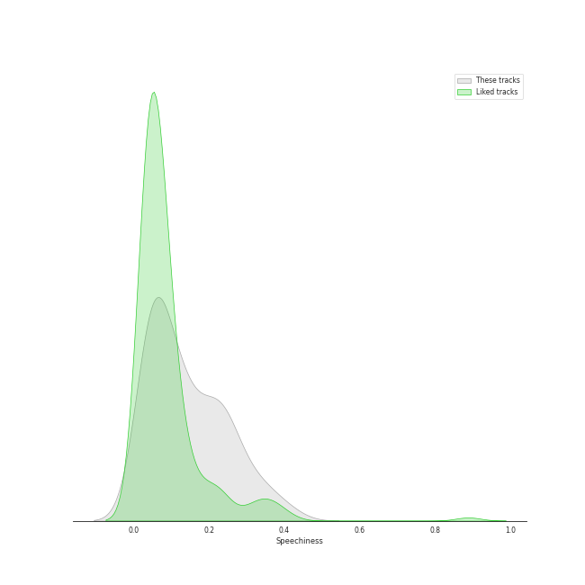
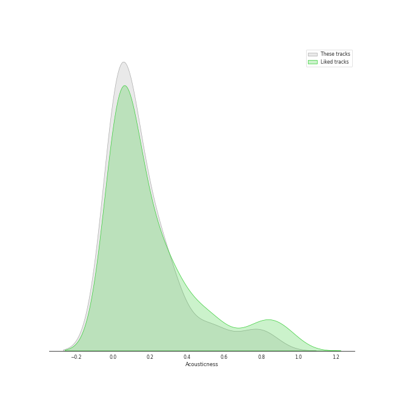

# Audio Features for Stray Kids

## Danceability

| 10 most Danceable tracks | 10 least Danceable tracks |
|:---|:---|
| RUN (HAN) (0.929) | CHEESE (0.376) |
| HEYDAY (Prod. Czaer) (0.892) | Side Effects (0.444) |
| Any (0.879) | Deep end (Felix) (0.485) |
| Christmas EveL (0.878) | Hellevator (0.515) |
| Maknae On Top (I.N) (0.834) | i hate to admit (Bang Chan) (0.523) |
| Back Door (0.82) | District 9 (0.529) |
| VENOM (0.812) | Mixtape : Time Out (0.555) |
| CASE 143 (0.812) | MIROH (0.564) |
| Up All Night (Bang Chan, Changbin, Felix, Seungmin) (0.79) | Awkward Silence (0.577) |
| Charmer (0.786) | Levanter - English Ver. (0.581) |

## Energy

| 10 most Energetic tracks | 10 least Energetic tracks |
|:---|:---|
| MIROH (0.979) | i hate to admit (Bang Chan) (0.217) |
| Side Effects (0.977) | Deep end (Felix) (0.223) |
| District 9 (0.956) | miss you (Hyunjin) (0.226) |
| CHEESE (0.946) | 24 to 25 (0.455) |
| Mixtape : Time Out (0.945) | Maknae On Top (I.N) (0.619) |
| Awkward Silence (0.915) | Hug Me (I.N) (0.623) |
| CASE 143 (0.89) | There (0.631) |
| Chronosaurus (0.883) | RUN (HAN) (0.69) |
| DOMINO - English Ver. (0.877) | Drive (Bang Chan, Lee Know) (0.703) |
| Silent Cry (0.876) | Levanter - English Ver. (0.727) |

## Speechiness

| 10 most Speechy tracks | 10 least Speechy tracks |
|:---|:---|
| MANIAC (0.411) | 24 to 25 (0.0288) |
| I GOT IT (HAN) (0.365) | Drive (Bang Chan, Lee Know) (0.0314) |
| VENOM (0.339) | Stars and Raindrops (Seungmin) (0.0329) |
| 3RACHA (Bang Chan, Changbin, HAN) (0.301) | Up All Night (Bang Chan, Changbin, Felix, Seungmin) (0.0386) |
| Back Door (0.272) | Hug Me (I.N) (0.0414) |
| CHEESE (0.268) | DOMINO - English Ver. (0.0425) |
| District 9 (0.265) | miss you (Hyunjin) (0.0434) |
| RUN (HAN) (0.238) | Maknae On Top (I.N) (0.0465) |
| Thunderous (0.234) | DOMINO (0.0466) |
| Muddy Water (Changbin, Hyunjin, HAN, Felix) (0.231) | Chronosaurus (0.0488) |

## Acousticness

| 10 most Acoustic tracks | 10 least Acoustic tracks |
|:---|:---|
| Deep end (Felix) (0.879) | Easy (0.000219) |
| miss you (Hyunjin) (0.826) | SUPER BOARD (0.00653) |
| i hate to admit (Bang Chan) (0.794) | FREEZE (0.00674) |
| RUN (HAN) (0.703) | God’s Menu (0.00776) |
| 24 to 25 (0.533) | Hellevator (0.00816) |
| Hug Me (I.N) (0.358) | MIROH (0.0091) |
| Drive (Bang Chan, Lee Know) (0.311) | Levanter - English Ver. (0.00912) |
| Muddy Water (Changbin, Hyunjin, HAN, Felix) (0.306) | District 9 (0.0122) |
| Chronosaurus (0.289) | Voices (0.0205) |
| Awkward Silence (0.288) | Side Effects (0.0219) |

## Instrumentalness

| 10 most Instrumental tracks | 10 least Instrumental tracks |
|:---|:---|
| Maknae On Top (I.N) (1.97e-05) | SUPER BOARD (0.0) |
| Charmer (1.04e-05) | Winter Falls (0.0) |
| Easy (1.03e-05) | Red Lights (Bang Chan, Hyunjin) (0.0) |
| Hug Me (I.N) (6.13e-06) | Mixtape : Time Out (0.0) |
| District 9 (3.49e-06) | i hate to admit (Bang Chan) (0.0) |
| CHEESE (0.0) | Back Door (0.0) |
| Hellevator (0.0) | DOMINO - English Ver. (0.0) |
| Give Me Your TMI (0.0) | Up All Night (Bang Chan, Changbin, Felix, Seungmin) (0.0) |
| Awkward Silence (0.0) | Drive (Bang Chan, Lee Know) (0.0) |
| There (0.0) | Thunderous (0.0) |

## Liveness

| 10 most Live tracks | 10 least Live tracks |
|:---|:---|
| Red Lights (Bang Chan, Hyunjin) (0.612) | CASE 143 (0.0222) |
| Levanter - English Ver. (0.544) | CIRCUS (0.0353) |
| God’s Menu (0.521) | HEYDAY (Prod. Czaer) (0.0363) |
| Easy (0.471) | Maknae On Top (I.N) (0.0374) |
| Christmas EveL (0.401) | Up All Night (Bang Chan, Changbin, Felix, Seungmin) (0.0536) |
| Hellevator (0.35) | Side Effects (0.0545) |
| Voices (0.35) | I GOT IT (HAN) (0.0653) |
| Stars and Raindrops (Seungmin) (0.287) | FREEZE (0.0691) |
| Blueprint (0.287) | MANIAC (0.0697) |
| Silent Cry (0.281) | Hug Me (I.N) (0.0716) |

## Valence

| 10 most Happy tracks | 10 least Happy tracks |
|:---|:---|
| Up All Night (Bang Chan, Changbin, Felix, Seungmin) (0.916) | Side Effects (0.118) |
| Muddy Water (Changbin, Hyunjin, HAN, Felix) (0.888) | Deep end (Felix) (0.257) |
| Maknae On Top (I.N) (0.883) | Hellevator (0.288) |
| Christmas EveL (0.878) | There (0.298) |
| Give Me Your TMI (0.824) | Voices (0.299) |
| I GOT IT (HAN) (0.824) | miss you (Hyunjin) (0.306) |
| Hug Me (I.N) (0.813) | Red Lights (Bang Chan, Hyunjin) (0.336) |
| Thunderous (0.79) | 24 to 25 (0.376) |
| Awkward Silence (0.765) | Easy (0.388) |
| RUN (HAN) (0.749) | Mixtape : Time Out (0.389) |

## Tempo

| 10 most Fast tracks | 10 least Fast tracks |
|:---|:---|
| Awkward Silence (199.981) | miss you (Hyunjin) (72.96) |
| District 9 (179.987) | I GOT IT (HAN) (75.698) |
| Thunderous (172.156) | Hellevator (78.17) |
| DOMINO (160.066) | There (79.984) |
| DOMINO - English Ver. (160.063) | CHEESE (89.657) |
| Mixtape : Time Out (160.006) | Muddy Water (Changbin, Hyunjin, HAN, Felix) (89.989) |
| FREEZE (159.874) | Drive (Bang Chan, Lee Know) (89.998) |
| God’s Menu (157.052) | i hate to admit (Bang Chan) (90.013) |
| Levanter - English Ver. (149.971) | Charmer (90.963) |
| Voices (149.967) | 24 to 25 (92.01) |
