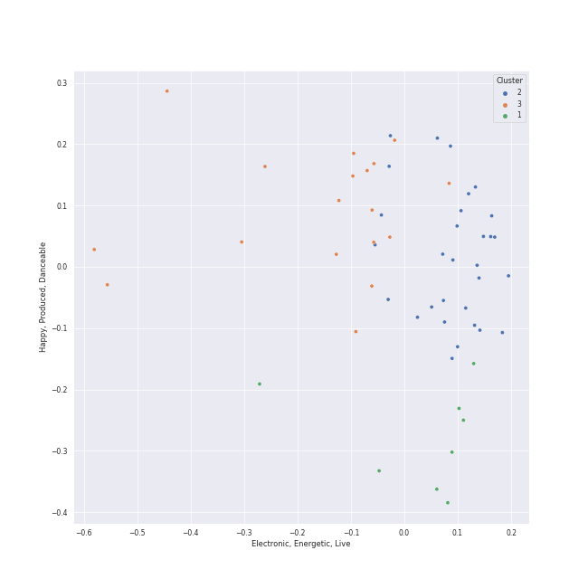

# Clusters in Stray Kids

## Cluster #1

8 tracks

| Art | Track | Album | Artists | Label | Rank | 💚 | 🔗 |
|:---|:---|:---|:---|:---|---:|:---|:---|
|  | twilight | ATE | [Stray Kids](../../overview.md) | [Republic Records](../../../../labels/republic_records) | 496 | 💚 | [🔗](https://open.spotify.com/track/1T0hdoMSjzoKUPbKRmrDg3) |
|  | Red Lights (Bang Chan, Hyunjin) | NOEASY | [Stray Kids](../../overview.md) | [Republic Records](../../../../labels/republic_records) | 773 | 💚 | [🔗](https://open.spotify.com/track/0LatE4S9UtCDwIdGQsFFKL) |
|  | LALALALA | ROCK-STAR | [Stray Kids](../../overview.md) | [Republic Records](../../../../labels/republic_records) | 334 | 💚 | [🔗](https://open.spotify.com/track/1OG1NoKpZZLrMqMYCk9m84) |
|  | God’s Menu | GO LIVE | [Stray Kids](../../overview.md) | [Republic Records](../../../../labels/republic_records) | 994 | 💚 | [🔗](https://open.spotify.com/track/4XPXrcpyNr30Km6aPiflJy) |
|  | Easy | GO LIVE | [Stray Kids](../../overview.md) | [Republic Records](../../../../labels/republic_records) | 994 | | [🔗](https://open.spotify.com/track/4s9diT9GXpI7QiysMkoANG) |
|  | Voices | SKZ2020 | [Stray Kids](../../overview.md) | [Republic Records](../../../../labels/republic_records) | 994 | | [🔗](https://open.spotify.com/track/3zutAkkwy9Ucd9l4H4EReH) |
|  | Levanter (English Ver.) | Step Out of Clé (English Ver.) | [Stray Kids](../../overview.md) | [Republic Records](../../../../labels/republic_records) | 994 | | [🔗](https://open.spotify.com/track/5sPdWGv1MlA0qHzjN9hPPv) |
|  | Hellevator | Mixtape | [Stray Kids](../../overview.md) | [Republic Records](../../../../labels/republic_records) | 994 | | [🔗](https://open.spotify.com/track/7mKXEaBVWuV0dMqN0gaCBm) |
## Cluster #2

30 tracks

| Art | Track | Album | Artists | Label | Rank | 💚 | 🔗 |
|:---|:---|:---|:---|:---|---:|:---|:---|
|  | JJAM | ATE | [Stray Kids](../../overview.md) | [Republic Records](../../../../labels/republic_records) | 994 | | [🔗](https://open.spotify.com/track/6ojfWEW5oBSyXQqO9G72iM) |
|  | Winter Falls | Christmas EveL | [Stray Kids](../../overview.md) | [Republic Records](../../../../labels/republic_records) | 369 | | [🔗](https://open.spotify.com/track/0BeqHPNJSLzfH8TZ7Adpb3) |
|  | Surfin’ (Lee Know, Changbin, Felix) | NOEASY | [Stray Kids](../../overview.md) | [Republic Records](../../../../labels/republic_records) | 994 | | [🔗](https://open.spotify.com/track/1FdnsU6An1Ye3uBJe8j23c) |
|  | Silent Cry | NOEASY | [Stray Kids](../../overview.md) | [Republic Records](../../../../labels/republic_records) | 994 | | [🔗](https://open.spotify.com/track/5kBJH5gU89axZDauhfddpy) |
|  | Stars and Raindrops (Seungmin) | SKZ-REPLAY | [Stray Kids](../../overview.md) | [Republic Records](../../../../labels/republic_records) | 994 | | [🔗](https://open.spotify.com/track/5kFGqKqHzVVMMI7V7uoID1) |
|  | FREEZE | ODDINARY | [Stray Kids](../../overview.md) | [Republic Records](../../../../labels/republic_records) | 994 | | [🔗](https://open.spotify.com/track/2L7hSYdvF0CtaM6JisfKEG) |
|  | MEGAVERSE | ROCK-STAR | [Stray Kids](../../overview.md) | [Republic Records](../../../../labels/republic_records) | 65 | 💚 | [🔗](https://open.spotify.com/track/5Q1tv4GTxP3IJeGMOKdrFO) |
|  | Blueprint | GO LIVE | [Stray Kids](../../overview.md) | [Republic Records](../../../../labels/republic_records) | 994 | | [🔗](https://open.spotify.com/track/2JzOF5Ex1BfufuZ6DgvOPe) |
|  | MIROH | Clé 1 : MIROH | [Stray Kids](../../overview.md) | [Republic Records](../../../../labels/republic_records) | 994 | 💚 | [🔗](https://open.spotify.com/track/2sFWzfV3kqAwXEWM9BjzwH) |
|  | District 9 | I am NOT | [Stray Kids](../../overview.md) | [Republic Records](../../../../labels/republic_records) | 994 | | [🔗](https://open.spotify.com/track/4A0ZTqmb6131trEdQl2dBW) |
## Cluster #3

18 tracks

| Art | Track | Album | Artists | Label | Rank | 💚 | 🔗 |
|:---|:---|:---|:---|:---|---:|:---|:---|
|  | 3RACHA (Bang Chan, Changbin, HAN) | MAXIDENT | [Stray Kids](../../overview.md) | [Republic Records](../../../../labels/republic_records) | 994 | | [🔗](https://open.spotify.com/track/6T4o4xEh61CpgM9v4jG5DJ) |
|  | Thunderous | NOEASY | [Stray Kids](../../overview.md) | [Republic Records](../../../../labels/republic_records) | 27 | 💚 | [🔗](https://open.spotify.com/track/0nwTMzpatarzvLvtwwzdCt) |
|  | Drive (Bang Chan, Lee Know) | SKZ-REPLAY | [Stray Kids](../../overview.md) | [Republic Records](../../../../labels/republic_records) | 994 | | [🔗](https://open.spotify.com/track/0hLvtmoexLKl14LrzxOYRt) |
|  | I GOT IT (HAN) | SKZ-REPLAY | [Stray Kids](../../overview.md) | [Republic Records](../../../../labels/republic_records) | 760 | 💚 | [🔗](https://open.spotify.com/track/4atsZkGtoHHPugKK5wzAE1) |
|  | Hug Me (I.N) | SKZ-REPLAY | [Stray Kids](../../overview.md) | [Republic Records](../../../../labels/republic_records) | 599 | | [🔗](https://open.spotify.com/track/5gXUFmE5AKFiInKyHVVEnL) |
|  | TOPLINE (Feat. Tiger JK) | 5-STAR | [Stray Kids](../../overview.md), Tiger JK | [Republic Records](../../../../labels/republic_records) | 501 | | [🔗](https://open.spotify.com/track/0jvZ9caE53ubCQXMki6W23) |
|  | Hall of Fame | 5-STAR | [Stray Kids](../../overview.md) | [Republic Records](../../../../labels/republic_records) | 809 | 💚 | [🔗](https://open.spotify.com/track/5podb1asONjqwKk1iMVOeG) |
|  | MANIAC | ODDINARY | [Stray Kids](../../overview.md) | [Republic Records](../../../../labels/republic_records) | 691 | 💚 | [🔗](https://open.spotify.com/track/63irPUP3xB74fHdw1Aw9zR) |
|  | Leave | ROCK-STAR | [Stray Kids](../../overview.md) | [Republic Records](../../../../labels/republic_records) | 741 | 💚 | [🔗](https://open.spotify.com/track/2zPqhdPGNCwzXnvSvj7WgD) |
|  | Awkward Silence | I am WHO | [Stray Kids](../../overview.md) | [Republic Records](../../../../labels/republic_records) | 994 | | [🔗](https://open.spotify.com/track/6qOPM7GV2Yv10hAgFEn6oN) |