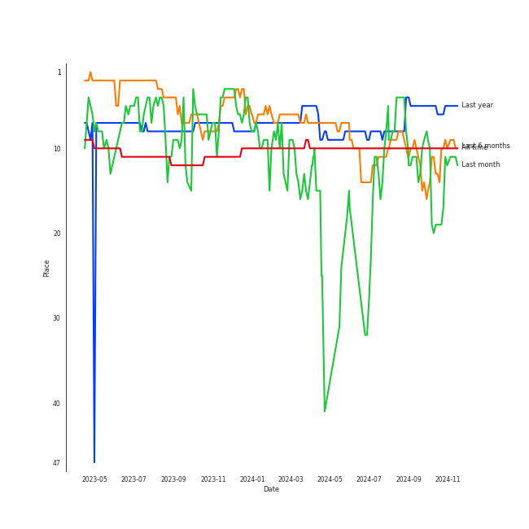
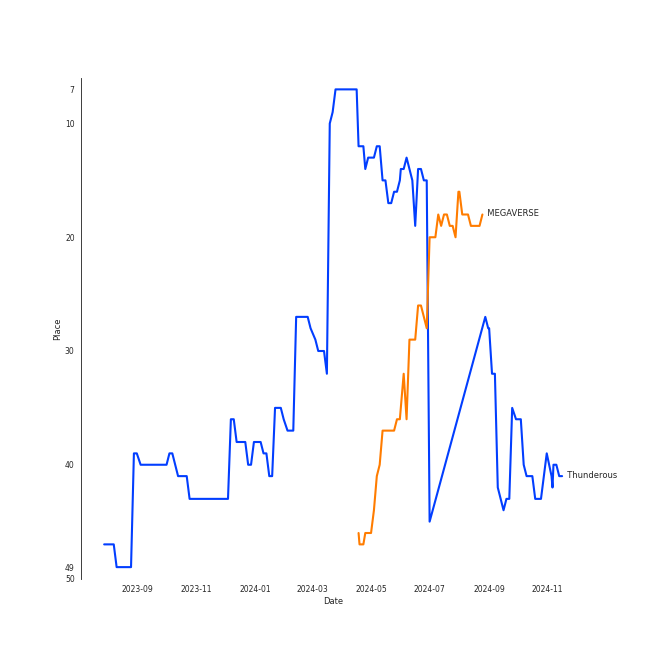
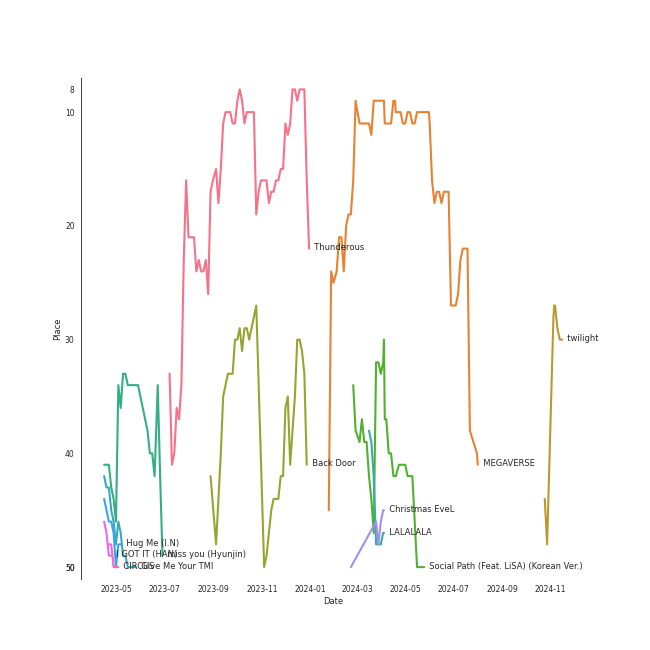
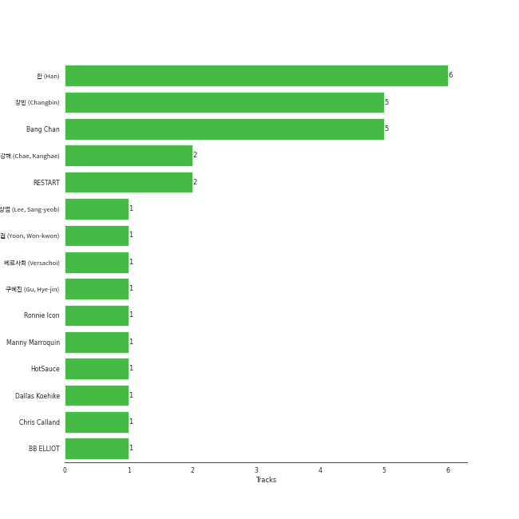

# Stray Kids

[See Track Features](audio_features.md)

[See Clusters](clusters/overview.md)

## Relationships

Stray Kids:
- has member Bang Chan
- has member 창빈 (Changbin)
- has member 필릭스 (Felix)
- has member 한 (Han)
- has member 현진 (Hyunjin)
- has member 아이엔 (I.N)
- has member 리노 (Lee Know)
- has member 승민 (Seungmin)
- has member 우진 (Woojin)

## Artist Rank
Stray Kids is currently:
- The #7 artist of all time
- The #4 artist of the last 6 months
- The #3 artist of the last month

## Top Tracks

- Thunderous is:
    - the #16 track of the last 6 months
    - the #43 track of all time
- Back Door is:
    - the #44 track of the last 6 months
- VENOM is:
    - the #25 track of the last month
- MANIAC is:
    - the #43 track of the last month

### Top tracks of all time over time

### Top tracks of the last 6 months over time

### Top tracks of the last month over time

## Featured on Playlists
| Art | Tracks | Playlist |
|:---|---:|:---|
|  | 48 | [K-Pop](../../playlists/k_pop/overview.md) |
|  | 10 | [Workout](../../playlists/workout/overview.md) |
|  | 8 | [K-Pop Favorites](../../playlists/k_pop_favorites/overview.md) |
|  | 6 | [Chill](../../playlists/chill/overview.md) |
|  | 4 | [Recent Comebacks](../../playlists/recent_comebacks/overview.md) |
|  | 3 | [Summer](../../playlists/summer/overview.md) |
|  | 3 | [K-Memes](../../playlists/k_memes/overview.md) |
|  | 3 | [Halloween](../../playlists/halloween/overview.md) |
|  | 3 | [Christmas](../../playlists/christmas/overview.md) |
|  | 2 | [Cursed English](../../playlists/cursed_english/overview.md) |
|  | 1 | [K-Pop 101](../../playlists/k_pop_101/overview.md) |
|  | 1 | [Sharon RPD](../../playlists/sharon_rpd/overview.md) |

## Top Albums

| Art | Tracks | 💚 | Album | Release Date | 🔗 |
|:---|---:|---:|:---|:---|:---|
|  | 9 | 3 | SKZ-REPLAY | 2022-12-21 | [🔗](https://open.spotify.com/album/3UXrliH0JUQvcaLnBD8Txz) |
|  | 6 | 4 | NOEASY | 2021-08-23 | [🔗](https://open.spotify.com/album/558tpdCejjVQNFAumRAeQj) |
|  | 5 | 3 | ODDINARY | 2022-03-18 | [🔗](https://open.spotify.com/album/0Gmf4pfe0POEQq2FgGAj2q) |
|  | 4 | 3 | 5-STAR | 2023-06-02 | [🔗](https://open.spotify.com/album/3Pel3gWsPxVpZVrciU0Fm6) |
|  | 4 | 2 | ROCK-STAR | 2023-11-10 | [🔗](https://open.spotify.com/album/0aJnGEZWIc1VCYlZOXv05a) |
|  | 4 | 2 | MAXIDENT | 2022-10-07 | [🔗](https://open.spotify.com/album/0T6hYH0UyDjNraWZk2mZWi) |
|  | 4 | 1 | Christmas EveL | 2021-11-29 | [🔗](https://open.spotify.com/album/1qVuQI0WRn2Mczbdxx54Ih) |
|  | 3 | 1 | GO LIVE | 2020-06-17 | [🔗](https://open.spotify.com/album/6DWLIzvmiLPAuDWYZqrLQo) |
|  | 2 | 2 | IN LIFE | 2020-09-14 | [🔗](https://open.spotify.com/album/0aERWcI2KYSCM4biUihB9X) |
|  | 2 | 0 | SKZ2020 | 2020-03-18 | [🔗](https://open.spotify.com/album/6QIWJVJPPgAA5c4aIb1zCA) |

See all albums

| Art | Tracks | 💚 | Album | Release Date | 🔗 |
|:---|---:|---:|:---|:---|:---|
|  | 1 | 1 | There | 2023-02-15 | [🔗](https://open.spotify.com/album/2j8BoKqZrMUYTARDIs9XDk) |
|  | 1 | 1 | Street Man Fighter Original Vol.4 (Crew Songs) | 2022-09-20 | [🔗](https://open.spotify.com/album/7dwRGP1A80POqE3O9At5Vw) |
|  | 1 | 1 | Clé 2 : Yellow Wood | 2019-06-19 | [🔗](https://open.spotify.com/album/7a3luOh8mK0q8YsRkNUjrU) |
|  | 1 | 1 | Clé 1 : MIROH | 2019-03-25 | [🔗](https://open.spotify.com/album/3s6RbqkTprnGwKpoUSYL00) |
|  | 1 | 1 | CIRCUS | 2022-06-10 | [🔗](https://open.spotify.com/album/4IQHY28D4aHus9lGDlSdPp) |
|  | 1 | 0 | Step Out of Clé (English Ver.) | 2020-01-24 | [🔗](https://open.spotify.com/album/2BBeNPEEevRiYISKYEnGvc) |
|  | 1 | 0 | SKZ-REPLAY | 2022-12-21 | [🔗](https://open.spotify.com/album/2r5xgTlwEoWBSNcxXjmTVn) |
|  | 1 | 0 | Mixtape : Time Out | 2022-08-01 | [🔗](https://open.spotify.com/album/6Sr3My17NKn1g1zIFclPoS) |
|  | 1 | 0 | Mixtape | 2018-01-08 | [🔗](https://open.spotify.com/album/1kTzTL0iOIE2IAGw83yY4O) |
|  | 1 | 0 | I am WHO | 2018-08-06 | [🔗](https://open.spotify.com/album/2SACeVKmkXeAXHqLDdTU9N) |
|  | 1 | 0 | I am NOT | 2018-03-26 | [🔗](https://open.spotify.com/album/6xP5hGAHaLArPqF07UYVJL) |

## Top Record Labels

| Tracks | 💚 | Label |
|---:|---:|:---|
| 50 | 23 | [Republic Records](../../labels/republic_records/overview.md) |
| 3 | 2 | [Sony Music Labels Inc.](../../labels/sony_music_labels_inc_/overview.md) |
| 1 | 1 | [Genie Music Corporation](../../labels/genie_music_corporation/overview.md) |

## Genres

- [k-pop](../../genres/k_pop/overview.md)
- [k-pop boy group](../../genres/k_pop_boy_group/overview.md)
- [pop](../../genres/pop/overview.md)

## Credits

### Member Credits

| | Bang Chan | 창빈 (Changbin) | 필릭스 (Felix) | 한 (Han) |
|:---|---:|---:|---:|---:|
| Arranger | 1 | 0 | 0 | 0 |
| Lyricist | 1 | 1 | 0 | 1 |
| Songwriter | 2 | 2 | 0 | 2 |
| Vocal | 0 | 0 | 1 | 0 |
### Production Credits

| Art | Track | Members | Credit Types |
|:---|:---|:---|:---|
|  | MIROH | 창빈 (Changbin), 한 (Han), Bang Chan | Lyricist, Songwriter |
|  | Back Door | 창빈 (Changbin), 한 (Han), Bang Chan | Songwriter, Arranger |

## Top Producers

| Art | Producer | Tracks | Credit Types |
|:---|:---|---:|:---|
| | 창빈 (Changbin) | 2 | Songwriter, Lyricist |
| | 한 (Han) | 2 | Songwriter, Lyricist |
| | Bang Chan | 2 | Arranger, Songwriter, Lyricist |
| | HotSauce | 1 | Arranger, Songwriter |

## Tracks

| Art | Track | Album | Artists | Label | 💚 | 🔗 |
|:---|:---|:---|:---|:---|:---|:---|
|  | Hellevator | Mixtape | [Stray Kids](overview.md) | [Republic Records](../../labels/republic_records) | | [🔗](https://open.spotify.com/track/7mKXEaBVWuV0dMqN0gaCBm) |
|  | District 9 | I am NOT | [Stray Kids](overview.md) | [Republic Records](../../labels/republic_records) | | [🔗](https://open.spotify.com/track/4A0ZTqmb6131trEdQl2dBW) |
|  | Awkward Silence | I am WHO | [Stray Kids](overview.md) | [Republic Records](../../labels/republic_records) | | [🔗](https://open.spotify.com/track/6qOPM7GV2Yv10hAgFEn6oN) |
|  | MIROH | Clé 1 : MIROH | [Stray Kids](overview.md) | [Republic Records](../../labels/republic_records) | 💚 | [🔗](https://open.spotify.com/track/2sFWzfV3kqAwXEWM9BjzwH) |
|  | Side Effects | Clé 2 : Yellow Wood | [Stray Kids](overview.md) | [Republic Records](../../labels/republic_records) | 💚 | [🔗](https://open.spotify.com/track/1Y2HN48G6Bkm4V3csQncJP) |
|  | Levanter (English Ver.) | Step Out of Clé (English Ver.) | [Stray Kids](overview.md) | [Republic Records](../../labels/republic_records) | | [🔗](https://open.spotify.com/track/5sPdWGv1MlA0qHzjN9hPPv) |
|  | Chronosaurus | SKZ2020 | [Stray Kids](overview.md) | [Republic Records](../../labels/republic_records) | | [🔗](https://open.spotify.com/track/58epKNTOOt4RDWObkR9e43) |
|  | Voices | SKZ2020 | [Stray Kids](overview.md) | [Republic Records](../../labels/republic_records) | | [🔗](https://open.spotify.com/track/3zutAkkwy9Ucd9l4H4EReH) |
|  | Blueprint | GO LIVE | [Stray Kids](overview.md) | [Republic Records](../../labels/republic_records) | | [🔗](https://open.spotify.com/track/2JzOF5Ex1BfufuZ6DgvOPe) |
|  | Easy | GO LIVE | [Stray Kids](overview.md) | [Republic Records](../../labels/republic_records) | | [🔗](https://open.spotify.com/track/4s9diT9GXpI7QiysMkoANG) |

See all tracks

| Art | Track | Album | Artists | Label | 💚 | 🔗 |
|:---|:---|:---|:---|:---|:---|:---|
|  | God’s Menu | GO LIVE | [Stray Kids](overview.md) | [Republic Records](../../labels/republic_records) | 💚 | [🔗](https://open.spotify.com/track/4XPXrcpyNr30Km6aPiflJy) |
|  | Any | IN LIFE | [Stray Kids](overview.md) | [Republic Records](../../labels/republic_records) | 💚 | [🔗](https://open.spotify.com/track/5S7kMbtEikXwCAHMu3R3jw) |
|  | Back Door | IN LIFE | [Stray Kids](overview.md) | [Republic Records](../../labels/republic_records) | 💚 | [🔗](https://open.spotify.com/track/0XuepwFJUcKN8T5zTqoP0F) |
|  | CHEESE | NOEASY | [Stray Kids](overview.md) | [Republic Records](../../labels/republic_records) | 💚 | [🔗](https://open.spotify.com/track/7qpSatdWQcRHA3hpedL2u4) |
|  | DOMINO | NOEASY | [Stray Kids](overview.md) | [Republic Records](../../labels/republic_records) | 💚 | [🔗](https://open.spotify.com/track/6Ib6RkvLBMD85bov85apSL) |
|  | Red Lights (Bang Chan, Hyunjin) | NOEASY | [Stray Kids](overview.md) | [Republic Records](../../labels/republic_records) | 💚 | [🔗](https://open.spotify.com/track/0LatE4S9UtCDwIdGQsFFKL) |
|  | Silent Cry | NOEASY | [Stray Kids](overview.md) | [Republic Records](../../labels/republic_records) | | [🔗](https://open.spotify.com/track/5kBJH5gU89axZDauhfddpy) |
|  | Surfin’ (Lee Know, Changbin, Felix) | NOEASY | [Stray Kids](overview.md) | [Republic Records](../../labels/republic_records) | | [🔗](https://open.spotify.com/track/1FdnsU6An1Ye3uBJe8j23c) |
|  | Thunderous | NOEASY | [Stray Kids](overview.md) | [Republic Records](../../labels/republic_records) | 💚 | [🔗](https://open.spotify.com/track/0nwTMzpatarzvLvtwwzdCt) |
|  | 24 to 25 | Christmas EveL | [Stray Kids](overview.md) | [Republic Records](../../labels/republic_records) | | [🔗](https://open.spotify.com/track/6WM7pRXIeXuZ3Wowi9v1Wr) |
|  | Christmas EveL | Christmas EveL | [Stray Kids](overview.md) | [Republic Records](../../labels/republic_records) | 💚 | [🔗](https://open.spotify.com/track/5npCUsfrlhdyjxyCa32maW) |
|  | DOMINO (English Ver.) | Christmas EveL | [Stray Kids](overview.md) | [Republic Records](../../labels/republic_records) | | [🔗](https://open.spotify.com/track/0b9YBfAcbnhVDUFmsfpDFj) |
|  | Winter Falls | Christmas EveL | [Stray Kids](overview.md) | [Republic Records](../../labels/republic_records) | | [🔗](https://open.spotify.com/track/0BeqHPNJSLzfH8TZ7Adpb3) |
|  | Charmer | ODDINARY | [Stray Kids](overview.md) | [Republic Records](../../labels/republic_records) | | [🔗](https://open.spotify.com/track/4QDpsNBlllaLGj8zbF2EE0) |
|  | FREEZE | ODDINARY | [Stray Kids](overview.md) | [Republic Records](../../labels/republic_records) | | [🔗](https://open.spotify.com/track/2L7hSYdvF0CtaM6JisfKEG) |
|  | MANIAC | ODDINARY | [Stray Kids](overview.md) | [Republic Records](../../labels/republic_records) | 💚 | [🔗](https://open.spotify.com/track/63irPUP3xB74fHdw1Aw9zR) |
|  | Muddy Water (Changbin, Hyunjin, HAN, Felix) | ODDINARY | [Stray Kids](overview.md) | [Republic Records](../../labels/republic_records) | 💚 | [🔗](https://open.spotify.com/track/0oHn3CGVerdfLqIrN6CT42) |
|  | VENOM | ODDINARY | [Stray Kids](overview.md) | [Republic Records](../../labels/republic_records) | 💚 | [🔗](https://open.spotify.com/track/4b3rGL8LDSkbARUUA20136) |
|  | CIRCUS | CIRCUS | [Stray Kids](overview.md) | [Sony Music Labels Inc.](../../labels/sony_music_labels_inc_) | 💚 | [🔗](https://open.spotify.com/track/2uw2ftfyS4yJLWiTtbxasE) |
|  | Mixtape : Time Out | Mixtape : Time Out | [Stray Kids](overview.md) | [Republic Records](../../labels/republic_records) | | [🔗](https://open.spotify.com/track/0OCDOcvQvozjsivREMojzx) |
|  | HEYDAY (Prod. Czaer) | Street Man Fighter Original Vol.4 (Crew Songs) | [Stray Kids](overview.md) | [Genie Music Corporation](../../labels/genie_music_corporation) | 💚 | [🔗](https://open.spotify.com/track/35sE2Ehvd1GzBzAIC0zFIu) |
|  | 3RACHA (Bang Chan, Changbin, HAN) | MAXIDENT | [Stray Kids](overview.md) | [Republic Records](../../labels/republic_records) | | [🔗](https://open.spotify.com/track/6T4o4xEh61CpgM9v4jG5DJ) |
|  | CASE 143 | MAXIDENT | [Stray Kids](overview.md) | [Republic Records](../../labels/republic_records) | 💚 | [🔗](https://open.spotify.com/track/3O8G8eVrhfXTGttyQ1xVuq) |
|  | Give Me Your TMI | MAXIDENT | [Stray Kids](overview.md) | [Republic Records](../../labels/republic_records) | 💚 | [🔗](https://open.spotify.com/track/7CQhZA3qNDZBoTKWqjD7gR) |
|  | SUPER BOARD | MAXIDENT | [Stray Kids](overview.md) | [Republic Records](../../labels/republic_records) | | [🔗](https://open.spotify.com/track/078fJxqEUz0LvbHSM6AoXJ) |
|  | Drive (Bang Chan, Lee Know) | SKZ-REPLAY | [Stray Kids](overview.md) | [Republic Records](../../labels/republic_records) | | [🔗](https://open.spotify.com/track/0hLvtmoexLKl14LrzxOYRt) |
|  | Hug Me (I.N) | SKZ-REPLAY | [Stray Kids](overview.md) | [Republic Records](../../labels/republic_records) | | [🔗](https://open.spotify.com/track/5gXUFmE5AKFiInKyHVVEnL) |
|  | I GOT IT (HAN) | SKZ-REPLAY | [Stray Kids](overview.md) | [Republic Records](../../labels/republic_records) | 💚 | [🔗](https://open.spotify.com/track/4atsZkGtoHHPugKK5wzAE1) |
|  | Maknae On Top (I.N) | SKZ-REPLAY | [Stray Kids](overview.md), Bang Chan, Changbin (Stray Kids) | [Republic Records](../../labels/republic_records) | 💚 | [🔗](https://open.spotify.com/track/1J0qupz0gVGSB5jcRY35tL) |
|  | RUN (HAN) | SKZ-REPLAY | [Stray Kids](overview.md) | [Republic Records](../../labels/republic_records) | | [🔗](https://open.spotify.com/track/4jjaOnFqtAyiYmP7PdTJbO) |
|  | Stars and Raindrops (Seungmin) | SKZ-REPLAY | [Stray Kids](overview.md) | [Republic Records](../../labels/republic_records) | | [🔗](https://open.spotify.com/track/5kFGqKqHzVVMMI7V7uoID1) |
|  | Up All Night (Bang Chan, Changbin, Felix, Seungmin) | SKZ-REPLAY | [Stray Kids](overview.md) | [Republic Records](../../labels/republic_records) | 💚 | [🔗](https://open.spotify.com/track/0bxB5Jie9fGKTIibfYVfei) |
|  | Up All Night (Bang Chan, Changbin, Felix, Seungmin) | SKZ-REPLAY | [Stray Kids](overview.md) | [Sony Music Labels Inc.](../../labels/sony_music_labels_inc_) | | [🔗](https://open.spotify.com/track/7sA7GFAQU055GXROfrGNJe) |
|  | i hate to admit (Bang Chan) | SKZ-REPLAY | [Stray Kids](overview.md) | [Republic Records](../../labels/republic_records) | | [🔗](https://open.spotify.com/track/0XABJLloqjHsF4mY4tGIOH) |
|  | miss you (Hyunjin) | SKZ-REPLAY | [Stray Kids](overview.md) | [Republic Records](../../labels/republic_records) | | [🔗](https://open.spotify.com/track/1BwFLLe233S6HR1ravS3yi) |
|  | There | There | [Stray Kids](overview.md) | [Sony Music Labels Inc.](../../labels/sony_music_labels_inc_) | 💚 | [🔗](https://open.spotify.com/track/6gHeWGamtOYHBd1LBZ7Fv6) |
|  | Hall of Fame | 5-STAR | [Stray Kids](overview.md) | [Republic Records](../../labels/republic_records) | 💚 | [🔗](https://open.spotify.com/track/5podb1asONjqwKk1iMVOeG) |
|  | ITEM | 5-STAR | [Stray Kids](overview.md) | [Republic Records](../../labels/republic_records) | | [🔗](https://open.spotify.com/track/1EWTsgQAEsUrnQ8iawhDSN) |
|  | S-Class | 5-STAR | [Stray Kids](overview.md) | [Republic Records](../../labels/republic_records) | 💚 | [🔗](https://open.spotify.com/track/3gTQwwDNJ42CCLo3Sf4JDd) |
|  | TOPLINE (Feat. Tiger JK) | 5-STAR | [Stray Kids](overview.md), Tiger JK | [Republic Records](../../labels/republic_records) | 💚 | [🔗](https://open.spotify.com/track/0jvZ9caE53ubCQXMki6W23) |
|  | LALALALA | ROCK-STAR | [Stray Kids](overview.md) | [Republic Records](../../labels/republic_records) | 💚 | [🔗](https://open.spotify.com/track/1OG1NoKpZZLrMqMYCk9m84) |
|  | LALALALA (Rock Ver.) | ROCK-STAR | [Stray Kids](overview.md) | [Republic Records](../../labels/republic_records) | | [🔗](https://open.spotify.com/track/20FfCMC46eOIIrxCUdSNZT) |
|  | MEGAVERSE | ROCK-STAR | [Stray Kids](overview.md) | [Republic Records](../../labels/republic_records) | | [🔗](https://open.spotify.com/track/5Q1tv4GTxP3IJeGMOKdrFO) |
|  | Social Path (Feat. LiSA) (Korean Ver.) | ROCK-STAR | [Stray Kids](overview.md), LiSA | [Republic Records](../../labels/republic_records) | 💚 | [🔗](https://open.spotify.com/track/5w6HF09YaD6wWlC90NaeVP) |

