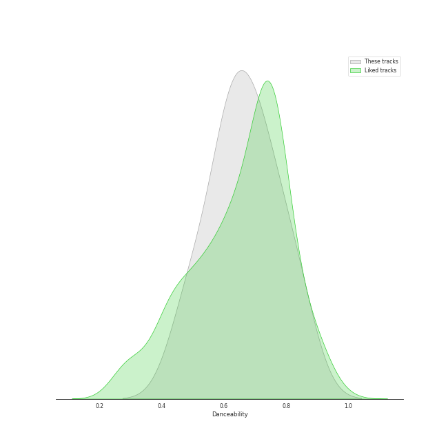
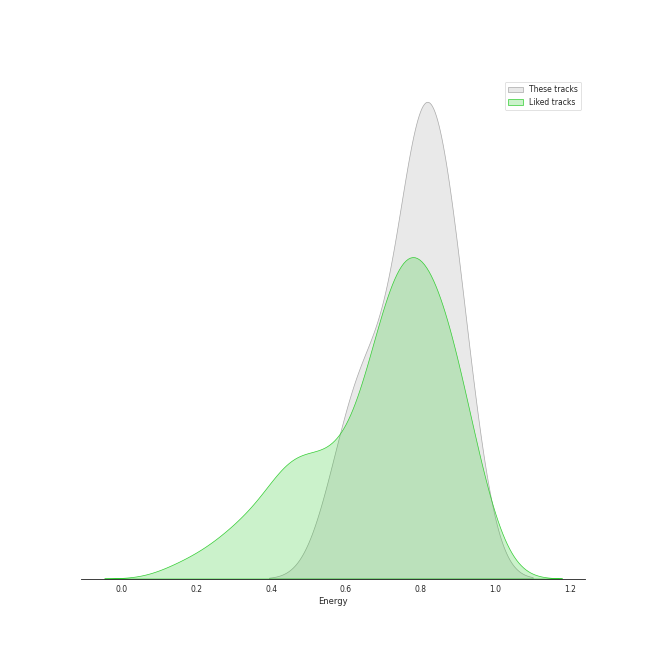
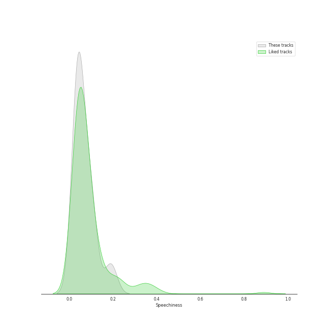
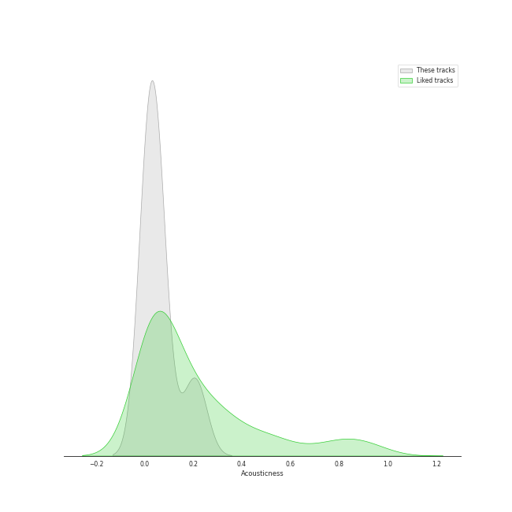
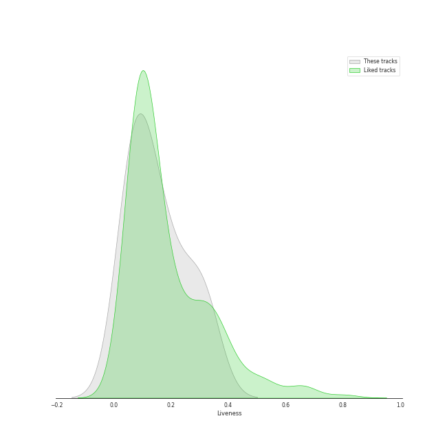
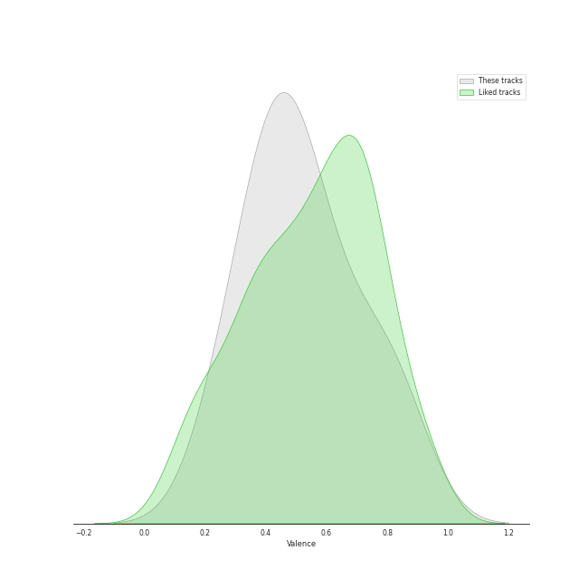
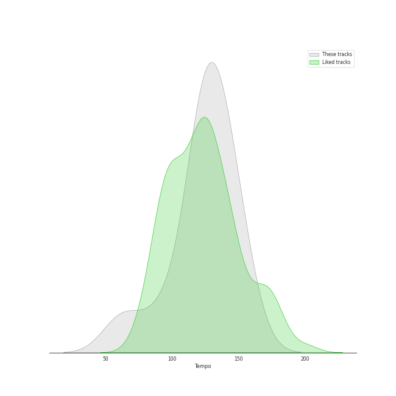

# Track Features for SUNMI

## Danceability

| ​ | 10 most Danceable tracks | ​​ | 10 least Danceable tracks |
|:---|:---|:---|:---|
|  | Heart Burn (0.84) |  | STRANGER (0.475) |
|  | Childhood (0.817) |  | TAIL (0.515) |
|  | 24 Hours (0.739) |  | Siren (0.61) |
|  | Gashina (0.722) |  | You can't sit with us (0.61) |
|  | pporappippam (0.714) |  | Oh Sorry Ya (0.622) |
|  | When We Disco (0.678) |  | Balloon in Love (0.622) |
|  | Balloon in Love (0.622) |  | When We Disco (0.678) |
|  | Oh Sorry Ya (0.622) |  | pporappippam (0.714) |
|  | You can't sit with us (0.61) |  | Gashina (0.722) |
|  | Siren (0.61) |  | 24 Hours (0.739) |

## Energy

| ​ | 10 most Energetic tracks | ​​ | 10 least Energetic tracks |
|:---|:---|:---|:---|
|  | When We Disco (0.912) |  | STRANGER (0.581) |
|  | Siren (0.905) |  | Heart Burn (0.656) |
|  | TAIL (0.858) |  | Childhood (0.66) |
|  | Gashina (0.833) |  | Oh Sorry Ya (0.758) |
|  | pporappippam (0.828) |  | You can't sit with us (0.761) |
|  | Balloon in Love (0.814) |  | 24 Hours (0.782) |
|  | 24 Hours (0.782) |  | Balloon in Love (0.814) |
|  | You can't sit with us (0.761) |  | pporappippam (0.828) |
|  | Oh Sorry Ya (0.758) |  | Gashina (0.833) |
|  | Childhood (0.66) |  | TAIL (0.858) |

## Speechiness

| ​ | 10 most Speechy tracks | ​​ | 10 least Speechy tracks |
|:---|:---|:---|:---|
|  | TAIL (0.19) |  | When We Disco (0.0293) |
|  | 24 Hours (0.103) |  | Balloon in Love (0.0352) |
|  | STRANGER (0.1) |  | Siren (0.0369) |
|  | Gashina (0.094) |  | Heart Burn (0.0401) |
|  | Childhood (0.0572) |  | pporappippam (0.0428) |
|  | Oh Sorry Ya (0.0469) |  | You can't sit with us (0.0432) |
|  | You can't sit with us (0.0432) |  | Oh Sorry Ya (0.0469) |
|  | pporappippam (0.0428) |  | Childhood (0.0572) |
|  | Heart Burn (0.0401) |  | Gashina (0.094) |
|  | Siren (0.0369) |  | STRANGER (0.1) |

## Acousticness

| ​ | 10 most Acoustic tracks | ​​ | 10 least Acoustic tracks |
|:---|:---|:---|:---|
|  | STRANGER (0.226) |  | Oh Sorry Ya (0.000315) |
|  | Childhood (0.185) |  | When We Disco (0.00283) |
|  | Balloon in Love (0.073) |  | 24 Hours (0.00549) |
|  | Gashina (0.0556) |  | Siren (0.0142) |
|  | pporappippam (0.0513) |  | Heart Burn (0.0287) |
|  | TAIL (0.0435) |  | You can't sit with us (0.0357) |
|  | You can't sit with us (0.0357) |  | TAIL (0.0435) |
|  | Heart Burn (0.0287) |  | pporappippam (0.0513) |
|  | Siren (0.0142) |  | Gashina (0.0556) |
|  | 24 Hours (0.00549) |  | Balloon in Love (0.073) |

## Instrumentalness

| ​ | 10 most Instrumental tracks | ​​ | 10 least Instrumental tracks |
|:---|:---|:---|:---|
|  | pporappippam (0.0652) |  | Siren (0.0) |
|  | Oh Sorry Ya (0.00344) |  | Gashina (0.0) |
|  | Balloon in Love (0.00343) |  | You can't sit with us (0.0) |
|  | Childhood (0.000704) |  | When We Disco (0.0) |
|  | TAIL (1.8e-05) |  | STRANGER (3.78e-06) |
|  | 24 Hours (1.5e-05) |  | Heart Burn (4.38e-06) |
|  | Heart Burn (4.38e-06) |  | 24 Hours (1.5e-05) |
|  | STRANGER (3.78e-06) |  | TAIL (1.8e-05) |
|  | When We Disco (0.0) |  | Childhood (0.000704) |
|  | You can't sit with us (0.0) |  | Balloon in Love (0.00343) |

## Liveness

| ​ | 10 most Live tracks | ​​ | 10 least Live tracks |
|:---|:---|:---|:---|
|  | When We Disco (0.319) |  | pporappippam (0.0347) |
|  | 24 Hours (0.315) |  | Siren (0.0592) |
|  | STRANGER (0.253) |  | Heart Burn (0.0714) |
|  | Gashina (0.195) |  | Childhood (0.0717) |
|  | You can't sit with us (0.173) |  | TAIL (0.0796) |
|  | Oh Sorry Ya (0.127) |  | Balloon in Love (0.121) |
|  | Balloon in Love (0.121) |  | Oh Sorry Ya (0.127) |
|  | TAIL (0.0796) |  | You can't sit with us (0.173) |
|  | Childhood (0.0717) |  | Gashina (0.195) |
|  | Heart Burn (0.0714) |  | STRANGER (0.253) |

## Valence

| ​ | 10 most Happy tracks | ​​ | 10 least Happy tracks |
|:---|:---|:---|:---|
|  | Childhood (0.86) |  | Oh Sorry Ya (0.237) |
|  | Heart Burn (0.783) |  | pporappippam (0.318) |
|  | When We Disco (0.692) |  | Balloon in Love (0.392) |
|  | 24 Hours (0.604) |  | STRANGER (0.419) |
|  | Gashina (0.53) |  | TAIL (0.428) |
|  | Siren (0.521) |  | You can't sit with us (0.467) |
|  | You can't sit with us (0.467) |  | Siren (0.521) |
|  | TAIL (0.428) |  | Gashina (0.53) |
|  | STRANGER (0.419) |  | 24 Hours (0.604) |
|  | Balloon in Love (0.392) |  | When We Disco (0.692) |

## Tempo

| ​ | 10 most Fast tracks | ​​ | 10 least Fast tracks |
|:---|:---|:---|:---|
|  | Childhood (152.029) |  | STRANGER (62.644) |
|  | Oh Sorry Ya (144.991) |  | Gashina (93.941) |
|  | You can't sit with us (144.852) |  | pporappippam (120.014) |
|  | Balloon in Love (132.953) |  | Heart Burn (121.99) |
|  | When We Disco (131.947) |  | Siren (122.012) |
|  | 24 Hours (125.94) |  | TAIL (125.07) |
|  | TAIL (125.07) |  | 24 Hours (125.94) |
|  | Siren (122.012) |  | When We Disco (131.947) |
|  | Heart Burn (121.99) |  | Balloon in Love (132.953) |
|  | pporappippam (120.014) |  | You can't sit with us (144.852) |
