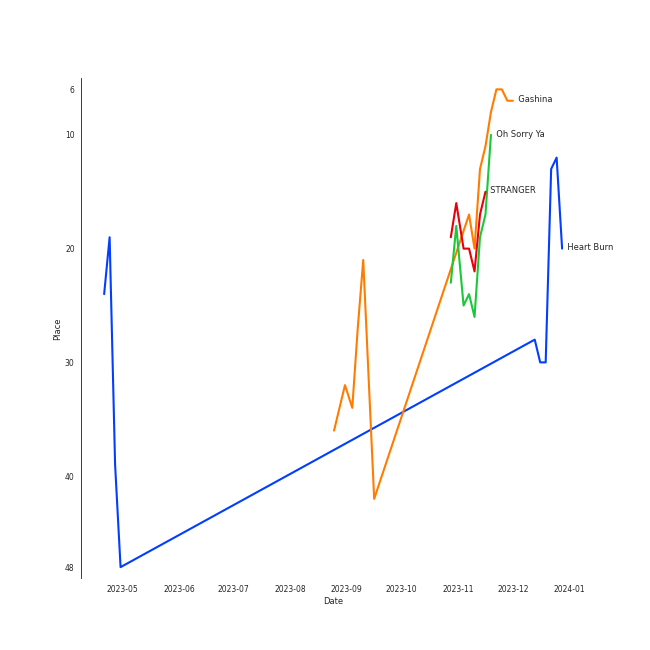

# SUNMI

## Artist Rank
SUNMI is currently:
- The #43 artist of all time
- The #45 artist of the last 6 months

## Top Tracks

- Gashina is:
    - the #32 track of the last month

### Top tracks of the last month over time

## Featured on Playlists
| Art | Tracks | Playlist |
|:---|---:|:---|
|  | 9 | [K-Pop](../../playlists/k_pop/overview.md) |
|  | 2 | [K-Pop Favorites](../../playlists/k_pop_favorites/overview.md) |
|  | 1 | [K-Pop 101](../../playlists/k_pop_101/overview.md) |
|  | 1 | [K-Memes](../../playlists/k_memes/overview.md) |
|  | 1 | [Chill](../../playlists/chill/overview.md) |
## Top Albums

| Art | Tracks | 💚 | Album | Release Date | 🔗 |
|:---|---:|---:|:---|:---|:---|
|  | 2 | 2 | Heart Burn | 2022-06-29 | [🔗](https://open.spotify.com/album/0ahb3lp7jXxKUx3beS7AVu) |
|  | 1 | 1 | pporappippam | 2020-06-29 | [🔗](https://open.spotify.com/album/5IKVYCIhY5SyMhj1cYovz3) |
|  | 1 | 1 | When We Disco | 2020-08-12 | [🔗](https://open.spotify.com/album/1PllJjUqafNlQ23eBqs511) |
|  | 1 | 1 | TAIL | 2021-02-23 | [🔗](https://open.spotify.com/album/6N8gHTBafJrVn0tcn9AKqz) |
|  | 1 | 1 | SUNMI SPECIAL EDITION [Gashina] | 2017-08-22 | [🔗](https://open.spotify.com/album/3TSX6AxLdCP4E5o3F5jCdN) |
|  | 1 | 1 | Oh Sorry Ya | 2022-03-08 | [🔗](https://open.spotify.com/album/4LKKDcLPX4aZXGfnlpFPi7) |
|  | 1 | 1 | 1/6 | 2021-08-06 | [🔗](https://open.spotify.com/album/3UJlc2nl7tik1gD23DOBVX) |
|  | 1 | 0 | WARNING | 2018-09-12 | [🔗](https://open.spotify.com/album/3FlTMPuc3cWXTosTmXOnCr) |

## Top Record Labels

| Tracks | 💚 | Label |
|---:|---:|:---|
| 5 | 5 | Abyss Company |
| 3 | 2 | Makeus Entertainment |
| 1 | 1 | THE BLACK LABEL |
| 1 | 1 | [JYP Entertainment](../../labels/jyp_entertainment/overview.md) |

## Genres

- [k-pop](../../genres/k_pop)

## Tracks

| Art | Track | Album | Artists | Label | 💚 | 🔗 |
|:---|:---|:---|:---|:---|:---|:---|
|  | When We Disco | When We Disco | J.Y. Park, [SUNMI](overview.md) | [JYP Entertainment](../../labels/jyp_entertainment) | 💚 | [🔗](https://open.spotify.com/track/6t9nnPyEZfjcn1aLJ4l9AK) |
|  | Gashina | SUNMI SPECIAL EDITION [Gashina] | [SUNMI](overview.md) | Makeus Entertainment, The Black Label | 💚 | [🔗](https://open.spotify.com/track/0jFHMDRXxKaREor3hBEEST) |
|  | Siren | WARNING | [SUNMI](overview.md) | MAKEUS ENTERTAINMENT | | [🔗](https://open.spotify.com/track/0gEnVDMhKKjF1qXuvBwq91) |
|  | pporappippam | pporappippam | [SUNMI](overview.md) | Makeus Entertainment | 💚 | [🔗](https://open.spotify.com/track/7oQh96s9YemWG3A4zkIbrU) |
|  | TAIL | TAIL | [SUNMI](overview.md) | Abyss Company | 💚 | [🔗](https://open.spotify.com/track/7muTXW7kGytN3zdomku6FV) |
|  | You can't sit with us | 1/6 | [SUNMI](overview.md) | Abyss Company | 💚 | [🔗](https://open.spotify.com/track/4aS8OY1JsRSBKGfnAkIOZH) |
|  | Oh Sorry Ya | Oh Sorry Ya | [SUNMI](overview.md) | Abyss Company | 💚 | [🔗](https://open.spotify.com/track/03HYOtfzbzx0HPHMcfLFOe) |
|  | Childhood | Heart Burn | [SUNMI](overview.md) | Abyss Company | 💚 | [🔗](https://open.spotify.com/track/0YD0nPpSx4DSHoL1EGJ5Lj) |
|  | Heart Burn | Heart Burn | [SUNMI](overview.md) | Abyss Company | 💚 | [🔗](https://open.spotify.com/track/4JmbtS0Muijl37KP9lDscy) |