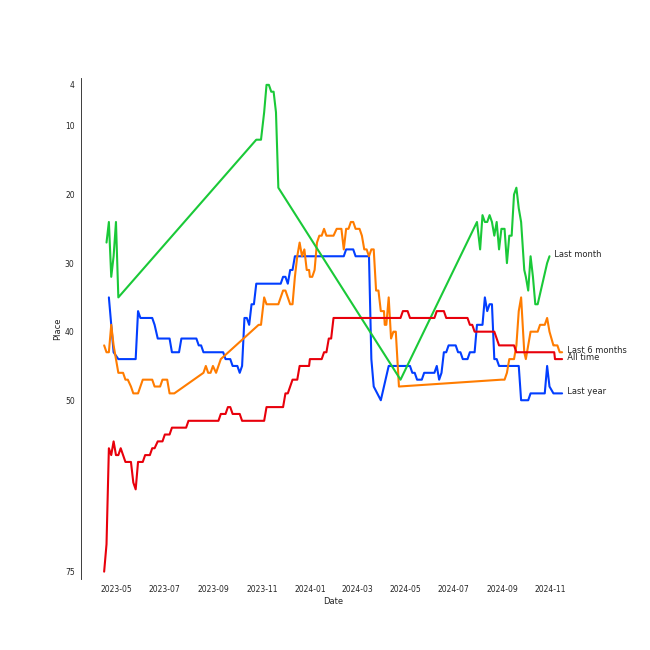
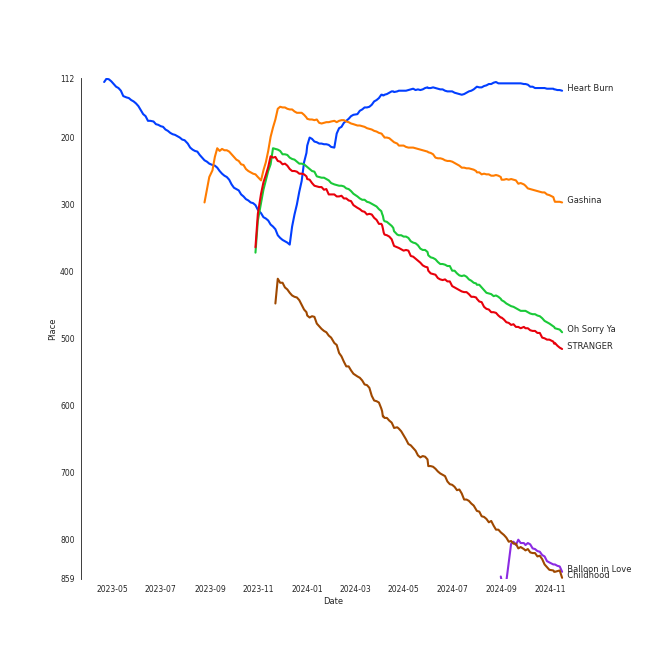
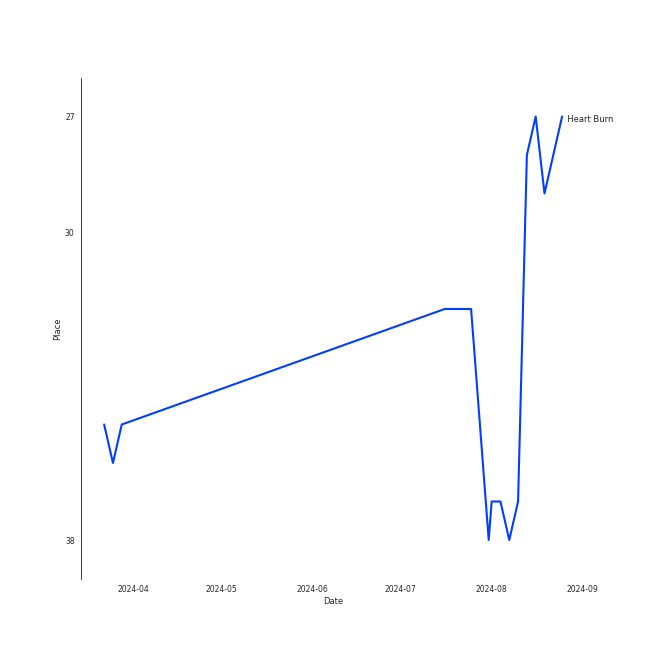
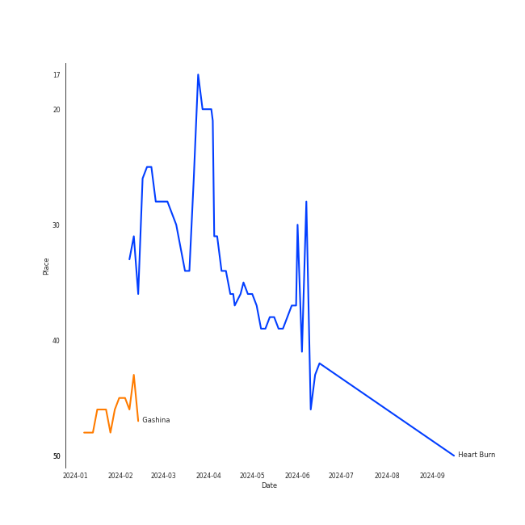

# SUNMI

[See Track Features](audio_features.md)

[See Clusters](clusters/overview.md)

## Relationships

SUNMI:
- is a member of Wonder Girls

## Artist Rank
SUNMI is currently:
- The #43 artist of all time
- The #37 artist overall

## Top Tracks

### Top tracks, aggregated

Top tracks of all time over time

Top tracks of the last 6 months over time

## Featured on Playlists
| Art | Tracks | Playlist |
|:---|---:|:---|
|  | 12 | [K-Pop](../../playlists/k-pop/overview.md) |
|  | 2 | [K-Pop Favorites](../../playlists/k-pop_favorites/overview.md) |
|  | 2 | [Chill](../../playlists/chill/overview.md) |
|  | 1 | [K-Pop 101](../../playlists/k-pop_101/overview.md) |
|  | 1 | [Beat Drop!](../../playlists/beat_drop!/overview.md) |
|  | 1 | [Recent Comebacks](../../playlists/recent_comebacks/overview.md) |
|  | 1 | [K-Memes](../../playlists/k-memes/overview.md) |
|  | 1 | [Halloween](../../playlists/halloween/overview.md) |

## Top Albums

| Art | Tracks | 💚 | Album | Release Date | 🔗 |
|:---|---:|---:|:---|:---|:---|
|  | 2 | 2 | Heart Burn | 2022-06-29 | [🔗](https://open.spotify.com/album/0ahb3lp7jXxKUx3beS7AVu) |
|  | 1 | 1 | pporappippam | 2020-06-29 | [🔗](https://open.spotify.com/album/5IKVYCIhY5SyMhj1cYovz3) |
|  | 1 | 1 | When We Disco | 2020-08-12 | [🔗](https://open.spotify.com/album/1PllJjUqafNlQ23eBqs511) |
|  | 1 | 1 | TAIL | 2021-02-23 | [🔗](https://open.spotify.com/album/6N8gHTBafJrVn0tcn9AKqz) |
|  | 1 | 1 | SUNMI SPECIAL EDITION [Gashina] | 2017-08-22 | [🔗](https://open.spotify.com/album/3TSX6AxLdCP4E5o3F5jCdN) |
|  | 1 | 1 | STRANGER | 2023-10-17 | [🔗](https://open.spotify.com/album/5QUzffclUFjjFFZ1HmaB6X) |
|  | 1 | 1 | Oh Sorry Ya | 2022-03-08 | [🔗](https://open.spotify.com/album/4LKKDcLPX4aZXGfnlpFPi7) |
|  | 1 | 1 | Balloon in Love | 2024-06-13 | [🔗](https://open.spotify.com/album/2AxY2j1VRmHSoIooqtQ7p9) |
|  | 1 | 1 | 24 Hours | 2013-08-26 | [🔗](https://open.spotify.com/album/4ag4tJmAksjMdxICMV83Aw) |
|  | 1 | 1 | 1/6 | 2021-08-06 | [🔗](https://open.spotify.com/album/3UJlc2nl7tik1gD23DOBVX) |

See all albums

| Art | Tracks | 💚 | Album | Release Date | 🔗 |
|:---|---:|---:|:---|:---|:---|
|  | 1 | 0 | WARNING | 2018-09-12 | [🔗](https://open.spotify.com/album/3FlTMPuc3cWXTosTmXOnCr) |

## Top Record Labels

| Tracks | 💚 | Label |
|---:|---:|:---|
| 7 | 7 | Abyss Company |
| 3 | 2 | Makeus Entertainment |
| 1 | 1 | THE BLACK LABEL |
| 1 | 1 | [Republic Records](../../labels/republic_records/overview.md) |
| 1 | 1 | [JYP Entertainment](../../labels/jyp_entertainment/overview.md) |

## Genres

- [k-pop](../../genres/k-pop/overview.md)

## Credits

### Credits by Type

| Credit Type | Tracks |
|:---|---:|
| Lyricist | 5 |
| Songwriter | 3 |
| Vocal | 1 |

### Production Credits

| Art | Track | Credit Types |
|:---|:---|:---|
|  | Gashina | Lyricist |
|  | pporappippam | Lyricist, Songwriter |
|  | TAIL | Lyricist, Songwriter |
|  | Childhood | Lyricist, Songwriter |
|  | Heart Burn | Lyricist |

## Top Producers

| Art | Producer | Tracks | Credit Types |
|:---|:---|---:|:---|
|  | [SUNMI](overview.md) | 5 | Lyricist, Songwriter |
| | Frants | 2 | Arranger, Songwriter, Producer |
| | Ash | 1 | Arranger, Songwriter |
| | Sean Callery | 1 | Arranger, Lyricist, Songwriter |
| | 강선영 (강선영) | 1 | Producer |
| | CobiCudi | 1 | Lyricist, Songwriter |
| | 최자연 (Choi, Ja-yeon) | 1 | Producer |
| | 김규원 (Kim, Gyu-won) | 1 | Arranger, Lyricist, Songwriter |
| | [구종필 (Koo, Jong-Pil)](../../producers/구종필_(koo,_jong-pil)/overview.md) | 1 | Producer |
| | Vince | 1 | Lyricist, Songwriter |

View all

| Art | Producer | Tracks | Credit Types |
|:---|:---|---:|:---|
| | [TEDDY](../../producers/teddy/overview.md) | 1 | Lyricist, Songwriter |

## Tracks

| Art | Track | Album | Artists | Label | Rank | 💚 | 🔗 |
|:---|:---|:---|:---|:---|---:|:---|:---|
|  | Heart Burn | Heart Burn | [SUNMI](overview.md) | Abyss Company | 127 | 💚 | [🔗](https://open.spotify.com/track/4JmbtS0Muijl37KP9lDscy) |
|  | Gashina | SUNMI SPECIAL EDITION [Gashina] | [SUNMI](overview.md) | Makeus Entertainment, The Black Label | 236 | 💚 | [🔗](https://open.spotify.com/track/0jFHMDRXxKaREor3hBEEST) |
|  | Oh Sorry Ya | Oh Sorry Ya | [SUNMI](overview.md) | Abyss Company | 392 | 💚 | [🔗](https://open.spotify.com/track/03HYOtfzbzx0HPHMcfLFOe) |
|  | STRANGER | STRANGER | [SUNMI](overview.md) | Abyss Company | 416 | 💚 | [🔗](https://open.spotify.com/track/3SifPlW12FRs8OQP2VkXSi) |
|  | Childhood | Heart Burn | [SUNMI](overview.md) | Abyss Company | 708 | 💚 | [🔗](https://open.spotify.com/track/0YD0nPpSx4DSHoL1EGJ5Lj) |
|  | 24 Hours | 24 Hours | [SUNMI](overview.md) | [Republic Records](../../labels/republic_records) | 855 | 💚 | [🔗](https://open.spotify.com/track/4ayWErdGIvSo4o6a3lMVLt) |
|  | Siren | WARNING | [SUNMI](overview.md) | MAKEUS ENTERTAINMENT | 855 | | [🔗](https://open.spotify.com/track/0gEnVDMhKKjF1qXuvBwq91) |
|  | pporappippam | pporappippam | [SUNMI](overview.md) | Makeus Entertainment | 855 | 💚 | [🔗](https://open.spotify.com/track/7oQh96s9YemWG3A4zkIbrU) |
|  | When We Disco | When We Disco | J.Y. Park, [SUNMI](overview.md) | [JYP Entertainment](../../labels/jyp_entertainment) | 855 | 💚 | [🔗](https://open.spotify.com/track/6t9nnPyEZfjcn1aLJ4l9AK) |
|  | TAIL | TAIL | [SUNMI](overview.md) | Abyss Company | 855 | 💚 | [🔗](https://open.spotify.com/track/7muTXW7kGytN3zdomku6FV) |

See all tracks

| Art | Track | Album | Artists | Label | Rank | 💚 | 🔗 |
|:---|:---|:---|:---|:---|---:|:---|:---|
|  | You can't sit with us | 1/6 | [SUNMI](overview.md) | Abyss Company | 855 | 💚 | [🔗](https://open.spotify.com/track/4aS8OY1JsRSBKGfnAkIOZH) |
|  | Balloon in Love | Balloon in Love | [SUNMI](overview.md) | Abyss Company | 855 | 💚 | [🔗](https://open.spotify.com/track/3x6unDluyCL4v5AeGrAVGA) |

