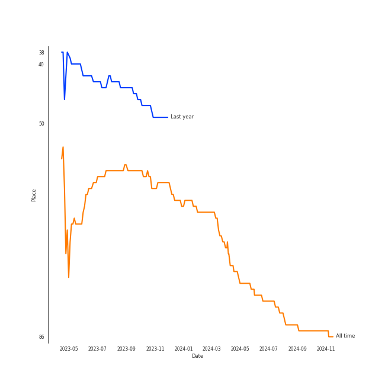
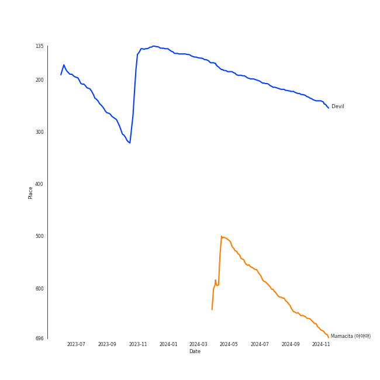
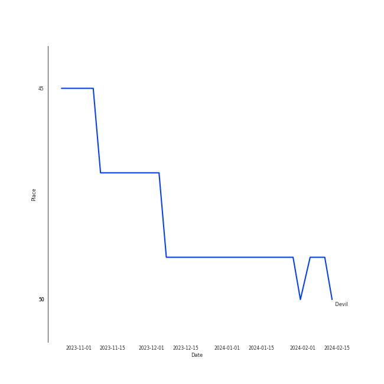
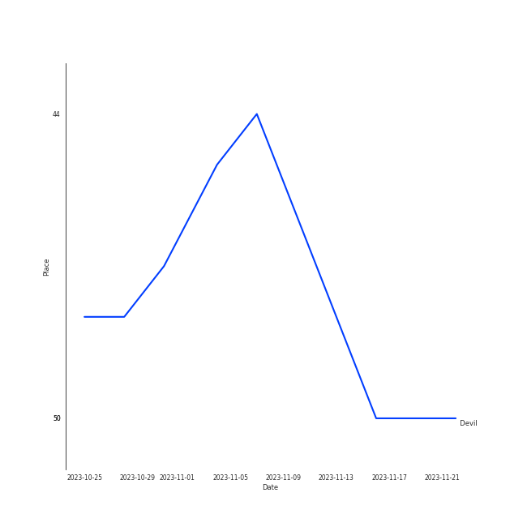
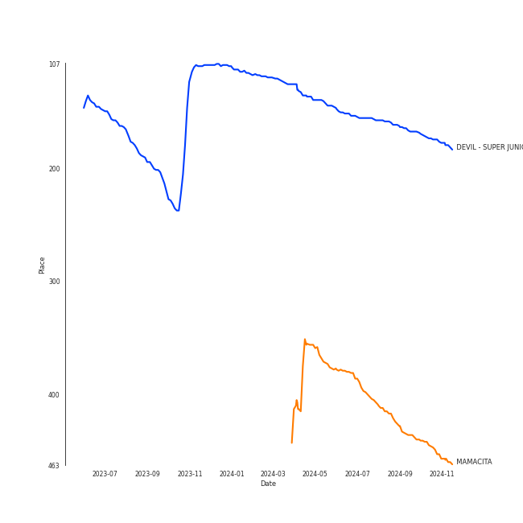

# SUPER JUNIOR

## Relationships

SUPER JUNIOR:
- has member 최시원 (Choi, Si-won)
- has member 동해 (Donghae)
- has member EUNHYUK
- has member 韩庚 (Han, Geng)
- has member 강인 (Kangin)
- has member 김희철 (Kim, Hee-chul)
- has member 김기범 (Kim, Ki-bum)
- has member 규현 (Kyuhyun)
- has member 이특 (Leeteuk)
- has member 려욱 (Ryeowook)
- has member 신동 (Shindong)
- has member 성민 (SungMin)
- has member YESUNG

## Artist Rank
- The #86 artist of all time

## Top Tracks

### Top tracks of all time

Top tracks of the last year over time

Top tracks of the last 6 months over time

## Top Albums

| Art | Rank | Tracks | 💚 | Album | Release Date | 🔗 |
|:---|---:|---:|---:|:---|:---|:---|
|  | 644 | 1 | 1 | 쏘리 쏘리 Sorry, Sorry - The 3rd Album | 2009-03-11 | [🔗](https://open.spotify.com/album/3v5XUoZzxbmJbxs7vWTua3) |
|  | 644 | 1 | 1 | REPLAY - The 8th Repackage Album | 2018-04-12 | [🔗](https://open.spotify.com/album/5uxH9so2Yrmi6nLClUZJkv) |
|  | 644 | 1 | 1 | PLAY - The 8th Album | 2017-11-06 | [🔗](https://open.spotify.com/album/1F7DAPXJpLVKfyZFSFsrCw) |
|  | 644 | 1 | 1 | Mr. Simple - The 5th Album | 2011-08-02 | [🔗](https://open.spotify.com/album/0eouyQPmljivHfUuG5nYBa) |
|  | 443 | 1 | 1 | MAMACITA - The 7th Album | 2014-08-29 | [🔗](https://open.spotify.com/album/53i190Z2uGOLljuS3DCvz2) |
|  | 168 | 1 | 1 | DEVIL - SUPER JUNIOR SPECIAL ALBUM | 2015-07-16 | [🔗](https://open.spotify.com/album/4YdR3Qy3eZXsLGIXaEAw8o) |
|  | 644 | 1 | 0 | The Renaissance - The 10th Album | 2021-03-16 | [🔗](https://open.spotify.com/album/3qyzxavqOfixEPDfFCEMlH) |

## Featured on Playlists
| Art | Tracks | Playlist |
|:---|---:|:---|
|  | 7 | [K-Pop](../../playlists/k-pop/overview.md) |
|  | 2 | [Workout](../../playlists/workout/overview.md) |
|  | 2 | [K-Memes](../../playlists/k-memes/overview.md) |
|  | 1 | [K-Pop 101](../../playlists/k-pop_101/overview.md) |
|  | 1 | [K-Pop Favorites](../../playlists/k-pop_favorites/overview.md) |
|  | 1 | [Halloween](../../playlists/halloween/overview.md) |

## Top Record Labels

| Tracks | 💚 | Label |
|---:|---:|:---|
| 7 | 6 | [SM Entertainment](../../labels/sm_entertainment/overview.md) |

## Genres

- [k-pop](../../genres/k-pop/overview.md)
- [k-pop boy group](../../genres/k-pop_boy_group/overview.md)

## Credits

### Credits by Type

| Credit Type | Tracks |
|:---|---:|
| Vocal | 1 |

## Top Producers

| Art | Producer | Tracks | Credit Types |
|:---|:---|---:|:---|
| | [유영진 (Yoo, Young-jin)](../../producers/유영진_(yoo,_young-jin)/overview.md) | 1 | Arranger, Lyricist, Producer, Songwriter |

## Tracks

| Art | Track | Album | Artists | Label | Rank | 💚 | 🔗 |
|:---|:---|:---|:---|:---|---:|:---|:---|
|  | Devil | DEVIL - SUPER JUNIOR SPECIAL ALBUM | [SUPER JUNIOR](overview.md) | [SM Entertainment](../../labels/sm_entertainment) | 225 | 💚 | [🔗](https://open.spotify.com/track/3IQ9FJ2cMVQtger5ZhgCaj) |
|  | Mamacita (아야야) | MAMACITA - The 7th Album | [SUPER JUNIOR](overview.md) | [SM Entertainment](../../labels/sm_entertainment) | 658 | 💚 | [🔗](https://open.spotify.com/track/23z7nLq4CD83EyzeeIokkt) |
|  | 쏘리 쏘리 Sorry, Sorry | 쏘리 쏘리 Sorry, Sorry - The 3rd Album | [SUPER JUNIOR](overview.md) | [SM Entertainment](../../labels/sm_entertainment) | 976 | 💚 | [🔗](https://open.spotify.com/track/5w18nowVMRZrC5Na9Vxoth) |
|  | Mr. Simple | Mr. Simple - The 5th Album | [SUPER JUNIOR](overview.md) | [SM Entertainment](../../labels/sm_entertainment) | 976 | 💚 | [🔗](https://open.spotify.com/track/6QTBYKLlV2PQniwAWrBV2z) |
|  | Black Suit | PLAY - The 8th Album | [SUPER JUNIOR](overview.md) | [SM Entertainment](../../labels/sm_entertainment) | 976 | 💚 | [🔗](https://open.spotify.com/track/0cCm1PbOd6nqAPDdA3PRfs) |
|  | Lo Siento | REPLAY - The 8th Repackage Album | [SUPER JUNIOR](overview.md), Leslie Grace, Play-N-Skillz | [SM Entertainment](../../labels/sm_entertainment) | 976 | 💚 | [🔗](https://open.spotify.com/track/2VVqxQhALecXvaArlZSVXr) |
|  | House Party | The Renaissance - The 10th Album | [SUPER JUNIOR](overview.md) | [SM Entertainment](../../labels/sm_entertainment) | 976 | | [🔗](https://open.spotify.com/track/0awQIOFGtg18LCJ0WhFf8s) |
