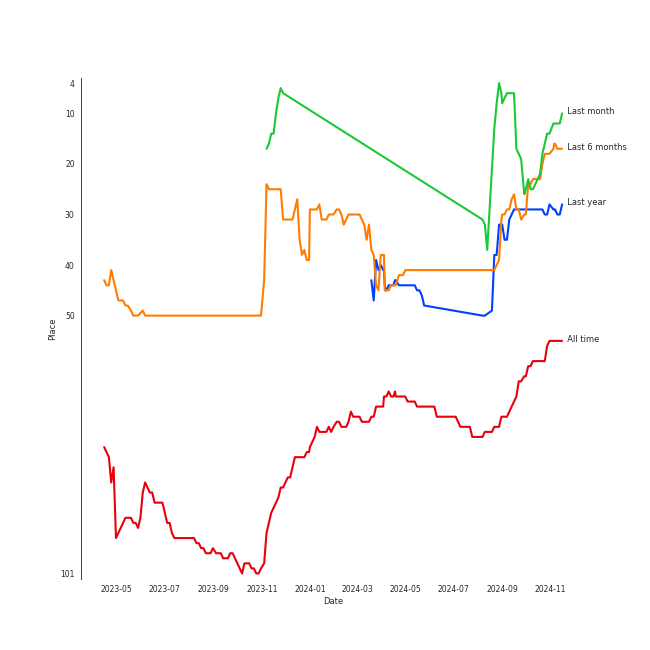
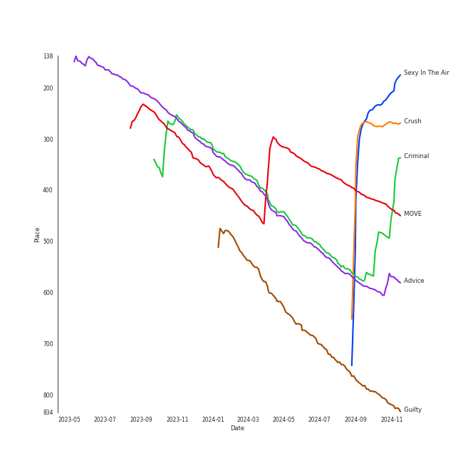
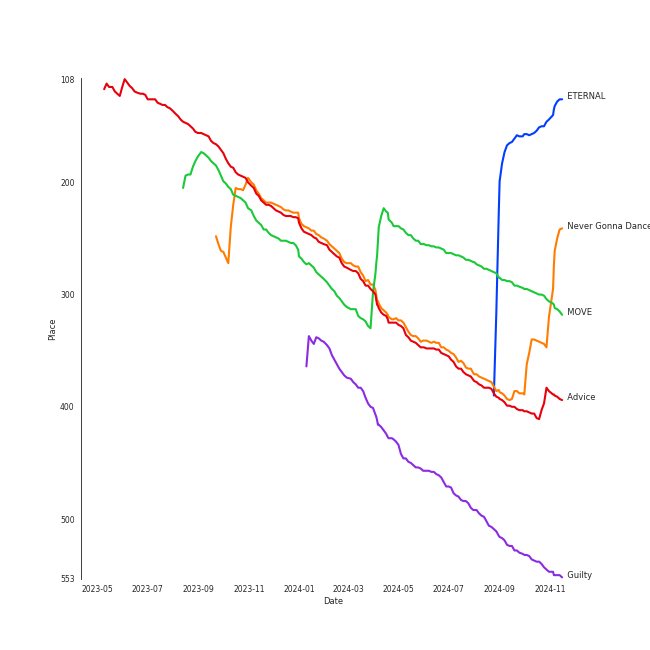

# TAEMIN

[See Track Features](audio_features.md)

[See Clusters](clusters/overview.md)

## Relationships

TAEMIN:
- is a member of [SHINee](../shinee/overview.md)
- is a member of SuperM

## Artist Rank
TAEMIN is currently:
- The #6 artist of the last month
- The #26 artist of the last 6 months
- The #29 artist of the last year
- The #67 artist of all time

## Top Tracks

### Top tracks of all time

## Top Albums

| Art | Rank | Tracks | 💚 | Album | Release Date | 🔗 |
|:---|---:|---:|---:|:---|:---|:---|
|  | 171 | 2 | 2 | ETERNAL | 2024-08-19 | [🔗](https://open.spotify.com/album/13M8K1l146FLdFoObJIVj9) |
|  | 394 | 2 | 1 | Never Gonna Dance Again : Act 1 - The 3rd Album | 2020-09-07 | [🔗](https://open.spotify.com/album/6YfGgOaUnhs0A9brMqjpHf) |
|  | 524 | 2 | 1 | Guilty - The 4th Mini Album | 2023-10-30 | [🔗](https://open.spotify.com/album/1lnDLQ5nH1V3ST8MuVGmQW) |
|  | 290 | 1 | 1 | MOVE - The 2nd Album | 2017-10-16 | [🔗](https://open.spotify.com/album/2Ka8QpE2XUUjL4vOQihkJH) |
|  | 402 | 1 | 1 | Advice - The 3rd Mini Album | 2021-05-18 | [🔗](https://open.spotify.com/album/0kNUDDHwjpemplDqSZ72Ct) |
|  | 639 | 1 | 0 | さよならひとり | 2016-07-27 | [🔗](https://open.spotify.com/album/0VOMzswFy3fFsOb1tYs1Wd) |
|  | 639 | 1 | 0 | Press It - The 1st Album | 2016-02-23 | [🔗](https://open.spotify.com/album/3BPjJEl3GqXKDhYZf7iFfs) |
|  | 639 | 1 | 0 | Never Gonna Dance Again : Act 2 - The 3rd Album | 2020-11-09 | [🔗](https://open.spotify.com/album/3xgFGYUOVxGp7pZywdf7AC) |

## Featured on Playlists
| Art | Tracks | Playlist |
|:---|---:|:---|
|  | 11 | [K-Pop](../../playlists/k-pop/overview.md) |
|  | 3 | [K-Pop Favorites](../../playlists/k-pop_favorites/overview.md) |
|  | 2 | [Recent Comebacks](../../playlists/recent_comebacks/overview.md) |
|  | 2 | [Halloween](../../playlists/halloween/overview.md) |
|  | 1 | [K-Pop 101](../../playlists/k-pop_101/overview.md) |
|  | 1 | [On Repeat](../../playlists/on_repeat/overview.md) |
|  | 1 | [Chill](../../playlists/chill/overview.md) |

## Top Record Labels

| Tracks | 💚 | Label |
|---:|---:|:---|
| 8 | 4 | [SM Entertainment](../../labels/sm_entertainment/overview.md) |
| 2 | 2 | BIGPLANETMADE |
| 1 | 0 | [Universal Music LLC](../../labels/universal_music_llc/overview.md) |

## Genres

- [k-pop](../../genres/k-pop/overview.md)

## Credits

### Credits by Type

| Credit Type | Tracks |
|:---|---:|
| Songwriter | 2 |

### Production Credits

| Art | Track | Credit Types |
|:---|:---|:---|
|  | Sexy In The Air | Songwriter |
|  | Crush | Songwriter |

## Top Producers

| Art | Producer | Tracks | Credit Types |
|:---|:---|---:|:---|
|  | [TAEMIN](overview.md) | 2 | Songwriter |
| | [Ryan S. Jhun](../../producers/ryan_s__jhun/overview.md) | 2 | Songwriter |
| | Angelique Cinelu | 1 | Arranger |
| | Adien Lewis | 1 | Arranger |
| | Dem Jointz | 1 | Songwriter |
| | Curtis Richardson | 1 | Arranger |

## Tracks

| Art | Track | Album | Artists | Label | Rank | 💚 | 🔗 |
|:---|:---|:---|:---|:---|---:|:---|:---|
|  | Sexy In The Air | ETERNAL | [TAEMIN](overview.md) | BIGPLANETMADE | 272 | 💚 | [🔗](https://open.spotify.com/track/3wluV5HGCW1Dq1CYsjIdLu) |
|  | Crush | ETERNAL | [TAEMIN](overview.md) | BIGPLANETMADE | 274 | 💚 | [🔗](https://open.spotify.com/track/44h13LO85kPl04MrAKMA9j) |
|  | MOVE | MOVE - The 2nd Album | [TAEMIN](overview.md) | [SM Entertainment](../../labels/sm_entertainment) | 413 | 💚 | [🔗](https://open.spotify.com/track/1cgBWgoL6520lR2QZDzdGN) |
|  | Criminal | Never Gonna Dance Again : Act 1 - The 3rd Album | [TAEMIN](overview.md) | [SM Entertainment](../../labels/sm_entertainment) | 579 | 💚 | [🔗](https://open.spotify.com/track/2KXEE2MsPZLmT38XiyAOpH) |
|  | Advice | Advice - The 3rd Mini Album | [TAEMIN](overview.md) | [SM Entertainment](../../labels/sm_entertainment) | 590 | 💚 | [🔗](https://open.spotify.com/track/4rOODw637hsmsq0uzT0DN3) |
|  | Guilty | Guilty - The 4th Mini Album | [TAEMIN](overview.md) | [SM Entertainment](../../labels/sm_entertainment) | 784 | 💚 | [🔗](https://open.spotify.com/track/4jMwQaDiDICry8Ia1gFnAn) |
|  | Drip Drop | Press It - The 1st Album | [TAEMIN](overview.md) | [SM Entertainment](../../labels/sm_entertainment) | 966 | | [🔗](https://open.spotify.com/track/7EYDRfuloB4kG28ECZkPZB) |
|  | さよならひとり | さよならひとり | [TAEMIN](overview.md) | [Universal Music LLC](../../labels/universal_music_llc) | 966 | | [🔗](https://open.spotify.com/track/4ltAvuYuC8PNKAStXiWouZ) |
|  | Clockwork | Never Gonna Dance Again : Act 1 - The 3rd Album | [TAEMIN](overview.md) | [SM Entertainment](../../labels/sm_entertainment) | 966 | | [🔗](https://open.spotify.com/track/09SIbdUVr34sBd7Uwwt63J) |
|  | Heaven | Never Gonna Dance Again : Act 2 - The 3rd Album | [TAEMIN](overview.md) | [SM Entertainment](../../labels/sm_entertainment) | 966 | | [🔗](https://open.spotify.com/track/2hjaiDsLLBlY68XrgjZk7F) |

See all tracks

| Art | Track | Album | Artists | Label | Rank | 💚 | 🔗 |
|:---|:---|:---|:---|:---|---:|:---|:---|
|  | Night Away | Guilty - The 4th Mini Album | [TAEMIN](overview.md) | [SM Entertainment](../../labels/sm_entertainment) | 966 | | [🔗](https://open.spotify.com/track/0zjkBOwL8upqIOmufTO6tT) |

