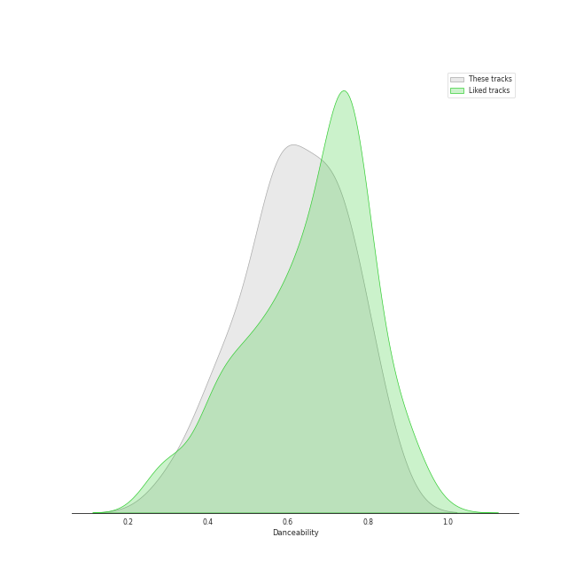
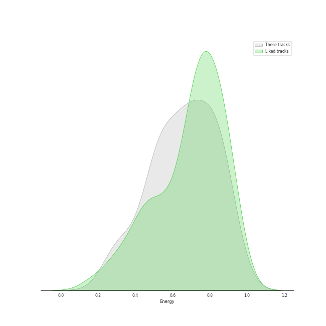
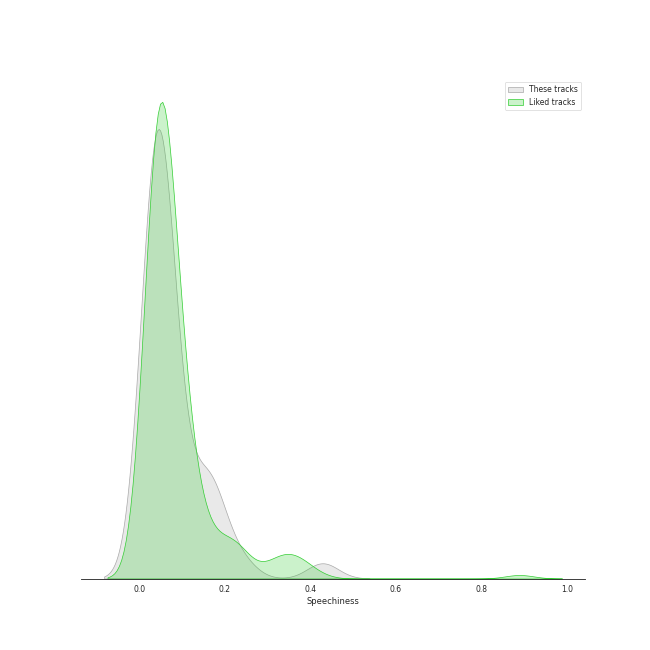
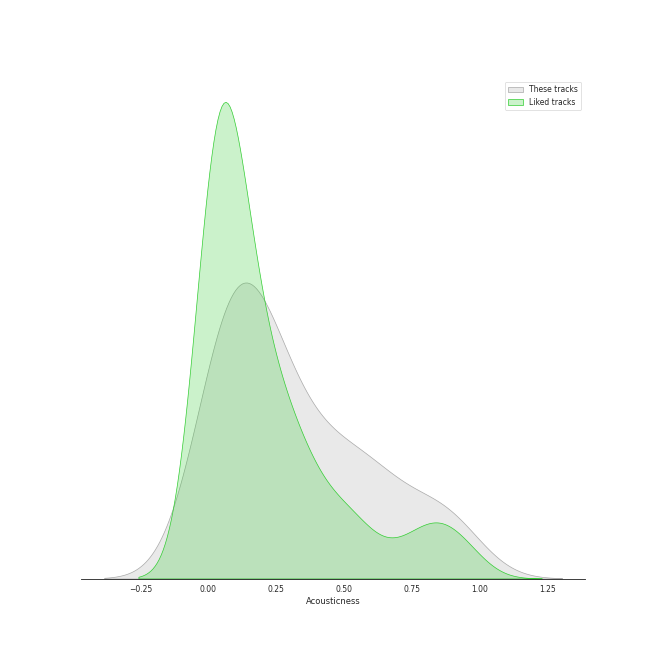
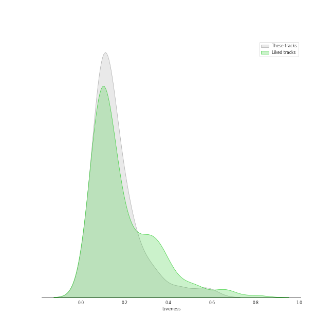
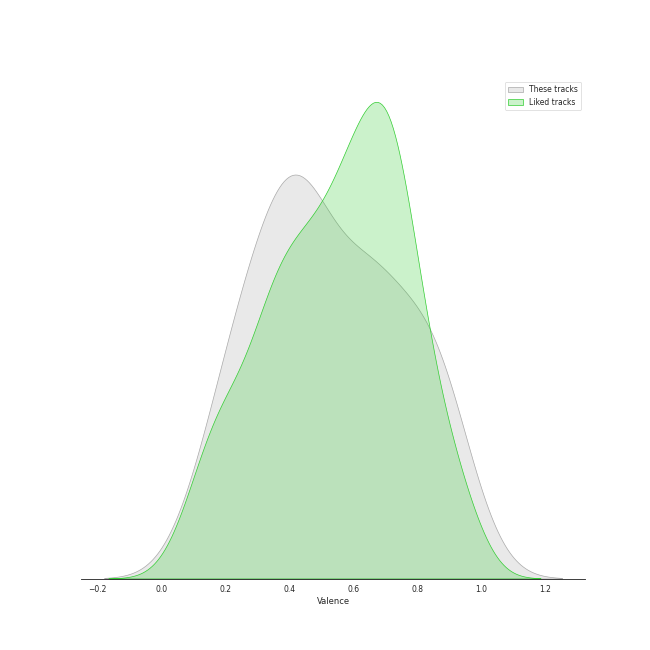

# Audio Features for TAEYEON

## Danceability

| 10 most Danceable tracks | 10 least Danceable tracks |
|:---|:---|
| To the moon (0.835) | Fine (0.36) |
| Toddler (0.784) | Sweet Love (0.41) |
| Good Thing (0.772) | This Christmas (0.413) |
| Happy (0.753) | 11:11 (0.445) |
| What Do I Call You (0.75) | Heart (0.468) |
| Weekend (0.74) | Let It Snow (0.498) |
| Spark (0.739) | I (0.506) |
| You Better Not (0.703) | 그대라는 시 (0.533) |
| I Got Love (0.693) | If (0.538) |
| Stress (0.685) | Cold As Hell (0.555) |

## Energy

| 10 most Energetic tracks | 10 least Energetic tracks |
|:---|:---|
| Stress (0.94) | 그대라는 시 (0.292) |
| Good Thing (0.875) | The Magic of Christmas Time (0.33) |
| Let It Snow (0.854) | If (0.346) |
| Weekend (0.854) | This Christmas (0.464) |
| Candy Cane (0.848) | LOL (0.501) |
| Up & Down (0.838) | Gravity (0.515) |
| INVU (0.816) | 11:11 (0.528) |
| I (0.788) | Wine (0.53) |
| Sweet Love (0.785) | Heart (0.533) |
| Four Seasons (0.768) | Fine (0.565) |

## Speechiness

| 10 most Speechy tracks | 10 least Speechy tracks |
|:---|:---|
| Sweet Love (0.172) | The Magic of Christmas Time (0.0274) |
| Up & Down (0.161) | Spark (0.0283) |
| I Got Love (0.158) | If (0.0294) |
| Four Seasons (0.145) | This Christmas (0.0297) |
| You Better Not (0.135) | LOL (0.0319) |
| Priority (0.0936) | Toddler (0.0322) |
| Good Thing (0.0862) | I (0.0324) |
| Stress (0.0754) | Cold As Hell (0.0325) |
| 11:11 (0.0744) | Candy Cane (0.0327) |
| What Do I Call You (0.0674) | Rain (0.0329) |

## Acousticness

| 10 most Acoustic tracks | 10 least Acoustic tracks |
|:---|:---|
| 그대라는 시 (0.914) | Up & Down (0.00279) |
| The Magic of Christmas Time (0.898) | Can't Control Myself (0.0263) |
| If (0.827) | Four Seasons (0.0548) |
| 11:11 (0.677) | I (0.0666) |
| This Christmas (0.646) | Stress (0.0687) |
| Sweet Love (0.602) | Good Thing (0.0731) |
| Wine (0.567) | What Do I Call You (0.0733) |
| I Got Love (0.543) | Weekend (0.0783) |
| Rain (0.538) | Gravity (0.0898) |
| You Better Not (0.371) | INVU (0.0911) |

## Instrumentalness

| 10 most Instrumental tracks | 10 least Instrumental tracks |
|:---|:---|
| Weekend (0.000532) | To the moon (0.0) |
| Priority (0.000127) | Stress (0.0) |
| LOL (0.000101) | Candy Cane (0.0) |
| Up & Down (3.45e-05) | Sweet Love (0.0) |
| Toddler (1.52e-05) | Can't Control Myself (0.0) |
| Rain (1.29e-05) | Good Thing (0.0) |
| You Better Not (1.18e-05) | What Do I Call You (0.0) |
| The Magic of Christmas Time (2.19e-06) | Happy (0.0) |
| INVU (2.17e-06) | Spark (0.0) |
| I Got Love (1.4e-06) | Four Seasons (0.0) |

## Liveness

| 10 most Live tracks | 10 least Live tracks |
|:---|:---|
| Can't Control Myself (0.453) | Stress (0.0389) |
| What Do I Call You (0.347) | Fine (0.0448) |
| I (0.324) | Up & Down (0.081) |
| This Christmas (0.294) | Rain (0.0883) |
| Weekend (0.253) | LOL (0.0886) |
| Spark (0.222) | INVU (0.0961) |
| Cold As Hell (0.208) | To the moon (0.0964) |
| The Magic of Christmas Time (0.204) | If (0.0973) |
| Happy (0.201) | Heart (0.0974) |
| Priority (0.185) | I Got Love (0.108) |

## Valence

| 10 most Happy tracks | 10 least Happy tracks |
|:---|:---|
| Stress (0.933) | Gravity (0.142) |
| To the moon (0.866) | Can't Control Myself (0.229) |
| Weekend (0.856) | I (0.233) |
| What Do I Call You (0.835) | Cold As Hell (0.236) |
| I Got Love (0.828) | If (0.266) |
| Good Thing (0.798) | Fine (0.311) |
| Candy Cane (0.676) | This Christmas (0.341) |
| Four Seasons (0.673) | Heart (0.345) |
| Toddler (0.658) | Priority (0.356) |
| Happy (0.636) | Wine (0.367) |

## Tempo

| 10 most Fast tracks | 10 least Fast tracks |
|:---|:---|
| 11:11 (203.155) | Wine (72.022) |
| Heart (179.652) | Sweet Love (74.751) |
| Four Seasons (173.99) | Rain (76.024) |
| Fine (173.281) | Can't Control Myself (85.044) |
| Cold As Hell (155.962) | LOL (88.016) |
| Gravity (153.871) | I (89.993) |
| If (145.714) | The Magic of Christmas Time (91.689) |
| Candy Cane (141.956) | Priority (92.945) |
| Stress (140.081) | I Got Love (101.956) |
| What Do I Call You (139.889) | Up & Down (105.06) |
