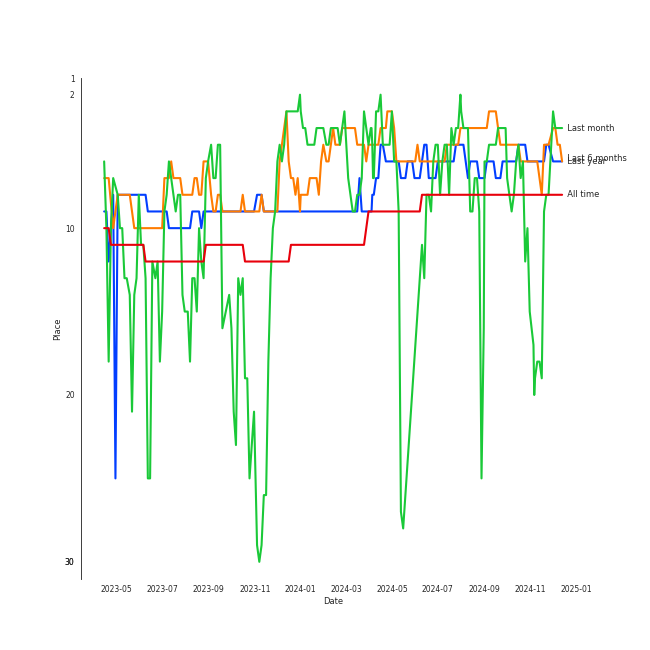
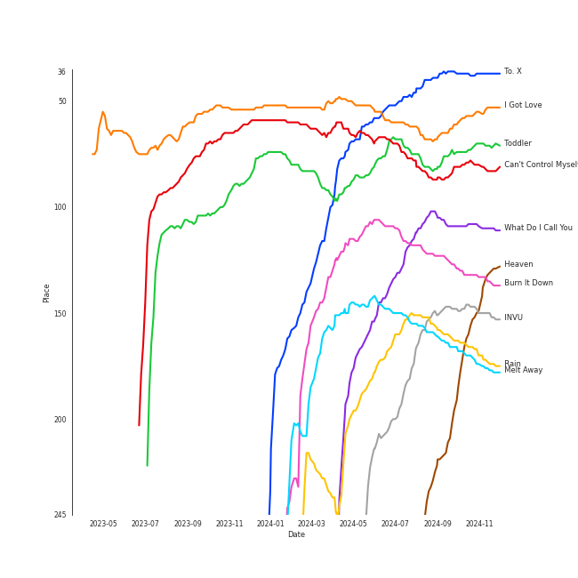
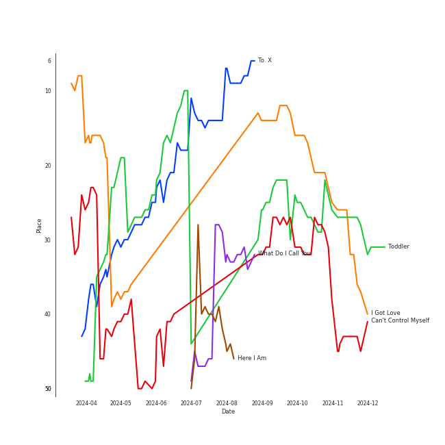
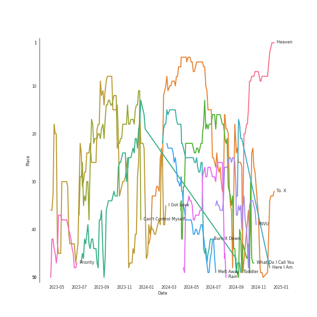
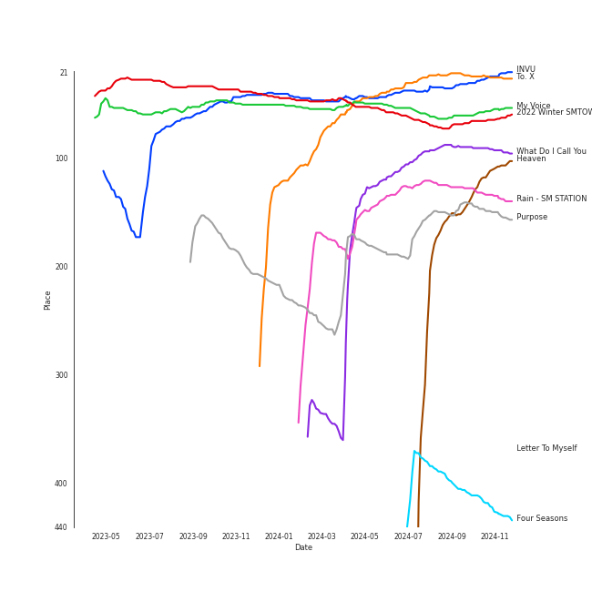
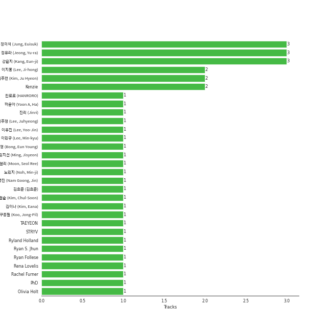

# TAEYEON

## Relationships

TAEYEON:
- is a member of [GOT the beat](../got_the_beat/overview.md)
- is a member of [Girls' Generation](../girls__generation/overview.md)
- is a member of Girls' Generation-TTS

## Artist Rank
TAEYEON is currently:
- The #4 artist of the last month
- The #5 artist of the last 6 months
- The #6 artist of the last year
- The #8 artist of all time

## Top Tracks

### Top tracks of all time

Top tracks of the last year over time

Top tracks of the last 6 months over time

## Top Albums

| Art | Rank | Tracks | 💚 | Album | Release Date | 🔗 |
|:---|---:|---:|---:|:---|:---|:---|
|  | 19 | 7 | 7 | INVU - The 3rd Album | 2022-02-14 | [🔗](https://open.spotify.com/album/7i2YLTVQ0dyngRuUqtGmr9) |
|  | 154 | 6 | 4 | Purpose - The 2nd Album | 2019-10-28 | [🔗](https://open.spotify.com/album/0h6wCpdgpSOAbYDDYJVuwr) |
|  | 26 | 5 | 4 | To. X - The 5th Mini Album | 2023-11-27 | [🔗](https://open.spotify.com/album/0VciVDVU6NoqtQ0WAIlTmD) |
|  | 277 | 4 | 4 | Letter To Myself - The 6th Mini Album | 2024-11-18 | [🔗](https://open.spotify.com/album/47f7hcYu2nGCYcRx5d8zCM) |
|  | 509 | 4 | 0 | This Christmas – Winter is Coming | 2017-12-12 | [🔗](https://open.spotify.com/album/1U3KyC9Key12NSi9ETVExx) |
|  | 55 | 3 | 1 | My Voice - The 1st Album | 2017-02-28 | [🔗](https://open.spotify.com/album/6DlCl3hBP1Gwhn0tgitGfN) |
|  | 96 | 2 | 2 | What Do I Call You - The 4th Mini Album | 2020-12-15 | [🔗](https://open.spotify.com/album/70XJeDlFe1LmZo1lyFKyq3) |
|  | 690 | 2 | 1 | Why - The 2nd Mini Album | 2016-06-28 | [🔗](https://open.spotify.com/album/1ukBQWhQwWKqTGgs0YzRzU) |
|  | 690 | 2 | 1 | Something New - The 3rd Mini Album | 2018-06-18 | [🔗](https://open.spotify.com/album/0xYQcPVyEEegJlTXLttWUx) |
|  | 690 | 2 | 1 | I - The 1st Mini Album | 2015-10-07 | [🔗](https://open.spotify.com/album/4e7kLQu7SKBUiMtV5WH3A1) |

See all albums

| Art | Rank | Tracks | 💚 | Album | Release Date | 🔗 |
|:---|---:|---:|---:|:---|:---|:---|
|  | 139 | 1 | 1 | Rain - SM STATION | 2016-02-03 | [🔗](https://open.spotify.com/album/5MgY1E2inbDcthAQEzwz8L) |
|  | 690 | 1 | 1 | My Voice - The 1st Album (Deluxe Edition) | 2017-04-05 | [🔗](https://open.spotify.com/album/7MG0bxf0ZFsAyej9W3XzTO) |
|  | 690 | 1 | 1 | Hotel del Luna (Original Television Soundtrack) Pt.3 | 2019-07-21 | [🔗](https://open.spotify.com/album/6nddI94g7zC5bbyNzRBO0Y) |
|  | 690 | 1 | 1 | Hong Gil Dong OST | 2008-01-23 | [🔗](https://open.spotify.com/album/5Efud8Wmo7vBQjSJI1WcJ7) |
|  | 103 | 1 | 1 | Heaven | 2024-07-08 | [🔗](https://open.spotify.com/album/68taLckvPxHRtNa8QjQJ5e) |
|  | 690 | 1 | 1 | Happy | 2020-05-04 | [🔗](https://open.spotify.com/album/1nPB6o7EjGvUORXlnioEPk) |
|  | 439 | 1 | 1 | Four Seasons | 2019-03-24 | [🔗](https://open.spotify.com/album/3ublKZHu1qjU9ujf9A4zhH) |
|  | 58 | 1 | 1 | 2022 Winter SMTOWN : SMCU PALACE | 2022-12-26 | [🔗](https://open.spotify.com/album/1HwnXJfZx8N8qDfzwUbxcw) |
|  | 690 | 1 | 0 | Weekend | 2021-07-06 | [🔗](https://open.spotify.com/album/4tJsXd2onpa4P9lFmkJIKy) |

## Featured on Playlists
| Art | Tracks | Playlist |
|:---|---:|:---|
|  | 40 | [K-Pop](../../playlists/k-pop/overview.md) |
|  | 13 | [K-Pop Favorites](../../playlists/k-pop_favorites/overview.md) |
|  | 13 | [Chill](../../playlists/chill/overview.md) |
|  | 6 | [Relax](../../playlists/relax/overview.md) |
|  | 5 | [My Top Songs 2024](../../playlists/my_top_songs_2024/overview.md) |
|  | 4 | [Recent Comebacks](../../playlists/recent_comebacks/overview.md) |
|  | 4 | [Christmas](../../playlists/christmas/overview.md) |
|  | 3 | [Recommendations for Jeff](../../playlists/recommendations_for_jeff/overview.md) |
|  | 3 | [Halloween](../../playlists/halloween/overview.md) |
|  | 3 | [Recommendations for Chris](../../playlists/recommendations_for_chris/overview.md) |
|  | 3 | [My Top Songs 2023](../../playlists/my_top_songs_2023/overview.md) |
|  | 2 | [Summer](../../playlists/summer/overview.md) |
|  | 2 | [My Top Songs 2022](../../playlists/my_top_songs_2022/overview.md) |
|  | 2 | [K-OST](../../playlists/k-ost/overview.md) |
|  | 1 | [K-Pop 101](../../playlists/k-pop_101/overview.md) |
|  | 1 | [Workout](../../playlists/workout/overview.md) |

## Top Record Labels

| Tracks | 💚 | Label |
|---:|---:|:---|
| 44 | 31 | [SM Entertainment](../../labels/sm_entertainment/overview.md) |
| 1 | 1 | msmedia |
| 1 | 1 | Beyond Music |

## Genres

- [k-pop](../../genres/k-pop/overview.md)

## Credits

### Credits by Type

| Credit Type | Tracks |
|:---|---:|
| Lyricist | 1 |
| Vocal | 7 |

### Production Credits

| Art | Track | Credit Types |
|:---|:---|:---|
|  | Can't Control Myself | Lyricist |

## Top Producers

| Art | Producer | Tracks | Credit Types |
|:---|:---|---:|:---|
| | [정의석 (Jung, Euisuk)](../../producers/정의석_(jung,_euisuk)/overview.md) | 3 | Producer |
| | 정유라 (Jeong, Yu-ra) | 3 | Producer |
| | 강은지 (Kang, Eun-ji) | 3 | Producer |
| | 김주현 (Kim, Ju Hyeon) | 2 | Producer |
| | [Kenzie](../../producers/kenzie/overview.md) | 2 | Lyricist, Producer, Arranger, Songwriter |
| | 이지홍 (Lee, Ji-hong) | 2 | Producer |
| | 김효준 (김효준) | 1 | Producer |
| | Daniel Davidsen | 1 | Songwriter |
| | 노민지 (Noh, Min-ji) | 1 | Producer |
| | Mafly | 1 | Lyricist |

View all

| Art | Producer | Tracks | Credit Types |
|:---|:---|---:|:---|
| | Dino Medanhodzic | 1 | Arranger, Producer, Songwriter |
| | Michael Dunaief | 1 | Songwriter |
| | [구종필 (Koo, Jong-Pil)](../../producers/구종필_(koo,_jong-pil)/overview.md) | 1 | Producer |
| | 봉은영 (Bong, Eun Young) | 1 | Lyricist |
| | Nia Lovelis | 1 | Songwriter |
| | Rena Lovelis | 1 | Songwriter |
| | Ryan Follese | 1 | Songwriter |
| | 진리 (Jinri) | 1 | Lyricist |
| | 밍지션 (Ming, Jisyeon) | 1 | Producer |
| | 남궁진 (Nam Goong, Jin) | 1 | Producer |
| | Rachel Furner | 1 | Songwriter |
| | Cutfather | 1 | Songwriter |
| | Celine Svanbäck (Svanbäck, Celine) | 1 | Songwriter |
| | 이주형 (Lee, Juhyeong) | 1 | Producer |
| | 이민규 (Lee, Min-kyu) | 1 | Producer |
| | Dave Kutch | 1 | Producer |
| | [LDN Noise](../../producers/ldn_noise/overview.md) | 1 | Songwriter |
| | Jess Morgan | 1 | Songwriter |
| | 한로로 (HANRORO) | 1 | Lyricist |
| | Casey Moreta | 1 | Songwriter |
| | 하윤아 (Yoon A, Ha) | 1 | Lyricist |
| | Christian Vinten | 1 | Arranger, Songwriter |
| | STRYV | 1 | Arranger, Songwriter |
| | [김이나 (Kim, Eana)](../../producers/김이나_(kim,_eana)/overview.md) | 1 | Lyricist |
| | Olivia Holt | 1 | Songwriter |
|  | [TAEYEON](overview.md) | 1 | Lyricist |
| | Chantry Johnson | 1 | Arranger, Producer, Songwriter |
| | Jacob Ubizz | 1 | Arranger, Songwriter |
| | Matthew Tishler | 1 | Arranger, Songwriter |
| | 문설리 (Moon, Seol Ree) | 1 | Lyricist |
| | Dotter | 1 | Songwriter |
| | Chelcee Grimes | 1 | Arranger, Songwriter |
| | Lauritz Emil Christiansen | 1 | Arranger, Songwriter |
| | Felicia Barton | 1 | Songwriter |
| | [Ryan S. Jhun](../../producers/ryan_s__jhun/overview.md) | 1 | Arranger, Songwriter |
| | Alna | 1 | Songwriter |
| | 이유진 (Lee, Yoo-Jin) | 1 | Lyricist |
| | Aaron Benward | 1 | Songwriter |
| | PhD | 1 | Arranger |
| | Alex DeLeon | 1 | Songwriter |
| | Ryland Holland | 1 | Songwriter |
| | 김철순 (Kim, Chul-Soon) | 1 | Producer |

## Tracks

| Art | Track | Album | Artists | Label | Rank | 💚 | 🔗 |
|:---|:---|:---|:---|:---|---:|:---|:---|
|  | To. X | To. X - The 5th Mini Album | [TAEYEON](overview.md) | [SM Entertainment](../../labels/sm_entertainment) | 38 | 💚 | [🔗](https://open.spotify.com/track/2gyCwrOcC6JBoaJ8JGJ7T8) |
|  | I Got Love | My Voice - The 1st Album | [TAEYEON](overview.md) | [SM Entertainment](../../labels/sm_entertainment) | 53 | 💚 | [🔗](https://open.spotify.com/track/1IgRQvTqj7BKjNWRzjFEE0) |
|  | Toddler | INVU - The 3rd Album | [TAEYEON](overview.md) | [SM Entertainment](../../labels/sm_entertainment) | 69 | 💚 | [🔗](https://open.spotify.com/track/73pehvxZUb87PhgyJJpTlw) |
|  | Can't Control Myself | INVU - The 3rd Album | [TAEYEON](overview.md) | [SM Entertainment](../../labels/sm_entertainment) | 82 | 💚 | [🔗](https://open.spotify.com/track/2TZTpkpnDIKUOfU6riqCfE) |
|  | What Do I Call You | What Do I Call You - The 4th Mini Album | [TAEYEON](overview.md) | [SM Entertainment](../../labels/sm_entertainment) | 113 | 💚 | [🔗](https://open.spotify.com/track/3Wu4lFjkhcXxB6WWaX9gtr) |
|  | Heaven | Heaven | [TAEYEON](overview.md) | [SM Entertainment](../../labels/sm_entertainment) | 125 | 💚 | [🔗](https://open.spotify.com/track/1fCKxY62wMnayTNSr3S3GN) |
|  | Burn It Down | To. X - The 5th Mini Album | [TAEYEON](overview.md) | [SM Entertainment](../../labels/sm_entertainment) | 138 | 💚 | [🔗](https://open.spotify.com/track/1y8tPIOh9kR3eQE6TeBCwe) |
|  | INVU | INVU - The 3rd Album | [TAEYEON](overview.md) | [SM Entertainment](../../labels/sm_entertainment) | 154 | 💚 | [🔗](https://open.spotify.com/track/7rXcCpIAoOUCydkVDMcoPV) |
|  | Rain | Rain - SM STATION | [TAEYEON](overview.md) | [SM Entertainment](../../labels/sm_entertainment) | 176 | 💚 | [🔗](https://open.spotify.com/track/1ukyvyEeSg1odSQvhlRAIU) |
|  | Melt Away | To. X - The 5th Mini Album | [TAEYEON](overview.md) | [SM Entertainment](../../labels/sm_entertainment) | 180 | 💚 | [🔗](https://open.spotify.com/track/2cZtazNq0IRRFymK7UaRa0) |

See all tracks

| Art | Track | Album | Artists | Label | Rank | 💚 | 🔗 |
|:---|:---|:---|:---|:---|---:|:---|:---|
|  | Here I Am | Purpose - The 2nd Album | [TAEYEON](overview.md) | [SM Entertainment](../../labels/sm_entertainment) | 207 | 💚 | [🔗](https://open.spotify.com/track/3xeo2seNDIp712sUmZycAN) |
|  | Priority | 2022 Winter SMTOWN : SMCU PALACE | MAX CHANGMIN, [TAEYEON](overview.md), [WINTER](../winter/overview.md) | [SM Entertainment](../../labels/sm_entertainment) | 276 | 💚 | [🔗](https://open.spotify.com/track/79musoVrfPaVxoMSBFJYuc) |
|  | Hot Mess | Letter To Myself - The 6th Mini Album | [TAEYEON](overview.md) | [SM Entertainment](../../labels/sm_entertainment) | 457 | 💚 | [🔗](https://open.spotify.com/track/1905x5T3TtMOofjc5gokcJ) |
|  | Cold As Hell | INVU - The 3rd Album | [TAEYEON](overview.md) | [SM Entertainment](../../labels/sm_entertainment) | 499 | 💚 | [🔗](https://open.spotify.com/track/7gosH4fL73GpiJBd5GK2rC) |
|  | Spark | Purpose - The 2nd Album | [TAEYEON](overview.md) | [SM Entertainment](../../labels/sm_entertainment) | 520 | 💚 | [🔗](https://open.spotify.com/track/49euWwcjQTzVCynY53tvH5) |
|  | Four Seasons | Four Seasons | [TAEYEON](overview.md) | [SM Entertainment](../../labels/sm_entertainment) | 654 | 💚 | [🔗](https://open.spotify.com/track/4ytyLpIwUXbdFsNOvgNnmP) |
|  | Candy Cane | This Christmas – Winter is Coming | [TAEYEON](overview.md) | [SM Entertainment](../../labels/sm_entertainment) | 760 | | [🔗](https://open.spotify.com/track/1SO3jE0lOysjtylF6y3FWt) |
|  | Blur | Letter To Myself - The 6th Mini Album | [TAEYEON](overview.md) | [SM Entertainment](../../labels/sm_entertainment) | 812 | 💚 | [🔗](https://open.spotify.com/track/6h2rdCqiqXWHxrr41DjxpG) |
|  | Letter To Myself | Letter To Myself - The 6th Mini Album | [TAEYEON](overview.md) | [SM Entertainment](../../labels/sm_entertainment) | 878 | 💚 | [🔗](https://open.spotify.com/track/1Uxr0oBXAZRuLkAz27TkLc) |
|  | Nightmare | To. X - The 5th Mini Album | [TAEYEON](overview.md) | [SM Entertainment](../../labels/sm_entertainment) | 953 | 💚 | [🔗](https://open.spotify.com/track/3dmZOzXDFXEZXdjPqJJPKt) |
|  | If | Hong Gil Dong OST | [TAEYEON](overview.md) | msmedia | 1054 | 💚 | [🔗](https://open.spotify.com/track/76do9IBWqoiwV3EyoP25Le) |
|  | I | I - The 1st Mini Album | [TAEYEON](overview.md), Verbal Jint | [SM Entertainment](../../labels/sm_entertainment) | 1054 | | [🔗](https://open.spotify.com/track/5ZkITfPpcNPnyYGTibkO6m) |
|  | Stress | I - The 1st Mini Album | [TAEYEON](overview.md) | [SM Entertainment](../../labels/sm_entertainment) | 1054 | 💚 | [🔗](https://open.spotify.com/track/0a0FISfY8ty1xC69xCWf2T) |
|  | Good Thing | Why - The 2nd Mini Album | [TAEYEON](overview.md) | [SM Entertainment](../../labels/sm_entertainment) | 1054 | | [🔗](https://open.spotify.com/track/30CAqzLOdc8LbPRzchYaAt) |
|  | Up & Down | Why - The 2nd Mini Album | [TAEYEON](overview.md), HYOYEON | [SM Entertainment](../../labels/sm_entertainment) | 1054 | 💚 | [🔗](https://open.spotify.com/track/2T20Nb7QlVK8K6pRSiDl8N) |
|  | Fine | My Voice - The 1st Album | [TAEYEON](overview.md) | [SM Entertainment](../../labels/sm_entertainment) | 1054 | | [🔗](https://open.spotify.com/track/6CdUgvL597jWmW4w8P5kHs) |
|  | Sweet Love | My Voice - The 1st Album | [TAEYEON](overview.md) | [SM Entertainment](../../labels/sm_entertainment) | 1054 | | [🔗](https://open.spotify.com/track/2CbvW8kgNDByBIQbFY0h3i) |
|  | 11:11 | My Voice - The 1st Album (Deluxe Edition) | [TAEYEON](overview.md) | [SM Entertainment](../../labels/sm_entertainment) | 1054 | 💚 | [🔗](https://open.spotify.com/track/67QGnT1Vdfuuy4HkLTUVjj) |
|  | Let It Snow | This Christmas – Winter is Coming | [TAEYEON](overview.md) | [SM Entertainment](../../labels/sm_entertainment) | 1054 | | [🔗](https://open.spotify.com/track/752AmSeOh3T48yWd8OogC6) |
|  | The Magic of Christmas Time | This Christmas – Winter is Coming | [TAEYEON](overview.md) | [SM Entertainment](../../labels/sm_entertainment) | 1054 | | [🔗](https://open.spotify.com/track/35OjjtMHKnPdOAsEZ6M9OA) |
|  | This Christmas | This Christmas – Winter is Coming | [TAEYEON](overview.md) | [SM Entertainment](../../labels/sm_entertainment) | 1054 | | [🔗](https://open.spotify.com/track/6eAMa0e7WCbjM7ivbAhvkq) |
|  | Baram X 3 | Something New - The 3rd Mini Album | [TAEYEON](overview.md) | [SM Entertainment](../../labels/sm_entertainment) | 1054 | | [🔗](https://open.spotify.com/track/0DdbiN1gW1t4MU7tQ91eTW) |
|  | Something New | Something New - The 3rd Mini Album | [TAEYEON](overview.md) | [SM Entertainment](../../labels/sm_entertainment) | 1054 | 💚 | [🔗](https://open.spotify.com/track/6oDX7N6VnXSyLdyGsDP5jV) |
|  | 그대라는 시 | Hotel del Luna (Original Television Soundtrack) Pt.3 | [TAEYEON](overview.md) | Beyond Music | 1054 | 💚 | [🔗](https://open.spotify.com/track/56Cmy1rCQ35V2Q7groYiHl) |
|  | Gravity | Purpose - The 2nd Album | [TAEYEON](overview.md) | [SM Entertainment](../../labels/sm_entertainment) | 1054 | | [🔗](https://open.spotify.com/track/1fzLM4SRonzoHm723a2mP5) |
|  | LOL | Purpose - The 2nd Album | [TAEYEON](overview.md) | [SM Entertainment](../../labels/sm_entertainment) | 1054 | | [🔗](https://open.spotify.com/track/31mc9vkMVGvCHrlZukqhQb) |
|  | Love You Like Crazy | Purpose - The 2nd Album | [TAEYEON](overview.md) | [SM Entertainment](../../labels/sm_entertainment) | 1054 | 💚 | [🔗](https://open.spotify.com/track/4TsP3ww5zEXxuUdmkWIcqp) |
|  | Wine | Purpose - The 2nd Album | [TAEYEON](overview.md) | [SM Entertainment](../../labels/sm_entertainment) | 1054 | 💚 | [🔗](https://open.spotify.com/track/2Bgjj3t5bOh34DfENfgyUY) |
|  | Happy | Happy | [TAEYEON](overview.md) | [SM Entertainment](../../labels/sm_entertainment) | 1054 | 💚 | [🔗](https://open.spotify.com/track/459mRPsscVLMvVL59gr7EM) |
|  | To the moon | What Do I Call You - The 4th Mini Album | [TAEYEON](overview.md) | [SM Entertainment](../../labels/sm_entertainment) | 1054 | 💚 | [🔗](https://open.spotify.com/track/06v5p9PbGF6R0fbxGwMdlX) |
|  | Weekend | Weekend | [TAEYEON](overview.md) | [SM Entertainment](../../labels/sm_entertainment) | 1054 | | [🔗](https://open.spotify.com/track/6cqH1q7g5GeRVQVMK1Vc7f) |
|  | Heart | INVU - The 3rd Album | [TAEYEON](overview.md) | [SM Entertainment](../../labels/sm_entertainment) | 1054 | 💚 | [🔗](https://open.spotify.com/track/5wr4JYeZZz4POQao14IDFu) |
|  | Set Myself On Fire | INVU - The 3rd Album | [TAEYEON](overview.md) | [SM Entertainment](../../labels/sm_entertainment) | 1054 | 💚 | [🔗](https://open.spotify.com/track/002wiS64p2qXaYYVAP7KOW) |
|  | You Better Not | INVU - The 3rd Album | [TAEYEON](overview.md) | [SM Entertainment](../../labels/sm_entertainment) | 1054 | 💚 | [🔗](https://open.spotify.com/track/47Vgc15moDELPzmLAQSFgO) |
|  | All For Nothing | To. X - The 5th Mini Album | [TAEYEON](overview.md) | [SM Entertainment](../../labels/sm_entertainment) | 1054 | | [🔗](https://open.spotify.com/track/6kniGjw06j9O7GFgEFwu8v) |
|  | Blue Eyes | Letter To Myself - The 6th Mini Album | [TAEYEON](overview.md) | [SM Entertainment](../../labels/sm_entertainment) | 1054 | 💚 | [🔗](https://open.spotify.com/track/3FBfDRGZIhwoYnrm7n0GA7) |

