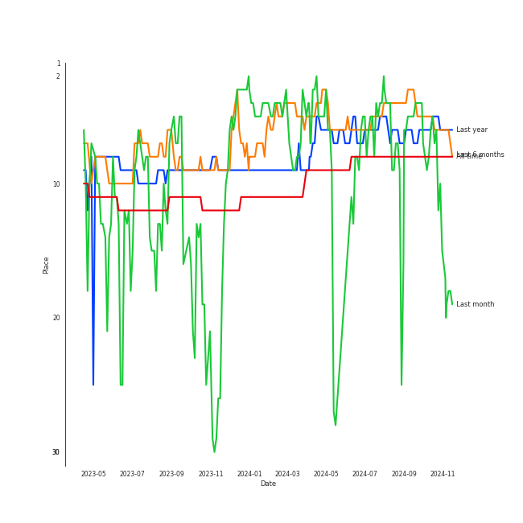
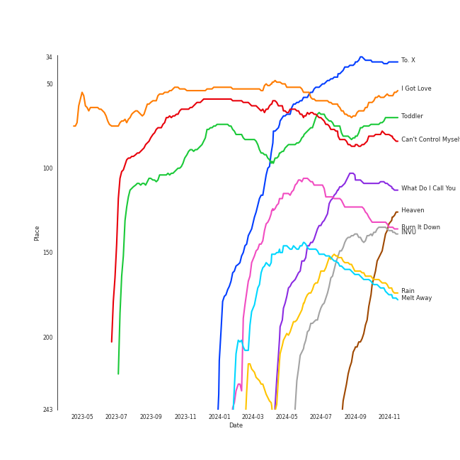
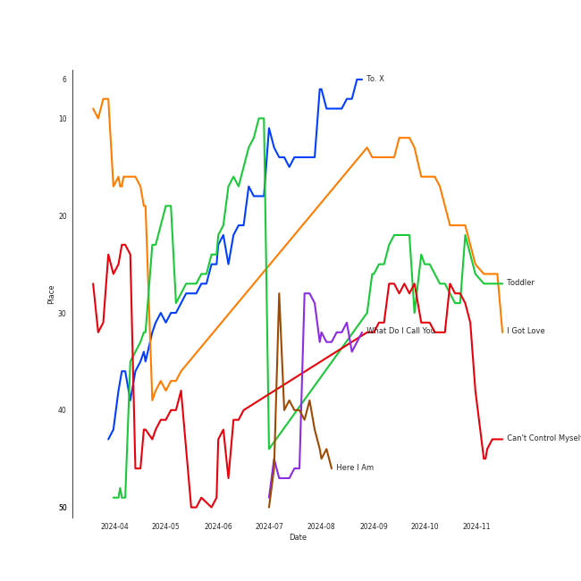

# TAEYEON

[See Track Features](audio_features.md)

[See Clusters](clusters/overview.md)

## Relationships

TAEYEON:
- is a member of [GOT the beat](../got_the_beat/overview.md)
- is a member of [Girls' Generation](../girls__generation/overview.md)
- is a member of Girls' Generation-TTS

## Artist Rank
TAEYEON is currently:
- The #3 artist of the last month
- The #5 artist of the last 6 months
- The #9 artist of all time

## Top Tracks

- I Got Love is the #10 track of all time
- Can't Control Myself is the #33 track of all time
- To. X is:
    - the #6 track of the On Repeat playlist
    - the #8 track of the last 6 months
- Burn It Down is:
    - the #29 track of the On Repeat playlist
    - the #18 track of the last 6 months
- Melt Away is the #30 track of the last 6 months
- Here I Am is the #34 track of the last month

### Top tracks, aggregated

### Top tracks of all time over time

### Top tracks of the last 6 months over time

## Featured on Playlists
| Art | Tracks | Playlist |
|:---|---:|:---|
|  | 34 | [K-Pop](../../playlists/k-pop/overview.md) |
|  | 12 | [K-Pop Favorites](../../playlists/k-pop_favorites/overview.md) |
|  | 11 | [Chill](../../playlists/chill/overview.md) |
|  | 6 | [Relax](../../playlists/relax/overview.md) |
|  | 5 | [Recent Comebacks](../../playlists/recent_comebacks/overview.md) |
|  | 4 | [Christmas](../../playlists/christmas/overview.md) |
|  | 3 | [Recommendations for Jeff](../../playlists/recommendations_for_jeff/overview.md) |
|  | 3 | [Your Top Songs 2023](../../playlists/your_top_songs_2023/overview.md) |
|  | 2 | [On Repeat](../../playlists/on_repeat/overview.md) |
|  | 2 | [Your Top Songs 2022](../../playlists/your_top_songs_2022/overview.md) |
|  | 2 | [Summer](../../playlists/summer/overview.md) |
|  | 2 | [Recommendations for Chris](../../playlists/recommendations_for_chris/overview.md) |
|  | 2 | [K-OST](../../playlists/k-ost/overview.md) |
|  | 1 | [Workout](../../playlists/workout/overview.md) |
|  | 1 | [Repeat Rewind](../../playlists/repeat_rewind/overview.md) |
|  | 1 | [Halloween](../../playlists/halloween/overview.md) |
|  | 1 | [K-Pop 101](../../playlists/k-pop_101/overview.md) |

## Top Albums

| Art | Tracks | 💚 | Album | Release Date | 🔗 |
|:---|---:|---:|:---|:---|:---|
|  | 7 | 6 | INVU - The 3rd Album | 2022-02-14 | [🔗](https://open.spotify.com/album/7i2YLTVQ0dyngRuUqtGmr9) |
|  | 5 | 4 | To. X - The 5th Mini Album | 2023-11-27 | [🔗](https://open.spotify.com/album/0VciVDVU6NoqtQ0WAIlTmD) |
|  | 5 | 2 | Purpose - The 2nd Album | 2019-10-28 | [🔗](https://open.spotify.com/album/0h6wCpdgpSOAbYDDYJVuwr) |
|  | 4 | 0 | This Christmas – Winter is Coming | 2017-12-12 | [🔗](https://open.spotify.com/album/1U3KyC9Key12NSi9ETVExx) |
|  | 3 | 1 | My Voice - The 1st Album | 2017-02-28 | [🔗](https://open.spotify.com/album/6DlCl3hBP1Gwhn0tgitGfN) |
|  | 2 | 2 | What Do I Call You - The 4th Mini Album | 2020-12-15 | [🔗](https://open.spotify.com/album/70XJeDlFe1LmZo1lyFKyq3) |
|  | 2 | 1 | Why - The 2nd Mini Album | 2016-06-28 | [🔗](https://open.spotify.com/album/1ukBQWhQwWKqTGgs0YzRzU) |
|  | 2 | 1 | Something New - The 3rd Mini Album | 2018-06-18 | [🔗](https://open.spotify.com/album/0xYQcPVyEEegJlTXLttWUx) |
|  | 2 | 1 | I - The 1st Mini Album | 2015-10-07 | [🔗](https://open.spotify.com/album/4e7kLQu7SKBUiMtV5WH3A1) |
|  | 1 | 1 | Rain - SM STATION | 2016-02-03 | [🔗](https://open.spotify.com/album/5MgY1E2inbDcthAQEzwz8L) |

See all albums

| Art | Tracks | 💚 | Album | Release Date | 🔗 |
|:---|---:|---:|:---|:---|:---|
|  | 1 | 1 | My Voice - The 1st Album (Deluxe Edition) | 2017-04-05 | [🔗](https://open.spotify.com/album/7MG0bxf0ZFsAyej9W3XzTO) |
|  | 1 | 1 | Hotel del Luna (Original Television Soundtrack) Pt.3 | 2019-07-21 | [🔗](https://open.spotify.com/album/6nddI94g7zC5bbyNzRBO0Y) |
|  | 1 | 1 | Hong Gil Dong OST | 2008-01-23 | [🔗](https://open.spotify.com/album/5Efud8Wmo7vBQjSJI1WcJ7) |
|  | 1 | 1 | Happy | 2020-05-04 | [🔗](https://open.spotify.com/album/1nPB6o7EjGvUORXlnioEPk) |
|  | 1 | 1 | Four Seasons | 2019-03-24 | [🔗](https://open.spotify.com/album/3ublKZHu1qjU9ujf9A4zhH) |
|  | 1 | 1 | 2022 Winter SMTOWN : SMCU PALACE | 2022-12-26 | [🔗](https://open.spotify.com/album/1HwnXJfZx8N8qDfzwUbxcw) |
|  | 1 | 0 | Weekend | 2021-07-06 | [🔗](https://open.spotify.com/album/4tJsXd2onpa4P9lFmkJIKy) |
|  | 1 | 0 | Can't Control Myself | 2022-01-17 | [🔗](https://open.spotify.com/album/2Xgk5KfKKed3D1a5B3gJJ9) |

## Top Record Labels

| Tracks | 💚 | Label |
|---:|---:|:---|
| 39 | 23 | [SM Entertainment](../../labels/sm_entertainment/overview.md) |
| 1 | 1 | msmedia |
| 1 | 1 | Beyond Music |

## Genres

- [k-pop](../../genres/k-pop/overview.md)

## Credits

### Credits by Type

| Credit Type | Tracks |
|:---|---:|
| Lyricist | 1 |
| Vocal | 5 |

### Production Credits

| Art | Track | Credit Types |
|:---|:---|:---|
|  | Can't Control Myself | Lyricist |

## Top Producers

| Art | Producer | Tracks | Credit Types |
|:---|:---|---:|:---|
| | Christian Vinten | 1 | Arranger, Songwriter |
| | Jess Morgan | 1 | Songwriter |
| | 이민규 (Lee, Min-kyu) | 1 | Producer |
| | 정의석 (Jung, Euisuk) | 1 | Producer |
| | 이주형 (Lee, Juhyeong) | 1 | Producer |
| | Celine Svanbäck (Svanbäck, Celine) | 1 | Songwriter |
| | Cutfather | 1 | Songwriter |
| | Rachel Furner | 1 | Songwriter |
| | 정유라 (Jeong, Yu-ra) | 1 | Producer |
| | 진리 (Jinri) | 1 | Lyricist |

View all

| Art | Producer | Tracks | Credit Types |
|:---|:---|---:|:---|
| | Daniel Davidsen | 1 | Songwriter |
| | 봉은영 (Bong, Eun Young) | 1 | Lyricist |
| | Mafly | 1 | Lyricist |
| | 밍지션 (Ming, Jisyeon) | 1 | Producer |
| | PhD | 1 | Arranger |
| | [김이나 (Kim, Eana)](../../producers/김이나_(kim,_eana)/overview.md) | 1 | Lyricist |
| | Aaron Benward | 1 | Songwriter |
| | 이유진 (Lee, Yoo-Jin) | 1 | Lyricist |
| | [Ryan S. Jhun](../../producers/ryan_s__jhun/overview.md) | 1 | Arranger, Songwriter |
| | Felicia Barton | 1 | Songwriter |
| | Lauritz Emil Christiansen | 1 | Arranger, Songwriter |
| | Chelcee Grimes | 1 | Arranger, Songwriter |
| | 문설리 (Moon, Seol Ree) | 1 | Lyricist |
| | Matthew Tishler | 1 | Arranger, Songwriter |
| | Jacob Ubizz | 1 | Arranger, Songwriter |
| | 이지홍 (Lee, Ji-hong) | 1 | Producer |
|  | [TAEYEON](overview.md) | 1 | Lyricist |
| | Olivia Holt | 1 | Songwriter |
| | 김철순 (Kim, Chul-Soon) | 1 | Producer |

## Tracks

| Art | Track | Album | Artists | Label | Score | 💚 | 🔗 |
|:---|:---|:---|:---|:---|---:|:---|:---|
|  | I Got Love | My Voice - The 1st Album | [TAEYEON](overview.md) | [SM Entertainment](../../labels/sm_entertainment) | 15482 | 💚 | [🔗](https://open.spotify.com/track/1IgRQvTqj7BKjNWRzjFEE0) |
|  | Can't Control Myself | INVU - The 3rd Album | [TAEYEON](overview.md) | [SM Entertainment](../../labels/sm_entertainment) | 11559 | 💚 | [🔗](https://open.spotify.com/track/2TZTpkpnDIKUOfU6riqCfE) |
|  | Toddler | INVU - The 3rd Album | [TAEYEON](overview.md) | [SM Entertainment](../../labels/sm_entertainment) | 6874 | 💚 | [🔗](https://open.spotify.com/track/73pehvxZUb87PhgyJJpTlw) |
|  | To. X | To. X - The 5th Mini Album | [TAEYEON](overview.md) | [SM Entertainment](../../labels/sm_entertainment) | 5479 | 💚 | [🔗](https://open.spotify.com/track/2gyCwrOcC6JBoaJ8JGJ7T8) |
|  | Burn It Down | To. X - The 5th Mini Album | [TAEYEON](overview.md) | [SM Entertainment](../../labels/sm_entertainment) | 3511 | 💚 | [🔗](https://open.spotify.com/track/1y8tPIOh9kR3eQE6TeBCwe) |
|  | Melt Away | To. X - The 5th Mini Album | [TAEYEON](overview.md) | [SM Entertainment](../../labels/sm_entertainment) | 2087 | 💚 | [🔗](https://open.spotify.com/track/2cZtazNq0IRRFymK7UaRa0) |
|  | Priority | 2022 Winter SMTOWN : SMCU PALACE | MAX CHANGMIN, [TAEYEON](overview.md), [WINTER](../winter/overview.md) | [SM Entertainment](../../labels/sm_entertainment) | 1255 | 💚 | [🔗](https://open.spotify.com/track/79musoVrfPaVxoMSBFJYuc) |
|  | Rain | Rain - SM STATION | [TAEYEON](overview.md) | [SM Entertainment](../../labels/sm_entertainment) | 361 | 💚 | [🔗](https://open.spotify.com/track/1ukyvyEeSg1odSQvhlRAIU) |
|  | Here I Am | Purpose - The 2nd Album | [TAEYEON](overview.md) | [SM Entertainment](../../labels/sm_entertainment) | 215 | 💚 | [🔗](https://open.spotify.com/track/3xeo2seNDIp712sUmZycAN) |
|  | Candy Cane | This Christmas – Winter is Coming | [TAEYEON](overview.md) | [SM Entertainment](../../labels/sm_entertainment) | 67 | | [🔗](https://open.spotify.com/track/1SO3jE0lOysjtylF6y3FWt) |

See all tracks

| Art | Track | Album | Artists | Label | Score | 💚 | 🔗 |
|:---|:---|:---|:---|:---|---:|:---|:---|
|  | What Do I Call You | What Do I Call You - The 4th Mini Album | [TAEYEON](overview.md) | [SM Entertainment](../../labels/sm_entertainment) | 66 | 💚 | [🔗](https://open.spotify.com/track/3Wu4lFjkhcXxB6WWaX9gtr) |
|  | Nightmare | To. X - The 5th Mini Album | [TAEYEON](overview.md) | [SM Entertainment](../../labels/sm_entertainment) | 13 | 💚 | [🔗](https://open.spotify.com/track/3dmZOzXDFXEZXdjPqJJPKt) |
|  | Cold As Hell | INVU - The 3rd Album | [TAEYEON](overview.md) | [SM Entertainment](../../labels/sm_entertainment) | 5 | 💚 | [🔗](https://open.spotify.com/track/7gosH4fL73GpiJBd5GK2rC) |
|  | If | Hong Gil Dong OST | [TAEYEON](overview.md) | msmedia | 0 | 💚 | [🔗](https://open.spotify.com/track/76do9IBWqoiwV3EyoP25Le) |
|  | I | I - The 1st Mini Album | [TAEYEON](overview.md), Verbal Jint | [SM Entertainment](../../labels/sm_entertainment) | 0 | | [🔗](https://open.spotify.com/track/5ZkITfPpcNPnyYGTibkO6m) |
|  | Stress | I - The 1st Mini Album | [TAEYEON](overview.md) | [SM Entertainment](../../labels/sm_entertainment) | 0 | 💚 | [🔗](https://open.spotify.com/track/0a0FISfY8ty1xC69xCWf2T) |
|  | Good Thing | Why - The 2nd Mini Album | [TAEYEON](overview.md) | [SM Entertainment](../../labels/sm_entertainment) | 0 | | [🔗](https://open.spotify.com/track/30CAqzLOdc8LbPRzchYaAt) |
|  | Up & Down | Why - The 2nd Mini Album | [TAEYEON](overview.md), HYOYEON | [SM Entertainment](../../labels/sm_entertainment) | 0 | 💚 | [🔗](https://open.spotify.com/track/2T20Nb7QlVK8K6pRSiDl8N) |
|  | Fine | My Voice - The 1st Album | [TAEYEON](overview.md) | [SM Entertainment](../../labels/sm_entertainment) | 0 | | [🔗](https://open.spotify.com/track/6CdUgvL597jWmW4w8P5kHs) |
|  | Sweet Love | My Voice - The 1st Album | [TAEYEON](overview.md) | [SM Entertainment](../../labels/sm_entertainment) | 0 | | [🔗](https://open.spotify.com/track/2CbvW8kgNDByBIQbFY0h3i) |
|  | 11:11 | My Voice - The 1st Album (Deluxe Edition) | [TAEYEON](overview.md) | [SM Entertainment](../../labels/sm_entertainment) | 0 | 💚 | [🔗](https://open.spotify.com/track/67QGnT1Vdfuuy4HkLTUVjj) |
|  | Let It Snow | This Christmas – Winter is Coming | [TAEYEON](overview.md) | [SM Entertainment](../../labels/sm_entertainment) | 0 | | [🔗](https://open.spotify.com/track/752AmSeOh3T48yWd8OogC6) |
|  | The Magic of Christmas Time | This Christmas – Winter is Coming | [TAEYEON](overview.md) | [SM Entertainment](../../labels/sm_entertainment) | 0 | | [🔗](https://open.spotify.com/track/35OjjtMHKnPdOAsEZ6M9OA) |
|  | This Christmas | This Christmas – Winter is Coming | [TAEYEON](overview.md) | [SM Entertainment](../../labels/sm_entertainment) | 0 | | [🔗](https://open.spotify.com/track/6eAMa0e7WCbjM7ivbAhvkq) |
|  | Baram X 3 | Something New - The 3rd Mini Album | [TAEYEON](overview.md) | [SM Entertainment](../../labels/sm_entertainment) | 0 | | [🔗](https://open.spotify.com/track/0DdbiN1gW1t4MU7tQ91eTW) |
|  | Something New | Something New - The 3rd Mini Album | [TAEYEON](overview.md) | [SM Entertainment](../../labels/sm_entertainment) | 0 | 💚 | [🔗](https://open.spotify.com/track/6oDX7N6VnXSyLdyGsDP5jV) |
|  | Four Seasons | Four Seasons | [TAEYEON](overview.md) | [SM Entertainment](../../labels/sm_entertainment) | 0 | 💚 | [🔗](https://open.spotify.com/track/4ytyLpIwUXbdFsNOvgNnmP) |
|  | 그대라는 시 | Hotel del Luna (Original Television Soundtrack) Pt.3 | [TAEYEON](overview.md) | Beyond Music | 0 | 💚 | [🔗](https://open.spotify.com/track/56Cmy1rCQ35V2Q7groYiHl) |
|  | Gravity | Purpose - The 2nd Album | [TAEYEON](overview.md) | [SM Entertainment](../../labels/sm_entertainment) | 0 | | [🔗](https://open.spotify.com/track/1fzLM4SRonzoHm723a2mP5) |
|  | LOL | Purpose - The 2nd Album | [TAEYEON](overview.md) | [SM Entertainment](../../labels/sm_entertainment) | 0 | | [🔗](https://open.spotify.com/track/31mc9vkMVGvCHrlZukqhQb) |
|  | Spark | Purpose - The 2nd Album | [TAEYEON](overview.md) | [SM Entertainment](../../labels/sm_entertainment) | 0 | 💚 | [🔗](https://open.spotify.com/track/49euWwcjQTzVCynY53tvH5) |
|  | Wine | Purpose - The 2nd Album | [TAEYEON](overview.md) | [SM Entertainment](../../labels/sm_entertainment) | 0 | | [🔗](https://open.spotify.com/track/2Bgjj3t5bOh34DfENfgyUY) |
|  | Happy | Happy | [TAEYEON](overview.md) | [SM Entertainment](../../labels/sm_entertainment) | 0 | 💚 | [🔗](https://open.spotify.com/track/459mRPsscVLMvVL59gr7EM) |
|  | To the moon | What Do I Call You - The 4th Mini Album | [TAEYEON](overview.md) | [SM Entertainment](../../labels/sm_entertainment) | 0 | 💚 | [🔗](https://open.spotify.com/track/06v5p9PbGF6R0fbxGwMdlX) |
|  | Weekend | Weekend | [TAEYEON](overview.md) | [SM Entertainment](../../labels/sm_entertainment) | 0 | | [🔗](https://open.spotify.com/track/6cqH1q7g5GeRVQVMK1Vc7f) |
|  | Can't Control Myself | Can't Control Myself | [TAEYEON](overview.md) | [SM Entertainment](../../labels/sm_entertainment) | 0 | | [🔗](https://open.spotify.com/track/559f8rcNNZW07wz5Rfxnfh) |
|  | Heart | INVU - The 3rd Album | [TAEYEON](overview.md) | [SM Entertainment](../../labels/sm_entertainment) | 0 | 💚 | [🔗](https://open.spotify.com/track/5wr4JYeZZz4POQao14IDFu) |
|  | INVU | INVU - The 3rd Album | [TAEYEON](overview.md) | [SM Entertainment](../../labels/sm_entertainment) | 0 | 💚 | [🔗](https://open.spotify.com/track/7rXcCpIAoOUCydkVDMcoPV) |
|  | Set Myself On Fire | INVU - The 3rd Album | [TAEYEON](overview.md) | [SM Entertainment](../../labels/sm_entertainment) | 0 | | [🔗](https://open.spotify.com/track/002wiS64p2qXaYYVAP7KOW) |
|  | You Better Not | INVU - The 3rd Album | [TAEYEON](overview.md) | [SM Entertainment](../../labels/sm_entertainment) | 0 | 💚 | [🔗](https://open.spotify.com/track/47Vgc15moDELPzmLAQSFgO) |
|  | All For Nothing | To. X - The 5th Mini Album | [TAEYEON](overview.md) | [SM Entertainment](../../labels/sm_entertainment) | 0 | | [🔗](https://open.spotify.com/track/6kniGjw06j9O7GFgEFwu8v) |

