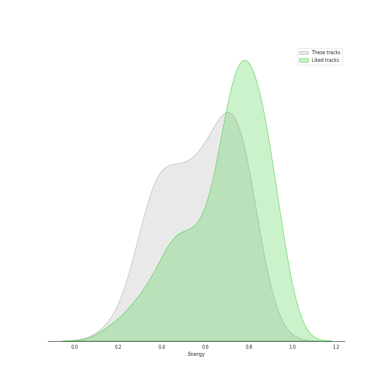
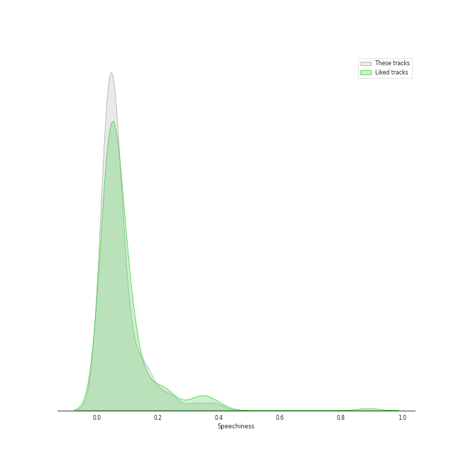
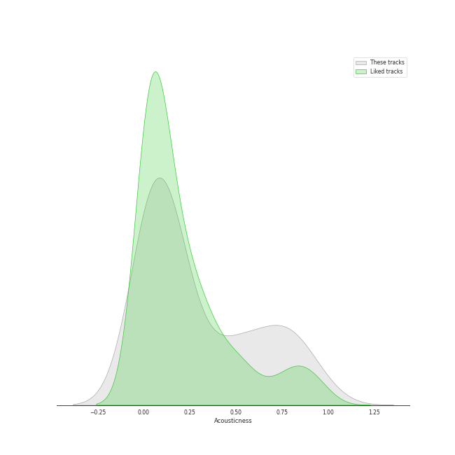
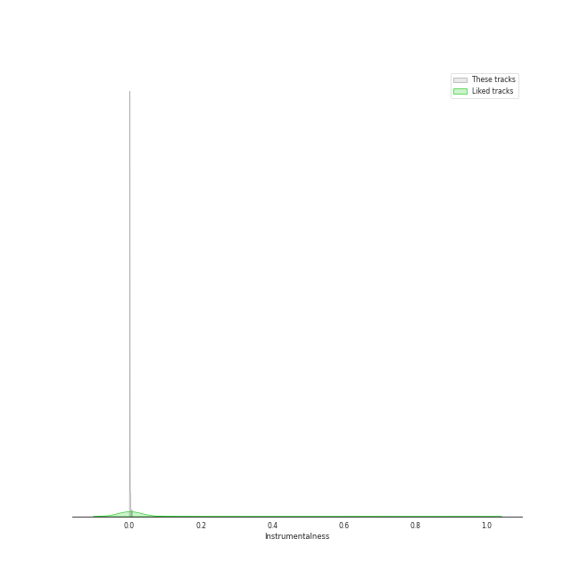
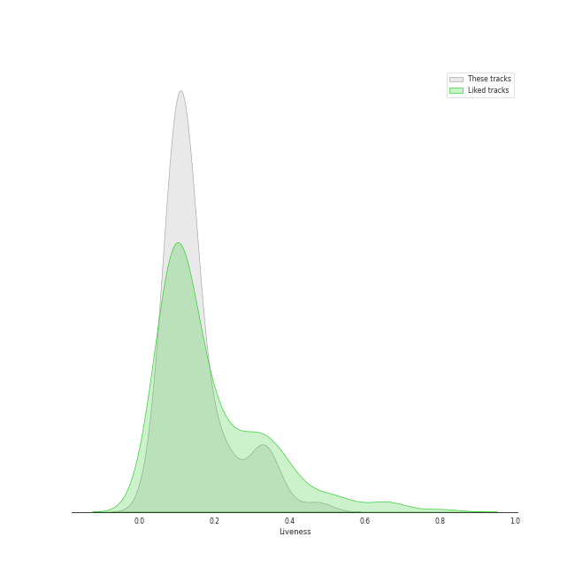
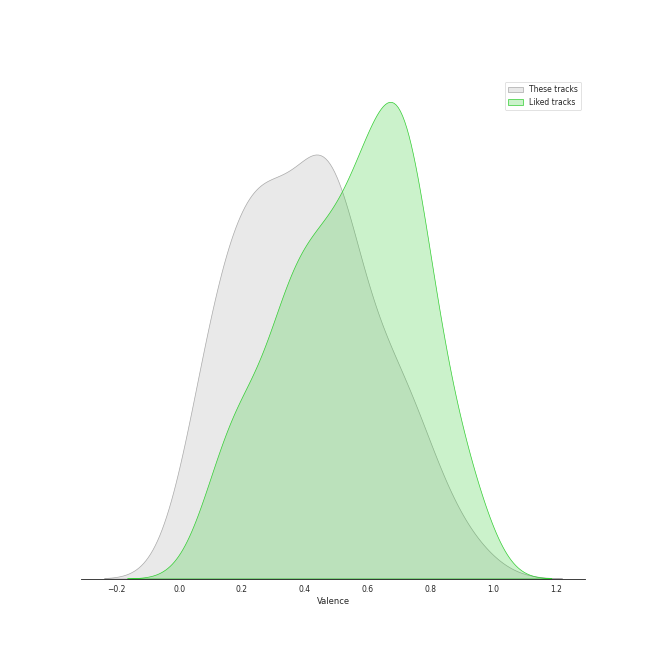
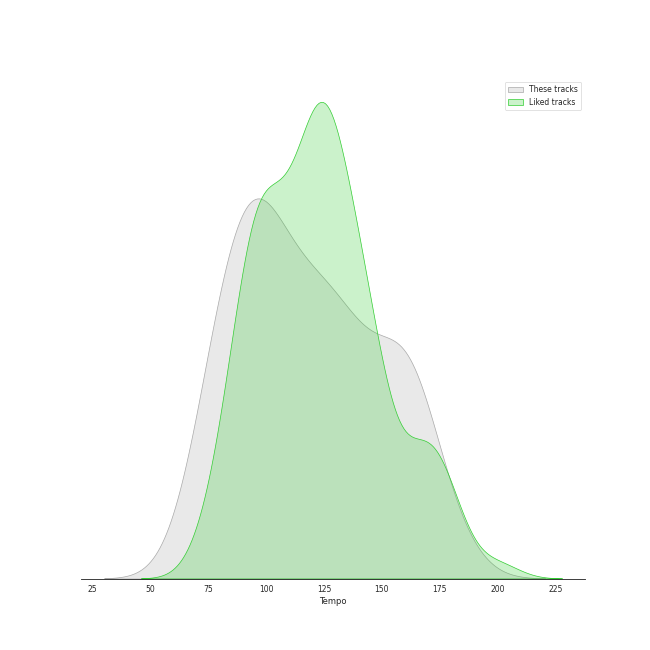

# Track Features for Taylor Swift

## Danceability

| ​ | 10 most Danceable tracks | ​​ | 10 least Danceable tracks |
|:---|:---|:---|:---|
|  | I Think He Knows (0.897) |  | exile (feat. Bon Iver) (0.298) |
|  | Cornelia Street (0.824) |  | tolerate it (0.316) |
|  | Paper Rings (0.811) |  | Sweet Nothing (0.337) |
|  | Clean (0.81) |  | epiphany (0.354) |
|  | Gorgeous (0.8) |  | Lover (0.359) |
|  | Vigilante Shit (0.798) |  | willow (0.392) |
|  | Welcome To New York (0.793) |  | Back To December (0.529) |
|  | the 1 (0.777) |  | Begin Again (0.53) |
|  | Look What You Made Me Do (0.766) |  | august (0.532) |
|  | Santa Baby (0.759) |  | no body, no crime (feat. HAIM) (0.546) |

## Energy

| ​ | 10 most Energetic tracks | ​​ | 10 least Energetic tracks |
|:---|:---|:---|:---|
|  | Red (0.896) |  | Sweet Nothing (0.156) |
|  | Out Of The Woods (0.842) |  | epiphany (0.267) |
|  | ME! (feat. Brendon Urie of Panic! At The Disco) (0.83) |  | peace (0.272) |
|  | Forever & Always (0.821) |  | Vigilante Shit (0.277) |
|  | Forever & Always (Taylor’s Version) (0.821) |  | illicit affairs (0.31) |
|  | This Is Why We Can't Have Nice Things (0.789) |  | Snow On The Beach (feat. Lana Del Rey) (0.319) |
|  | Style (0.786) |  | False God (0.32) |
|  | Shake It Off (0.785) |  | the 1 (0.357) |
|  | You Belong With Me (0.783) |  | tolerate it (0.361) |
|  | Last Christmas (0.77) |  | Midnight Rain (0.363) |

## Speechiness

| ​ | 10 most Speechy tracks | ​​ | 10 least Speechy tracks |
|:---|:---|:---|:---|
|  | Vigilante Shit (0.39) |  | All Too Well (0.0243) |
|  | False God (0.239) |  | Begin Again (0.0263) |
|  | Dancing With Our Hands Tied (0.196) |  | no body, no crime (feat. HAIM) (0.0264) |
|  | willow (0.17) |  | Santa Baby (0.0271) |
|  | Question...? (0.167) |  | epiphany (0.0281) |
|  | Shake It Off (0.165) |  | exile (feat. Bon Iver) (0.0287) |
|  | I Did Something Bad (0.159) |  | Back To December (0.0303) |
|  | Cruel Summer (0.157) |  | Love Story (0.031) |
|  | ...Ready For It? (0.136) |  | Welcome To New York (0.0324) |
|  | Gorgeous (0.135) |  | august (0.0331) |

## Acousticness

| ​ | 10 most Acoustic tracks | ​​ | 10 least Acoustic tracks |
|:---|:---|:---|:---|
|  | Sweet Nothing (0.964) |  | Out Of The Woods (0.00103) |
|  | peace (0.918) |  | 22 (0.00215) |
|  | illicit affairs (0.881) |  | Style (0.00253) |
|  | tolerate it (0.878) |  | I Knew You Were Trouble. (0.00454) |
|  | invisible string (0.838) |  | I Think He Knows (0.00889) |
|  | willow (0.833) |  | We Are Never Ever Getting Back Together (0.00957) |
|  | Cornelia Street (0.781) |  | Paper Rings (0.0129) |
|  | exile (feat. Bon Iver) (0.778) |  | This Is Why We Can't Have Nice Things (0.0156) |
|  | the 1 (0.757) |  | Forever & Always (Taylor’s Version) (0.0231) |
|  | False God (0.736) |  | London Boy (0.0246) |

## Instrumentalness

| ​ | 10 most Instrumental tracks | ​​ | 10 least Instrumental tracks |
|:---|:---|:---|:---|
|  | Wildest Dreams (0.00593) |  | Clean (0.0) |
|  | the last great american dynasty (0.0023) |  | This Is Why We Can't Have Nice Things (0.0) |
|  | Gasoline (feat. Taylor Swift) (0.0022) |  | Question...? (0.0) |
|  | willow (0.00179) |  | Forever & Always (Taylor’s Version) (0.0) |
|  | Style (0.0016) |  | Love Story (0.0) |
|  | 22 (0.0013) |  | Last Christmas (0.0) |
|  | Snow On The Beach (feat. Lana Del Rey) (0.000993) |  | illicit affairs (0.0) |
|  | Lavender Haze (0.000573) |  | ME! (feat. Brendon Urie of Panic! At The Disco) (0.0) |
|  | epiphany (0.000402) |  | Death By A Thousand Cuts (0.0) |
|  | Delicate (0.000357) |  | ...Ready For It? (0.0) |

## Liveness

| ​ | 10 most Live tracks | ​​ | 10 least Live tracks |
|:---|:---|:---|:---|
|  | Karma (0.483) |  | I Knew You Were Trouble. (0.0398) |
|  | This Is Why We Can't Have Nice Things (0.382) |  | Don’t Blame Me (0.0607) |
|  | Call It What You Want (0.34) |  | I Can See You (Taylor’s Version) (From The Vault) (0.0608) |
|  | Out Of The Woods (0.337) |  | I Did Something Bad (0.0696) |
|  | Back To December (0.334) |  | I Think He Knows (0.0715) |
|  | I Don’t Wanna Live Forever (Fifty Shades Darker) - From "Fifty Shades Darker (Original Motion Picture Soundtrack)" (0.325) |  | Paper Rings (0.0742) |
|  | Death By A Thousand Cuts (0.319) |  | 22 (0.0752) |
|  | Welcome To New York (0.304) |  | tolerate it (0.0797) |
|  | Question...? (0.296) |  | Love Story (0.0822) |
|  | cardigan (0.25) |  | epiphany (0.0858) |

## Valence

| ​ | 10 most Happy tracks | ​​ | 10 least Happy tracks |
|:---|:---|:---|:---|
|  | Shake It Off (0.943) |  | Maroon (0.0374) |
|  | Paper Rings (0.865) |  | Delicate (0.0499) |
|  | I Can See You (Taylor’s Version) (From The Vault) (0.819) |  | Dress (0.0851) |
|  | Mean (0.789) |  | I Don’t Wanna Live Forever (Fifty Shades Darker) - From "Fifty Shades Darker (Original Motion Picture Soundtrack)" (0.0862) |
|  | We Are Never Ever Getting Back Together (0.75) |  | Karma (0.0969) |
|  | Santa Baby (0.75) |  | Lavender Haze (0.0976) |
|  | ME! (feat. Brendon Urie of Panic! At The Disco) (0.728) |  | Question...? (0.106) |
|  | the last great american dynasty (0.706) |  | epiphany (0.113) |
|  | Last Christmas (0.685) |  | exile (feat. Bon Iver) (0.152) |
|  | I Knew You Were Trouble. (0.679) |  | Vigilante Shit (0.163) |

## Tempo

| ​ | 10 most Fast tracks | ​​ | 10 least Fast tracks |
|:---|:---|:---|:---|
|  | ME! (feat. Brendon Urie of Panic! At The Disco) (182.162) |  | Lover (68.534) |
|  | Sweet Nothing (176.655) |  | tolerate it (74.952) |
|  | Cruel Summer (169.994) |  | exile (feat. Bon Iver) (75.602) |
|  | Bejeweled (163.999) |  | I Knew You Were Trouble. (77.019) |
|  | Mean (163.974) |  | no body, no crime (feat. HAIM) (79.015) |
|  | This Is Why We Can't Have Nice Things (163.96) |  | Begin Again (79.025) |
|  | Call It What You Want (163.954) |  | Vigilante Shit (79.846) |
|  | Dancing With Our Hands Tied (160.024) |  | False God (79.97) |
|  | Shake It Off (160.015) |  | willow (81.112) |
|  | ...Ready For It? (160.015) |  | I Did Something Bad (82.989) |
