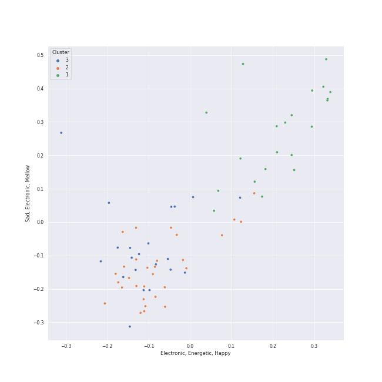

# Clusters in Taylor Swift

## Cluster #1

20 tracks

| Art | Track | Album | Artists | Label | Rank | 💚 | 🔗 |
|:---|:---|:---|:---|:---|---:|:---|:---|
|  | illicit affairs | folklore | [Taylor Swift](../../overview.md) | [Taylor Swift](../../../../labels/taylor_swift) | 841 | | [🔗](https://open.spotify.com/track/2NmsngXHeC1GQ9wWrzhOMf) |
|  | invisible string | folklore | [Taylor Swift](../../overview.md) | [Taylor Swift](../../../../labels/taylor_swift) | 841 | 💚 | [🔗](https://open.spotify.com/track/6VsvKPJ4xjVNKpI8VVZ3SV) |
|  | peace | folklore | [Taylor Swift](../../overview.md) | [Taylor Swift](../../../../labels/taylor_swift) | 841 | | [🔗](https://open.spotify.com/track/7MbT4I8qGntX4fMdqMQgke) |
|  | willow | evermore | [Taylor Swift](../../overview.md) | [Taylor Swift](../../../../labels/taylor_swift) | 841 | 💚 | [🔗](https://open.spotify.com/track/0lx2cLdOt3piJbcaXIV74f) |
|  | Snow On The Beach (feat. Lana Del Rey) | Midnights | [Taylor Swift](../../overview.md), [Lana Del Rey](../../../lana_del_rey/overview.md) | [Taylor Swift](../../../../labels/taylor_swift) | 841 | 💚 | [🔗](https://open.spotify.com/track/1wtOxkiel43cVs0Yux5Q4h) |
|  | Midnight Rain | Midnights | [Taylor Swift](../../overview.md) | [Taylor Swift](../../../../labels/taylor_swift) | 841 | 💚 | [🔗](https://open.spotify.com/track/3rWDp9tBPQR9z6U5YyRSK4) |
|  | False God | Lover | [Taylor Swift](../../overview.md) | [Taylor Swift](../../../../labels/taylor_swift) | 841 | | [🔗](https://open.spotify.com/track/5hQSXkFgbxjZo9uCwd11so) |
|  | Down Bad | THE TORTURED POETS DEPARTMENT: THE ANTHOLOGY | [Taylor Swift](../../overview.md) | [Taylor Swift](../../../../labels/taylor_swift) | 841 | | [🔗](https://open.spotify.com/track/1kbEbBdEgQdQeLXCJh28pJ) |
|  | Guilty as Sin? | THE TORTURED POETS DEPARTMENT: THE ANTHOLOGY | [Taylor Swift](../../overview.md) | [Taylor Swift](../../../../labels/taylor_swift) | 841 | | [🔗](https://open.spotify.com/track/799KrpEbhZp0MHeiA8YK9P) |
|  | So Long, London | THE TORTURED POETS DEPARTMENT: THE ANTHOLOGY | [Taylor Swift](../../overview.md) | [Taylor Swift](../../../../labels/taylor_swift) | 841 | 💚 | [🔗](https://open.spotify.com/track/7wAkQFShJ27V8362MqevQr) |
## Cluster #2

30 tracks

| Art | Track | Album | Artists | Label | Rank | 💚 | 🔗 |
|:---|:---|:---|:---|:---|---:|:---|:---|
|  | Blank Space | 1989 | [Taylor Swift](../../overview.md) | [Big Machine Records, LLC](../../../../labels/big_machine_records) | 841 | 💚 | [🔗](https://open.spotify.com/track/1p80LdxRV74UKvL8gnD7ky) |
|  | I Know Places | 1989 | [Taylor Swift](../../overview.md) | [Big Machine Records, LLC](../../../../labels/big_machine_records) | 841 | 💚 | [🔗](https://open.spotify.com/track/3jBMHD19RZdAqG9iFQh7xc) |
|  | Look What You Made Me Do | reputation | [Taylor Swift](../../overview.md) | [Big Machine Records, LLC](../../../../labels/big_machine_records) | 841 | 💚 | [🔗](https://open.spotify.com/track/1P17dC1amhFzptugyAO7Il) |
|  | Red | Red | [Taylor Swift](../../overview.md) | [Big Machine Records, LLC](../../../../labels/big_machine_records) | 841 | 💚 | [🔗](https://open.spotify.com/track/0cITLOYn1Sv4q27zZPqlNK) |
|  | 22 | Red | [Taylor Swift](../../overview.md) | [Big Machine Records, LLC](../../../../labels/big_machine_records) | 841 | | [🔗](https://open.spotify.com/track/2ULNeSomDxVNmdDy8VxEBU) |
|  | Anti-Hero | Midnights | [Taylor Swift](../../overview.md) | [Taylor Swift](../../../../labels/taylor_swift) | 841 | 💚 | [🔗](https://open.spotify.com/track/0V3wPSX9ygBnCm8psDIegu) |
|  | Cruel Summer | Lover | [Taylor Swift](../../overview.md) | [Taylor Swift](../../../../labels/taylor_swift) | 841 | 💚 | [🔗](https://open.spotify.com/track/1BxfuPKGuaTgP7aM0Bbdwr) |
|  | London Boy | Lover | [Taylor Swift](../../overview.md) | [Taylor Swift](../../../../labels/taylor_swift) | 841 | 💚 | [🔗](https://open.spotify.com/track/1LLXZFeAHK9R4xUramtUKw) |
|  | Forever & Always (Taylor’s Version) | Fearless (Taylor's Version) | [Taylor Swift](../../overview.md) | [Taylor Swift](../../../../labels/taylor_swift) | 841 | | [🔗](https://open.spotify.com/track/1msEuwSBneBKpVCZQcFTsU) |
|  | Forever & Always | Fearless | [Taylor Swift](../../overview.md) | [Big Machine Records, LLC](../../../../labels/big_machine_records) | 841 | | [🔗](https://open.spotify.com/track/47HtKpfzpAt8rQjjXWotFj) |
## Cluster #3

21 tracks

| Art | Track | Album | Artists | Label | Rank | 💚 | 🔗 |
|:---|:---|:---|:---|:---|---:|:---|:---|
|  | Clean | 1989 | [Taylor Swift](../../overview.md) | [Big Machine Records, LLC](../../../../labels/big_machine_records) | 841 | 💚 | [🔗](https://open.spotify.com/track/06WgOCf0LV2h4keYXDRnuh) |
|  | Call It What You Want | reputation | [Taylor Swift](../../overview.md) | [Big Machine Records, LLC](../../../../labels/big_machine_records) | 841 | 💚 | [🔗](https://open.spotify.com/track/1GwMQaZz6Au3QLDbjbMdme) |
|  | Don’t Blame Me | reputation | [Taylor Swift](../../overview.md) | [Big Machine Records, LLC](../../../../labels/big_machine_records) | 841 | 💚 | [🔗](https://open.spotify.com/track/1R0a2iXumgCiFb7HEZ7gUE) |
|  | Dress | reputation | [Taylor Swift](../../overview.md) | [Big Machine Records, LLC](../../../../labels/big_machine_records) | 841 | 💚 | [🔗](https://open.spotify.com/track/6oVxXO5oQ4pTpO8RSnkzvv) |
|  | Dancing With Our Hands Tied | reputation | [Taylor Swift](../../overview.md) | [Big Machine Records, LLC](../../../../labels/big_machine_records) | 841 | 💚 | [🔗](https://open.spotify.com/track/7I7JbDv63ZJJsSi24DyJrz) |
|  | Lavender Haze | Midnights | [Taylor Swift](../../overview.md) | [Taylor Swift](../../../../labels/taylor_swift) | 841 | 💚 | [🔗](https://open.spotify.com/track/5jQI2r1RdgtuT8S3iG8zFC) |
|  | I Can Do It With a Broken Heart | THE TORTURED POETS DEPARTMENT: THE ANTHOLOGY | [Taylor Swift](../../overview.md) | [Taylor Swift](../../../../labels/taylor_swift) | 841 | 💚 | [🔗](https://open.spotify.com/track/2fPvQfGQEZOKtJ9qXeL4x8) |
|  | The Tortured Poets Department | THE TORTURED POETS DEPARTMENT: THE ANTHOLOGY | [Taylor Swift](../../overview.md) | [Taylor Swift](../../../../labels/taylor_swift) | 841 | | [🔗](https://open.spotify.com/track/4PdLaGZubp4lghChqp8erB) |
|  | Love Story | Fearless | [Taylor Swift](../../overview.md) | [Big Machine Records, LLC](../../../../labels/big_machine_records) | 841 | | [🔗](https://open.spotify.com/track/1vrd6UOGamcKNGnSHJQlSt) |
|  | I Don’t Wanna Live Forever (Fifty Shades Darker) - From "Fifty Shades Darker (Original Motion Picture Soundtrack)" | I Don’t Wanna Live Forever (Fifty Shades Darker) | ZAYN, [Taylor Swift](../../overview.md) | Universal Music Group | 841 | | [🔗](https://open.spotify.com/track/3NdDpSvN911VPGivFlV5d0) |