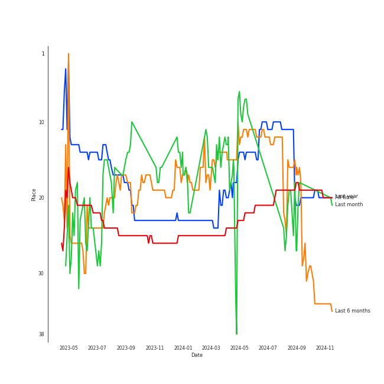

# Taylor Swift

[See Track Features](audio_features.md)

[See Clusters](clusters/overview.md)

## Artist Rank
Taylor Swift is currently:
- The #22 artist of the last month
- The #17 artist of the last 6 months
- The #23 artist of all time

## Top Tracks

- Santa Baby is:
    - the #20 track of the last month
## Featured on Playlists
| Art | Tracks | Playlist |
|:---|---:|:---|
|  | 61 | [Singer-Songwriter](../../playlists/singer-songwriter/overview.md) |
|  | 51 | [Pop](../../playlists/pop/overview.md) |
|  | 8 | [Chill](../../playlists/chill/overview.md) |
|  | 6 | [Summer](../../playlists/summer/overview.md) |
|  | 3 | [Workout](../../playlists/workout/overview.md) |
|  | 3 | [Christmas](../../playlists/christmas/overview.md) |
|  | 3 | [Tarps](../../playlists/tarps/overview.md) |
|  | 1 | [K-Pop-Adjacent](../../playlists/k-pop-adjacent/overview.md) |
|  | 1 | [Karaoke](../../playlists/karaoke/overview.md) |

## Top Albums

| Art | Tracks | 💚 | Album | Release Date | 🔗 |
|:---|---:|---:|:---|:---|:---|
|  | 10 | 9 | reputation | 2017-11-10 | [🔗](https://open.spotify.com/album/6DEjYFkNZh67HP7R9PSZvv) |
|  | 10 | 6 | folklore | 2020-07-24 | [🔗](https://open.spotify.com/album/2fenSS68JI1h4Fo296JfGr) |
|  | 10 | 5 | Midnights | 2022-10-21 | [🔗](https://open.spotify.com/album/151w1FgRZfnKZA9FEcg9Z3) |
|  | 9 | 6 | Lover | 2019-08-23 | [🔗](https://open.spotify.com/album/1NAmidJlEaVgA3MpcPFYGq) |
|  | 8 | 7 | 1989 | 2014-10-27 | [🔗](https://open.spotify.com/album/2QJmrSgbdM35R67eoGQo4j) |
|  | 6 | 3 | Red | 2012-10-22 | [🔗](https://open.spotify.com/album/1EoDsNmgTLtmwe1BDAVxV5) |
|  | 3 | 2 | evermore | 2020-12-11 | [🔗](https://open.spotify.com/album/2Xoteh7uEpea4TohMxjtaq) |
|  | 3 | 0 | Fearless | 2008-11-11 | [🔗](https://open.spotify.com/album/2dqn5yOQWdyGwOpOIi9O4x) |
|  | 2 | 0 | The Taylor Swift Holiday Collection | 2008-12-02 | [🔗](https://open.spotify.com/album/7vzYp7FrKnTRoktBYsx9SF) |
|  | 2 | 0 | Speak Now | 2010-10-25 | [🔗](https://open.spotify.com/album/5MfAxS5zz8MlfROjGQVXhy) |

See all albums

| Art | Tracks | 💚 | Album | Release Date | 🔗 |
|:---|---:|---:|:---|:---|:---|
|  | 1 | 1 | Speak Now (Taylor's Version) | 2023-07-07 | [🔗](https://open.spotify.com/album/5AEDGbliTTfjOB8TSm1sxt) |
|  | 1 | 0 | I Don’t Wanna Live Forever (Fifty Shades Darker) | 2016-12-09 | [🔗](https://open.spotify.com/album/5MxXY7DbFMUiHFTPUabgJJ) |
|  | 1 | 0 | Fearless (Taylor's Version) | 2021-04-09 | [🔗](https://open.spotify.com/album/4hDok0OAJd57SGIT8xuWJH) |

## Top Record Labels

| Tracks | 💚 | Label |
|---:|---:|:---|
| 34 | 20 | [Taylor Swift](../../labels/taylor_swift/overview.md) |
| 31 | 19 | [Big Machine Records](../../labels/big_machine_records/overview.md) |
| 1 | 0 | Universal Music Group |

## Genres

- [pop](../../genres/pop/overview.md)

## Credits

### Credits by Type

| Credit Type | Tracks |
|:---|---:|
| Instrument | 3 |
| Lyricist | 7 |
| Producer | 21 |
| Songwriter | 39 |
| Vocal | 30 |

### Production Credits

| Art | Track | Credit Types |
|:---|:---|:---|
|  | Begin Again | Lyricist, Producer, Songwriter |
|  | Red | Lyricist, Producer, Songwriter |
|  | All Too Well | Producer, Songwriter |
|  | Clean | Producer, Songwriter |
|  | Blank Space | Songwriter |
|  | I Know Places | Producer, Songwriter |
|  | Style | Songwriter |
|  | Wildest Dreams | Songwriter |
|  | Out Of The Woods | Lyricist, Producer |
|  | Shake It Off | Songwriter |

View all

| Art | Track | Credit Types |
|:---|:---|:---|
|  | Call It What You Want | Producer, Songwriter |
|  | Look What You Made Me Do | Producer, Songwriter |
|  | Don’t Blame Me | Songwriter |
|  | Gorgeous | Songwriter |
|  | ...Ready For It? | Lyricist, Songwriter |
|  | I Did Something Bad | Songwriter |
|  | Delicate | Songwriter |
|  | Dress | Producer, Songwriter |
|  | Dancing With Our Hands Tied | Songwriter |
|  | Cornelia Street | Lyricist, Producer, Songwriter |
|  | Cruel Summer | Producer, Songwriter |
|  | London Boy | Producer, Songwriter |
|  | Lover | Lyricist, Producer, Songwriter |
|  | Death By A Thousand Cuts | Producer, Songwriter |
|  | Paper Rings | Producer, Songwriter |
|  | the 1 | Songwriter |
|  | the last great american dynasty | Songwriter |
|  | august | Producer, Songwriter |
|  | cardigan | Songwriter |
|  | exile (feat. Bon Iver) | Songwriter |
|  | invisible string | Songwriter |
|  | tolerate it | Songwriter |
|  | willow | Songwriter |
|  | deja vu | Songwriter |
|  | Anti-Hero | Producer, Songwriter |
|  | Snow On The Beach (feat. Lana Del Rey) | Producer, Songwriter |
|  | Midnight Rain | Producer, Songwriter |
|  | Lavender Haze | Producer, Songwriter |
|  | Karma | Producer, Songwriter |
|  | I Can See You (Taylor’s Version) (From The Vault) | Lyricist, Songwriter |

## Top Producers

| Art | Producer | Tracks | Credit Types |
|:---|:---|---:|:---|
|  | [Taylor Swift](overview.md) | 39 | Songwriter, Lyricist, Producer |
| | Serban Ghenea | 27 | Producer |
| | Laura Sisk | 20 | Producer |
| | Jack Antonoff | 16 | Producer, Songwriter |
| | Max Martin | 11 | Producer, Songwriter, Lyricist |
| | Sam Holland | 10 | Producer |
| | Shellback | 10 | Producer, Songwriter, Lyricist |
| | John Hanes | 9 | Producer |
| | Michael Ilbert | 9 | Producer |
| | Jonathan Low | 7 | Producer |

View all

| Art | Producer | Tracks | Credit Types |
|:---|:---|---:|:---|
| | Aaron Dessner | 7 | Producer, Songwriter |
| | Bryce Dessner | 6 | Arranger |
| | Kyle Resnick | 4 | Producer |
| | Justin Niebank | 3 | Producer |
| | Sounwave | 3 | Producer, Songwriter |
| | Nathan Chapman | 3 | Producer |
| | James McAlister | 3 | Producer |
| | Dann Huff | 2 | Producer |
| | Steve Marcantonio | 2 | Producer |
| | Rob Moose | 2 | Arranger, Producer |
| | David Huff | 2 | Producer |
| | Ali Payami | 2 | Lyricist, Producer, Songwriter |
| | Jonathan Gautier | 2 | Producer |
| | Jahaan Sweet | 2 | Producer, Songwriter |
| | Thomas Bartlett | 2 | Producer |
| | Zoë Kravitz (Kravitz, Zoë) | 2 | Songwriter |
| | Clarice Jensen | 2 | Producer |
| | Jason Treuting | 1 | Producer |
| | Ryan Tedder | 1 | Producer, Songwriter |
|  | [Lana Del Rey](../lana_del_rey/overview.md) | 1 | Songwriter |
| | Fred Fairbrass | 1 | Songwriter |
| | Brian David Willis | 1 | Producer |
| | Alex Sopp | 1 | Producer |
| | Mike Williams | 1 | Producer |
| | Justin Vernon | 1 | Producer, Songwriter |
| | Oscar Holter | 1 | Producer, Songwriter |
| | Bryan Devendorf | 1 | Producer |
| | Smith Carlson | 1 | Producer |
| | J. T. Bates | 1 | Producer |
|  | [Imogen Heap](../imogen_heap/overview.md) | 1 | Producer, Songwriter |
| | Bella Blasko | 1 | Producer |
| | Peter Carlsson | 1 | Producer |
| | Robert Manzoli | 1 | Songwriter |
| | St. Vincent | 1 | Songwriter |
| | Liz Rose | 1 | Songwriter |
| | Sam Dew | 1 | Songwriter |
| | Evan Smith | 1 | Producer |
| | Ken Lewis | 1 | Producer |
| | Noel Zancanella | 1 | Producer |
| | Keanu Beats | 1 | Producer, Songwriter |
| | Dave Gross | 1 | Producer |
| | Cautious Clay | 1 | Songwriter |
| | Richard Fairbrass | 1 | Songwriter |
| | William Bowery | 1 | Songwriter |
| | CJ Camerieri | 1 | Producer |
| | Mattias Bylund | 1 | Arranger, Producer |
| | Braxton Cook | 1 | Producer |
| | Dave Nelson | 1 | Producer |

## Tracks

| Art | Track | Album | Artists | Label | 💚 | 🔗 |
|:---|:---|:---|:---|:---|:---|:---|
|  | Forever & Always | Fearless | [Taylor Swift](overview.md) | [Big Machine Records, LLC](../../labels/big_machine_records) | | [🔗](https://open.spotify.com/track/47HtKpfzpAt8rQjjXWotFj) |
|  | Love Story | Fearless | [Taylor Swift](overview.md) | [Big Machine Records, LLC](../../labels/big_machine_records) | | [🔗](https://open.spotify.com/track/1vrd6UOGamcKNGnSHJQlSt) |
|  | You Belong With Me | Fearless | [Taylor Swift](overview.md) | [Big Machine Records, LLC](../../labels/big_machine_records) | | [🔗](https://open.spotify.com/track/3GCL1PydwsLodcpv0Ll1ch) |
|  | Last Christmas | The Taylor Swift Holiday Collection | [Taylor Swift](overview.md) | [Big Machine Records, LLC](../../labels/big_machine_records) | | [🔗](https://open.spotify.com/track/2IprIjGNRlj3TfqUWCAo0C) |
|  | Santa Baby | The Taylor Swift Holiday Collection | [Taylor Swift](overview.md) | [Big Machine Records, LLC](../../labels/big_machine_records) | | [🔗](https://open.spotify.com/track/71IScwIe7bcIlpnlkbKVQw) |
|  | Back To December | Speak Now | [Taylor Swift](overview.md) | [Big Machine Records, LLC](../../labels/big_machine_records) | | [🔗](https://open.spotify.com/track/3DrjZArsPsoqbLzUZZV1Id) |
|  | Mean | Speak Now | [Taylor Swift](overview.md) | [Big Machine Records, LLC](../../labels/big_machine_records) | | [🔗](https://open.spotify.com/track/5yEPktRqvIhko5QFF3aBhQ) |
|  | 22 | Red | [Taylor Swift](overview.md) | [Big Machine Records, LLC](../../labels/big_machine_records) | | [🔗](https://open.spotify.com/track/2ULNeSomDxVNmdDy8VxEBU) |
|  | All Too Well | Red | [Taylor Swift](overview.md) | [Big Machine Records, LLC](../../labels/big_machine_records) | 💚 | [🔗](https://open.spotify.com/track/4XMP3zVxrnr58T0tjIHvpR) |
|  | Begin Again | Red | [Taylor Swift](overview.md) | [Big Machine Records, LLC](../../labels/big_machine_records) | 💚 | [🔗](https://open.spotify.com/track/0L4YCNRfXAoTvdpWeH2RGj) |

See all tracks

| Art | Track | Album | Artists | Label | 💚 | 🔗 |
|:---|:---|:---|:---|:---|:---|:---|
|  | I Knew You Were Trouble. | Red | [Taylor Swift](overview.md) | [Big Machine Records, LLC](../../labels/big_machine_records) | | [🔗](https://open.spotify.com/track/72jCZdH0Lhg93z6Z4hBjgj) |
|  | Red | Red | [Taylor Swift](overview.md) | [Big Machine Records, LLC](../../labels/big_machine_records) | 💚 | [🔗](https://open.spotify.com/track/0cITLOYn1Sv4q27zZPqlNK) |
|  | We Are Never Ever Getting Back Together | Red | [Taylor Swift](overview.md) | [Big Machine Records, LLC](../../labels/big_machine_records) | | [🔗](https://open.spotify.com/track/7AEAGTc8cReDqcbPoY9gwo) |
|  | Blank Space | 1989 | [Taylor Swift](overview.md) | [Big Machine Records, LLC](../../labels/big_machine_records) | 💚 | [🔗](https://open.spotify.com/track/1p80LdxRV74UKvL8gnD7ky) |
|  | Clean | 1989 | [Taylor Swift](overview.md) | [Big Machine Records, LLC](../../labels/big_machine_records) | 💚 | [🔗](https://open.spotify.com/track/06WgOCf0LV2h4keYXDRnuh) |
|  | I Know Places | 1989 | [Taylor Swift](overview.md) | [Big Machine Records, LLC](../../labels/big_machine_records) | 💚 | [🔗](https://open.spotify.com/track/3jBMHD19RZdAqG9iFQh7xc) |
|  | Out Of The Woods | 1989 | [Taylor Swift](overview.md) | [Big Machine Records, LLC](../../labels/big_machine_records) | 💚 | [🔗](https://open.spotify.com/track/5OndtwLGA9O6XHFcGm2H7r) |
|  | Shake It Off | 1989 | [Taylor Swift](overview.md) | [Big Machine Records, LLC](../../labels/big_machine_records) | 💚 | [🔗](https://open.spotify.com/track/5xTtaWoae3wi06K5WfVUUH) |
|  | Style | 1989 | [Taylor Swift](overview.md) | [Big Machine Records, LLC](../../labels/big_machine_records) | 💚 | [🔗](https://open.spotify.com/track/4lIxdJw6W3Fg4vUIYCB0S5) |
|  | Welcome To New York | 1989 | [Taylor Swift](overview.md) | [Big Machine Records, LLC](../../labels/big_machine_records) | | [🔗](https://open.spotify.com/track/6qnM0XXPZOINWA778uNqQ9) |
|  | Wildest Dreams | 1989 | [Taylor Swift](overview.md) | [Big Machine Records, LLC](../../labels/big_machine_records) | 💚 | [🔗](https://open.spotify.com/track/59HjlYCeBsxdI0fcm3zglw) |
|  | ...Ready For It? | reputation | [Taylor Swift](overview.md) | [Big Machine Records, LLC](../../labels/big_machine_records) | 💚 | [🔗](https://open.spotify.com/track/2yLa0QULdQr0qAIvVwN6B5) |
|  | Call It What You Want | reputation | [Taylor Swift](overview.md) | [Big Machine Records, LLC](../../labels/big_machine_records) | 💚 | [🔗](https://open.spotify.com/track/1GwMQaZz6Au3QLDbjbMdme) |
|  | Dancing With Our Hands Tied | reputation | [Taylor Swift](overview.md) | [Big Machine Records, LLC](../../labels/big_machine_records) | 💚 | [🔗](https://open.spotify.com/track/7I7JbDv63ZJJsSi24DyJrz) |
|  | Delicate | reputation | [Taylor Swift](overview.md) | [Big Machine Records, LLC](../../labels/big_machine_records) | 💚 | [🔗](https://open.spotify.com/track/6NFyWDv5CjfwuzoCkw47Xf) |
|  | Don’t Blame Me | reputation | [Taylor Swift](overview.md) | [Big Machine Records, LLC](../../labels/big_machine_records) | 💚 | [🔗](https://open.spotify.com/track/1R0a2iXumgCiFb7HEZ7gUE) |
|  | Dress | reputation | [Taylor Swift](overview.md) | [Big Machine Records, LLC](../../labels/big_machine_records) | 💚 | [🔗](https://open.spotify.com/track/6oVxXO5oQ4pTpO8RSnkzvv) |
|  | Gorgeous | reputation | [Taylor Swift](overview.md) | [Big Machine Records, LLC](../../labels/big_machine_records) | 💚 | [🔗](https://open.spotify.com/track/1ZY1PqizIl78geGM4xWlEA) |
|  | I Did Something Bad | reputation | [Taylor Swift](overview.md) | [Big Machine Records, LLC](../../labels/big_machine_records) | 💚 | [🔗](https://open.spotify.com/track/4svZDCRz4cJoneBpjpx8DJ) |
|  | Look What You Made Me Do | reputation | [Taylor Swift](overview.md) | [Big Machine Records, LLC](../../labels/big_machine_records) | 💚 | [🔗](https://open.spotify.com/track/1P17dC1amhFzptugyAO7Il) |
|  | This Is Why We Can't Have Nice Things | reputation | [Taylor Swift](overview.md) | [Big Machine Records, LLC](../../labels/big_machine_records) | | [🔗](https://open.spotify.com/track/07NxDD1iKCHbAldceD7QLP) |
|  | Cornelia Street | Lover | [Taylor Swift](overview.md) | [Taylor Swift](../../labels/taylor_swift) | 💚 | [🔗](https://open.spotify.com/track/12M5uqx0ZuwkpLp5rJim1a) |
|  | Cruel Summer | Lover | [Taylor Swift](overview.md) | [Taylor Swift](../../labels/taylor_swift) | 💚 | [🔗](https://open.spotify.com/track/1BxfuPKGuaTgP7aM0Bbdwr) |
|  | Death By A Thousand Cuts | Lover | [Taylor Swift](overview.md) | [Taylor Swift](../../labels/taylor_swift) | 💚 | [🔗](https://open.spotify.com/track/2dgFqt3w9xIQRjhPtwNk3D) |
|  | False God | Lover | [Taylor Swift](overview.md) | [Taylor Swift](../../labels/taylor_swift) | | [🔗](https://open.spotify.com/track/5hQSXkFgbxjZo9uCwd11so) |
|  | I Think He Knows | Lover | [Taylor Swift](overview.md) | [Taylor Swift](../../labels/taylor_swift) | | [🔗](https://open.spotify.com/track/2YWtcWi3a83pdEg3Gif4Pd) |
|  | London Boy | Lover | [Taylor Swift](overview.md) | [Taylor Swift](../../labels/taylor_swift) | 💚 | [🔗](https://open.spotify.com/track/1LLXZFeAHK9R4xUramtUKw) |
|  | Lover | Lover | [Taylor Swift](overview.md) | [Taylor Swift](../../labels/taylor_swift) | 💚 | [🔗](https://open.spotify.com/track/1dGr1c8CrMLDpV6mPbImSI) |
|  | ME! (feat. Brendon Urie of Panic! At The Disco) | Lover | [Taylor Swift](overview.md), Brendon Urie, Panic! At The Disco | [Taylor Swift](../../labels/taylor_swift) | | [🔗](https://open.spotify.com/track/2Rk4JlNc2TPmZe2af99d45) |
|  | Paper Rings | Lover | [Taylor Swift](overview.md) | [Taylor Swift](../../labels/taylor_swift) | 💚 | [🔗](https://open.spotify.com/track/4y5bvROuBDPr5fuwXbIBZR) |
|  | august | folklore | [Taylor Swift](overview.md) | [Taylor Swift](../../labels/taylor_swift) | 💚 | [🔗](https://open.spotify.com/track/3hUxzQpSfdDqwM3ZTFQY0K) |
|  | cardigan | folklore | [Taylor Swift](overview.md) | [Taylor Swift](../../labels/taylor_swift) | 💚 | [🔗](https://open.spotify.com/track/4R2kfaDFhslZEMJqAFNpdd) |
|  | epiphany | folklore | [Taylor Swift](overview.md) | [Taylor Swift](../../labels/taylor_swift) | | [🔗](https://open.spotify.com/track/08fa9LFcFBTcilB3iq2e2A) |
|  | exile (feat. Bon Iver) | folklore | [Taylor Swift](overview.md), Bon Iver | [Taylor Swift](../../labels/taylor_swift) | 💚 | [🔗](https://open.spotify.com/track/4pvb0WLRcMtbPGmtejJJ6y) |
|  | illicit affairs | folklore | [Taylor Swift](overview.md) | [Taylor Swift](../../labels/taylor_swift) | | [🔗](https://open.spotify.com/track/2NmsngXHeC1GQ9wWrzhOMf) |
|  | invisible string | folklore | [Taylor Swift](overview.md) | [Taylor Swift](../../labels/taylor_swift) | 💚 | [🔗](https://open.spotify.com/track/6VsvKPJ4xjVNKpI8VVZ3SV) |
|  | mad woman | folklore | [Taylor Swift](overview.md) | [Taylor Swift](../../labels/taylor_swift) | | [🔗](https://open.spotify.com/track/2QDyYdZyhlP2fp79KZX8Bi) |
|  | peace | folklore | [Taylor Swift](overview.md) | [Taylor Swift](../../labels/taylor_swift) | | [🔗](https://open.spotify.com/track/7MbT4I8qGntX4fMdqMQgke) |
|  | the 1 | folklore | [Taylor Swift](overview.md) | [Taylor Swift](../../labels/taylor_swift) | 💚 | [🔗](https://open.spotify.com/track/0Jlcvv8IykzHaSmj49uNW8) |
|  | the last great american dynasty | folklore | [Taylor Swift](overview.md) | [Taylor Swift](../../labels/taylor_swift) | 💚 | [🔗](https://open.spotify.com/track/2Eeur20xVqfUoM3Q7EFPFt) |
|  | no body, no crime (feat. HAIM) | evermore | [Taylor Swift](overview.md), HAIM | [Taylor Swift](../../labels/taylor_swift) | | [🔗](https://open.spotify.com/track/3RaT22zZsxVYxxKR7TAaYF) |
|  | tolerate it | evermore | [Taylor Swift](overview.md) | [Taylor Swift](../../labels/taylor_swift) | 💚 | [🔗](https://open.spotify.com/track/0PurA4JVJ8YQgSVopY8fn6) |
|  | willow | evermore | [Taylor Swift](overview.md) | [Taylor Swift](../../labels/taylor_swift) | 💚 | [🔗](https://open.spotify.com/track/0lx2cLdOt3piJbcaXIV74f) |
|  | Forever & Always (Taylor’s Version) | Fearless (Taylor's Version) | [Taylor Swift](overview.md) | [Taylor Swift](../../labels/taylor_swift) | | [🔗](https://open.spotify.com/track/1msEuwSBneBKpVCZQcFTsU) |
|  | Anti-Hero | Midnights | [Taylor Swift](overview.md) | [Taylor Swift](../../labels/taylor_swift) | 💚 | [🔗](https://open.spotify.com/track/0V3wPSX9ygBnCm8psDIegu) |
|  | Bejeweled | Midnights | [Taylor Swift](overview.md) | [Taylor Swift](../../labels/taylor_swift) | | [🔗](https://open.spotify.com/track/3qoftcUZaUOncvIYjFSPdE) |
|  | Karma | Midnights | [Taylor Swift](overview.md) | [Taylor Swift](../../labels/taylor_swift) | 💚 | [🔗](https://open.spotify.com/track/7KokYm8cMIXCsGVmUvKtqf) |
|  | Lavender Haze | Midnights | [Taylor Swift](overview.md) | [Taylor Swift](../../labels/taylor_swift) | 💚 | [🔗](https://open.spotify.com/track/5jQI2r1RdgtuT8S3iG8zFC) |
|  | Maroon | Midnights | [Taylor Swift](overview.md) | [Taylor Swift](../../labels/taylor_swift) | | [🔗](https://open.spotify.com/track/3eX0NZfLtGzoLUxPNvRfqm) |
|  | Midnight Rain | Midnights | [Taylor Swift](overview.md) | [Taylor Swift](../../labels/taylor_swift) | 💚 | [🔗](https://open.spotify.com/track/3rWDp9tBPQR9z6U5YyRSK4) |
|  | Question...? | Midnights | [Taylor Swift](overview.md) | [Taylor Swift](../../labels/taylor_swift) | | [🔗](https://open.spotify.com/track/0heeNYlwOGuUSe7TgUD27B) |
|  | Snow On The Beach (feat. Lana Del Rey) | Midnights | [Taylor Swift](overview.md), [Lana Del Rey](../lana_del_rey/overview.md) | [Taylor Swift](../../labels/taylor_swift) | 💚 | [🔗](https://open.spotify.com/track/1wtOxkiel43cVs0Yux5Q4h) |
|  | Sweet Nothing | Midnights | [Taylor Swift](overview.md) | [Taylor Swift](../../labels/taylor_swift) | | [🔗](https://open.spotify.com/track/0wavGRldH0AWyu2zvTz8zb) |
|  | Vigilante Shit | Midnights | [Taylor Swift](overview.md) | [Taylor Swift](../../labels/taylor_swift) | | [🔗](https://open.spotify.com/track/1xwAWUI6Dj0WGC3KiUPN0O) |
|  | I Can See You (Taylor’s Version) (From The Vault) | Speak Now (Taylor's Version) | [Taylor Swift](overview.md) | [Taylor Swift](../../labels/taylor_swift) | 💚 | [🔗](https://open.spotify.com/track/5kHMfzgLZP95O9NBy0ku4v) |
|  | I Don’t Wanna Live Forever (Fifty Shades Darker) - From "Fifty Shades Darker (Original Motion Picture Soundtrack)" | I Don’t Wanna Live Forever (Fifty Shades Darker) | ZAYN, [Taylor Swift](overview.md) | Universal Music Group | | [🔗](https://open.spotify.com/track/3NdDpSvN911VPGivFlV5d0) |

