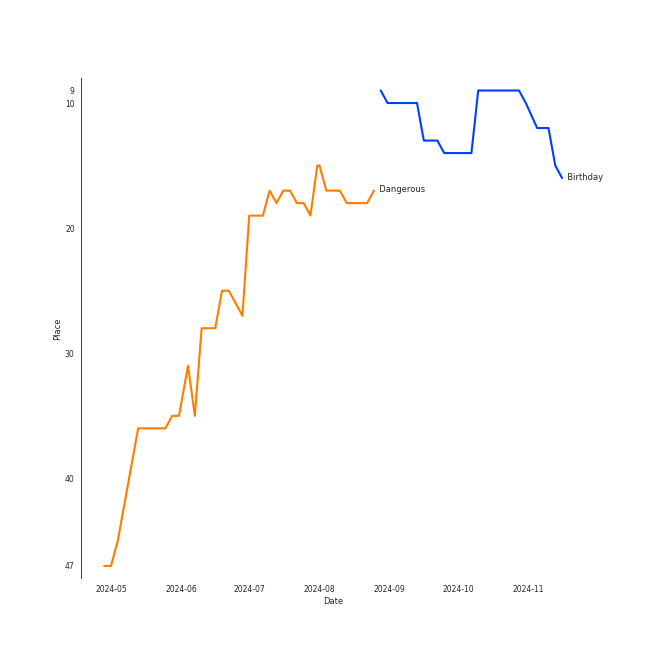
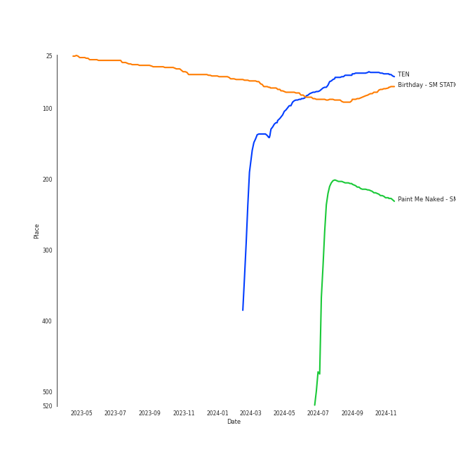
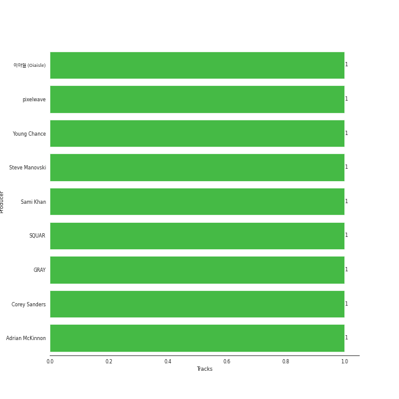

# TEN

## Relationships

TEN:
- is a member of NCT
- is a member of [NCT U](../nct_u/overview.md)
- is a member of SuperM
- is a member of WayV
- is a member of WayV-TEN&YANGYANG

## Artist Rank
TEN is currently:
- The #35 artist of the last 6 months
- The #37 artist of the last year
- The #41 artist of all time

## Top Tracks

### Top tracks of all time

Top tracks of the last year over time

Top tracks of the last 6 months over time

## Top Albums

| Art | Rank | Tracks | 💚 | Album | Release Date | 🔗 |
|:---|---:|---:|---:|:---|:---|:---|
|  | 52 | 4 | 3 | TEN - The 1st Mini Album | 2024-02-13 | [🔗](https://open.spotify.com/album/50Zo1vf3YCQtXLUZr2oBiQ) |
|  | 199 | 1 | 1 | Paint Me Naked - SM STATION | 2021-08-10 | [🔗](https://open.spotify.com/album/4oj5R0SVazc5Eq3WnIC0e6) |
|  | 90 | 1 | 1 | Birthday - SM STATION : NCT LAB | 2022-10-26 | [🔗](https://open.spotify.com/album/6tcPTRUC3gwmG1iyWyzRzr) |

## Featured on Playlists
| Art | Tracks | Playlist |
|:---|---:|:---|
|  | 6 | [K-Pop](../../playlists/k-pop/overview.md) |
|  | 4 | [K-Pop Favorites](../../playlists/k-pop_favorites/overview.md) |
|  | 2 | [Halloween](../../playlists/halloween/overview.md) |
|  | 1 | [Funk](../../playlists/funk/overview.md) |
|  | 1 | [Summer](../../playlists/summer/overview.md) |
|  | 1 | [Your Top Songs 2023](../../playlists/your_top_songs_2023/overview.md) |

## Top Record Labels

| Tracks | 💚 | Label |
|---:|---:|:---|
| 6 | 5 | [SM Entertainment](../../labels/sm_entertainment/overview.md) |

## Genres

- [k-pop](../../genres/k-pop/overview.md)

## Credits

### Credits by Type

| Credit Type | Tracks |
|:---|---:|
| Vocal | 2 |

## Top Producers

| Art | Producer | Tracks | Credit Types |
|:---|:---|---:|:---|
| | pixelwave | 1 | Arranger, Songwriter |
| | SQUAR | 1 | Arranger, Producer, Songwriter |
| | Steve Manovski | 1 | Arranger, Producer, Songwriter |
| | Young Chance | 1 | Lyricist, Songwriter |
| | GRAY | 1 | Lyricist, Songwriter |
| | 이아일 (Oiaisle) | 1 | Songwriter |
| | Adrian McKinnon | 1 | Lyricist |
| | Corey Sanders | 1 | Lyricist, Songwriter |
| | Sami Khan | 1 | Lyricist |

## Tracks

| Art | Track | Album | Artists | Label | Rank | 💚 | 🔗 |
|:---|:---|:---|:---|:---|---:|:---|:---|
|  | Dangerous | TEN - The 1st Mini Album | [TEN](overview.md) | [SM Entertainment](../../labels/sm_entertainment) | 55 | 💚 | [🔗](https://open.spotify.com/track/56vA4AoGec8ae9nmdprBBI) |
|  | Birthday | Birthday - SM STATION : NCT LAB | [TEN](overview.md) | [SM Entertainment](../../labels/sm_entertainment) | 108 | 💚 | [🔗](https://open.spotify.com/track/2cbllYULJNYhcDK37Uh8hR) |
|  | Nightwalker | TEN - The 1st Mini Album | [TEN](overview.md) | [SM Entertainment](../../labels/sm_entertainment) | 224 | 💚 | [🔗](https://open.spotify.com/track/4RiudH8RehvLLrk8uNgIdR) |
|  | Paint Me Naked | Paint Me Naked - SM STATION | [TEN](overview.md) | [SM Entertainment](../../labels/sm_entertainment) | 267 | 💚 | [🔗](https://open.spotify.com/track/4UaGQ2D4MBuRBWumZO52Ma) |
|  | Shadow | TEN - The 1st Mini Album | [TEN](overview.md) | [SM Entertainment](../../labels/sm_entertainment) | 330 | | [🔗](https://open.spotify.com/track/05bEOekC31J9F7tH8jEuJw) |
|  | Water | TEN - The 1st Mini Album | [TEN](overview.md) | [SM Entertainment](../../labels/sm_entertainment) | 740 | 💚 | [🔗](https://open.spotify.com/track/0fl3T6cekhgAxYu5xLWefX) |
