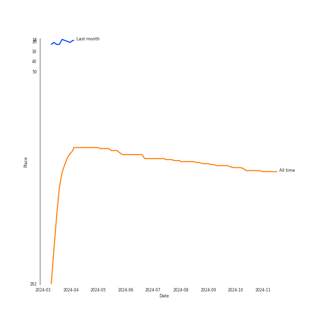
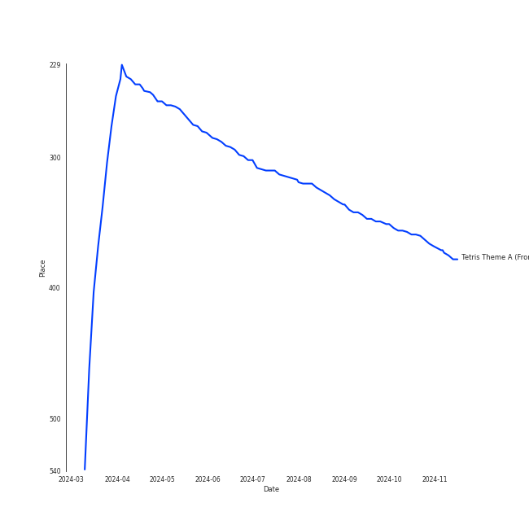
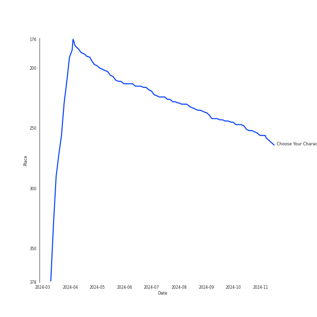

# The 8-Bit Big Band

## Artist Rank
- The #143 artist of all time

## Top Tracks

### Top tracks of all time

## Top Albums

| Art | Rank | Tracks | 💚 | Album | Release Date | 🔗 |
|:---|---:|---:|---:|:---|:---|:---|
|  | 226 | 5 | 5 | Choose Your Character! | 2019-06-24 | [🔗](https://open.spotify.com/album/2d3PcBi2ID1sLe8ZRTmxIi) |

## Featured on Playlists
| Art | Tracks | Playlist |
|:---|---:|:---|
|  | 5 | [Soundtracks](../../playlists/soundtracks/overview.md) |
|  | 5 | [Jazz](../../playlists/jazz/overview.md) |

## Top Record Labels

| Tracks | 💚 | Label |
|---:|---:|:---|
| 5 | 5 | The 8-Bit Big Band |

## Genres

- 8-bit

## Top Producers

| Art | Producer | Tracks | Credit Types |
|:---|:---|---:|:---|
| | Charlie Rosen | 5 | Arranger, Producer |
| | John Kilgore | 5 | Producer |
| | 田中宏和 (Tanaka, Hirokazu) | 1 | Arranger |
| | 戸高一生 (Totaka, Kazumi) | 1 | Songwriter |
| | 増田順一 (Masuda, Jun'ichi) | 1 | Songwriter |
| | 近藤浩治 (Kondo, Koji) | 1 | Songwriter |
| | Jonathan Coulton | 1 | Lyricist, Songwriter |

## Tracks

| Art | Track | Album | Artists | Label | Rank | 💚 | 🔗 |
|:---|:---|:---|:---|:---|---:|:---|:---|
|  | Tetris Theme A (From "Tetris") | Choose Your Character! | [The 8-Bit Big Band](overview.md) | The 8-Bit Big Band | 312 | 💚 | [🔗](https://open.spotify.com/track/1Am7PA2PBSqXyiByhm3jao) |
|  | Delfino Plaza (From "Super Mario Sunshine") | Choose Your Character! | [The 8-Bit Big Band](overview.md) | The 8-Bit Big Band | 874 | 💚 | [🔗](https://open.spotify.com/track/2gnqOaI0TpTOg8FufLil3Y) |
|  | Luigi's Mansion Theme (From "Luigi's Mansion") | Choose Your Character! | [The 8-Bit Big Band](overview.md) | The 8-Bit Big Band | 874 | 💚 | [🔗](https://open.spotify.com/track/49IoPNyh5U5rTvegOawXqr) |
|  | Still Alive (From "Portal") | Choose Your Character! | [The 8-Bit Big Band](overview.md) | The 8-Bit Big Band | 874 | 💚 | [🔗](https://open.spotify.com/track/0RrhwwIqnfCDPZD7DfWAVj) |
|  | Trainer Battle Music (From "Pokémon") | Choose Your Character! | [The 8-Bit Big Band](overview.md) | The 8-Bit Big Band | 874 | 💚 | [🔗](https://open.spotify.com/track/1iM0VDtxxaeU8y5lj7kxkN) |
