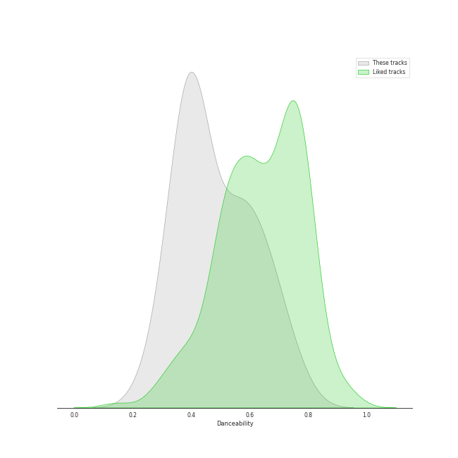
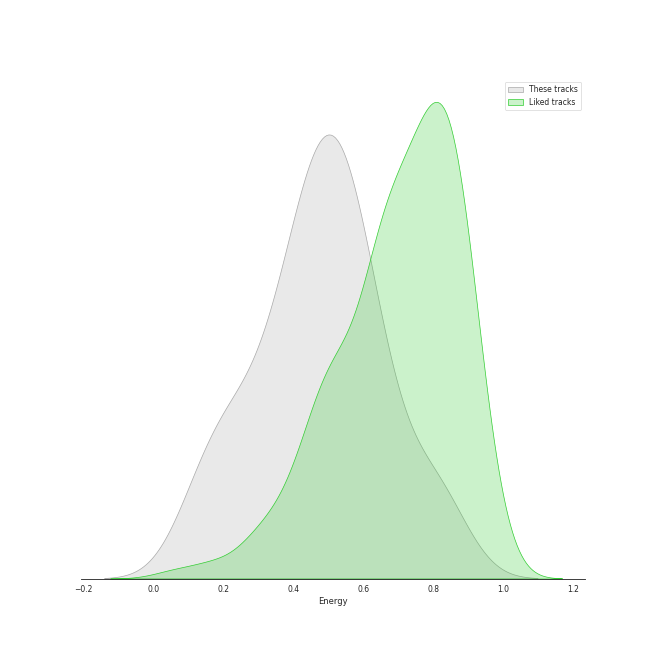
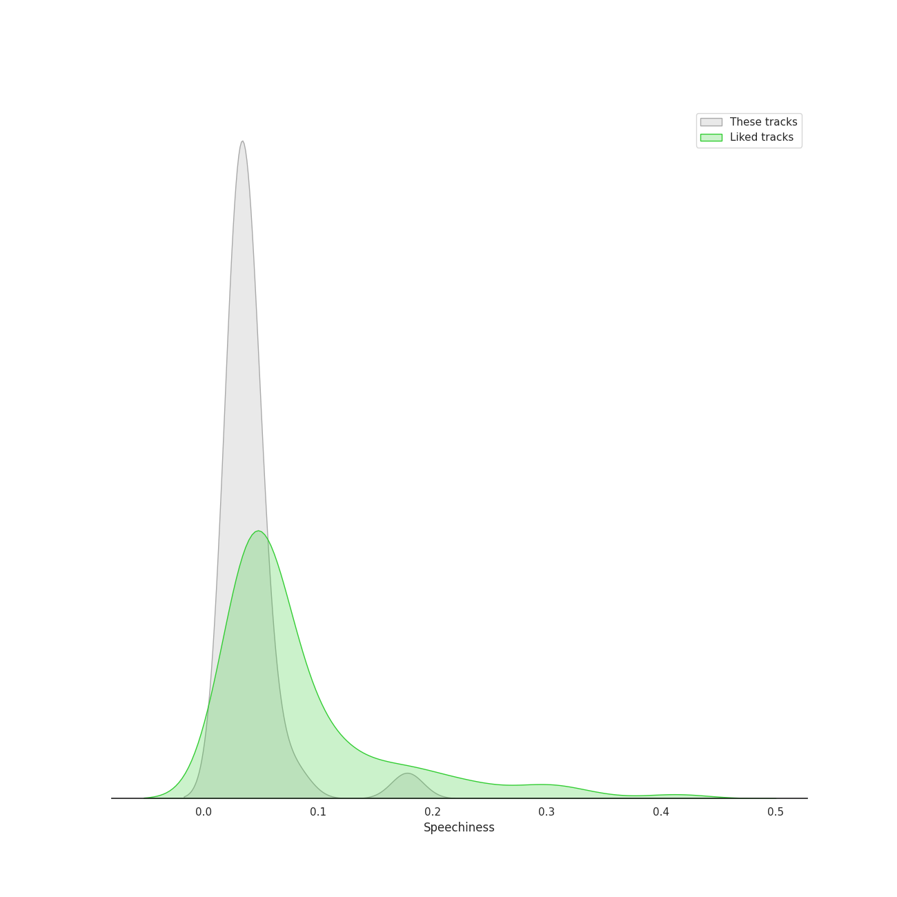
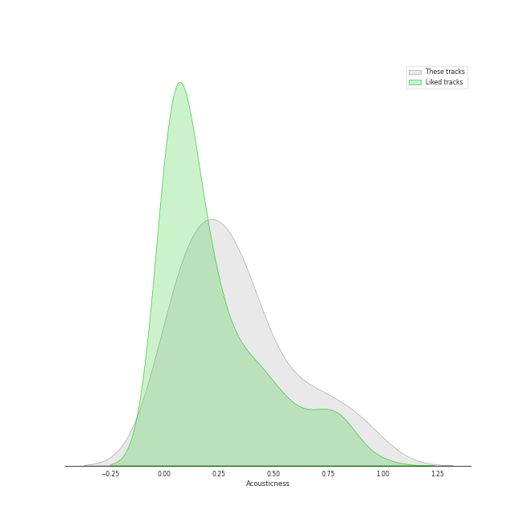
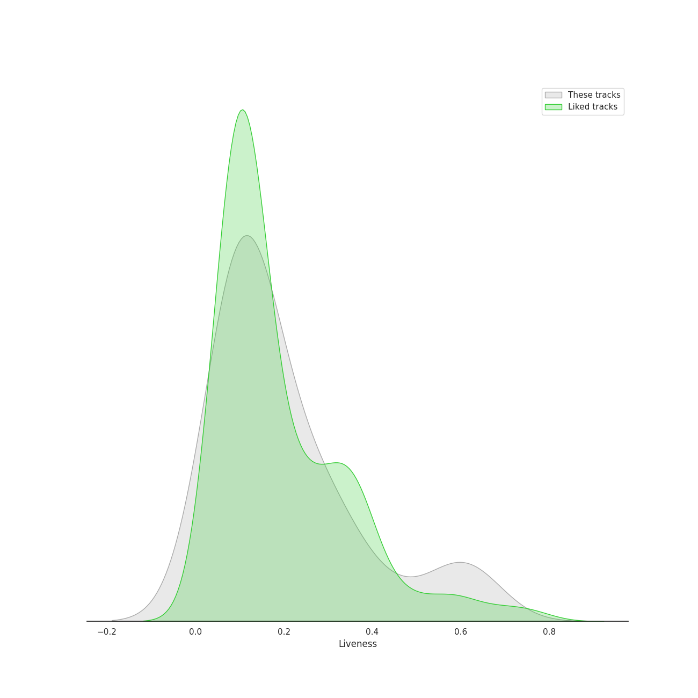
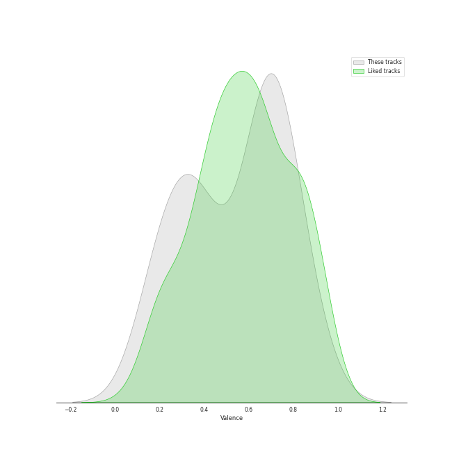
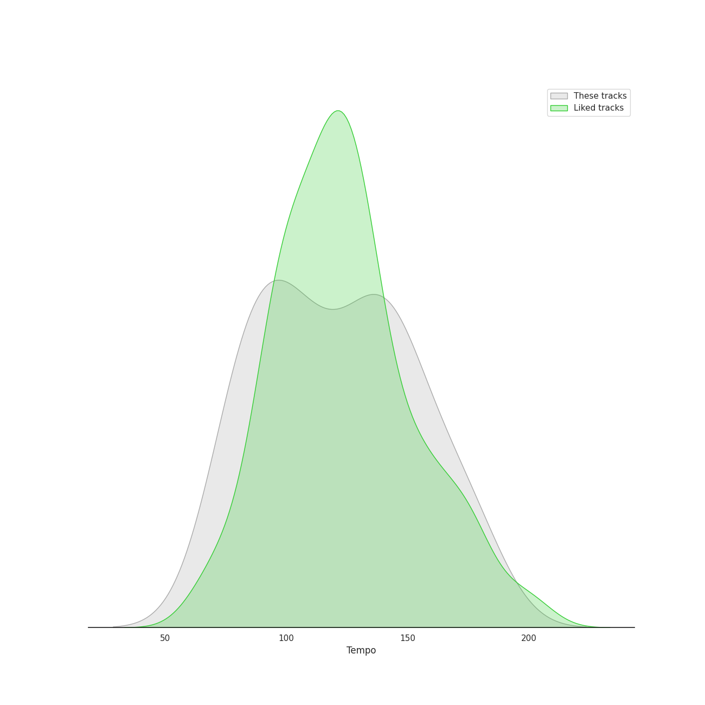

# Audio Features for The Beatles

## Danceability

| ​ | 10 most Danceable tracks | ​​ | 10 least Danceable tracks |
|:---|:---|:---|:---|
|  | Get Back - Remastered 2009 (0.761) |  | Across The Universe - Remastered 2009 (0.257) |
|  | When I'm Sixty Four - Remastered 2009 (0.704) |  | Because - Remastered 2009 (0.328) |
|  | Blackbird - Remastered 2009 (0.686) |  | Yesterday - Remastered 2009 (0.332) |
|  | Day Tripper - Remastered 2015 (0.665) |  | You Never Give Me Your Money - Remastered 2009 (0.335) |
|  | Penny Lane - Remastered 2009 (0.651) |  | I Want You (She's So Heavy) - Remastered 2009 (0.37) |
|  | Octopus's Garden - Remastered 2009 (0.626) |  | Revolution 1 - Remastered 2009 (0.386) |
|  | Yellow Submarine - Remastered 2009 (0.604) |  | Dear Prudence - Remastered 2009 (0.388) |
|  | A Hard Day's Night - Remastered 2009 (0.59) |  | Strawberry Fields Forever - Remastered 2009 (0.39) |
|  | Eleanor Rigby - Remastered 2009 (0.581) |  | Something - Remastered 2009 (0.396) |
|  | Sexy Sadie - Remastered 2009 (0.577) |  | All You Need Is Love - Remastered 2009 (0.4) |

## Energy

| ​ | 10 most Energetic tracks | ​​ | 10 least Energetic tracks |
|:---|:---|:---|:---|
|  | Love Me Do - Remastered 2009 (0.829) |  | Blackbird - Remastered 2009 (0.127) |
|  | A Hard Day's Night - Remastered 2009 (0.805) |  | Golden Slumbers - Remastered 2009 (0.152) |
|  | Day Tripper - Remastered 2015 (0.782) |  | Yesterday - Remastered 2009 (0.179) |
|  | Oh! Darling - Remastered 2009 (0.656) |  | When I'm Sixty Four - Remastered 2009 (0.241) |
|  | While My Guitar Gently Weeps - Remastered 2009 (0.654) |  | Because - Remastered 2009 (0.249) |
|  | Revolution 1 - Remastered 2009 (0.626) |  | Eleanor Rigby - Remastered 2009 (0.28) |
|  | Sexy Sadie - Remastered 2009 (0.624) |  | Something - Remastered 2009 (0.338) |
|  | Get Back - Remastered 2009 (0.592) |  | Norwegian Wood (This Bird Has Flown) - Remastered 2009 (0.369) |
|  | All My Loving - Remastered 2009 (0.563) |  | Come Together - Remastered 2009 (0.376) |
|  | I Am The Walrus - Remastered 2009 (0.556) |  | Let It Be - Remastered 2009 (0.403) |

## Speechiness

| ​ | 10 most Speechy tracks | ​​ | 10 least Speechy tracks |
|:---|:---|:---|:---|
|  | Strawberry Fields Forever - Remastered 2009 (0.178) |  | Octopus's Garden - Remastered 2009 (0.0247) |
|  | Love Me Do - Remastered 2009 (0.0806) |  | Because - Remastered 2009 (0.0272) |
|  | Get Back - Remastered 2009 (0.0586) |  | Carry That Weight - Remastered 2009 (0.0274) |
|  | I Am The Walrus - Remastered 2009 (0.0513) |  | Golden Slumbers - Remastered 2009 (0.0277) |
|  | When I'm Sixty Four - Remastered 2009 (0.0476) |  | Sexy Sadie - Remastered 2009 (0.0285) |
|  | Dear Prudence - Remastered 2009 (0.0436) |  | Across The Universe - Remastered 2009 (0.0287) |
|  | Oh! Darling - Remastered 2009 (0.0397) |  | All You Need Is Love - Remastered 2009 (0.0288) |
|  | Come Together - Remastered 2009 (0.0393) |  | All My Loving - Remastered 2009 (0.0298) |
|  | Yellow Submarine - Remastered 2009 (0.0389) |  | Got To Get You Into My Life - Remastered 2009 (0.0302) |
|  | Eleanor Rigby - Remastered 2009 (0.0381) |  | Something - Remastered 2009 (0.0304) |

## Acousticness

| ​ | 10 most Acoustic tracks | ​​ | 10 least Acoustic tracks |
|:---|:---|:---|:---|
|  | Eleanor Rigby - Remastered 2009 (0.936) |  | Oh! Darling - Remastered 2009 (0.0126) |
|  | Yesterday - Remastered 2009 (0.879) |  | While My Guitar Gently Weeps - Remastered 2009 (0.0205) |
|  | Blackbird - Remastered 2009 (0.754) |  | I Want You (She's So Heavy) - Remastered 2009 (0.0233) |
|  | Because - Remastered 2009 (0.754) |  | Come Together - Remastered 2009 (0.0302) |
|  | Let It Be - Remastered 2009 (0.631) |  | Revolution 1 - Remastered 2009 (0.0785) |
|  | When I'm Sixty Four - Remastered 2009 (0.625) |  | I Am The Walrus - Remastered 2009 (0.0828) |
|  | Yellow Submarine - Remastered 2009 (0.531) |  | Day Tripper - Remastered 2015 (0.12) |
|  | Get Back - Remastered 2009 (0.492) |  | A Hard Day's Night - Remastered 2009 (0.137) |
|  | Got To Get You Into My Life - Remastered 2009 (0.42) |  | Octopus's Garden - Remastered 2009 (0.155) |
|  | Love Me Do - Remastered 2009 (0.386) |  | Dear Prudence - Remastered 2009 (0.16) |

## Instrumentalness

| ​ | 10 most Instrumental tracks | ​​ | 10 least Instrumental tracks |
|:---|:---|:---|:---|
|  | Come Together - Remastered 2009 (0.248) |  | Yesterday - Remastered 2009 (0.0) |
|  | I Want You (She's So Heavy) - Remastered 2009 (0.205) |  | All My Loving - Remastered 2009 (0.0) |
|  | You Never Give Me Your Money - Remastered 2009 (0.136) |  | Yellow Submarine - Remastered 2009 (0.0) |
|  | Dear Prudence - Remastered 2009 (0.0681) |  | A Hard Day's Night - Remastered 2009 (0.0) |
|  | Oh! Darling - Remastered 2009 (0.0279) |  | Let It Be - Remastered 2009 (0.0) |
|  | Penny Lane - Remastered 2009 (0.026) |  | Something - Remastered 2009 (2.62e-06) |
|  | Carry That Weight - Remastered 2009 (0.00663) |  | Day Tripper - Remastered 2015 (4.19e-06) |
|  | Get Back - Remastered 2009 (0.00626) |  | Because - Remastered 2009 (5.77e-06) |
|  | Sexy Sadie - Remastered 2009 (0.00622) |  | Got To Get You Into My Life - Remastered 2009 (9.27e-06) |
|  | While My Guitar Gently Weeps - Remastered 2009 (0.00395) |  | Blackbird - Remastered 2009 (1.41e-05) |

## Liveness

| ​ | 10 most Live tracks | ​​ | 10 least Live tracks |
|:---|:---|:---|:---|
|  | Revolution 1 - Remastered 2009 (0.621) |  | Blackbird - Remastered 2009 (0.0573) |
|  | Get Back - Remastered 2009 (0.61) |  | Across The Universe - Remastered 2009 (0.0702) |
|  | I Am The Walrus - Remastered 2009 (0.589) |  | Strawberry Fields Forever - Remastered 2009 (0.0713) |
|  | Yellow Submarine - Remastered 2009 (0.438) |  | Got To Get You Into My Life - Remastered 2009 (0.0838) |
|  | All My Loving - Remastered 2009 (0.343) |  | When I'm Sixty Four - Remastered 2009 (0.0868) |
|  | Eleanor Rigby - Remastered 2009 (0.305) |  | Yesterday - Remastered 2009 (0.0886) |
|  | Carry That Weight - Remastered 2009 (0.298) |  | Come Together - Remastered 2009 (0.0926) |
|  | All You Need Is Love - Remastered 2009 (0.286) |  | I Want You (She's So Heavy) - Remastered 2009 (0.0966) |
|  | Oh! Darling - Remastered 2009 (0.268) |  | A Hard Day's Night - Remastered 2009 (0.0996) |
|  | Love Me Do - Remastered 2009 (0.227) |  | Dear Prudence - Remastered 2009 (0.108) |

## Valence

| ​ | 10 most Happy tracks | ​​ | 10 least Happy tracks |
|:---|:---|:---|:---|
|  | All My Loving - Remastered 2009 (0.9) |  | Because - Remastered 2009 (0.162) |
|  | Across The Universe - Remastered 2009 (0.858) |  | Come Together - Remastered 2009 (0.187) |
|  | Eleanor Rigby - Remastered 2009 (0.813) |  | You Never Give Me Your Money - Remastered 2009 (0.223) |
|  | A Hard Day's Night - Remastered 2009 (0.797) |  | Golden Slumbers - Remastered 2009 (0.239) |
|  | Love Me Do - Remastered 2009 (0.744) |  | Strawberry Fields Forever - Remastered 2009 (0.289) |
|  | Day Tripper - Remastered 2015 (0.731) |  | Yesterday - Remastered 2009 (0.315) |
|  | Octopus's Garden - Remastered 2009 (0.73) |  | Get Back - Remastered 2009 (0.332) |
|  | Got To Get You Into My Life - Remastered 2009 (0.711) |  | Dear Prudence - Remastered 2009 (0.332) |
|  | Carry That Weight - Remastered 2009 (0.704) |  | Blackbird - Remastered 2009 (0.372) |
|  | While My Guitar Gently Weeps - Remastered 2009 (0.702) |  | Something - Remastered 2009 (0.377) |

## Tempo

| ​ | 10 most Fast tracks | ​​ | 10 least Fast tracks |
|:---|:---|:---|:---|
|  | Norwegian Wood (This Bird Has Flown) - Remastered 2009 (176.625) |  | Sexy Sadie - Remastered 2009 (75.478) |
|  | You Never Give Me Your Money - Remastered 2009 (174.464) |  | All My Loving - Remastered 2009 (77.56) |
|  | Oh! Darling - Remastered 2009 (173.93) |  | Golden Slumbers - Remastered 2009 (80.608) |
|  | Come Together - Remastered 2009 (165.007) |  | Because - Remastered 2009 (81.257) |
|  | Across The Universe - Remastered 2009 (152.126) |  | Carry That Weight - Remastered 2009 (84.319) |
|  | Dear Prudence - Remastered 2009 (150.721) |  | I Am The Walrus - Remastered 2009 (85.206) |
|  | Love Me Do - Remastered 2009 (147.997) |  | Octopus's Garden - Remastered 2009 (92.225) |
|  | Let It Be - Remastered 2009 (143.462) |  | Blackbird - Remastered 2009 (93.699) |
|  | When I'm Sixty Four - Remastered 2009 (140.411) |  | Yesterday - Remastered 2009 (96.529) |
|  | A Hard Day's Night - Remastered 2009 (138.514) |  | Strawberry Fields Forever - Remastered 2009 (97.871) |
