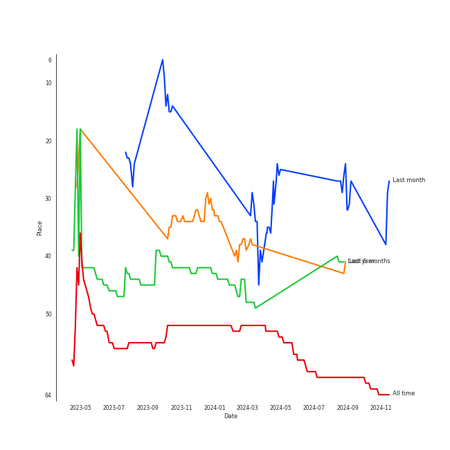

# The Beatles

[See Track Features](audio_features.md)

[See Clusters](clusters/overview.md)

## Relationships

The Beatles:
- was formerly known as The Quarrymen
- has member Pete Best
- has member Norman Chapman
- has member George Harrison
- has member John Lennon
- has member Paul McCartney
- has member Tommy Moore
- has member Chas Newby
- has member Ringo Starr
- has member Stuart Sutcliffe

## Artist Rank
The Beatles is currently:
- The #33 artist of the last 6 months
- The #43 artist of all time

## Featured on Playlists
| Art | Tracks | Playlist |
|:---|---:|:---|
|  | 31 | [Classic Rock](../../playlists/classic_rock/overview.md) |
|  | 5 | [Karaoke](../../playlists/karaoke/overview.md) |
|  | 3 | [Tarps](../../playlists/tarps/overview.md) |

## Top Albums

| Art | Tracks | 💚 | Album | Release Date | 🔗 |
|:---|---:|---:|:---|:---|:---|
|  | 9 | 6 | Abbey Road (Remastered) | 1969-09-26 | [🔗](https://open.spotify.com/album/0ETFjACtuP2ADo6LFhL6HN) |
|  | 5 | 5 | The Beatles (Remastered) | 1968-11-22 | [🔗](https://open.spotify.com/album/1klALx0u4AavZNEvC4LrTL) |
|  | 3 | 2 | Revolver (Remastered) | 1966-08-05 | [🔗](https://open.spotify.com/album/3PRoXYsngSwjEQWR5PsHWR) |
|  | 3 | 2 | Magical Mystery Tour (Remastered) | 1967-11-27 | [🔗](https://open.spotify.com/album/2BtE7qm1qzM80p9vLSiXkj) |
|  | 3 | 2 | Let It Be (Remastered) | 1970-05-08 | [🔗](https://open.spotify.com/album/0jTGHV5xqHPvEcwL8f6YU5) |
|  | 1 | 1 | With The Beatles (Remastered) | 1963-11-22 | [🔗](https://open.spotify.com/album/1aYdiJk6XKeHWGO3FzHHTr) |
|  | 1 | 1 | Rubber Soul (Remastered) | 1965-12-03 | [🔗](https://open.spotify.com/album/50o7kf2wLwVmOTVYJOTplm) |
|  | 1 | 1 | Help! (Remastered) | 1965-08-06 | [🔗](https://open.spotify.com/album/0PT5m6hwPRrpBwIHVnvbFX) |
|  | 1 | 1 | A Hard Day's Night (Remastered) | 1964-07-10 | [🔗](https://open.spotify.com/album/6wCttLq0ADzkPgtRnUihLV) |
|  | 1 | 1 | 1 (Remastered) | 2000-11-13 | [🔗](https://open.spotify.com/album/7vEJAtP3KgKSpOHVgwm3Eh) |

See all albums

| Art | Tracks | 💚 | Album | Release Date | 🔗 |
|:---|---:|---:|:---|:---|:---|
|  | 1 | 0 | Yellow Submarine (Remastered) | 1969-01-17 | [🔗](https://open.spotify.com/album/1gKZ5A1ndFqbcrWtW85cCy) |
|  | 1 | 0 | Sgt. Pepper's Lonely Hearts Club Band (Remastered) | 1967-06-01 | [🔗](https://open.spotify.com/album/6QaVfG1pHYl1z15ZxkvVDW) |
|  | 1 | 0 | Please Please Me (Remastered) | 1963-03-22 | [🔗](https://open.spotify.com/album/3KzAvEXcqJKBF97HrXwlgf) |

## Top Record Labels

| Tracks | 💚 | Label |
|---:|---:|:---|
| 30 | 21 | [EMI Catalogue](../../labels/emi_catalogue/overview.md) |
| 1 | 1 | [UMC (Universal Music Catalogue)](../../labels/umc_(universal_music_catalogue)/overview.md) |

## Genres

- [british invasion](../../genres/british_invasion/overview.md)
- [classic rock](../../genres/classic_rock/overview.md)
- merseybeat
- [psychedelic rock](../../genres/psychedelic_rock/overview.md)
- [rock](../../genres/rock/overview.md)

## Credits

### Member Credits

| | George Harrison | John Lennon | Paul McCartney | Ringo Starr |
|:---|---:|---:|---:|---:|
| Instrument | 19 | 17 | 21 | 17 |
| Lyricist | 2 | 1 | 0 | 0 |
| Songwriter | 2 | 21 | 20 | 0 |
| Vocal | 12 | 15 | 21 | 0 |
### Production Credits

| Art | Track | Members | Credit Types |
|:---|:---|:---|:---|
|  | All My Loving - Remastered 2009 | John Lennon, Paul McCartney | Songwriter |
|  | A Hard Day's Night - Remastered 2009 | John Lennon, Paul McCartney | Songwriter |
|  | Yesterday - Remastered 2009 | John Lennon, Paul McCartney | Songwriter |
|  | Norwegian Wood (This Bird Has Flown) - Remastered 2009 | John Lennon, Paul McCartney | Songwriter |
|  | Got To Get You Into My Life - Remastered 2009 | John Lennon, Paul McCartney | Songwriter |
|  | Eleanor Rigby - Remastered 2009 | John Lennon, Paul McCartney | Songwriter |
|  | Penny Lane - Remastered 2009 | John Lennon, Paul McCartney | Songwriter |
|  | I Am The Walrus - Remastered 2009 | John Lennon, Paul McCartney | Songwriter |
|  | Revolution 1 - Remastered 2009 | John Lennon, Paul McCartney | Songwriter |
|  | Sexy Sadie - Remastered 2009 | John Lennon, Paul McCartney | Songwriter |

View all

| Art | Track | Members | Credit Types |
|:---|:---|:---|:---|
|  | While My Guitar Gently Weeps - Remastered 2009 | George Harrison | Lyricist, Songwriter |
|  | Dear Prudence - Remastered 2009 | John Lennon, Paul McCartney | Songwriter |
|  | Blackbird - Remastered 2009 | John Lennon, Paul McCartney | Songwriter |
|  | Golden Slumbers - Remastered 2009 | John Lennon, Paul McCartney | Songwriter |
|  | Something - Remastered 2009 | George Harrison | Lyricist, Songwriter |
|  | Because - Remastered 2009 | John Lennon, Paul McCartney | Songwriter |
|  | Come Together - Remastered 2009 | John Lennon, Paul McCartney | Songwriter |
|  | Oh! Darling - Remastered 2009 | John Lennon, Paul McCartney | Songwriter |
|  | I Want You (She's So Heavy) - Remastered 2009 | John Lennon, Paul McCartney | Songwriter |
|  | Get Back - Remastered 2009 | John Lennon, Paul McCartney | Songwriter |
|  | Let It Be - Remastered 2009 | John Lennon, Paul McCartney | Songwriter |
|  | Day Tripper - Remastered 2015 | John Lennon, Paul McCartney | Songwriter |
|  | Imagine | John Lennon | Lyricist, Songwriter |

## Top Producers

| Art | Producer | Tracks | Credit Types |
|:---|:---|---:|:---|
| | George Martin | 22 | Producer, Arranger |
| | John Lennon | 20 | Songwriter |
| | Paul McCartney | 20 | Songwriter |
| | Geoff Emerick | 10 | Producer |
| | Phil McDonald | 8 | Producer |
| | Norman Smith | 5 | Producer |
| | Glyn Johns | 4 | Producer |
| | Chris Thomas | 3 | Producer |
| | Ken Scott | 3 | Producer |
| | Barry Sheffield | 2 | Producer |

View all

| Art | Producer | Tracks | Credit Types |
|:---|:---|---:|:---|
| | George Harrison | 2 | Lyricist, Songwriter |
| | Jeff Jarratt | 2 | Producer |
| | Phil Spector | 2 | Producer |
| | John Mills | 1 | Arranger |
| | Ron Pender | 1 | Producer |

## Tracks

| Art | Track | Album | Artists | Label | 💚 | 🔗 |
|:---|:---|:---|:---|:---|:---|:---|
|  | Love Me Do - Remastered 2009 | Please Please Me (Remastered) | [The Beatles](overview.md) | [EMI Catalogue](../../labels/emi_catalogue) | | [🔗](https://open.spotify.com/track/3VbGCXWRiouAq8VyMYN2MI) |
|  | All My Loving - Remastered 2009 | With The Beatles (Remastered) | [The Beatles](overview.md) | [EMI Catalogue](../../labels/emi_catalogue) | 💚 | [🔗](https://open.spotify.com/track/4joiWvli4qJVEW6qZV2i2J) |
|  | A Hard Day's Night - Remastered 2009 | A Hard Day's Night (Remastered) | [The Beatles](overview.md) | [EMI Catalogue](../../labels/emi_catalogue) | 💚 | [🔗](https://open.spotify.com/track/5J2CHimS7dWYMImCHkEFaJ) |
|  | Yesterday - Remastered 2009 | Help! (Remastered) | [The Beatles](overview.md) | [EMI Catalogue](../../labels/emi_catalogue) | 💚 | [🔗](https://open.spotify.com/track/3BQHpFgAp4l80e1XslIjNI) |
|  | Norwegian Wood (This Bird Has Flown) - Remastered 2009 | Rubber Soul (Remastered) | [The Beatles](overview.md) | [EMI Catalogue](../../labels/emi_catalogue) | 💚 | [🔗](https://open.spotify.com/track/1H7gMYGykdtwZOV6s1N0by) |
|  | Eleanor Rigby - Remastered 2009 | Revolver (Remastered) | [The Beatles](overview.md) | [EMI Catalogue](../../labels/emi_catalogue) | 💚 | [🔗](https://open.spotify.com/track/5GjPQ0eI7AgmOnADn1EO6Q) |
|  | Got To Get You Into My Life - Remastered 2009 | Revolver (Remastered) | [The Beatles](overview.md) | [EMI Catalogue](../../labels/emi_catalogue) | 💚 | [🔗](https://open.spotify.com/track/3tGhRLgcCP6SIZU3tbGl7l) |
|  | Yellow Submarine - Remastered 2009 | Revolver (Remastered) | [The Beatles](overview.md) | [EMI Catalogue](../../labels/emi_catalogue) | | [🔗](https://open.spotify.com/track/50xwQXPtfNZFKFeZ0XePWc) |
|  | When I'm Sixty Four - Remastered 2009 | Sgt. Pepper's Lonely Hearts Club Band (Remastered) | [The Beatles](overview.md) | [EMI Catalogue](../../labels/emi_catalogue) | | [🔗](https://open.spotify.com/track/1NrbnHlR2BFREcyWXHIHip) |
|  | I Am The Walrus - Remastered 2009 | Magical Mystery Tour (Remastered) | [The Beatles](overview.md) | [EMI Catalogue](../../labels/emi_catalogue) | 💚 | [🔗](https://open.spotify.com/track/6Pq9MmkDQYZiiCDpxnvrf6) |

See all tracks

| Art | Track | Album | Artists | Label | 💚 | 🔗 |
|:---|:---|:---|:---|:---|:---|:---|
|  | Penny Lane - Remastered 2009 | Magical Mystery Tour (Remastered) | [The Beatles](overview.md) | [EMI Catalogue](../../labels/emi_catalogue) | 💚 | [🔗](https://open.spotify.com/track/1h04XMpzGzmAudoI6VHBgA) |
|  | Strawberry Fields Forever - Remastered 2009 | Magical Mystery Tour (Remastered) | [The Beatles](overview.md) | [EMI Catalogue](../../labels/emi_catalogue) | | [🔗](https://open.spotify.com/track/3Am0IbOxmvlSXro7N5iSfZ) |
|  | Blackbird - Remastered 2009 | The Beatles (Remastered) | [The Beatles](overview.md) | [EMI Catalogue](../../labels/emi_catalogue) | 💚 | [🔗](https://open.spotify.com/track/5jgFfDIR6FR0gvlA56Nakr) |
|  | Dear Prudence - Remastered 2009 | The Beatles (Remastered) | [The Beatles](overview.md) | [EMI Catalogue](../../labels/emi_catalogue) | 💚 | [🔗](https://open.spotify.com/track/5NQYyej46WQkgCbnzGD21W) |
|  | Revolution 1 - Remastered 2009 | The Beatles (Remastered) | [The Beatles](overview.md) | [EMI Catalogue](../../labels/emi_catalogue) | 💚 | [🔗](https://open.spotify.com/track/1aOzDhi5a1RWWRy5dmYA8I) |
|  | Sexy Sadie - Remastered 2009 | The Beatles (Remastered) | [The Beatles](overview.md) | [EMI Catalogue](../../labels/emi_catalogue) | 💚 | [🔗](https://open.spotify.com/track/2tBv9tAdqEbLNDi5smSjbg) |
|  | While My Guitar Gently Weeps - Remastered 2009 | The Beatles (Remastered) | [The Beatles](overview.md) | [EMI Catalogue](../../labels/emi_catalogue) | 💚 | [🔗](https://open.spotify.com/track/389QX9Q1eUOEZ19vtzzI9O) |
|  | All You Need Is Love - Remastered 2009 | Yellow Submarine (Remastered) | [The Beatles](overview.md) | [EMI Catalogue](../../labels/emi_catalogue) | | [🔗](https://open.spotify.com/track/2Z8cY4QpZTFUZxCQCpvNe1) |
|  | Because - Remastered 2009 | Abbey Road (Remastered) | [The Beatles](overview.md) | [EMI Catalogue](../../labels/emi_catalogue) | 💚 | [🔗](https://open.spotify.com/track/1rxoyGj1QuPoVi8fOft1Kt) |
|  | Carry That Weight - Remastered 2009 | Abbey Road (Remastered) | [The Beatles](overview.md) | [EMI Catalogue](../../labels/emi_catalogue) | | [🔗](https://open.spotify.com/track/5eZrW59C3UgBhkqNlowEID) |
|  | Come Together - Remastered 2009 | Abbey Road (Remastered) | [The Beatles](overview.md) | [EMI Catalogue](../../labels/emi_catalogue) | 💚 | [🔗](https://open.spotify.com/track/2EqlS6tkEnglzr7tkKAAYD) |
|  | Golden Slumbers - Remastered 2009 | Abbey Road (Remastered) | [The Beatles](overview.md) | [EMI Catalogue](../../labels/emi_catalogue) | 💚 | [🔗](https://open.spotify.com/track/01SfTM5nfCou5gQL70r6gs) |
|  | I Want You (She's So Heavy) - Remastered 2009 | Abbey Road (Remastered) | [The Beatles](overview.md) | [EMI Catalogue](../../labels/emi_catalogue) | 💚 | [🔗](https://open.spotify.com/track/3Z25k4ZF6QENy2d9YatsM5) |
|  | Octopus's Garden - Remastered 2009 | Abbey Road (Remastered) | [The Beatles](overview.md) | [EMI Catalogue](../../labels/emi_catalogue) | | [🔗](https://open.spotify.com/track/0suLngfo7rJoetk7Ub6N8l) |
|  | Oh! Darling - Remastered 2009 | Abbey Road (Remastered) | [The Beatles](overview.md) | [EMI Catalogue](../../labels/emi_catalogue) | 💚 | [🔗](https://open.spotify.com/track/2mxByJWOajjiVsLWjNXvDJ) |
|  | Something - Remastered 2009 | Abbey Road (Remastered) | [The Beatles](overview.md) | [EMI Catalogue](../../labels/emi_catalogue) | 💚 | [🔗](https://open.spotify.com/track/0pNeVovbiZHkulpGeOx1Gj) |
|  | You Never Give Me Your Money - Remastered 2009 | Abbey Road (Remastered) | [The Beatles](overview.md) | [EMI Catalogue](../../labels/emi_catalogue) | | [🔗](https://open.spotify.com/track/1jOLTO379yIu9aMnCkpMQl) |
|  | Across The Universe - Remastered 2009 | Let It Be (Remastered) | [The Beatles](overview.md) | [EMI Catalogue](../../labels/emi_catalogue) | | [🔗](https://open.spotify.com/track/4dkoqJrP0L8FXftrMZongF) |
|  | Get Back - Remastered 2009 | Let It Be (Remastered) | [The Beatles](overview.md) | [EMI Catalogue](../../labels/emi_catalogue) | 💚 | [🔗](https://open.spotify.com/track/4MLBqAEzNN89o2M9h92Z26) |
|  | Let It Be - Remastered 2009 | Let It Be (Remastered) | [The Beatles](overview.md) | [EMI Catalogue](../../labels/emi_catalogue) | 💚 | [🔗](https://open.spotify.com/track/7iN1s7xHE4ifF5povM6A48) |
|  | Day Tripper - Remastered 2015 | 1 (Remastered) | [The Beatles](overview.md) | [UMC (Universal Music Catalogue)](../../labels/umc_(universal_music_catalogue)) | 💚 | [🔗](https://open.spotify.com/track/29b2b96jozyD9GPCkOrVLs) |

