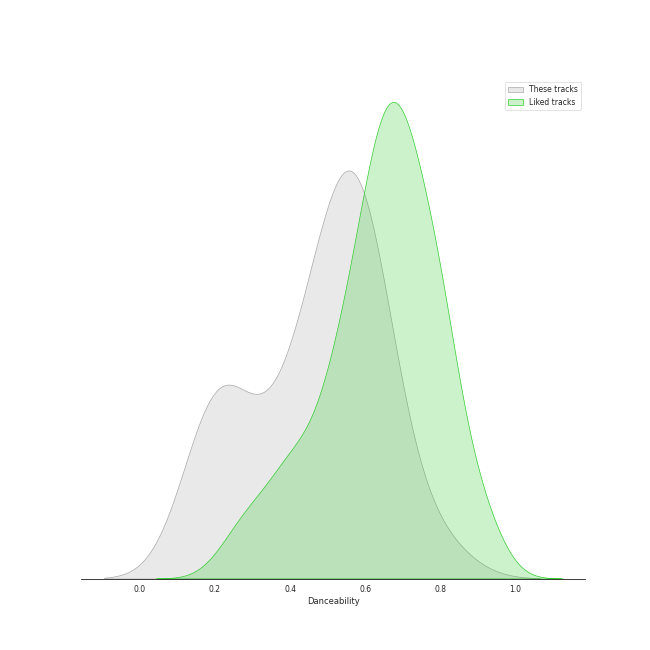
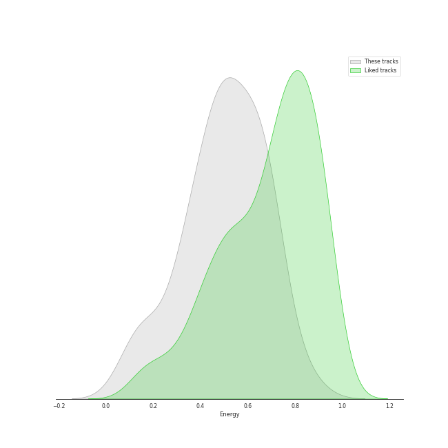
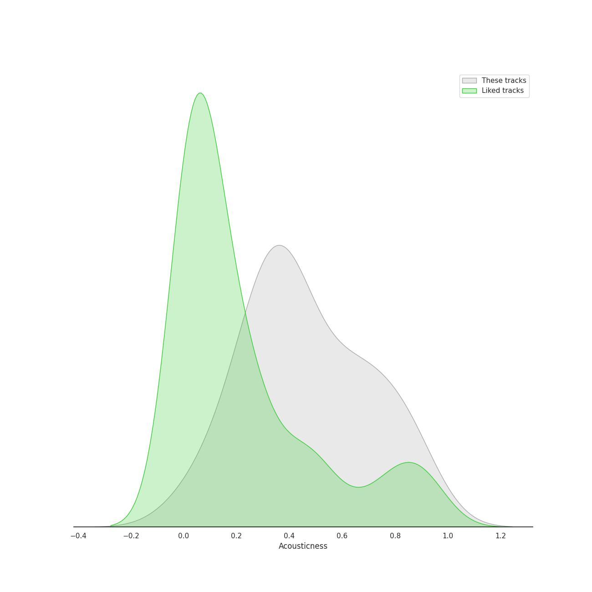
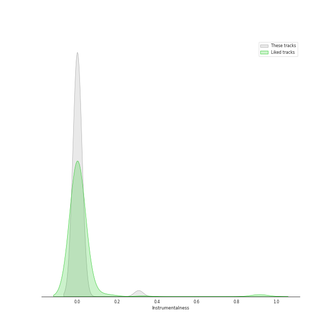
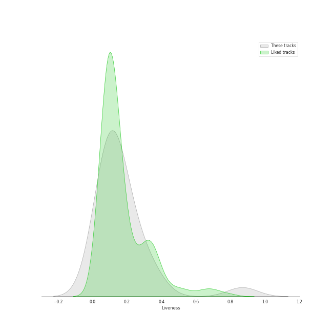
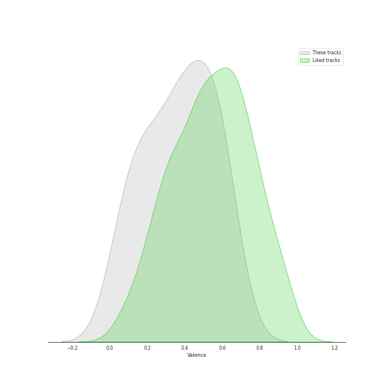

# Track Features for The Tarpeggios

## Danceability

| ​ | 10 most Danceable tracks | ​​ | 10 least Danceable tracks |
|:---|:---|:---|:---|
|  | Settle Down (0.794) |  | The End (Interlude) (0.176) |
|  | Flesh & Bone (0.774) |  | You Take My Breath Away (0.192) |
|  | Life Itself (0.742) |  | A Case of You (0.205) |
|  | Hallucinate (0.709) |  | Golden Slumbers / Carry That Weight (0.213) |
|  | Denim Jacket (0.708) |  | Dawn FM (0.213) |
|  | Into You (0.674) |  | Lullabye (Goodnight, My Angel) (0.215) |
|  | Kiss the Sky (0.668) |  | Rose Leaves (0.261) |
|  | Perfect Illusion (0.664) |  | Pink + White (0.262) |
|  | Forgive Me (0.65) |  | Before He Cheats (0.272) |
|  | Blank Space (0.64) |  | Let's Build A House (Live) (0.29) |

## Energy

| ​ | 10 most Energetic tracks | ​​ | 10 least Energetic tracks |
|:---|:---|:---|:---|
|  | Candyman (0.848) |  | Butterfly Fly Away (Interlude) (0.0963) |
|  | XS (0.728) |  | Dawn FM (0.103) |
|  | I See Fire (0.717) |  | You Take My Breath Away (0.131) |
|  | Perfect Illusion (0.697) |  | Neu Roses (Intro) (0.177) |
|  | As (0.696) |  | Savior Complex (Interlude) (0.181) |
|  | Late Night Talking (Live) (0.692) |  | Lullabye (Goodnight, My Angel) (0.187) |
|  | Drag Me Down / As Long as You Love Me (0.691) |  | Rose Leaves (0.271) |
|  | Can't Take My Eyes off You (0.683) |  | A Case of You (0.3) |
|  | Build Me up Buttercup (0.68) |  | The End (Interlude) (0.314) |
|  | Let's Build A House (Live) (0.647) |  | Cellophane (0.334) |

## Speechiness

| ​ | 10 most Speechy tracks | ​​ | 10 least Speechy tracks |
|:---|:---|:---|:---|
|  | Candyman (0.236) |  | Chariot (0.0262) |
|  | Late Night Talking (Live) (0.105) |  | The Scientist (0.0267) |
|  | Chandelier (0.105) |  | The End (Interlude) (0.0289) |
|  | Carolina State of Mind (0.101) |  | Stand (0.0295) |
|  | Flesh & Bone (0.0927) |  | Lullabye (Goodnight, My Angel) (0.0317) |
|  | Denim Jacket (0.087) |  | A Case of You (0.0317) |
|  | Sweet (0.079) |  | Bottom of the River (0.032) |
|  | Life Itself (0.0717) |  | Neu Roses (Intro) (0.032) |
|  | Build Me up Buttercup (0.0665) |  | Forgive Me (0.0327) |
|  | Dawn FM (0.0654) |  | Rose Leaves (0.033) |

## Acousticness

| ​ | 10 most Acoustic tracks | ​​ | 10 least Acoustic tracks |
|:---|:---|:---|:---|
|  | Butterfly Fly Away (Interlude) (0.928) |  | Kiss the Sky (0.0279) |
|  | You Take My Breath Away (0.878) |  | Into You (0.0288) |
|  | Lullabye (Goodnight, My Angel) (0.858) |  | Perfect Illusion (0.0347) |
|  | Savior Complex (Interlude) (0.822) |  | From Fire (0.0876) |
|  | The Scientist (0.814) |  | As (0.132) |
|  | A Case of You (0.789) |  | Sanctify (0.137) |
|  | Neu Roses (Intro) (0.767) |  | Hallucinate (0.175) |
|  | Rose Leaves (0.751) |  | Chandelier (0.196) |
|  | Dawn FM (0.733) |  | Sweet (0.203) |
|  | Stand (0.723) |  | Flesh & Bone (0.217) |

## Instrumentalness

| ​ | 10 most Instrumental tracks | ​​ | 10 least Instrumental tracks |
|:---|:---|:---|:---|
|  | You Take My Breath Away (0.308) |  | Flesh & Bone (0.0) |
|  | The End (Interlude) (1.55e-05) |  | Butterfly Fly Away (Interlude) (0.0) |
|  | Into You (6.48e-06) |  | Chariot (0.0) |
|  | Wife You Up (3.8e-06) |  | Chandelier (0.0) |
|  | Drag Me Down / As Long as You Love Me (2.01e-06) |  | Candyman (0.0) |
|  | Dawn FM (1.59e-06) |  | Denim Jacket (0.0) |
|  | Lullabye (Goodnight, My Angel) (1.02e-06) |  | Kiss the Sky (0.0) |
|  | Hallucinate (0.0) |  | Before He Cheats (0.0) |
|  | G Train (0.0) |  | Can't Take My Eyes off You (0.0) |
|  | Build Me up Buttercup (0.0) |  | Bottom of the River (0.0) |

## Liveness

| ​ | 10 most Live tracks | ​​ | 10 least Live tracks |
|:---|:---|:---|:---|
|  | XS (0.869) |  | Settle Down (0.0381) |
|  | Let's Build A House (Live) (0.711) |  | Blank Space (0.044) |
|  | As (0.377) |  | I Knew You Were Trouble (0.0531) |
|  | Build Me up Buttercup (0.346) |  | I See Fire (0.0666) |
|  | Late Night Talking (Live) (0.341) |  | Drag Me Down / As Long as You Love Me (0.0696) |
|  | Chariot (0.341) |  | Carolina State of Mind (0.0792) |
|  | Neu Roses (Intro) (0.316) |  | Into You (0.0796) |
|  | Can't Take My Eyes off You (0.267) |  | Forgive Me (0.0798) |
|  | Sweet (0.248) |  | Flesh & Bone (0.0805) |
|  | Before He Cheats (0.241) |  | Santa Monica (0.0805) |

## Valence

| ​ | 10 most Happy tracks | ​​ | 10 least Happy tracks |
|:---|:---|:---|:---|
|  | Flesh & Bone (0.722) |  | You Take My Breath Away (0.0384) |
|  | Denim Jacket (0.698) |  | The End (Interlude) (0.0761) |
|  | Build Me up Buttercup (0.655) |  | The Scientist (0.0813) |
|  | XS (0.649) |  | Dawn FM (0.139) |
|  | Late Night Talking (Live) (0.633) |  | A Case of You (0.139) |
|  | Sweet (0.619) |  | Cellophane (0.142) |
|  | Candyman (0.572) |  | Golden Slumbers / Carry That Weight (0.161) |
|  | I Knew You Were Trouble (0.57) |  | Pink + White (0.176) |
|  | Blank Space (0.562) |  | Rose Leaves (0.179) |
|  | Sanctify (0.562) |  | Drag Me Down / As Long as You Love Me (0.192) |

## Tempo

| ​ | 10 most Fast tracks | ​​ | 10 least Fast tracks |
|:---|:---|:---|:---|
|  | Carolina State of Mind (180.209) |  | Pink + White (70.977) |
|  | Chandelier (173.914) |  | Lullabye (Goodnight, My Angel) (72.306) |
|  | Dawn FM (172.901) |  | Bottom of the River (74.144) |
|  | A Case of You (171.769) |  | Before He Cheats (74.975) |
|  | G Train (169.964) |  | I Knew You Were Trouble (77.05) |
|  | Candyman (169.783) |  | Savior Complex (Interlude) (79.333) |
|  | I See Fire (159.935) |  | Golden Slumbers / Carry That Weight (82.759) |
|  | Sweet (156.1) |  | Butterfly Fly Away (Interlude) (82.924) |
|  | Flesh & Bone (147.901) |  | Chariot (83.998) |
|  | The Scientist (143.803) |  | Home (85.943) |
