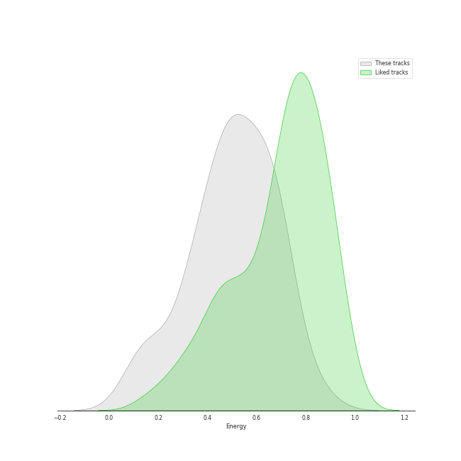
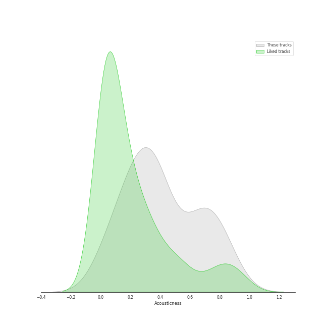
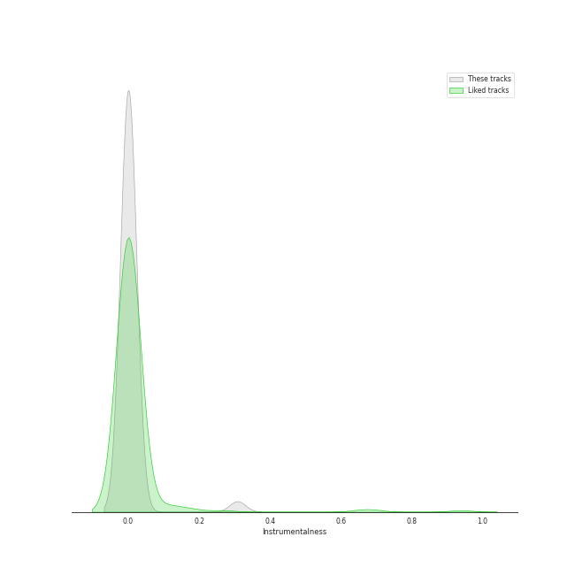
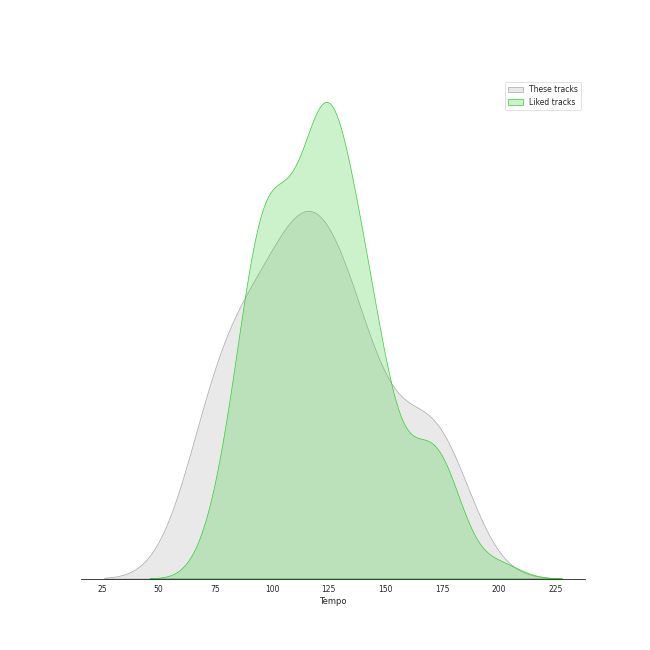

# Audio Features for The Tarpeggios

## Danceability

| 10 most Danceable tracks | 10 least Danceable tracks |
|:---|:---|
| Settle Down (0.794) | The End (Interlude) (0.176) |
| Kiss the Sky (0.668) | You Take My Breath Away (0.192) |
| Blank Space (0.64) | A Case of You (0.205) |
| XS (0.614) | Golden Slumbers / Carry That Weight (0.213) |
| Build Me up Buttercup (0.611) | Lullabye (Goodnight, My Angel) (0.215) |
| Sanctify (0.585) | Before He Cheats (0.272) |
| Bottom of the River (0.583) | The Scientist (0.358) |
| Can't Take My Eyes off You (0.578) | I See Fire (0.406) |
| I Knew You Were Trouble (0.574) | Wife You Up (0.433) |
| Candyman (0.566) | G Train (0.44) |

## Energy

| 10 most Energetic tracks | 10 least Energetic tracks |
|:---|:---|
| Candyman (0.848) | You Take My Breath Away (0.131) |
| XS (0.728) | Lullabye (Goodnight, My Angel) (0.187) |
| I See Fire (0.717) | A Case of You (0.3) |
| Drag Me Down / As Long as You Love Me (0.691) | The End (Interlude) (0.314) |
| Can't Take My Eyes off You (0.683) | Bottom of the River (0.345) |
| Build Me up Buttercup (0.68) | The Scientist (0.375) |
| Carolina State of Mind (0.644) | Golden Slumbers / Carry That Weight (0.388) |
| Kiss the Sky (0.628) | Settle Down (0.408) |
| Chandelier (0.626) | Wife You Up (0.479) |
| Blank Space (0.62) | I Knew You Were Trouble (0.483) |

## Speechiness

| 10 most Speechy tracks | 10 least Speechy tracks |
|:---|:---|
| Candyman (0.236) | Chariot (0.0262) |
| Chandelier (0.105) | The Scientist (0.0267) |
| Carolina State of Mind (0.101) | The End (Interlude) (0.0289) |
| Build Me up Buttercup (0.0665) | Lullabye (Goodnight, My Angel) (0.0317) |
| Blank Space (0.059) | A Case of You (0.0317) |
| I See Fire (0.0589) | Bottom of the River (0.032) |
| Kiss the Sky (0.0518) | Golden Slumbers / Carry That Weight (0.0335) |
| Sanctify (0.0515) | Settle Down (0.0339) |
| XS (0.0482) | G Train (0.0344) |
| Can't Take My Eyes off You (0.0464) | I Knew You Were Trouble (0.0356) |

## Acousticness

| 10 most Acoustic tracks | 10 least Acoustic tracks |
|:---|:---|
| You Take My Breath Away (0.878) | Kiss the Sky (0.0279) |
| Lullabye (Goodnight, My Angel) (0.858) | Sanctify (0.137) |
| The Scientist (0.814) | Chandelier (0.196) |
| A Case of You (0.789) | Carolina State of Mind (0.244) |
| Bottom of the River (0.675) | Wife You Up (0.275) |
| Home (0.668) | Chariot (0.299) |
| I See Fire (0.662) | G Train (0.315) |
| I Knew You Were Trouble (0.631) | Drag Me Down / As Long as You Love Me (0.341) |
| The End (Interlude) (0.556) | Before He Cheats (0.342) |
| Golden Slumbers / Carry That Weight (0.525) | XS (0.346) |

## Instrumentalness

| 10 most Instrumental tracks | 10 least Instrumental tracks |
|:---|:---|
| You Take My Breath Away (0.308) | Chariot (0.0) |
| The End (Interlude) (1.55e-05) | Chandelier (0.0) |
| Wife You Up (3.8e-06) | Candyman (0.0) |
| Drag Me Down / As Long as You Love Me (2.01e-06) | Kiss the Sky (0.0) |
| Lullabye (Goodnight, My Angel) (1.02e-06) | Before He Cheats (0.0) |
| G Train (0.0) | Can't Take My Eyes off You (0.0) |
| Build Me up Buttercup (0.0) | Bottom of the River (0.0) |
| A Case of You (0.0) | Settle Down (0.0) |
| The Scientist (0.0) | I Knew You Were Trouble (0.0) |
| Carolina State of Mind (0.0) | Golden Slumbers / Carry That Weight (0.0) |

## Liveness

| 10 most Live tracks | 10 least Live tracks |
|:---|:---|
| XS (0.869) | Settle Down (0.0381) |
| Build Me up Buttercup (0.346) | Blank Space (0.044) |
| Chariot (0.341) | I Knew You Were Trouble (0.0531) |
| Can't Take My Eyes off You (0.267) | I See Fire (0.0666) |
| Before He Cheats (0.241) | Drag Me Down / As Long as You Love Me (0.0696) |
| G Train (0.239) | Carolina State of Mind (0.0792) |
| Bottom of the River (0.17) | Chandelier (0.0872) |
| Golden Slumbers / Carry That Weight (0.166) | The Scientist (0.0992) |
| Kiss the Sky (0.151) | Candyman (0.104) |
| The End (Interlude) (0.147) | Home (0.104) |

## Valence

| 10 most Happy tracks | 10 least Happy tracks |
|:---|:---|
| Build Me up Buttercup (0.655) | You Take My Breath Away (0.0384) |
| XS (0.649) | The End (Interlude) (0.0761) |
| Candyman (0.572) | The Scientist (0.0813) |
| I Knew You Were Trouble (0.57) | A Case of You (0.139) |
| Blank Space (0.562) | Golden Slumbers / Carry That Weight (0.161) |
| Sanctify (0.562) | Drag Me Down / As Long as You Love Me (0.192) |
| Kiss the Sky (0.55) | Wife You Up (0.21) |
| Settle Down (0.513) | Lullabye (Goodnight, My Angel) (0.242) |
| Can't Take My Eyes off You (0.456) | Home (0.305) |
| Bottom of the River (0.449) | G Train (0.316) |

## Tempo

| 10 most Fast tracks | 10 least Fast tracks |
|:---|:---|
| Carolina State of Mind (180.209) | Lullabye (Goodnight, My Angel) (72.306) |
| Chandelier (173.914) | Bottom of the River (74.144) |
| A Case of You (171.769) | Before He Cheats (74.975) |
| G Train (169.964) | I Knew You Were Trouble (77.05) |
| Candyman (169.783) | Golden Slumbers / Carry That Weight (82.759) |
| I See Fire (159.935) | Chariot (83.998) |
| The Scientist (143.803) | Home (85.943) |
| Drag Me Down / As Long as You Love Me (140.055) | Blank Space (95.966) |
| The End (Interlude) (136.834) | Settle Down (95.985) |
| Build Me up Buttercup (125.016) | Sanctify (104.985) |
