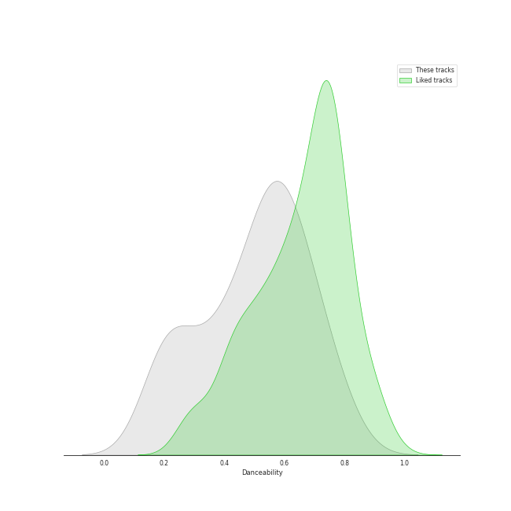
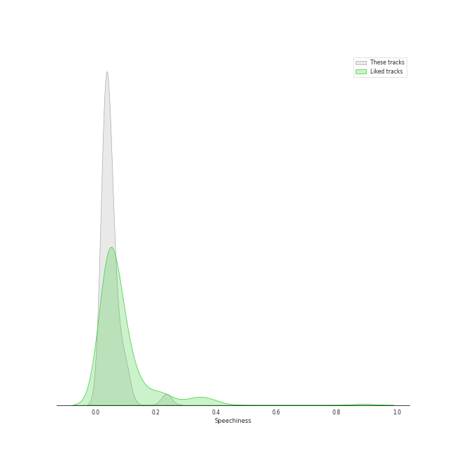
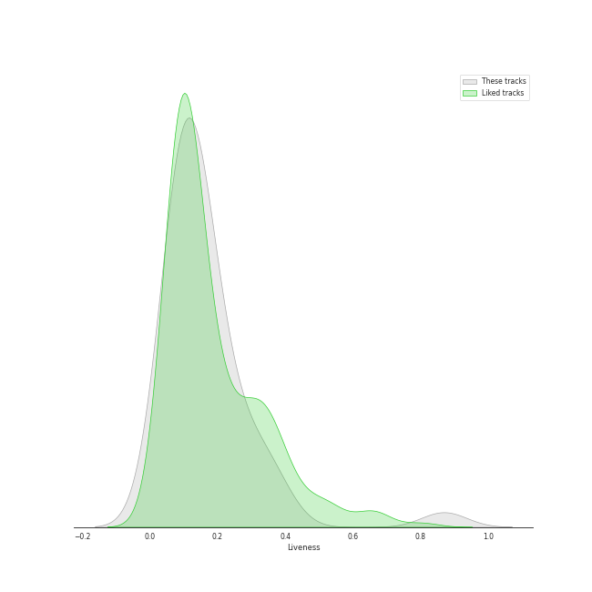
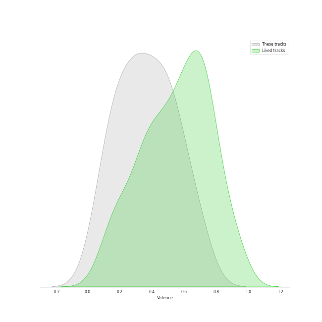

# Audio Features for The Tarpeggios

## Danceability

| ​ | 10 most Danceable tracks | ​​ | 10 least Danceable tracks |
|:---|:---|:---|:---|
|  | Settle Down (0.794) |  | The End (Interlude) (0.176) |
|  | Kiss the Sky (0.668) |  | You Take My Breath Away (0.192) |
|  | Blank Space (0.64) |  | A Case of You (0.205) |
|  | XS (0.614) |  | Golden Slumbers / Carry That Weight (0.213) |
|  | Build Me up Buttercup (0.611) |  | Lullabye (Goodnight, My Angel) (0.215) |
|  | Sanctify (0.585) |  | Before He Cheats (0.272) |
|  | Bottom of the River (0.583) |  | The Scientist (0.358) |
|  | Can't Take My Eyes off You (0.578) |  | I See Fire (0.406) |
|  | I Knew You Were Trouble (0.574) |  | Wife You Up (0.433) |
|  | Candyman (0.566) |  | G Train (0.44) |

## Energy

| ​ | 10 most Energetic tracks | ​​ | 10 least Energetic tracks |
|:---|:---|:---|:---|
|  | Candyman (0.848) |  | You Take My Breath Away (0.131) |
|  | XS (0.728) |  | Lullabye (Goodnight, My Angel) (0.187) |
|  | I See Fire (0.717) |  | A Case of You (0.3) |
|  | Drag Me Down / As Long as You Love Me (0.691) |  | The End (Interlude) (0.314) |
|  | Can't Take My Eyes off You (0.683) |  | Bottom of the River (0.345) |
|  | Build Me up Buttercup (0.68) |  | The Scientist (0.375) |
|  | Carolina State of Mind (0.644) |  | Golden Slumbers / Carry That Weight (0.388) |
|  | Kiss the Sky (0.628) |  | Settle Down (0.408) |
|  | Chandelier (0.626) |  | Wife You Up (0.479) |
|  | Blank Space (0.62) |  | I Knew You Were Trouble (0.483) |

## Speechiness

| ​ | 10 most Speechy tracks | ​​ | 10 least Speechy tracks |
|:---|:---|:---|:---|
|  | Candyman (0.236) |  | Chariot (0.0262) |
|  | Chandelier (0.105) |  | The Scientist (0.0267) |
|  | Carolina State of Mind (0.101) |  | The End (Interlude) (0.0289) |
|  | Build Me up Buttercup (0.0665) |  | Lullabye (Goodnight, My Angel) (0.0317) |
|  | Blank Space (0.059) |  | A Case of You (0.0317) |
|  | I See Fire (0.0589) |  | Bottom of the River (0.032) |
|  | Kiss the Sky (0.0518) |  | Golden Slumbers / Carry That Weight (0.0335) |
|  | Sanctify (0.0515) |  | Settle Down (0.0339) |
|  | XS (0.0482) |  | G Train (0.0344) |
|  | Can't Take My Eyes off You (0.0464) |  | I Knew You Were Trouble (0.0356) |

## Acousticness

| ​ | 10 most Acoustic tracks | ​​ | 10 least Acoustic tracks |
|:---|:---|:---|:---|
|  | You Take My Breath Away (0.878) |  | Kiss the Sky (0.0279) |
|  | Lullabye (Goodnight, My Angel) (0.858) |  | Sanctify (0.137) |
|  | The Scientist (0.814) |  | Chandelier (0.196) |
|  | A Case of You (0.789) |  | Carolina State of Mind (0.244) |
|  | Bottom of the River (0.675) |  | Wife You Up (0.275) |
|  | Home (0.668) |  | Chariot (0.299) |
|  | I See Fire (0.662) |  | G Train (0.315) |
|  | I Knew You Were Trouble (0.631) |  | Drag Me Down / As Long as You Love Me (0.341) |
|  | The End (Interlude) (0.556) |  | Before He Cheats (0.342) |
|  | Golden Slumbers / Carry That Weight (0.525) |  | XS (0.346) |

## Instrumentalness

| ​ | 10 most Instrumental tracks | ​​ | 10 least Instrumental tracks |
|:---|:---|:---|:---|
|  | You Take My Breath Away (0.308) |  | Chariot (0.0) |
|  | The End (Interlude) (1.55e-05) |  | Chandelier (0.0) |
|  | Wife You Up (3.8e-06) |  | Candyman (0.0) |
|  | Drag Me Down / As Long as You Love Me (2.01e-06) |  | Kiss the Sky (0.0) |
|  | Lullabye (Goodnight, My Angel) (1.02e-06) |  | Before He Cheats (0.0) |
|  | G Train (0.0) |  | Can't Take My Eyes off You (0.0) |
|  | Build Me up Buttercup (0.0) |  | Bottom of the River (0.0) |
|  | A Case of You (0.0) |  | Settle Down (0.0) |
|  | The Scientist (0.0) |  | I Knew You Were Trouble (0.0) |
|  | Carolina State of Mind (0.0) |  | Golden Slumbers / Carry That Weight (0.0) |

## Liveness

| ​ | 10 most Live tracks | ​​ | 10 least Live tracks |
|:---|:---|:---|:---|
|  | XS (0.869) |  | Settle Down (0.0381) |
|  | Build Me up Buttercup (0.346) |  | Blank Space (0.044) |
|  | Chariot (0.341) |  | I Knew You Were Trouble (0.0531) |
|  | Can't Take My Eyes off You (0.267) |  | I See Fire (0.0666) |
|  | Before He Cheats (0.241) |  | Drag Me Down / As Long as You Love Me (0.0696) |
|  | G Train (0.239) |  | Carolina State of Mind (0.0792) |
|  | Bottom of the River (0.17) |  | Chandelier (0.0872) |
|  | Golden Slumbers / Carry That Weight (0.166) |  | The Scientist (0.0992) |
|  | Kiss the Sky (0.151) |  | Candyman (0.104) |
|  | The End (Interlude) (0.147) |  | Home (0.104) |

## Valence

| ​ | 10 most Happy tracks | ​​ | 10 least Happy tracks |
|:---|:---|:---|:---|
|  | Build Me up Buttercup (0.655) |  | You Take My Breath Away (0.0384) |
|  | XS (0.649) |  | The End (Interlude) (0.0761) |
|  | Candyman (0.572) |  | The Scientist (0.0813) |
|  | I Knew You Were Trouble (0.57) |  | A Case of You (0.139) |
|  | Blank Space (0.562) |  | Golden Slumbers / Carry That Weight (0.161) |
|  | Sanctify (0.562) |  | Drag Me Down / As Long as You Love Me (0.192) |
|  | Kiss the Sky (0.55) |  | Wife You Up (0.21) |
|  | Settle Down (0.513) |  | Lullabye (Goodnight, My Angel) (0.242) |
|  | Can't Take My Eyes off You (0.456) |  | Home (0.305) |
|  | Bottom of the River (0.449) |  | G Train (0.316) |

## Tempo

| ​ | 10 most Fast tracks | ​​ | 10 least Fast tracks |
|:---|:---|:---|:---|
|  | Carolina State of Mind (180.209) |  | Lullabye (Goodnight, My Angel) (72.306) |
|  | Chandelier (173.914) |  | Bottom of the River (74.144) |
|  | A Case of You (171.769) |  | Before He Cheats (74.975) |
|  | G Train (169.964) |  | I Knew You Were Trouble (77.05) |
|  | Candyman (169.783) |  | Golden Slumbers / Carry That Weight (82.759) |
|  | I See Fire (159.935) |  | Chariot (83.998) |
|  | The Scientist (143.803) |  | Home (85.943) |
|  | Drag Me Down / As Long as You Love Me (140.055) |  | Blank Space (95.966) |
|  | The End (Interlude) (136.834) |  | Settle Down (95.985) |
|  | Build Me up Buttercup (125.016) |  | Sanctify (104.985) |
