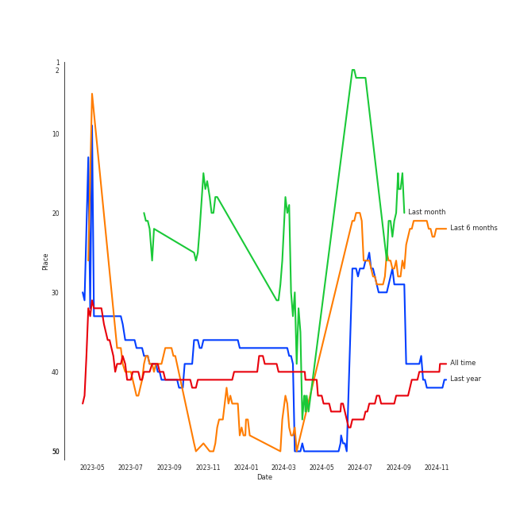
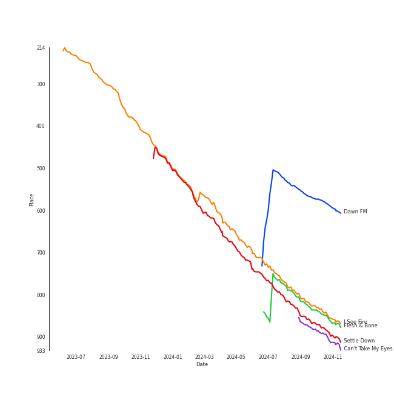
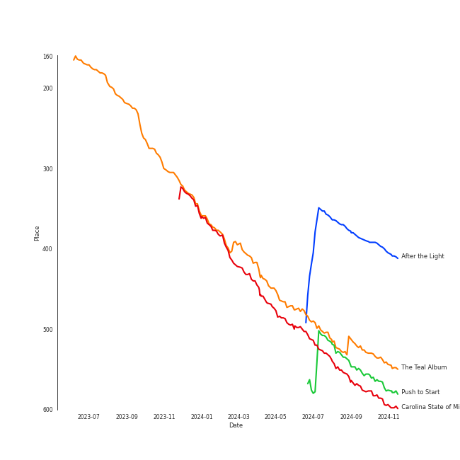

# The Tarpeggios

[See Track Features](audio_features.md)

[See Clusters](clusters/overview.md)

## Relationships

The Tarpeggios:
- was formerly known as The Quarrymen
- has member Pete Best
- has member Norman Chapman
- has member George Harrison
- has member John Lennon
- has member Paul McCartney
- has member Tommy Moore
- has member Chas Newby
- has member Ringo Starr
- has member Stuart Sutcliffe

## Artist Rank
The Tarpeggios is currently:
- The #22 artist of the last 6 months
- The #42 artist of the last year
- The #40 artist of all time

## Top Tracks

### Top tracks of all time

## Top Albums

| Art | Rank | Tracks | 💚 | Album | Release Date | 🔗 |
|:---|---:|---:|---:|:---|:---|:---|
|  | 540 | 9 | 7 | The Teal Album | 2016-11-12 | [🔗](https://open.spotify.com/album/7mTQ62MIYHSbkZHGjY0Ftg) |
|  | 592 | 7 | 6 | Carolina State of Mind | 2013-11-15 | [🔗](https://open.spotify.com/album/3zKusinRVxdC5s2wOPYBgX) |
|  | 656 | 7 | 5 | Bloodline | 2024-05-15 | [🔗](https://open.spotify.com/album/5XMETYH0wL2F3qDpWfVKzw) |
|  | 656 | 5 | 4 | Homeward | 2022-04-08 | [🔗](https://open.spotify.com/album/2FiDSelqVoi7VQfpmaMRJK) |
|  | 399 | 4 | 0 | After the Light | 2023-08-18 | [🔗](https://open.spotify.com/album/5Q9k2sd9kFnmPEJjdsFIpV) |
|  | 656 | 3 | 2 | MODERN ECSTASY | 2023-07-07 | [🔗](https://open.spotify.com/album/3EFIthm5Zjb7MfuXeDJb9A) |
|  | 570 | 2 | 2 | Push to Start | 2023-04-03 | [🔗](https://open.spotify.com/album/4ggdFWPHn5rTdUrw4s46yS) |
|  | 656 | 2 | 2 | Immaterial | 2021-07-16 | [🔗](https://open.spotify.com/album/5YgtPHMCi4dGtL6JarEGkI) |
|  | 656 | 1 | 1 | G Train | 2019-11-22 | [🔗](https://open.spotify.com/album/0vmio1Hc8vrU7scyVa6BYK) |
|  | 656 | 1 | 0 | Before He Cheats | 2019-10-22 | [🔗](https://open.spotify.com/album/7bndGIMX7IOBjG3J7O0BEQ) |

## Featured on Playlists
| Art | Tracks | Playlist |
|:---|---:|:---|
|  | 41 | [A Cappella](../../playlists/a_cappella/overview.md) |
|  | 1 | [Tarps](../../playlists/tarps/overview.md) |

## Top Record Labels

| Tracks | 💚 | Label |
|---:|---:|:---|
| 32 | 22 | [The Tarpeggios](../../labels/the_tarpeggios/overview.md) |
| 9 | 7 | The Unc - Chapel Hill Tarpeggios |

## Credits

### Member Credits

| | George Harrison | Ringo Starr | [John Lennon](../../producers/john_lennon/overview.md) | [Paul McCartney](../../producers/paul_mccartney/overview.md) |
|:---|---:|---:|---:|---:|
| Instrument | 20 | 18 | 18 | 22 |
| Lyricist | 2 | 0 | 1 | 0 |
| Songwriter | 2 | 0 | 22 | 21 |
| Vocal | 12 | 0 | 16 | 21 |
### Production Credits

| Art | Track | Members | Credit Types |
|:---|:---|:---|:---|
|  | All My Loving - Remastered 2009 | [John Lennon](../../../producers/john_lennon/overview.md), [Paul McCartney](../../../producers/paul_mccartney/overview.md) | Songwriter |
|  | A Hard Day's Night - Remastered 2009 | [John Lennon](../../../producers/john_lennon/overview.md), [Paul McCartney](../../../producers/paul_mccartney/overview.md) | Songwriter |
|  | Yesterday - Remastered 2009 | [John Lennon](../../../producers/john_lennon/overview.md), [Paul McCartney](../../../producers/paul_mccartney/overview.md) | Songwriter |
|  | Norwegian Wood (This Bird Has Flown) - Remastered 2009 | [John Lennon](../../../producers/john_lennon/overview.md), [Paul McCartney](../../../producers/paul_mccartney/overview.md) | Songwriter |
|  | Got To Get You Into My Life - Remastered 2009 | [John Lennon](../../../producers/john_lennon/overview.md), [Paul McCartney](../../../producers/paul_mccartney/overview.md) | Songwriter |
|  | Eleanor Rigby - Remastered 2009 | [John Lennon](../../../producers/john_lennon/overview.md), [Paul McCartney](../../../producers/paul_mccartney/overview.md) | Songwriter |
|  | Penny Lane - Remastered 2009 | [John Lennon](../../../producers/john_lennon/overview.md), [Paul McCartney](../../../producers/paul_mccartney/overview.md) | Songwriter |
|  | I Am The Walrus - Remastered 2009 | [John Lennon](../../../producers/john_lennon/overview.md), [Paul McCartney](../../../producers/paul_mccartney/overview.md) | Songwriter |
|  | Revolution 1 - Remastered 2009 | [John Lennon](../../../producers/john_lennon/overview.md), [Paul McCartney](../../../producers/paul_mccartney/overview.md) | Songwriter |
|  | Sexy Sadie - Remastered 2009 | [John Lennon](../../../producers/john_lennon/overview.md), [Paul McCartney](../../../producers/paul_mccartney/overview.md) | Songwriter |

View all

| Art | Track | Members | Credit Types |
|:---|:---|:---|:---|
|  | While My Guitar Gently Weeps - Remastered 2009 | George Harrison | Lyricist, Songwriter |
|  | Dear Prudence - Remastered 2009 | [John Lennon](../../../producers/john_lennon/overview.md), [Paul McCartney](../../../producers/paul_mccartney/overview.md) | Songwriter |
|  | Blackbird - Remastered 2009 | [John Lennon](../../../producers/john_lennon/overview.md), [Paul McCartney](../../../producers/paul_mccartney/overview.md) | Songwriter |
|  | Golden Slumbers - Remastered 2009 | [John Lennon](../../../producers/john_lennon/overview.md), [Paul McCartney](../../../producers/paul_mccartney/overview.md) | Songwriter |
|  | Something - Remastered 2009 | George Harrison | Lyricist, Songwriter |
|  | Because - Remastered 2009 | [John Lennon](../../../producers/john_lennon/overview.md), [Paul McCartney](../../../producers/paul_mccartney/overview.md) | Songwriter |
|  | Come Together - Remastered 2009 | [John Lennon](../../../producers/john_lennon/overview.md), [Paul McCartney](../../../producers/paul_mccartney/overview.md) | Songwriter |
|  | Oh! Darling - Remastered 2009 | [John Lennon](../../../producers/john_lennon/overview.md), [Paul McCartney](../../../producers/paul_mccartney/overview.md) | Songwriter |
|  | I Want You (She's So Heavy) - Remastered 2009 | [John Lennon](../../../producers/john_lennon/overview.md), [Paul McCartney](../../../producers/paul_mccartney/overview.md) | Songwriter |
|  | Get Back - Remastered 2009 | [John Lennon](../../../producers/john_lennon/overview.md), [Paul McCartney](../../../producers/paul_mccartney/overview.md) | Songwriter |
|  | Across The Universe - Remastered 2009 | [John Lennon](../../../producers/john_lennon/overview.md), [Paul McCartney](../../../producers/paul_mccartney/overview.md) | Songwriter |
|  | Let It Be - Remastered 2009 | [John Lennon](../../../producers/john_lennon/overview.md), [Paul McCartney](../../../producers/paul_mccartney/overview.md) | Songwriter |
|  | Day Tripper - Remastered 2015 | [John Lennon](../../../producers/john_lennon/overview.md), [Paul McCartney](../../../producers/paul_mccartney/overview.md) | Songwriter |
|  | Imagine | [John Lennon](../../../producers/john_lennon/overview.md) | Lyricist, Songwriter |

## Tracks

| Art | Track | Album | Artists | Label | Rank | 💚 | 🔗 |
|:---|:---|:---|:---|:---|---:|:---|:---|
|  | Dawn FM | After the Light | [The Tarpeggios](overview.md) | [The Tarpeggios](../../labels/the_tarpeggios) | 590 | | [🔗](https://open.spotify.com/track/4KWIpxAss4Pi8Bw3cQEmmZ) |
|  | I See Fire | The Teal Album | [The Tarpeggios](overview.md) | The Unc - Chapel Hill Tarpeggios | 858 | 💚 | [🔗](https://open.spotify.com/track/4Mp2l1tCHxnm65a6yQ8lph) |
|  | Flesh & Bone | Push to Start | [The Tarpeggios](overview.md) | [The Tarpeggios](../../labels/the_tarpeggios) | 862 | 💚 | [🔗](https://open.spotify.com/track/07Y1FyOg5wP1AD46E0MSKC) |
|  | Settle Down | Carolina State of Mind | [The Tarpeggios](overview.md) | [The Tarpeggios](../../labels/the_tarpeggios) | 895 | 💚 | [🔗](https://open.spotify.com/track/2RGGnyqlJ65QcpA4FggZ2x) |
|  | Can't Take My Eyes off You | The Teal Album | [The Tarpeggios](overview.md) | The Unc - Chapel Hill Tarpeggios | 908 | 💚 | [🔗](https://open.spotify.com/track/1wT7nx5HLq9mhBf3P0BwTf) |
|  | Carolina State of Mind | Carolina State of Mind | [The Tarpeggios](overview.md) | [The Tarpeggios](../../labels/the_tarpeggios) | 1000 | 💚 | [🔗](https://open.spotify.com/track/60xweUiIfi93UhZEDN3DKY) |
|  | Chariot | Carolina State of Mind | [The Tarpeggios](overview.md) | [The Tarpeggios](../../labels/the_tarpeggios) | 1000 | | [🔗](https://open.spotify.com/track/0of5rsasONYN34mx4rSgsn) |
|  | Home | Carolina State of Mind | [The Tarpeggios](overview.md) | [The Tarpeggios](../../labels/the_tarpeggios) | 1000 | 💚 | [🔗](https://open.spotify.com/track/5EiVVKFfodbFiHTCFEB1i3) |
|  | I Knew You Were Trouble | Carolina State of Mind | [The Tarpeggios](overview.md) | [The Tarpeggios](../../labels/the_tarpeggios) | 1000 | 💚 | [🔗](https://open.spotify.com/track/2uB0wu6NOxNAEYmKvf1VDi) |
|  | Lullabye (Goodnight, My Angel) | Carolina State of Mind | [The Tarpeggios](overview.md) | [The Tarpeggios](../../labels/the_tarpeggios) | 1000 | 💚 | [🔗](https://open.spotify.com/track/4OXK8cslw5QGKzk6U1yRfU) |

See all tracks

| Art | Track | Album | Artists | Label | Rank | 💚 | 🔗 |
|:---|:---|:---|:---|:---|---:|:---|:---|
|  | The Scientist | Carolina State of Mind | [The Tarpeggios](overview.md) | [The Tarpeggios](../../labels/the_tarpeggios) | 1000 | 💚 | [🔗](https://open.spotify.com/track/6NOjptrSCGSEr6vvSQuDmC) |
|  | A Case of You | The Teal Album | [The Tarpeggios](overview.md) | The Unc - Chapel Hill Tarpeggios | 1000 | 💚 | [🔗](https://open.spotify.com/track/6YwWeHUYCkRoGJWGtohs0j) |
|  | Blank Space | The Teal Album | [The Tarpeggios](overview.md) | The Unc - Chapel Hill Tarpeggios | 1000 | | [🔗](https://open.spotify.com/track/55uhowm3d20ahlHjQNa78b) |
|  | Bottom of the River | The Teal Album | [The Tarpeggios](overview.md) | The Unc - Chapel Hill Tarpeggios | 1000 | 💚 | [🔗](https://open.spotify.com/track/25XUZBlrcbb5U2fsJBY03P) |
|  | Build Me up Buttercup | The Teal Album | [The Tarpeggios](overview.md) | The Unc - Chapel Hill Tarpeggios | 1000 | 💚 | [🔗](https://open.spotify.com/track/7Gi0VBh0IsTbIncQGNJjv3) |
|  | Candyman | The Teal Album | [The Tarpeggios](overview.md) | The Unc - Chapel Hill Tarpeggios | 1000 | 💚 | [🔗](https://open.spotify.com/track/1OEnvNhDx4iYvjKD8rIp89) |
|  | Chandelier | The Teal Album | [The Tarpeggios](overview.md) | The Unc - Chapel Hill Tarpeggios | 1000 | | [🔗](https://open.spotify.com/track/132bFFrU2GvmvebqUlO2qS) |
|  | Drag Me Down / As Long as You Love Me | The Teal Album | [The Tarpeggios](overview.md) | The Unc - Chapel Hill Tarpeggios | 1000 | 💚 | [🔗](https://open.spotify.com/track/3GqtzxfUrdmrApqEMaWggL) |
|  | Before He Cheats | Before He Cheats | [The Tarpeggios](overview.md) | [The Tarpeggios](../../labels/the_tarpeggios) | 1000 | | [🔗](https://open.spotify.com/track/1kRKhFJLbqoXeBUecl8eZa) |
|  | G Train | G Train | [The Tarpeggios](overview.md) | [The Tarpeggios](../../labels/the_tarpeggios) | 1000 | 💚 | [🔗](https://open.spotify.com/track/7IFr6PZwvtqBJEMl55Omvx) |
|  | Wife You Up | Immaterial | [The Tarpeggios](overview.md) | [The Tarpeggios](../../labels/the_tarpeggios) | 1000 | 💚 | [🔗](https://open.spotify.com/track/73dGGJmQ9ERvnumjuG5LES) |
|  | XS | Immaterial | [The Tarpeggios](overview.md) | [The Tarpeggios](../../labels/the_tarpeggios) | 1000 | 💚 | [🔗](https://open.spotify.com/track/3s8C5wAXYgvpmzBhTduJBg) |
|  | Golden Slumbers / Carry That Weight | Homeward | [The Tarpeggios](overview.md) | [The Tarpeggios](../../labels/the_tarpeggios) | 1000 | 💚 | [🔗](https://open.spotify.com/track/3CJwaHt5VqpKaoJ4h523AB) |
|  | Kiss the Sky | Homeward | [The Tarpeggios](overview.md) | [The Tarpeggios](../../labels/the_tarpeggios) | 1000 | 💚 | [🔗](https://open.spotify.com/track/1alIiVzLvztXf92CxCXY1B) |
|  | Sanctify | Homeward | [The Tarpeggios](overview.md) | [The Tarpeggios](../../labels/the_tarpeggios) | 1000 | | [🔗](https://open.spotify.com/track/3uKuUjR2RMJFFbIAz8l459) |
|  | The End (Interlude) | Homeward | [The Tarpeggios](overview.md) | [The Tarpeggios](../../labels/the_tarpeggios) | 1000 | 💚 | [🔗](https://open.spotify.com/track/36TvCuzr3KGsG8UdZ9tk8e) |
|  | You Take My Breath Away | Homeward | [The Tarpeggios](overview.md) | [The Tarpeggios](../../labels/the_tarpeggios) | 1000 | 💚 | [🔗](https://open.spotify.com/track/430GqLsbnIps8OZoZUCIYp) |
|  | Hallucinate | Push to Start | [The Tarpeggios](overview.md) | [The Tarpeggios](../../labels/the_tarpeggios) | 1000 | 💚 | [🔗](https://open.spotify.com/track/7if1wRYtErHssU5Gbwr5Vg) |
|  | From Fire | MODERN ECSTASY | [The Tarpeggios](overview.md) | [The Tarpeggios](../../labels/the_tarpeggios) | 1000 | 💚 | [🔗](https://open.spotify.com/track/78iAMQZjxLsIlZleVCLn36) |
|  | Perfect Illusion | MODERN ECSTASY | [The Tarpeggios](overview.md) | [The Tarpeggios](../../labels/the_tarpeggios) | 1000 | 💚 | [🔗](https://open.spotify.com/track/29SUtH1OM0qfXinI7c4JOM) |
|  | Pink + White | MODERN ECSTASY | [The Tarpeggios](overview.md) | [The Tarpeggios](../../labels/the_tarpeggios) | 1000 | | [🔗](https://open.spotify.com/track/5Jpj2lXrRGZRuApSu1CExm) |
|  | Cellophane | After the Light | [The Tarpeggios](overview.md) | [The Tarpeggios](../../labels/the_tarpeggios) | 1000 | | [🔗](https://open.spotify.com/track/3GpSIZNdBPTOfyP5Hb8TrG) |
|  | Life Itself | After the Light | [The Tarpeggios](overview.md) | [The Tarpeggios](../../labels/the_tarpeggios) | 1000 | | [🔗](https://open.spotify.com/track/5azbTkuf8n5Hmlnc1ajzkY) |
|  | Santa Monica | After the Light | [The Tarpeggios](overview.md) | [The Tarpeggios](../../labels/the_tarpeggios) | 1000 | | [🔗](https://open.spotify.com/track/4sIjwLzVOUNTucmP4ALaGC) |
|  | As | Bloodline | [The Tarpeggios](overview.md) | [The Tarpeggios](../../labels/the_tarpeggios) | 1000 | 💚 | [🔗](https://open.spotify.com/track/6hAMfVONnyITSHQaPjErZF) |
|  | Denim Jacket | Bloodline | [The Tarpeggios](overview.md) | [The Tarpeggios](../../labels/the_tarpeggios) | 1000 | | [🔗](https://open.spotify.com/track/1OdzHKbEWGiYhCBdCCnOQR) |
|  | Forgive Me | Bloodline | [The Tarpeggios](overview.md) | [The Tarpeggios](../../labels/the_tarpeggios) | 1000 | 💚 | [🔗](https://open.spotify.com/track/2xapxfPwprpKNEAFb1yZfV) |
|  | Into You | Bloodline | [The Tarpeggios](overview.md) | [The Tarpeggios](../../labels/the_tarpeggios) | 1000 | 💚 | [🔗](https://open.spotify.com/track/5gF7iojRdalqupWW6PJppX) |
|  | Invincible | Bloodline | [The Tarpeggios](overview.md) | [The Tarpeggios](../../labels/the_tarpeggios) | 1000 | 💚 | [🔗](https://open.spotify.com/track/5jGSr1nD2v5yDl2wTU2okx) |
|  | Neu Roses (Intro) | Bloodline | [The Tarpeggios](overview.md) | [The Tarpeggios](../../labels/the_tarpeggios) | 1000 | | [🔗](https://open.spotify.com/track/5H1pu1hepKH0GEv9EKvrIt) |
|  | Stand | Bloodline | [The Tarpeggios](overview.md) | [The Tarpeggios](../../labels/the_tarpeggios) | 1000 | 💚 | [🔗](https://open.spotify.com/track/2SvQJBFy7QQXwHgJH1Cfri) |

