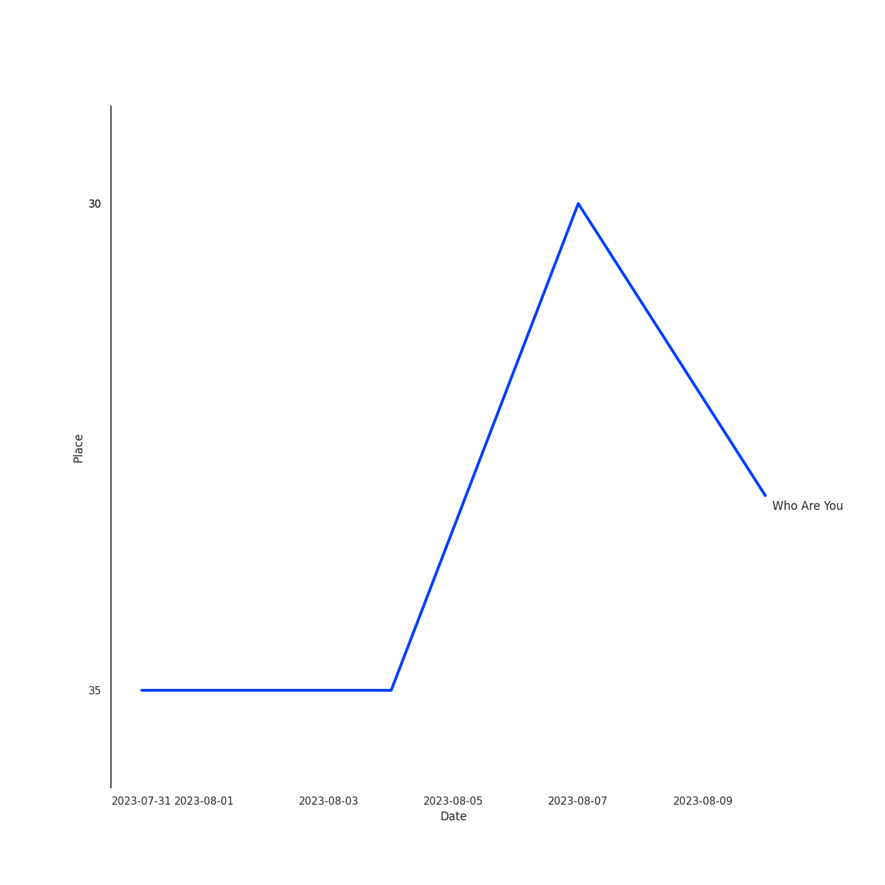

# The Who

## Artist Rank

## Top Tracks

- Who Are You is:
    - the #33 track of the last month

### Top tracks of the last month over time

## Featured on Playlists
| Art | Tracks | Playlist |
|:---|---:|:---|
|  | 6 | [Classic Rock](../../playlists/classic_rock/overview.md) |
|  | 1 | [Summer](../../playlists/summer/overview.md) |
## Top Albums

| Art | Tracks | 💚 | Album | Release Date | 🔗 |
|:---|---:|---:|:---|:---|:---|
|  | 2 | 2 | Who's Next (Deluxe Edition) | 1971-08-14 | [🔗](https://open.spotify.com/album/5MqyhhHbT13zsloD3uHhlQ) |
|  | 1 | 1 | Who's Next (Expanded Edition) | 1971-08-14 | [🔗](https://open.spotify.com/album/53PBYiedQrASAs5sy63JqT) |
|  | 1 | 1 | Who Are You | 1978-08-18 | [🔗](https://open.spotify.com/album/7at3CV9Y9P57wsEXkfU0q8) |
|  | 1 | 1 | Tommy | 1969-05-23 | [🔗](https://open.spotify.com/album/5cT7ee1sy2oEbFalP4asS4) |
|  | 1 | 1 | My Generation (Stereo Version) | 1965-12-03 | [🔗](https://open.spotify.com/album/6Oc6Ok1Oawu8lRkjmD4mXy) |

## Top Record Labels

| Tracks | 💚 | Label |
|---:|---:|:---|
| 3 | 3 | [Geffen](../../labels/geffen/overview.md) |
| 2 | 2 | [Polydor Records](../../labels/polydor_records/overview.md) |
| 1 | 1 | [UMC (Universal Music Catalogue)](../../labels/umc__universal_music_catalogue_/overview.md) |

## Genres

- [album rock](../../genres/album_rock)
- [british invasion](../../genres/british_invasion)
- [classic rock](../../genres/classic_rock)
- [hard rock](../../genres/hard_rock)
- [rock](../../genres/rock)

## Tracks

| Art | Track | Album | Artists | Label | 💚 | 🔗 |
|:---|:---|:---|:---|:---|:---|:---|
|  | My Generation - Stereo Version | My Generation (Stereo Version) | [The Who](overview.md) | [Geffen](../../labels/geffen) | 💚 | [🔗](https://open.spotify.com/track/4u9f8hqstB7iITDJNzKhQx) |
|  | Pinball Wizard | Tommy | [The Who](overview.md) | [UMC (Universal Music Catalogue)](../../labels/umc__universal_music_catalogue_) | 💚 | [🔗](https://open.spotify.com/track/6LbbHFEajG9e4m0G3L47c4) |
|  | Baba O'Riley | Who's Next (Deluxe Edition) | [The Who](overview.md) | [Polydor Records](../../labels/polydor_records) | 💚 | [🔗](https://open.spotify.com/track/3qiyyUfYe7CRYLucrPmulD) |
|  | Behind Blue Eyes | Who's Next (Deluxe Edition) | [The Who](overview.md) | [Polydor Records](../../labels/polydor_records) | 💚 | [🔗](https://open.spotify.com/track/0cKk8BKEi7zXbdrYdyqBP5) |
|  | Won't Get Fooled Again - Remix | Who's Next (Expanded Edition) | [The Who](overview.md) | [Geffen*](../../labels/geffen) | 💚 | [🔗](https://open.spotify.com/track/1W1GpfPujmgp2vQqcpUhtU) |
|  | Who Are You | Who Are You | [The Who](overview.md) | [Geffen](../../labels/geffen) | 💚 | [🔗](https://open.spotify.com/track/23IJ5wLRhEZ9DOuia5mPiZ) |