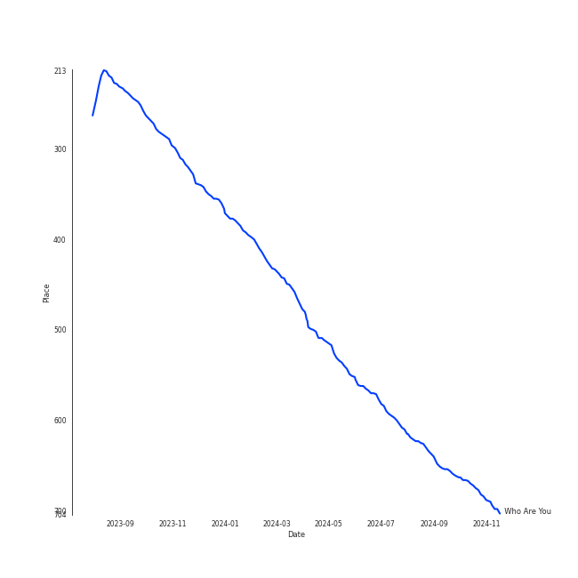
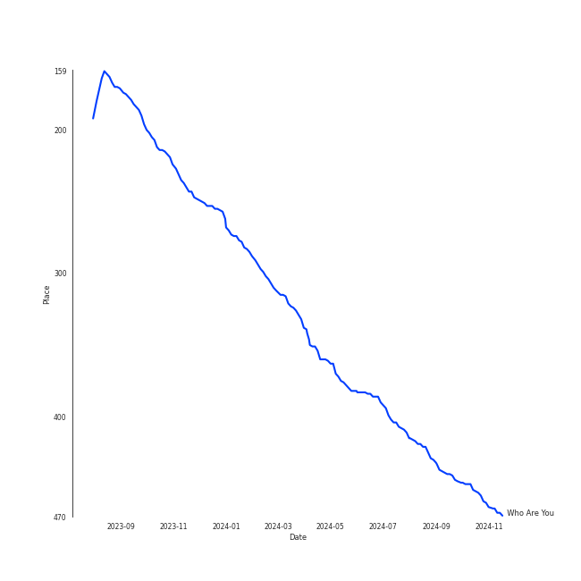
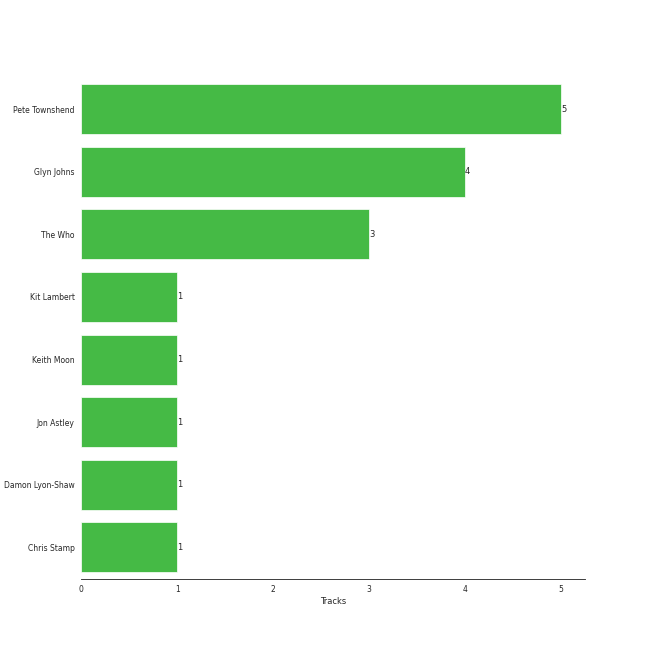

# The Who

## Relationships

The Who:
- was formerly known as The High Numbers
- is later known as The High Numbers
- has member John "Rabbit" Bundrick
- has member Roger Daltrey
- has member John Entwistle
- has member Loren Gold
- has member Kenney Jones
- has member Keith Moon
- has member Pino Palladino
- has member Doug Sandom
- has member Frank Simes
- has member Chris Stainton
- has member Zak Starkey
- has member Pete Townshend
- has member Simon Townshend

## Artist Rank
- The #313 artist overall

## Top Tracks

### Top tracks, aggregated

## Top Albums

| Art | Tracks | 💚 | Album | Release Date | 🔗 |
|:---|---:|---:|:---|:---|:---|
|  | 2 | 2 | Who's Next (Deluxe Edition) | 1971-08-14 | [🔗](https://open.spotify.com/album/5MqyhhHbT13zsloD3uHhlQ) |
|  | 1 | 1 | Who's Next (Expanded Edition) | 1971-08-14 | [🔗](https://open.spotify.com/album/53PBYiedQrASAs5sy63JqT) |
|  | 1 | 1 | Who Are You | 1978-08-18 | [🔗](https://open.spotify.com/album/7at3CV9Y9P57wsEXkfU0q8) |
|  | 1 | 1 | Tommy | 1969-05-23 | [🔗](https://open.spotify.com/album/5cT7ee1sy2oEbFalP4asS4) |
|  | 1 | 1 | My Generation (Stereo Version) | 1965-12-03 | [🔗](https://open.spotify.com/album/6Oc6Ok1Oawu8lRkjmD4mXy) |

## Featured on Playlists
| Art | Tracks | Playlist |
|:---|---:|:---|
|  | 6 | [Classic Rock](../../playlists/classic_rock/overview.md) |
|  | 1 | [Summer](../../playlists/summer/overview.md) |

## Top Record Labels

| Tracks | 💚 | Label |
|---:|---:|:---|
| 3 | 3 | [Geffen](../../labels/geffen/overview.md) |
| 2 | 2 | [Polydor Records](../../labels/polydor_records/overview.md) |
| 1 | 1 | [UMC (Universal Music Catalogue)](../../labels/umc_(universal_music_catalogue)/overview.md) |

## Genres

- [album rock](../../genres/album_rock/overview.md)
- [british invasion](../../genres/british_invasion/overview.md)
- [classic rock](../../genres/classic_rock/overview.md)
- [hard rock](../../genres/hard_rock/overview.md)
- [rock](../../genres/rock/overview.md)

## Credits

### Credits by Type

| Credit Type | Tracks |
|:---|---:|
| Producer | 3 |

### Member Credits

| | John Entwistle | Keith Moon | Pete Townshend | Pino Palladino | Roger Daltrey |
|:---|---:|---:|---:|---:|---:|
| Instrument | 2 | 2 | 3 | 1 | 0 |
| Lyricist | 0 | 0 | 5 | 0 | 0 |
| Producer | 0 | 1 | 0 | 0 | 0 |
| Songwriter | 0 | 0 | 5 | 0 | 0 |
| Vocal | 2 | 0 | 3 | 0 | 3 |
### Production Credits

| Art | Track | Members | Credit Types |
|:---|:---|:---|:---|
|  | Pinball Wizard | Pete Townshend | Lyricist, Songwriter |
|  | Behind Blue Eyes | [The Who](.), Pete Townshend | Producer, Lyricist, Songwriter |
|  | Won't Get Fooled Again - Remix | [The Who](.), Pete Townshend | Producer, Lyricist, Songwriter |
|  | Baba O'Riley | [The Who](.), Pete Townshend, Keith Moon | Producer, Lyricist, Songwriter |
|  | Who Are You | Pete Townshend | Lyricist, Songwriter |

## Top Producers

| Art | Producer | Tracks | Credit Types |
|:---|:---|---:|:---|
| | Pete Townshend | 5 | Lyricist, Songwriter |
| | Glyn Johns | 4 | Producer |
|  | [The Who](overview.md) | 3 | Producer |
| | Damon Lyon-Shaw | 1 | Producer |
| | Chris Stamp | 1 | Producer |
| | Keith Moon | 1 | Producer |
| | Jon Astley | 1 | Producer |
| | Kit Lambert | 1 | Producer |

## Tracks

| Art | Track | Album | Artists | Label | Rank | 💚 | 🔗 |
|:---|:---|:---|:---|:---|---:|:---|:---|
|  | Who Are You | Who Are You | [The Who](overview.md) | [Geffen](../../labels/geffen) | 573 | 💚 | [🔗](https://open.spotify.com/track/23IJ5wLRhEZ9DOuia5mPiZ) |
|  | My Generation - Stereo Version | My Generation (Stereo Version) | [The Who](overview.md) | [Geffen](../../labels/geffen) | 864 | 💚 | [🔗](https://open.spotify.com/track/4u9f8hqstB7iITDJNzKhQx) |
|  | Pinball Wizard | Tommy | [The Who](overview.md) | [UMC (Universal Music Catalogue)](../../labels/umc_(universal_music_catalogue)) | 864 | 💚 | [🔗](https://open.spotify.com/track/6LbbHFEajG9e4m0G3L47c4) |
|  | Baba O'Riley | Who's Next (Deluxe Edition) | [The Who](overview.md) | [Polydor Records](../../labels/polydor_records) | 864 | 💚 | [🔗](https://open.spotify.com/track/3qiyyUfYe7CRYLucrPmulD) |
|  | Behind Blue Eyes | Who's Next (Deluxe Edition) | [The Who](overview.md) | [Polydor Records](../../labels/polydor_records) | 864 | 💚 | [🔗](https://open.spotify.com/track/0cKk8BKEi7zXbdrYdyqBP5) |
|  | Won't Get Fooled Again - Remix | Who's Next (Expanded Edition) | [The Who](overview.md) | [Geffen*](../../labels/geffen) | 864 | 💚 | [🔗](https://open.spotify.com/track/1W1GpfPujmgp2vQqcpUhtU) |
