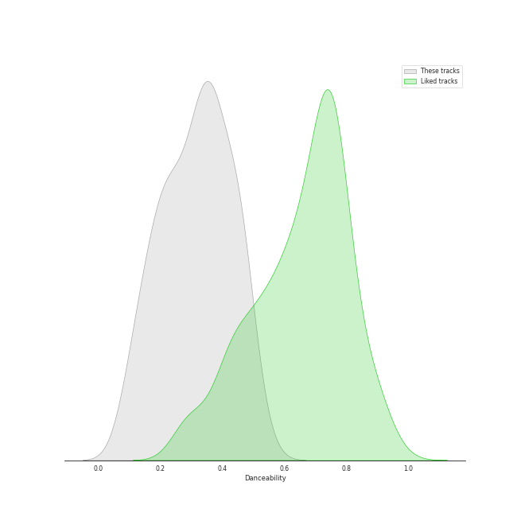
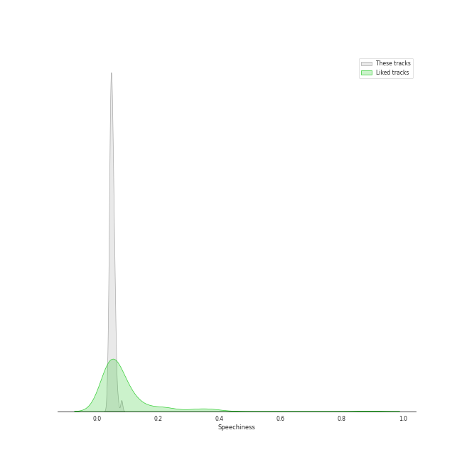
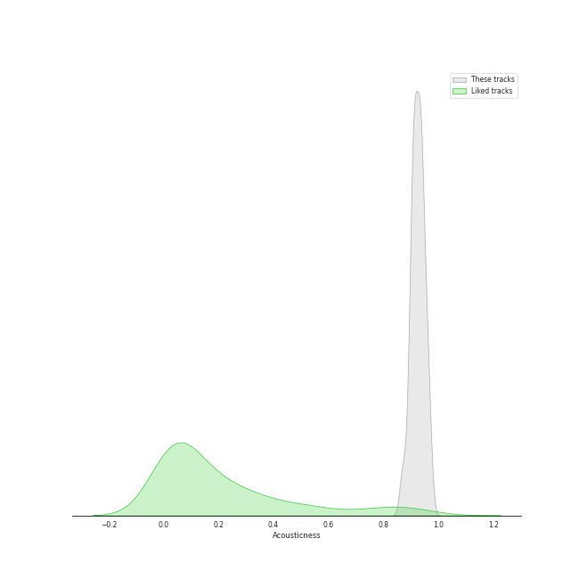
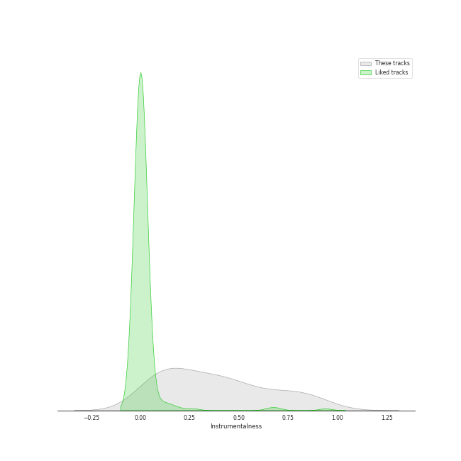
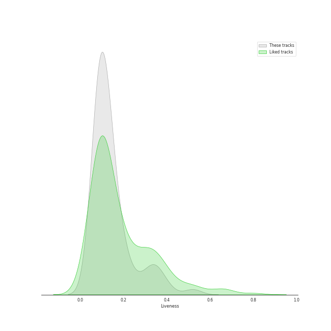
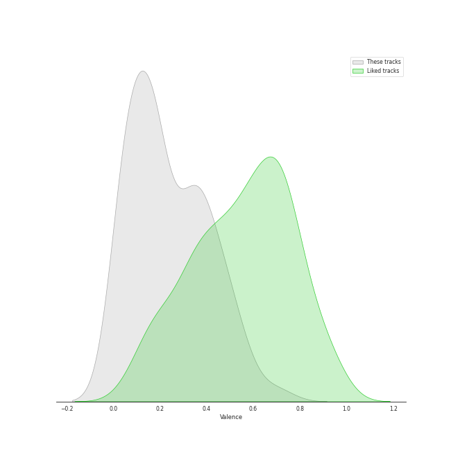
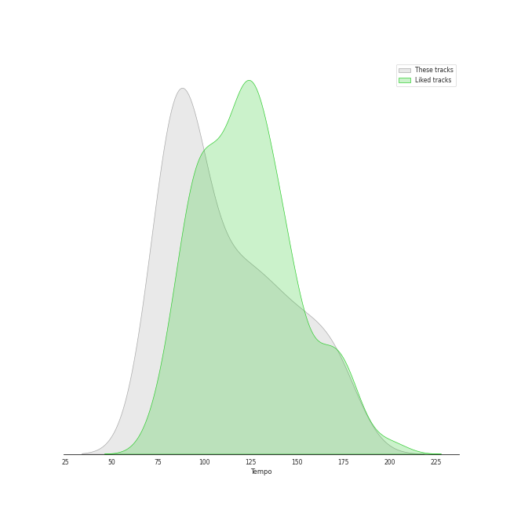

# Track Features for Tokyo String Quartet

## Danceability

| ​ | 10 most Danceable tracks | ​​ | 10 least Danceable tracks |
|:---|:---|:---|:---|
|  | String Quartet No. 2 in G Major, Op. 18, No. 2: IV. Allegro molto, quasi presto (0.527) |  | String Quartet No. 8 in E Minor, Op. 59 No. 2: II. Molto adagio (0.0914) |
|  | String Quartet No. 4 in C Minor, Op. 18, No. 4: II. Andante scherzoso quasi allegretto (0.496) |  | String Quartet No. 15 in A minor, Op. 132: III. Molto adagio (0.105) |
|  | String Quartet No. 5 in A Major, Op. 18 No. 5: I. Allegro (0.475) |  | String Quartet No. 16 in F Major, Op. 135: III. Lento assai, cantate e tranquillo - Più lento (0.111) |
|  | String Quartet No. 1 in F Major, Op. 18 No. 1: IV. Allegro (0.467) |  | String Quartet No. 1 in F Major, Op. 18 No. 1: II. Adagio affettuoso ed appassionato (0.125) |
|  | String Quartet No. 13 in B-Flat Major, Op. 130: II. Presto (0.465) |  | String Quartet No. 14 in C-Sharp Minor, Op. 131: I. Adagio ma non troppo e molto espressivo (0.135) |
|  | String Quartet No. 6 in B-Flat Major, Op. 18 No. 6: I. Allegro con brio (0.464) |  | String Quartet No. 10 in E-Flat Major, Op. 74 "Harp": II. Adagio ma non troppo (0.145) |
|  | String Quartet No. 6 in B-Flat Major, Op. 18 No. 6: III. Scherzo (Allegro) - Trio (0.462) |  | String Quartet No. 9 in C Major, Op. 59 No. 3: II. Andante con moto quasi Allegretto (0.158) |
|  | String Quartet No. 3 in D Major, Op. 18: III. Allegro (0.46) |  | String Quartet No. 13 in B-Flat Major, Op. 130: V. Cavatina (Adagio molto espressivo) (0.163) |
|  | String Quartet No. 2 in G Major, Op. 18, No. 2: III. Scherzo (Allegro) - Trio (0.459) |  | String Quartet No. 2 in G Major, Op. 18, No. 2: II. Adagio cantabile - Allegro (0.168) |
|  | String Quartet No. 9 in C Major, Op. 59 No. 3: IV. Finale (Allegro molto) (0.452) |  | String Quartet No. 11 in F Minor, Op. 95 "Quartetto serioso": II. Allegretto ma non troppo (0.183) |

## Energy

| ​ | 10 most Energetic tracks | ​​ | 10 least Energetic tracks |
|:---|:---|:---|:---|
|  | String Quartet No. 16 in F Major, Op. 135: II. Vivace (0.253) |  | String Quartet No. 14 in C-Sharp Minor, Op. 131: III. Allegro moderato - Adagio - Piu vivace (0.00881) |
|  | String Quartet No. 9 in C Major, Op. 59 No. 3: IV. Finale (Allegro molto) (0.23) |  | String Quartet No. 8 in E Minor, Op. 59 No. 2: II. Molto adagio (0.0142) |
|  | String Quartet No. 10 in E-Flat Major, Op. 74 "Harp": III. Presto - Più presto quasi prestissimo (0.228) |  | String Quartet No. 9 in C Major, Op. 59 No. 3: II. Andante con moto quasi Allegretto (0.0251) |
|  | Grosse Fuge, Op. 133 (0.209) |  | String Quartet No. 6 in B-Flat Major, Op. 18 No. 6: II. Adagio ma non troppo (0.0254) |
|  | String Quartet No. 3 in D Major, Op. 18: IV. Presto (0.183) |  | String Quartet No. 14 in C-Sharp Minor, Op. 131: VI. Adagio quasi un poco andante (0.0274) |
|  | String Quartet No. 14 in C-Sharp Minor, Op. 131: V. Presto (0.182) |  | String Quartet No. 7 In F Major, Op. 59 No. 1: III. Adagio molto e mesto (0.0284) |
|  | String Quartet No. 2 in G Major, Op. 18, No. 2: IV. Allegro molto, quasi presto (0.158) |  | String Quartet No. 14 in C-Sharp Minor, Op. 131: IV. Andante ma non troppo e molto cantabile (0.0304) |
|  | String Quartet No. 4 in C Minor, Op. 18 No. 4: IV. Allegretto – Prestissimo (0.152) |  | String Quartet No. 9 in C Major, Op. 59 No. 3: III. Menuetto (Grazioso) (0.0355) |
|  | String Quartet No. 7 In F Major, Op. 59 No. 1: IV. Theme russe (Allegro) (0.149) |  | String Quartet No. 14 in C-Sharp Minor, Op. 131: I. Adagio ma non troppo e molto espressivo (0.0371) |
|  | String Quartet No. 13 in B-Flat Major, Op. 130: VI. Finale (Allegro) (0.147) |  | String Quartet No. 12 in E-Flat Major, Op. 127: II. Adagio, ma non troppo e molto cantabile (0.0411) |

## Speechiness

| ​ | 10 most Speechy tracks | ​​ | 10 least Speechy tracks |
|:---|:---|:---|:---|
|  | String Quartet No. 11 in F Minor, Op. 95 "Quartetto serioso": III. Allegro assai - Vivace ma serioso (0.0807) |  | String Quartet No. 10 in E-Flat Major, Op. 74 "Harp": III. Presto - Più presto quasi prestissimo (0.0349) |
|  | String Quartet No. 4 in C Minor, Op. 18, No. 4: II. Andante scherzoso quasi allegretto (0.0682) |  | String Quartet No. 9 in C Major, Op. 59 No. 3: IV. Finale (Allegro molto) (0.0362) |
|  | String Quartet No. 1 in F Major, Op. 18 No. 1: I. Allegro con brio (0.0636) |  | String Quartet No. 14 in C-Sharp Minor, Op. 131: III. Allegro moderato - Adagio - Piu vivace (0.0387) |
|  | String Quartet No. 6 in B-Flat Major, Op. 18 No. 6: III. Scherzo (Allegro) - Trio (0.0614) |  | String Quartet No. 10 in E-Flat Major, Op. 74 "Harp": IV. Allegretto con Variazioni (0.0394) |
|  | String Quartet No. 5 in A Major, Op. 18 No. 5: I. Allegro (0.0609) |  | String Quartet No. 13 in B-Flat Major, Op. 130: VI. Finale (Allegro) (0.0395) |
|  | Grosse Fuge, Op. 133 (0.0597) |  | String Quartet No. 13 in B-Flat Major, Op. 130: III. Andante con moto ma non troppo (0.0395) |
|  | String Quartet No. 12 in E-Flat Major, Op. 127: III. Scherzando vivace (0.0588) |  | String Quartet No. 13 in B-Flat Major, Op. 130: II. Presto (0.0399) |
|  | String Quartet No. 7 In F Major, Op. 59 No. 1: II. Allegretto vivace e sempre scherzando (0.0588) |  | String Quartet No. 4 in C Minor, Op. 18 No. 4: IV. Allegretto – Prestissimo (0.0416) |
|  | String Quartet No. 2 in G Major, Op. 18, No. 2: I. Allegro (0.058) |  | String Quartet No. 6 in B-Flat Major, Op. 18 No. 6: I. Allegro con brio (0.0418) |
|  | String Quartet No. 16 in F Major, Op. 135: IV. Grave ma non troppo tratto - Allegro (0.0577) |  | String Quartet No. 3 in D Major, Op. 18: IV. Presto (0.0421) |

## Acousticness

| ​ | 10 most Acoustic tracks | ​​ | 10 least Acoustic tracks |
|:---|:---|:---|:---|
|  | String Quartet No. 15 in A minor, Op. 132: II. Allegro ma non tanto (0.974) |  | String Quartet No. 15 in A minor, Op. 132: III. Molto adagio (0.865) |
|  | String Quartet No. 4 in C Minor, Op. 18 No. 4: III. Menuetto (Allegro) - Trio (0.972) |  | String Quartet No. 16 in F Major, Op. 135: III. Lento assai, cantate e tranquillo - Più lento (0.869) |
|  | String Quartet No. 15 in A minor, Op. 132: IV. Alla marcia, assai vivace - Più Allegro (0.964) |  | String Quartet No. 11 in F Minor, Op. 95 "Serioso": I. Allegro con brio (0.877) |
|  | String Quartet No. 5 in A Major, Op. 18 No. 5: II. Menuetto - Trio (0.963) |  | String Quartet No. 14 in C-Sharp Minor, Op. 131: V. Presto (0.887) |
|  | String Quartet No. 15 in A minor, Op. 132: I. Assai sostenuto - Allegro (0.961) |  | String Quartet No. 9 in C Major, Op. 59 No. 3: IV. Finale (Allegro molto) (0.89) |
|  | String Quartet No. 13 in B-Flat Major, Op. 130: I. Adagio ma non troppo – Allegro (0.96) |  | String Quartet No. 2 in G Major, Op. 18, No. 2: II. Adagio cantabile - Allegro (0.892) |
|  | String Quartet No. 6 in B-Flat Major, Op. 18 No. 6: II. Adagio ma non troppo (0.959) |  | String Quartet No. 8 in E Minor, Op. 59 No. 2: IV. Finale (Presto) (0.899) |
|  | String Quartet No. 6 in B-Flat Major, Op. 18 No. 6: I. Allegro con brio (0.956) |  | String Quartet No. 12 in E-Flat Major, Op. 127: III. Scherzando vivace (0.899) |
|  | String Quartet No. 13 in B-Flat Major, Op. 130: V. Cavatina (Adagio molto espressivo) (0.955) |  | String Quartet No. 10 in E-Flat Major, Op. 74 "Harp": II. Adagio ma non troppo (0.9) |
|  | String Quartet No. 4 in C Minor, Op. 18 No. 4: IV. Allegretto – Prestissimo (0.953) |  | String Quartet No. 14 in C-Sharp Minor, Op. 131: VI. Adagio quasi un poco andante (0.901) |

## Instrumentalness

| ​ | 10 most Instrumental tracks | ​​ | 10 least Instrumental tracks |
|:---|:---|:---|:---|
|  | String Quartet No. 14 in C-Sharp Minor, Op. 131: VI. Adagio quasi un poco andante (0.97) |  | String Quartet No. 6 in B-Flat Major, Op. 18 No. 6: II. Adagio ma non troppo (0.00346) |
|  | String Quartet No. 9 in C Major, Op. 59 No. 3: IV. Finale (Allegro molto) (0.885) |  | String Quartet No. 2 in G Major, Op. 18, No. 2: I. Allegro (0.0207) |
|  | String Quartet No. 16 in F Major, Op. 135: II. Vivace (0.881) |  | String Quartet No. 1 in F Major, Op. 18 No. 1: II. Adagio affettuoso ed appassionato (0.0515) |
|  | String Quartet No. 10 in E-Flat Major, Op. 74 "Harp": III. Presto - Più presto quasi prestissimo (0.863) |  | String Quartet No. 13 in B-Flat Major, Op. 130: IV. Alla danza tedesca (allegro assai) (0.0559) |
|  | String Quartet No. 13 in B-Flat Major, Op. 130: V. Cavatina (Adagio molto espressivo) (0.849) |  | String Quartet No. 14 in C-Sharp Minor, Op. 131: II. Allegro molto vivace (0.059) |
|  | String Quartet No. 10 in E-Flat Major, Op. 74 "Harp": II. Adagio ma non troppo (0.844) |  | String Quartet No. 14 in C-Sharp Minor, Op. 131: IV. Andante ma non troppo e molto cantabile (0.0637) |
|  | String Quartet No. 6 in B-Flat Major, Op. 18 No. 6: III. Scherzo (Allegro) - Trio (0.819) |  | String Quartet No. 8 in E Minor, Op. 59 No. 2: IV. Finale (Presto) (0.0647) |
|  | String Quartet No. 10 in E-Flat Major, Op. 74 "Harp": IV. Allegretto con Variazioni (0.803) |  | String Quartet No. 1 in F Major, Op. 18 No. 1: IV. Allegro (0.07) |
|  | String Quartet No. 9 in C Major, Op. 59 No. 3: III. Menuetto (Grazioso) (0.785) |  | String Quartet No. 5 in A Major, Op. 18 No. 5: II. Menuetto - Trio (0.0749) |
|  | String Quartet No. 11 in F Minor, Op. 95 "Serioso": I. Allegro con brio (0.755) |  | String Quartet No. 4 in C Minor, Op. 18 No. 4: III. Menuetto (Allegro) - Trio (0.0754) |

## Liveness

| ​ | 10 most Live tracks | ​​ | 10 least Live tracks |
|:---|:---|:---|:---|
|  | String Quartet No. 10 in E-Flat Major, Op. 74 "Harp": III. Presto - Più presto quasi prestissimo (0.52) |  | String Quartet No. 8 in E Minor, Op. 59 No. 2: I. Allegro (0.0611) |
|  | String Quartet No. 13 in B-Flat Major, Op. 130: I. Adagio ma non troppo – Allegro (0.402) |  | String Quartet No. 5 in A Major, Op. 18 No. 5: II. Menuetto - Trio (0.0625) |
|  | String Quartet No. 5 in A Major, Op. 18 No. 5: IV. Allegro (0.368) |  | String Quartet No. 6 in B-Flat Major, Op. 18 No. 6: III. Scherzo (Allegro) - Trio (0.0631) |
|  | String Quartet No. 16 in F Major, Op. 135: I. Allegretto (0.35) |  | String Quartet No. 2 in G Major, Op. 18, No. 2: IV. Allegro molto, quasi presto (0.0653) |
|  | String Quartet No. 1 in F Major, Op. 18 No. 1: IV. Allegro (0.34) |  | String Quartet No. 3 in D Major, Op. 18: I. Allegro (0.0669) |
|  | Grosse Fuge, Op. 133 (0.332) |  | String Quartet No. 12 in E-Flat Major, Op. 127: III. Scherzando vivace (0.0716) |
|  | String Quartet No. 10 in E-Flat Major, Op. 74 "Harp": I. Poco Adagio - Allegro (0.331) |  | String Quartet No. 6 in B-Flat Major, Op. 18 No. 6: IV. Adagio "La Malinconia" - Allegretto quasi allegro (0.0732) |
|  | String Quartet No. 15 in A minor, Op. 132: I. Assai sostenuto - Allegro (0.293) |  | String Quartet No. 16 in F Major, Op. 135: III. Lento assai, cantate e tranquillo - Più lento (0.0748) |
|  | String Quartet No. 13 in B-Flat Major, Op. 130: IV. Alla danza tedesca (allegro assai) (0.271) |  | String Quartet No. 4 in C Minor, Op. 18, No. 4: II. Andante scherzoso quasi allegretto (0.0757) |
|  | String Quartet No. 15 in A minor, Op. 132: IV. Alla marcia, assai vivace - Più Allegro (0.228) |  | String Quartet No. 4 in C Minor, Op. 18 No. 4: I. Allegro ma non tanto (0.0758) |

## Valence

| ​ | 10 most Happy tracks | ​​ | 10 least Happy tracks |
|:---|:---|:---|:---|
|  | String Quartet No. 6 in B-Flat Major, Op. 18 No. 6: III. Scherzo (Allegro) - Trio (0.705) |  | String Quartet No. 16 in F Major, Op. 135: III. Lento assai, cantate e tranquillo - Più lento (0.0347) |
|  | String Quartet No. 16 in F Major, Op. 135: II. Vivace (0.581) |  | String Quartet No. 8 in E Minor, Op. 59 No. 2: II. Molto adagio (0.0377) |
|  | String Quartet No. 14 in C-Sharp Minor, Op. 131: V. Presto (0.539) |  | String Quartet No. 13 in B-Flat Major, Op. 130: V. Cavatina (Adagio molto espressivo) (0.0383) |
|  | String Quartet No. 2 in G Major, Op. 18, No. 2: III. Scherzo (Allegro) - Trio (0.529) |  | String Quartet No. 1 in F Major, Op. 18 No. 1: II. Adagio affettuoso ed appassionato (0.0383) |
|  | String Quartet No. 4 in C Minor, Op. 18 No. 4: IV. Allegretto – Prestissimo (0.505) |  | String Quartet No. 10 in E-Flat Major, Op. 74 "Harp": II. Adagio ma non troppo (0.0386) |
|  | String Quartet No. 10 in E-Flat Major, Op. 74 "Harp": III. Presto - Più presto quasi prestissimo (0.491) |  | String Quartet No. 15 in A minor, Op. 132: III. Molto adagio (0.0386) |
|  | String Quartet No. 3 in D Major, Op. 18: IV. Presto (0.487) |  | String Quartet No. 14 in C-Sharp Minor, Op. 131: I. Adagio ma non troppo e molto espressivo (0.0388) |
|  | String Quartet No. 1 in F Major, Op. 18 No. 1: IV. Allegro (0.47) |  | String Quartet No. 14 in C-Sharp Minor, Op. 131: VI. Adagio quasi un poco andante (0.0391) |
|  | String Quartet No. 13 in B-Flat Major, Op. 130: VI. Finale (Allegro) (0.446) |  | String Quartet No. 7 In F Major, Op. 59 No. 1: III. Adagio molto e mesto (0.0393) |
|  | String Quartet No. 13 in B-Flat Major, Op. 130: II. Presto (0.435) |  | String Quartet No. 6 in B-Flat Major, Op. 18 No. 6: IV. Adagio "La Malinconia" - Allegretto quasi allegro (0.0461) |

## Tempo

| ​ | 10 most Fast tracks | ​​ | 10 least Fast tracks |
|:---|:---|:---|:---|
|  | String Quartet No. 11 in F Minor, Op. 95 "Quartetto serioso": III. Allegro assai - Vivace ma serioso (179.045) |  | String Quartet No. 2 in G Major, Op. 18, No. 2: II. Adagio cantabile - Allegro (73.447) |
|  | String Quartet No. 12 in E-Flat Major, Op. 127: III. Scherzando vivace (174.606) |  | Grosse Fuge, Op. 133 (74.161) |
|  | String Quartet No. 3 in D Major, Op. 18: IV. Presto (171.742) |  | String Quartet No. 16 in F Major, Op. 135: IV. Grave ma non troppo tratto - Allegro (75.432) |
|  | String Quartet No. 6 in B-Flat Major, Op. 18 No. 6: III. Scherzo (Allegro) - Trio (171.063) |  | String Quartet No. 9 in C Major, Op. 59 No. 3: IV. Finale (Allegro molto) (76.074) |
|  | String Quartet No. 7 In F Major, Op. 59 No. 1: II. Allegretto vivace e sempre scherzando (168.809) |  | String Quartet No. 11 in F Minor, Op. 95 "Quartetto serioso": IV. Larghetto espressivo – Allegretto agitato – Allegro (76.52) |
|  | String Quartet No. 15 in A minor, Op. 132: V. Allegro appassionato - Presto (168.282) |  | String Quartet No. 10 in E-Flat Major, Op. 74 "Harp": I. Poco Adagio - Allegro (77.638) |
|  | String Quartet No. 4 in C Minor, Op. 18, No. 4: II. Andante scherzoso quasi allegretto (162.815) |  | String Quartet No. 15 in A minor, Op. 132: II. Allegro ma non tanto (79.596) |
|  | String Quartet No. 12 in E-Flat Major, Op. 127: I. Maestoso - Allegro (161.33) |  | String Quartet No. 8 in E Minor, Op. 59 No. 2: III. Allegretto (80.498) |
|  | String Quartet No. 1 in F Major, Op. 18 No. 1: III. Scherzo (Allegro molto) - Trio (158.573) |  | String Quartet No. 1 in F Major, Op. 18 No. 1: II. Adagio affettuoso ed appassionato (81.636) |
|  | String Quartet No. 2 in G Major, Op. 18, No. 2: III. Scherzo (Allegro) - Trio (157.888) |  | String Quartet No. 9 in C Major, Op. 59 No. 3: II. Andante con moto quasi Allegretto (81.675) |
