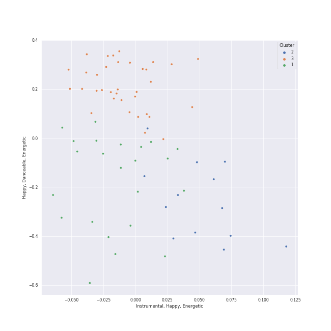

# Clusters in Tokyo String Quartet

## Cluster #1

23 tracks

| Art | Track | Album | Artists | Label | Rank | 💚 | 🔗 |
|:---|:---|:---|:---|:---|---:|:---|:---|
|  | String Quartet No. 16 in F Major, Op. 135: IV. Grave ma non troppo tratto - Allegro | Beethoven: Complete String Quartets | [Ludwig van Beethoven](../../../ludwig_van_beethoven/overview.md), [Tokyo String Quartet](../../overview.md) | [harmonia mundi](../../../../labels/harmonia_mundi) | 922 | | [🔗](https://open.spotify.com/track/17gcQZt0jMDbuEyOFaSyBI) |
|  | String Quartet No. 8 in E Minor, Op. 59 No. 2: III. Allegretto | Beethoven: Complete String Quartets | [Ludwig van Beethoven](../../../ludwig_van_beethoven/overview.md), [Tokyo String Quartet](../../overview.md) | [harmonia mundi](../../../../labels/harmonia_mundi) | 922 | | [🔗](https://open.spotify.com/track/1e0KnK30nx7GxphZVx7DFI) |
|  | String Quartet No. 11 in F Minor, Op. 95 "Quartetto serioso": II. Allegretto ma non troppo | Beethoven: Complete String Quartets | [Ludwig van Beethoven](../../../ludwig_van_beethoven/overview.md), [Tokyo String Quartet](../../overview.md) | [harmonia mundi](../../../../labels/harmonia_mundi) | 922 | | [🔗](https://open.spotify.com/track/226cSHopDmYFnLbzeGi5HV) |
|  | String Quartet No. 11 in F Minor, Op. 95 "Quartetto serioso": IV. Larghetto espressivo – Allegretto agitato – Allegro | Beethoven: Complete String Quartets | [Ludwig van Beethoven](../../../ludwig_van_beethoven/overview.md), [Tokyo String Quartet](../../overview.md) | [harmonia mundi](../../../../labels/harmonia_mundi) | 922 | | [🔗](https://open.spotify.com/track/51TlHN7aV2jUH1wNIJvgKS) |
|  | String Quartet No. 15 in A minor, Op. 132: II. Allegro ma non tanto | Beethoven: Complete String Quartets | [Ludwig van Beethoven](../../../ludwig_van_beethoven/overview.md), [Tokyo String Quartet](../../overview.md) | [harmonia mundi](../../../../labels/harmonia_mundi) | 922 | | [🔗](https://open.spotify.com/track/52afsywDcOS3ApCQET7k5J) |
|  | String Quartet No. 9 in C Major, Op. 59 No. 3: I. Introduzione (Andante con moto - Allegro vivace) | Beethoven: Complete String Quartets | [Ludwig van Beethoven](../../../ludwig_van_beethoven/overview.md), [Tokyo String Quartet](../../overview.md) | [harmonia mundi](../../../../labels/harmonia_mundi) | 922 | | [🔗](https://open.spotify.com/track/5bUQPchwRlyhMMNP7OYrcW) |
|  | String Quartet No. 14 in C-Sharp Minor, Op. 131: I. Adagio ma non troppo e molto espressivo | Beethoven: Complete String Quartets | [Ludwig van Beethoven](../../../ludwig_van_beethoven/overview.md), [Tokyo String Quartet](../../overview.md) | [harmonia mundi](../../../../labels/harmonia_mundi) | 922 | | [🔗](https://open.spotify.com/track/5vyWSi9S7IGHdxBqrEpdGR) |
|  | String Quartet No. 15 in A minor, Op. 132: III. Molto adagio | Beethoven: Complete String Quartets | [Ludwig van Beethoven](../../../ludwig_van_beethoven/overview.md), [Tokyo String Quartet](../../overview.md) | [harmonia mundi](../../../../labels/harmonia_mundi) | 922 | | [🔗](https://open.spotify.com/track/6z4iTB0VGpBh2kOaqf2Ucv) |
|  | String Quartet No. 15 in A minor, Op. 132: V. Allegro appassionato - Presto | Beethoven: Complete String Quartets | [Ludwig van Beethoven](../../../ludwig_van_beethoven/overview.md), [Tokyo String Quartet](../../overview.md) | [harmonia mundi](../../../../labels/harmonia_mundi) | 922 | | [🔗](https://open.spotify.com/track/7oIlqfDug1iDhuWUscjgPy) |
|  | String Quartet No. 15 in A minor, Op. 132: I. Assai sostenuto - Allegro | Beethoven: Complete String Quartets | [Ludwig van Beethoven](../../../ludwig_van_beethoven/overview.md), [Tokyo String Quartet](../../overview.md) | [harmonia mundi](../../../../labels/harmonia_mundi) | 922 | | [🔗](https://open.spotify.com/track/7wEpfZjWkbmhx7OtzL3CKn) |
## Cluster #2

13 tracks

| Art | Track | Album | Artists | Label | Rank | 💚 | 🔗 |
|:---|:---|:---|:---|:---|---:|:---|:---|
|  | String Quartet No. 9 in C Major, Op. 59 No. 3: IV. Finale (Allegro molto) | Beethoven: Complete String Quartets | [Ludwig van Beethoven](../../../ludwig_van_beethoven/overview.md), [Tokyo String Quartet](../../overview.md) | [harmonia mundi](../../../../labels/harmonia_mundi) | 922 | | [🔗](https://open.spotify.com/track/1KM3GCkFAaob2g2GRTSeum) |
|  | String Quartet No. 2 in G Major, Op. 18, No. 2: IV. Allegro molto, quasi presto | Beethoven: Complete String Quartets | [Ludwig van Beethoven](../../../ludwig_van_beethoven/overview.md), [Tokyo String Quartet](../../overview.md) | [harmonia mundi](../../../../labels/harmonia_mundi) | 922 | | [🔗](https://open.spotify.com/track/1bBEs2AN1gdZA3qoTpFvh9) |
|  | String Quartet No. 5 in A Major, Op. 18 No. 5: IV. Allegro | Beethoven: Complete String Quartets | [Ludwig van Beethoven](../../../ludwig_van_beethoven/overview.md), [Tokyo String Quartet](../../overview.md) | [harmonia mundi](../../../../labels/harmonia_mundi) | 922 | | [🔗](https://open.spotify.com/track/1xooWRi29x4214VEUWnhlV) |
|  | String Quartet No. 10 in E-Flat Major, Op. 74 "Harp": IV. Allegretto con Variazioni | Beethoven: Complete String Quartets | [Ludwig van Beethoven](../../../ludwig_van_beethoven/overview.md), [Tokyo String Quartet](../../overview.md) | [harmonia mundi](../../../../labels/harmonia_mundi) | 922 | | [🔗](https://open.spotify.com/track/40oN50qAShuDPpHz2ECp0f) |
|  | String Quartet No. 4 in C Minor, Op. 18 No. 4: IV. Allegretto – Prestissimo | Beethoven: Complete String Quartets | [Ludwig van Beethoven](../../../ludwig_van_beethoven/overview.md), [Tokyo String Quartet](../../overview.md) | [harmonia mundi](../../../../labels/harmonia_mundi) | 922 | | [🔗](https://open.spotify.com/track/4CSgXeoeJ4cj3xWqSzDqYM) |
|  | String Quartet No. 6 in B-Flat Major, Op. 18 No. 6: I. Allegro con brio | Beethoven: Complete String Quartets | [Ludwig van Beethoven](../../../ludwig_van_beethoven/overview.md), [Tokyo String Quartet](../../overview.md) | [harmonia mundi](../../../../labels/harmonia_mundi) | 922 | | [🔗](https://open.spotify.com/track/4FPrp3dlfffetVoIXrcSKC) |
|  | String Quartet No. 12 in E-Flat Major, Op. 127: IV. Allegro | Beethoven: Complete String Quartets | [Ludwig van Beethoven](../../../ludwig_van_beethoven/overview.md), [Tokyo String Quartet](../../overview.md) | [harmonia mundi](../../../../labels/harmonia_mundi) | 922 | | [🔗](https://open.spotify.com/track/4ISm6kQAIhwTC4Otw2G7gQ) |
|  | String Quartet No. 3 in D Major, Op. 18: IV. Presto | Beethoven: Complete String Quartets | [Ludwig van Beethoven](../../../ludwig_van_beethoven/overview.md), [Tokyo String Quartet](../../overview.md) | [harmonia mundi](../../../../labels/harmonia_mundi) | 922 | | [🔗](https://open.spotify.com/track/4v3aIB4HSAHNBVXlsa1J7l) |
|  | String Quartet No. 14 in C-Sharp Minor, Op. 131: V. Presto | Beethoven: Complete String Quartets | [Ludwig van Beethoven](../../../ludwig_van_beethoven/overview.md), [Tokyo String Quartet](../../overview.md) | [harmonia mundi](../../../../labels/harmonia_mundi) | 922 | | [🔗](https://open.spotify.com/track/5bMNqPkGepFdZU9WcN3oEk) |
|  | String Quartet No. 16 in F Major, Op. 135: II. Vivace | Beethoven: Complete String Quartets | [Ludwig van Beethoven](../../../ludwig_van_beethoven/overview.md), [Tokyo String Quartet](../../overview.md) | [harmonia mundi](../../../../labels/harmonia_mundi) | 922 | | [🔗](https://open.spotify.com/track/6MLcMKBVoM7iPeTTkGwWlg) |
## Cluster #3

35 tracks

| Art | Track | Album | Artists | Label | Rank | 💚 | 🔗 |
|:---|:---|:---|:---|:---|---:|:---|:---|
|  | String Quartet No. 4 in C Minor, Op. 18 No. 4: III. Menuetto (Allegro) - Trio | Beethoven: Complete String Quartets | [Ludwig van Beethoven](../../../ludwig_van_beethoven/overview.md), [Tokyo String Quartet](../../overview.md) | [harmonia mundi](../../../../labels/harmonia_mundi) | 922 | | [🔗](https://open.spotify.com/track/0FDBvZ6wjjGW15jlH3vVFt) |
|  | String Quartet No. 14 in C-Sharp Minor, Op. 131: III. Allegro moderato - Adagio - Piu vivace | Beethoven: Complete String Quartets | [Ludwig van Beethoven](../../../ludwig_van_beethoven/overview.md), [Tokyo String Quartet](../../overview.md) | [harmonia mundi](../../../../labels/harmonia_mundi) | 922 | | [🔗](https://open.spotify.com/track/0qAphY2YKqhNBrYaWucjQu) |
|  | String Quartet No. 12 in E-Flat Major, Op. 127: I. Maestoso - Allegro | Beethoven: Complete String Quartets | [Ludwig van Beethoven](../../../ludwig_van_beethoven/overview.md), [Tokyo String Quartet](../../overview.md) | [harmonia mundi](../../../../labels/harmonia_mundi) | 922 | | [🔗](https://open.spotify.com/track/1Oj4z7SesvJsdi52adQHkG) |
|  | String Quartet No. 7 In F Major, Op. 59 No. 1: II. Allegretto vivace e sempre scherzando | Beethoven: Complete String Quartets | [Ludwig van Beethoven](../../../ludwig_van_beethoven/overview.md), [Tokyo String Quartet](../../overview.md) | [harmonia mundi](../../../../labels/harmonia_mundi) | 922 | | [🔗](https://open.spotify.com/track/2T4zPGpKePodbDlA9LHMDj) |
|  | String Quartet No. 5 in A Major, Op. 18 No. 5: II. Menuetto - Trio | Beethoven: Complete String Quartets | [Ludwig van Beethoven](../../../ludwig_van_beethoven/overview.md), [Tokyo String Quartet](../../overview.md) | [harmonia mundi](../../../../labels/harmonia_mundi) | 922 | | [🔗](https://open.spotify.com/track/33qw9cPdfAYL9nYW6Y1ODN) |
|  | String Quartet No. 3 in D Major, Op. 18: I. Allegro | Beethoven: Complete String Quartets | [Ludwig van Beethoven](../../../ludwig_van_beethoven/overview.md), [Tokyo String Quartet](../../overview.md) | [harmonia mundi](../../../../labels/harmonia_mundi) | 922 | | [🔗](https://open.spotify.com/track/4UbcuUdeuzNJDajkn0ger7) |
|  | String Quartet No. 5 in A Major, Op. 18 No. 5: III. Andante cantabile | Beethoven: Complete String Quartets | [Ludwig van Beethoven](../../../ludwig_van_beethoven/overview.md), [Tokyo String Quartet](../../overview.md) | [harmonia mundi](../../../../labels/harmonia_mundi) | 922 | | [🔗](https://open.spotify.com/track/4WOEg6BxJIlMVx3mz8gJSw) |
|  | String Quartet No. 8 in E Minor, Op. 59 No. 2: IV. Finale (Presto) | Beethoven: Complete String Quartets | [Ludwig van Beethoven](../../../ludwig_van_beethoven/overview.md), [Tokyo String Quartet](../../overview.md) | [harmonia mundi](../../../../labels/harmonia_mundi) | 922 | | [🔗](https://open.spotify.com/track/4xgpjUdaUAFydWQDPeFFXY) |
|  | String Quartet No. 13 in B-Flat Major, Op. 130: III. Andante con moto ma non troppo | Beethoven: Complete String Quartets | [Ludwig van Beethoven](../../../ludwig_van_beethoven/overview.md), [Tokyo String Quartet](../../overview.md) | [harmonia mundi](../../../../labels/harmonia_mundi) | 922 | | [🔗](https://open.spotify.com/track/5ZDsIt23kqzWVzusGej26t) |
|  | String Quartet No. 1 in F Major, Op. 18 No. 1: I. Allegro con brio | Beethoven: Complete String Quartets | [Ludwig van Beethoven](../../../ludwig_van_beethoven/overview.md), [Tokyo String Quartet](../../overview.md) | [harmonia mundi](../../../../labels/harmonia_mundi) | 922 | | [🔗](https://open.spotify.com/track/77ZbS58RGMl0RE3S9TLSXx) |