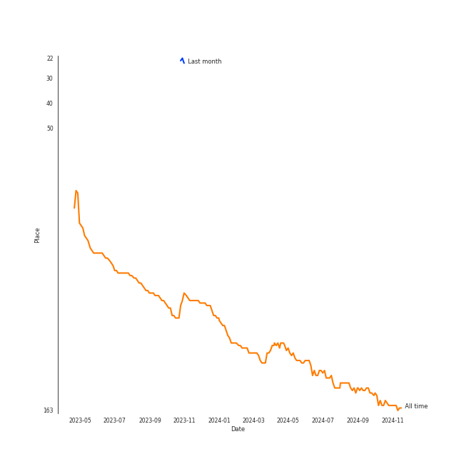

# TOMORROW X TOGETHER

[See Track Features](audio_features.md)

[See Clusters](clusters/overview.md)

## Relationships

TOMORROW X TOGETHER:
- has member 범규 (BEOMGYU)
- has member Kai Kamal Huening
- has member 수빈 (SOOBIN)
- has member 태현 (TAEHYUN)
- has member 연준 (YEONJUN)

## Artist Rank

## Top Tracks

- Devil by the Window is the #23 track of the last month
## Featured on Playlists
| Art | Tracks | Playlist |
|:---|---:|:---|
|  | 10 | [K-Pop](../../playlists/k-pop/overview.md) |
|  | 2 | [애교！](../../playlists/애교！/overview.md) |
|  | 1 | [K-Pop 101](../../playlists/k-pop_101/overview.md) |
|  | 1 | [K-Pop Favorites](../../playlists/k-pop_favorites/overview.md) |
|  | 1 | [Cursed English](../../playlists/cursed_english/overview.md) |
|  | 1 | [K-Memes](../../playlists/k-memes/overview.md) |
|  | 1 | [Halloween](../../playlists/halloween/overview.md) |

## Top Albums

| Art | Tracks | 💚 | Album | Release Date | 🔗 |
|:---|---:|---:|:---|:---|:---|
|  | 3 | 2 | The Chaos Chapter: FREEZE | 2021-05-31 | [🔗](https://open.spotify.com/album/5Zdr9vactwnJH4Vpe9Mid9) |
|  | 2 | 2 | The Name Chapter: TEMPTATION | 2023-01-27 | [🔗](https://open.spotify.com/album/7gkb4MxKe9rnoR3wxbJXJg) |
|  | 1 | 1 | minisode 2: Thursday's Child | 2022-05-09 | [🔗](https://open.spotify.com/album/1o8jYrnyZueTPIdhlHuTc8) |
|  | 1 | 1 | The Dream Chapter: MAGIC | 2019-10-21 | [🔗](https://open.spotify.com/album/5KoR6s906nbO21C9ZPdwTv) |
|  | 1 | 1 | The Chaos Chapter: FIGHT OR ESCAPE | 2021-08-17 | [🔗](https://open.spotify.com/album/2CjIfWoFITACUOlWGB7os5) |
|  | 1 | 0 | minisode1 : Blue Hour | 2020-10-26 | [🔗](https://open.spotify.com/album/2DDNDdePEx9R0bBwRqahdr) |
|  | 1 | 0 | The Dream Chapter: ETERNITY | 2020-05-18 | [🔗](https://open.spotify.com/album/4jTVGyo4fSSFniFPbfr0bW) |
|  | 1 | 0 | Cat & Dog (English Version) | 2019-05-03 | [🔗](https://open.spotify.com/album/4uJ120PsfiWOC7aV5FqGkU) |

## Top Record Labels

| Tracks | 💚 | Label |
|---:|---:|:---|
| 10 | 6 | [Republic Records](../../labels/republic_records/overview.md) |
| 1 | 1 | Imperial Distribution |

## Genres

- [k-pop](../../genres/k-pop/overview.md)
- [k-pop boy group](../../genres/k-pop_boy_group/overview.md)

## Tracks

| Art | Track | Album | Artists | Label | Rank | 💚 | 🔗 |
|:---|:---|:---|:---|:---|---:|:---|:---|
|  | Devil by the Window | The Name Chapter: TEMPTATION | [TOMORROW X TOGETHER](overview.md) | [Republic Records](../../labels/republic_records) | 427 | 💚 | [🔗](https://open.spotify.com/track/53H3sGmqiXWO4MwuZAJfyn) |
|  | Cat & Dog (English Version) | Cat & Dog (English Version) | [TOMORROW X TOGETHER](overview.md) | [Republic Records](../../labels/republic_records) | nan | | [🔗](https://open.spotify.com/track/0wzlQwQ17rpVVqgdaFNA7Q) |
|  | 9 and Three Quarters (Run Away) | The Dream Chapter: MAGIC | [TOMORROW X TOGETHER](overview.md) | Imperial Distribution | nan | 💚 | [🔗](https://open.spotify.com/track/2MsNSKQNQNRklkKFxxvIav) |
|  | Fairy of Shampoo | The Dream Chapter: ETERNITY | [TOMORROW X TOGETHER](overview.md) | [Republic Records](../../labels/republic_records) | nan | | [🔗](https://open.spotify.com/track/5JXpZcc3CeQaC6vAF1iaV5) |
|  | Blue Hour | minisode1 : Blue Hour | [TOMORROW X TOGETHER](overview.md) | [Republic Records](../../labels/republic_records) | nan | | [🔗](https://open.spotify.com/track/3ObPkJQAgjAhTwYvDhPrAW) |
|  | 0X1=LOVESONG (I Know I Love You) feat. Seori | The Chaos Chapter: FREEZE | [TOMORROW X TOGETHER](overview.md), Seori | [Republic Records](../../labels/republic_records) | nan | 💚 | [🔗](https://open.spotify.com/track/1Z8TPHiKeCUyClxV6WTTIf) |
|  | Anti-Romantic | The Chaos Chapter: FREEZE | [TOMORROW X TOGETHER](overview.md) | [Republic Records](../../labels/republic_records) | nan | 💚 | [🔗](https://open.spotify.com/track/44tTqUi3xi7E28QLzHVdUA) |
|  | Frost | The Chaos Chapter: FREEZE | [TOMORROW X TOGETHER](overview.md) | [Republic Records](../../labels/republic_records) | nan | | [🔗](https://open.spotify.com/track/3Yp61j6axuQe4nxYWvbOXy) |
|  | LO$ER=LO♡ER | The Chaos Chapter: FIGHT OR ESCAPE | [TOMORROW X TOGETHER](overview.md) | [Republic Records](../../labels/republic_records) | nan | 💚 | [🔗](https://open.spotify.com/track/21aOLk12MksET8AsbU0SI6) |
|  | Opening Sequence | minisode 2: Thursday's Child | [TOMORROW X TOGETHER](overview.md) | [Republic Records](../../labels/republic_records) | nan | 💚 | [🔗](https://open.spotify.com/track/1exxGxUMlJWD1h9YcE9YZH) |

See all tracks

| Art | Track | Album | Artists | Label | Rank | 💚 | 🔗 |
|:---|:---|:---|:---|:---|---:|:---|:---|
|  | Sugar Rush Ride | The Name Chapter: TEMPTATION | [TOMORROW X TOGETHER](overview.md) | [Republic Records](../../labels/republic_records) | nan | 💚 | [🔗](https://open.spotify.com/track/0rhI6gvOeCKA502RdJAbfs) |

