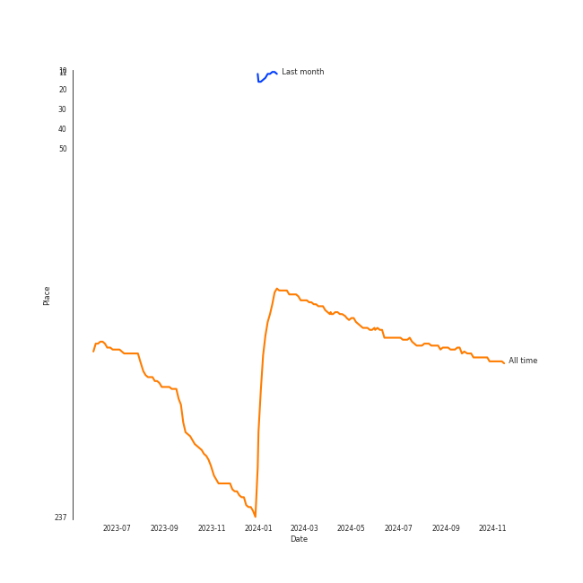

# TVXQ!

## Relationships

TVXQ!:
- has member 김재중 (Kim, Jae Joong)
- has member MAX CHANGMIN
- has member 박유천 (Park, Yoo-chun)
- has member U-KNOW
- has member XIA
- has member Yunho

## Artist Rank

## Top Tracks

### Top tracks, aggregated

## Featured on Playlists
| Art | Tracks | Playlist |
|:---|---:|:---|
|  | 8 | [K-Pop](../../playlists/k-pop/overview.md) |
|  | 2 | [Classical Samples](../../playlists/classical_samples/overview.md) |
|  | 1 | [K-Pop 101](../../playlists/k-pop_101/overview.md) |
|  | 1 | [K-Pop Favorites](../../playlists/k-pop_favorites/overview.md) |
|  | 1 | [Chill](../../playlists/chill/overview.md) |

## Top Albums

| Art | Tracks | 💚 | Album | Release Date | 🔗 |
|:---|---:|---:|:---|:---|:---|
|  | 2 | 2 | 20&2 - The 9th Album | 2023-12-26 | [🔗](https://open.spotify.com/album/4I6px53lYqErgJcsJkUNlu) |
|  | 1 | 1 | New Chapter #1: The Chance of Love - The 8th Album | 2018-03-28 | [🔗](https://open.spotify.com/album/0ipyHYAE0cMf4aDJNIDIU1) |
|  | 1 | 1 | MIROTIC - The 4th Album | 2008-09-26 | [🔗](https://open.spotify.com/album/51Wmrzs9O87YlKp2vqDwln) |
|  | 1 | 1 | Humanoids | 2012-11-26 | [🔗](https://open.spotify.com/album/2cMjjgRPQ0pCcvA7cP3S0L) |
|  | 1 | 1 | Hug | 2004-01-14 | [🔗](https://open.spotify.com/album/3cSN60IWlvmvzwiRzvjmpf) |
|  | 1 | 0 | TRI-ANGLE - 1st Album | 2004-10-01 | [🔗](https://open.spotify.com/album/1013imXHa490acqEZkQpeX) |
|  | 1 | 0 | SCREAM | 2013-09-04 | [🔗](https://open.spotify.com/album/4wOSe34mYXuiF6lyE0NUDu) |

## Top Record Labels

| Tracks | 💚 | Label |
|---:|---:|:---|
| 7 | 6 | [SM Entertainment](../../labels/sm_entertainment/overview.md) |
| 1 | 0 | [avex trax](../../labels/avex_trax/overview.md) |

## Genres

- [k-pop](../../genres/k-pop/overview.md)
- [k-pop boy group](../../genres/k-pop_boy_group/overview.md)

## Credits

### Member Credits

| | MAX CHANGMIN |
|:---|---:|
| Lyricist | 1 |
### Production Credits

| Art | Track | Members | Credit Types |
|:---|:---|:---|:---|
|  | Devil | MAX CHANGMIN | Lyricist |

## Top Producers

| Art | Producer | Tracks | Credit Types |
|:---|:---|---:|:---|
| | Thomas Troelsen | 2 | Songwriter, Arranger |
| | Mikkel Remee Sigvardt | 1 | Songwriter |
| | Lucas | 1 | Songwriter |
| | [Kenzie](../../producers/kenzie/overview.md) | 1 | Lyricist |
| | Donald Augustus Sales | 1 | Arranger, Songwriter |
| | [유영진 (Yoo, Young-jin)](../../producers/유영진_(yoo,_young-jin)/overview.md) | 1 | Arranger, Lyricist |
| | 이경남 (Lee, Kyung Nam) | 1 | Lyricist |
| | 이슬비 (Lee, Seul Bi) | 1 | Lyricist |

## Tracks

| Art | Track | Album | Artists | Label | Rank | 💚 | 🔗 |
|:---|:---|:---|:---|:---|---:|:---|:---|
|  | MIROTIC | MIROTIC - The 4th Album | [TVXQ!](overview.md) | [SM Entertainment](../../labels/sm_entertainment) | 586 | 💚 | [🔗](https://open.spotify.com/track/4BZhUnXvXYRQJPClr0hhIC) |
|  | HUG | Hug | [TVXQ!](overview.md) | [SM Entertainment](../../labels/sm_entertainment) | nan | 💚 | [🔗](https://open.spotify.com/track/3fB6z972xZddHD2SBKYCMc) |
|  | TRI-ANGLE - Extended Version | TRI-ANGLE - 1st Album | [TVXQ!](overview.md), [BoA](../boa/overview.md), TRAX | [SM Entertainment](../../labels/sm_entertainment) | nan | | [🔗](https://open.spotify.com/track/4Wkw62rPTP1v37vdwUJ1Yg) |
|  | Humanoids | Humanoids | [TVXQ!](overview.md) | [SM Entertainment](../../labels/sm_entertainment) | nan | 💚 | [🔗](https://open.spotify.com/track/6f852O1SMrPKLW597SlUXM) |
|  | SCREAM | SCREAM | [TVXQ!](overview.md) | [avex trax](../../labels/avex_trax) | nan | | [🔗](https://open.spotify.com/track/7BXpFBu8T1uW4dJLycAM6d) |
|  | 운명 The Chance of Love | New Chapter #1: The Chance of Love - The 8th Album | [TVXQ!](overview.md) | [SM Entertainment](../../labels/sm_entertainment) | nan | 💚 | [🔗](https://open.spotify.com/track/3XzxHvEomjJIKZcZqYfFut) |
|  | Rebel | 20&2 - The 9th Album | [TVXQ!](overview.md) | [SM Entertainment](../../labels/sm_entertainment) | nan | 💚 | [🔗](https://open.spotify.com/track/4Vawz7UCdavhRW1OxovN4a) |
|  | Take My Breath Away (Sung by MAX CHANGMIN) | 20&2 - The 9th Album | [TVXQ!](overview.md) | [SM Entertainment](../../labels/sm_entertainment) | nan | 💚 | [🔗](https://open.spotify.com/track/2zTirIUMNStSIdhHdlYNiq) |
