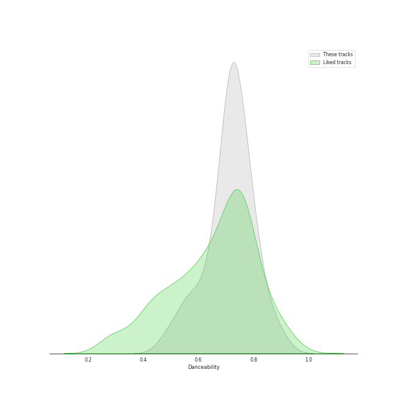
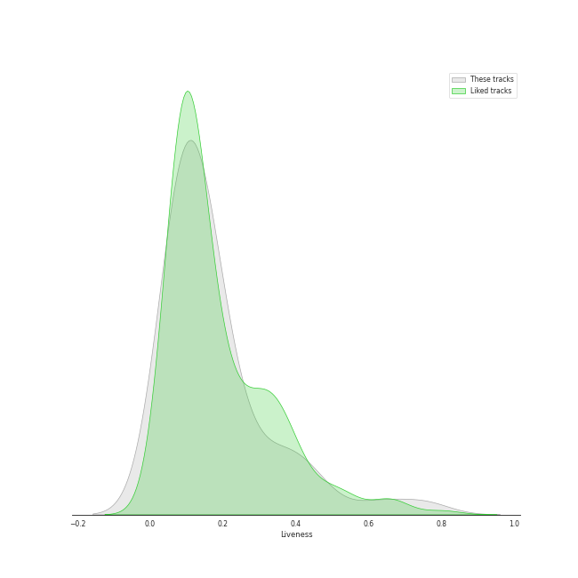
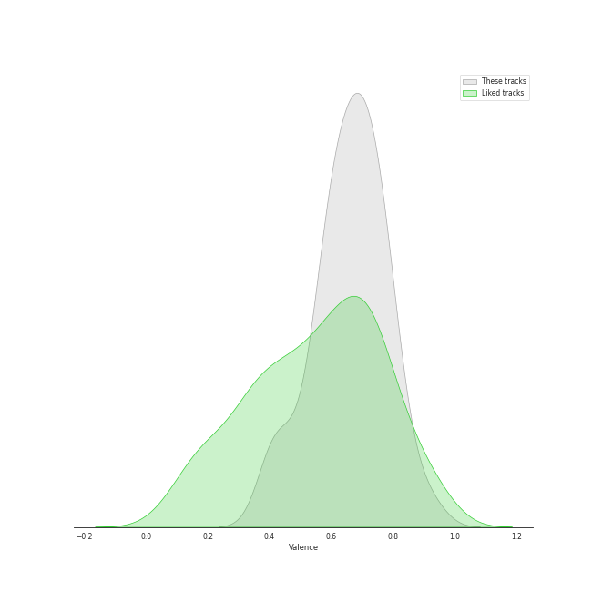

# Audio Features for TWICE

## Danceability

| 10 most Danceable tracks | 10 least Danceable tracks |
|:---|:---|
| Scandal (0.898) | BLAME IT ON ME (0.483) |
| Breakthrough (0.868) | CHEER UP (0.551) |
| CRUEL (0.84) | Heart Shaker (0.564) |
| First Time (0.812) | What is Love (0.574) |
| The Feels (0.808) | Signal (0.62) |
| HELL IN HEAVEN (0.8) | Brave (0.639) |
| LAST WALTZ (0.799) | I CAN'T STOP ME (English Version) (0.645) |
| WALLFLOWER (0.797) | 1, 3, 2 (JEONGYEON, MINA, TZUYU) (0.656) |
| SCIENTIST (0.786) | I CAN'T STOP ME (0.657) |
| Basics (0.778) | Perfect World (0.684) |

## Energy

| 10 most Energetic tracks | 10 least Energetic tracks |
|:---|:---|
| Feel Special (0.959) | Merry & Happy (0.63) |
| Heart Shaker (0.944) | BLAME IT ON ME (0.681) |
| GOT THE THRILLS (0.924) | CRY FOR ME (0.692) |
| YES or YES (0.913) | Breakthrough (0.728) |
| What is Love (0.909) | CRAZY STUPID LOVE (0.748) |
| Alcohol-Free (0.909) | First Time (0.754) |
| PUSH & PULL (JIHYO, SANA, DAHYUN) (0.907) | Signal (0.761) |
| Talk that Talk (0.907) | LAST WALTZ (0.772) |
| The Feels (0.903) | MOONLIGHT SUNRISE (0.78) |
| Likey (0.903) | Basics (0.8) |

## Speechiness

| 10 most Speechy tracks | 10 least Speechy tracks |
|:---|:---|
| Signal (0.334) | CRAZY STUPID LOVE (0.0316) |
| Basics (0.227) | Likey (0.033) |
| First Time (0.218) | YES or YES (0.0374) |
| SET ME FREE (ENG) (0.207) | Merry & Happy (0.0377) |
| PUSH & PULL (JIHYO, SANA, DAHYUN) (0.156) | I'LL SHOW YOU (0.0377) |
| SET ME FREE (0.141) | FANCY (0.0449) |
| Turtle (0.135) | 1, 3, 2 (JEONGYEON, MINA, TZUYU) (0.0463) |
| CHEER UP (0.124) | BLAME IT ON ME (0.0481) |
| Talk that Talk (0.124) | Brave (0.0483) |
| GOT THE THRILLS (0.121) | ICON (0.0484) |

## Acousticness

| 10 most Acoustic tracks | 10 least Acoustic tracks |
|:---|:---|
| Turtle (0.553) | CRUEL (0.0112) |
| Likey (0.413) | FANCY (0.0122) |
| Merry & Happy (0.403) | I'LL SHOW YOU (0.0136) |
| MOONLIGHT SUNRISE (0.401) | Feel Special (0.0296) |
| CRAZY STUPID LOVE (0.393) | MORE & MORE (0.0312) |
| PUSH & PULL (JIHYO, SANA, DAHYUN) (0.389) | MORE & MORE (English Version) (0.0313) |
| WALLFLOWER (0.294) | ICON (0.0338) |
| Basics (0.254) | Scandal (0.0397) |
| Like Ooh-Ahh (0.241) | Breakthrough (0.0439) |
| Signal (0.22) | Alcohol-Free (0.0474) |

## Instrumentalness

| 10 most Instrumental tracks | 10 least Instrumental tracks |
|:---|:---|
| Feel Special (0.00188) | SCIENTIST (0.0) |
| Scandal (0.00043) | Talk that Talk (0.0) |
| Likey (0.000377) | Perfect World (0.0) |
| TT (0.00016) | CRAZY STUPID LOVE (0.0) |
| Like Ooh-Ahh (0.000105) | CRUEL (0.0) |
| Dance The Night Away (4.73e-05) | Signal (0.0) |
| I'LL SHOW YOU (8.28e-06) | Turtle (0.0) |
| LOVE FOOLISH (4.3e-06) | GOT THE THRILLS (0.0) |
| MOONLIGHT SUNRISE (4.08e-06) | ICON (0.0) |
| YES or YES (3.72e-06) | SAY SOMETHING (0.0) |

## Liveness

| 10 most Live tracks | 10 least Live tracks |
|:---|:---|
| FANCY (0.627) | First Time (0.0495) |
| I CAN'T STOP ME (0.463) | SET ME FREE (0.0499) |
| I CAN'T STOP ME (English Version) (0.427) | LOVE FOOLISH (0.0576) |
| TT (0.399) | SET ME FREE (ENG) (0.0632) |
| Like Ooh-Ahh (0.382) | SAY SOMETHING (0.0646) |
| Perfect World (0.344) | PUSH & PULL (JIHYO, SANA, DAHYUN) (0.0658) |
| Talk that Talk (0.334) | Alcohol-Free (0.0674) |
| What is Love (0.264) | CRAZY STUPID LOVE (0.07) |
| BLAME IT ON ME (0.255) | ICON (0.0756) |
| 1, 3, 2 (JEONGYEON, MINA, TZUYU) (0.222) | The Feels (0.0816) |

## Valence

| 10 most Happy tracks | 10 least Happy tracks |
|:---|:---|
| The Feels (0.922) | TT (0.396) |
| Heart Shaker (0.857) | CRY FOR ME (0.419) |
| CRUEL (0.82) | Likey (0.443) |
| ICON (0.816) | CHEER UP (0.509) |
| Talk that Talk (0.783) | I'LL SHOW YOU (0.559) |
| Dance The Night Away (0.779) | MORE & MORE (0.562) |
| PUSH & PULL (JIHYO, SANA, DAHYUN) (0.778) | MORE & MORE (English Version) (0.567) |
| FANCY (0.775) | What is Love (0.569) |
| First Time (0.771) | LOVE FOOLISH (0.577) |
| I CAN'T STOP ME (0.769) | Basics (0.585) |

## Tempo

| 10 most Fast tracks | 10 least Fast tracks |
|:---|:---|
| Signal (207.819) | 1, 3, 2 (JEONGYEON, MINA, TZUYU) (88.938) |
| BLAME IT ON ME (177.713) | Turtle (94.985) |
| CHEER UP (172.95) | Alcohol-Free (97.097) |
| What is Love (169.966) | HELL IN HEAVEN (105.042) |
| Heart Shaker (164.062) | SAY SOMETHING (105.963) |
| Merry & Happy (154.077) | MORE & MORE (106.99) |
| I CAN'T STOP ME (150.084) | MORE & MORE (English Version) (106.998) |
| ICON (149.984) | First Time (107.03) |
| I CAN'T STOP ME (English Version) (149.959) | I'LL SHOW YOU (108.03) |
| CRY FOR ME (144.896) | WALLFLOWER (111.999) |
