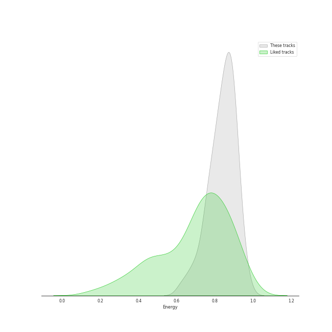
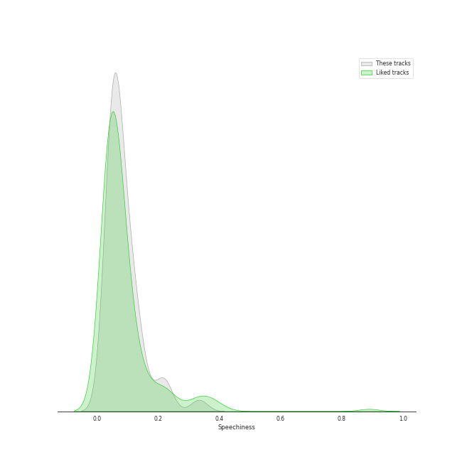
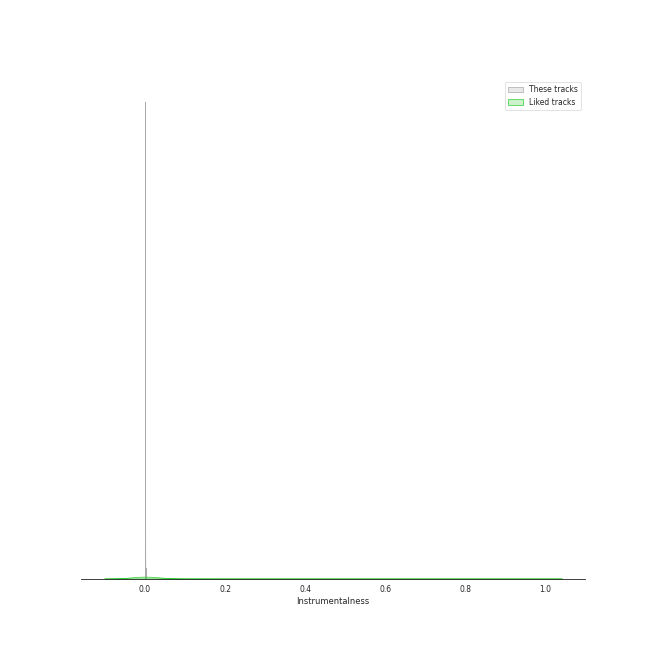
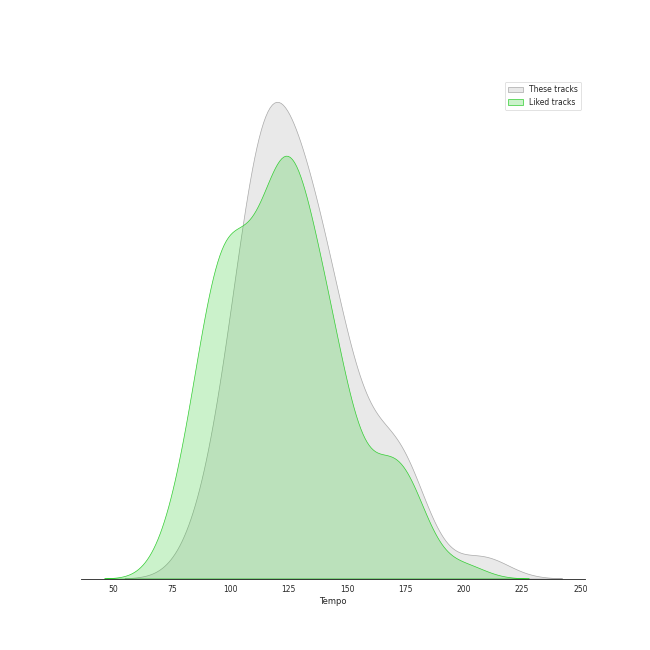

# Track Features for TWICE

## Danceability

| ​ | 10 most Danceable tracks | ​​ | 10 least Danceable tracks |
|:---|:---|:---|:---|
|  | Scandal (0.898) |  | BLAME IT ON ME (0.483) |
|  | Breakthrough (0.868) |  | I GOT YOU (0.52) |
|  | CRUEL (0.84) |  | CHEER UP (0.551) |
|  | First Time (0.812) |  | Heart Shaker (0.564) |
|  | The Feels (0.808) |  | What is Love (0.574) |
|  | HELL IN HEAVEN (0.8) |  | Signal (0.62) |
|  | LAST WALTZ (0.799) |  | Brave (0.639) |
|  | WALLFLOWER (0.797) |  | I CAN'T STOP ME (English Version) (0.645) |
|  | SCIENTIST (0.786) |  | 1, 3, 2 (JEONGYEON, MINA, TZUYU) (0.656) |
|  | Basics (0.778) |  | I CAN'T STOP ME (0.657) |

## Energy

| ​ | 10 most Energetic tracks | ​​ | 10 least Energetic tracks |
|:---|:---|:---|:---|
|  | Feel Special (0.959) |  | Merry & Happy (0.63) |
|  | Heart Shaker (0.944) |  | BLAME IT ON ME (0.681) |
|  | GOT THE THRILLS (0.924) |  | CRY FOR ME (0.692) |
|  | YES or YES (0.913) |  | Breakthrough (0.728) |
|  | What is Love (0.909) |  | CRAZY STUPID LOVE (0.748) |
|  | Alcohol-Free (0.909) |  | First Time (0.754) |
|  | PUSH & PULL (JIHYO, SANA, DAHYUN) (0.907) |  | Signal (0.761) |
|  | Talk that Talk (0.907) |  | LAST WALTZ (0.772) |
|  | The Feels (0.903) |  | BLOOM (0.773) |
|  | Likey (0.903) |  | MOONLIGHT SUNRISE (0.78) |

## Speechiness

| ​ | 10 most Speechy tracks | ​​ | 10 least Speechy tracks |
|:---|:---|:---|:---|
|  | Signal (0.334) |  | CRAZY STUPID LOVE (0.0316) |
|  | Basics (0.227) |  | Likey (0.033) |
|  | First Time (0.218) |  | YES or YES (0.0374) |
|  | SET ME FREE (ENG) (0.207) |  | Merry & Happy (0.0377) |
|  | PUSH & PULL (JIHYO, SANA, DAHYUN) (0.156) |  | I'LL SHOW YOU (0.0377) |
|  | SET ME FREE (0.141) |  | BLOOM (0.0388) |
|  | Turtle (0.135) |  | FANCY (0.0449) |
|  | CHEER UP (0.124) |  | 1, 3, 2 (JEONGYEON, MINA, TZUYU) (0.0463) |
|  | Talk that Talk (0.124) |  | BLAME IT ON ME (0.0481) |
|  | GOT THE THRILLS (0.121) |  | Brave (0.0483) |

## Acousticness

| ​ | 10 most Acoustic tracks | ​​ | 10 least Acoustic tracks |
|:---|:---|:---|:---|
|  | Turtle (0.553) |  | CRUEL (0.0112) |
|  | Likey (0.413) |  | FANCY (0.0122) |
|  | BLOOM (0.412) |  | I'LL SHOW YOU (0.0136) |
|  | Merry & Happy (0.403) |  | Feel Special (0.0296) |
|  | MOONLIGHT SUNRISE (0.401) |  | MORE & MORE (0.0312) |
|  | CRAZY STUPID LOVE (0.393) |  | MORE & MORE (English Version) (0.0313) |
|  | PUSH & PULL (JIHYO, SANA, DAHYUN) (0.389) |  | ICON (0.0338) |
|  | WALLFLOWER (0.294) |  | Scandal (0.0397) |
|  | Basics (0.254) |  | Breakthrough (0.0439) |
|  | Like Ooh-Ahh (0.241) |  | I GOT YOU (0.0451) |

## Instrumentalness

| ​ | 10 most Instrumental tracks | ​​ | 10 least Instrumental tracks |
|:---|:---|:---|:---|
|  | Feel Special (0.00188) |  | SCIENTIST (0.0) |
|  | Scandal (0.00043) |  | Talk that Talk (0.0) |
|  | Likey (0.000377) |  | Perfect World (0.0) |
|  | TT (0.00016) |  | CRAZY STUPID LOVE (0.0) |
|  | Like Ooh-Ahh (0.000105) |  | I GOT YOU (0.0) |
|  | Dance The Night Away (4.73e-05) |  | CRUEL (0.0) |
|  | BLOOM (1.26e-05) |  | Signal (0.0) |
|  | I'LL SHOW YOU (8.28e-06) |  | Turtle (0.0) |
|  | LOVE FOOLISH (4.3e-06) |  | GOT THE THRILLS (0.0) |
|  | MOONLIGHT SUNRISE (4.08e-06) |  | ICON (0.0) |

## Liveness

| ​ | 10 most Live tracks | ​​ | 10 least Live tracks |
|:---|:---|:---|:---|
|  | FANCY (0.627) |  | First Time (0.0495) |
|  | I CAN'T STOP ME (0.463) |  | SET ME FREE (0.0499) |
|  | I CAN'T STOP ME (English Version) (0.427) |  | LOVE FOOLISH (0.0576) |
|  | TT (0.399) |  | SET ME FREE (ENG) (0.0632) |
|  | Like Ooh-Ahh (0.382) |  | SAY SOMETHING (0.0646) |
|  | Perfect World (0.344) |  | PUSH & PULL (JIHYO, SANA, DAHYUN) (0.0658) |
|  | Talk that Talk (0.334) |  | Alcohol-Free (0.0674) |
|  | What is Love (0.264) |  | CRAZY STUPID LOVE (0.07) |
|  | BLAME IT ON ME (0.255) |  | ICON (0.0756) |
|  | 1, 3, 2 (JEONGYEON, MINA, TZUYU) (0.222) |  | The Feels (0.0816) |

## Valence

| ​ | 10 most Happy tracks | ​​ | 10 least Happy tracks |
|:---|:---|:---|:---|
|  | The Feels (0.922) |  | TT (0.396) |
|  | Heart Shaker (0.857) |  | CRY FOR ME (0.419) |
|  | CRUEL (0.82) |  | Likey (0.443) |
|  | ICON (0.816) |  | I GOT YOU (0.496) |
|  | Talk that Talk (0.783) |  | CHEER UP (0.509) |
|  | Dance The Night Away (0.779) |  | I'LL SHOW YOU (0.559) |
|  | PUSH & PULL (JIHYO, SANA, DAHYUN) (0.778) |  | MORE & MORE (0.562) |
|  | FANCY (0.775) |  | MORE & MORE (English Version) (0.567) |
|  | First Time (0.771) |  | What is Love (0.569) |
|  | I CAN'T STOP ME (0.769) |  | LOVE FOOLISH (0.577) |

## Tempo

| ​ | 10 most Fast tracks | ​​ | 10 least Fast tracks |
|:---|:---|:---|:---|
|  | Signal (207.819) |  | 1, 3, 2 (JEONGYEON, MINA, TZUYU) (88.938) |
|  | BLAME IT ON ME (177.713) |  | Turtle (94.985) |
|  | I GOT YOU (176.103) |  | Alcohol-Free (97.097) |
|  | CHEER UP (172.95) |  | HELL IN HEAVEN (105.042) |
|  | What is Love (169.966) |  | SAY SOMETHING (105.963) |
|  | Heart Shaker (164.062) |  | MORE & MORE (106.99) |
|  | Merry & Happy (154.077) |  | MORE & MORE (English Version) (106.998) |
|  | I CAN'T STOP ME (150.084) |  | First Time (107.03) |
|  | ICON (149.984) |  | I'LL SHOW YOU (108.03) |
|  | I CAN'T STOP ME (English Version) (149.959) |  | WALLFLOWER (111.999) |
