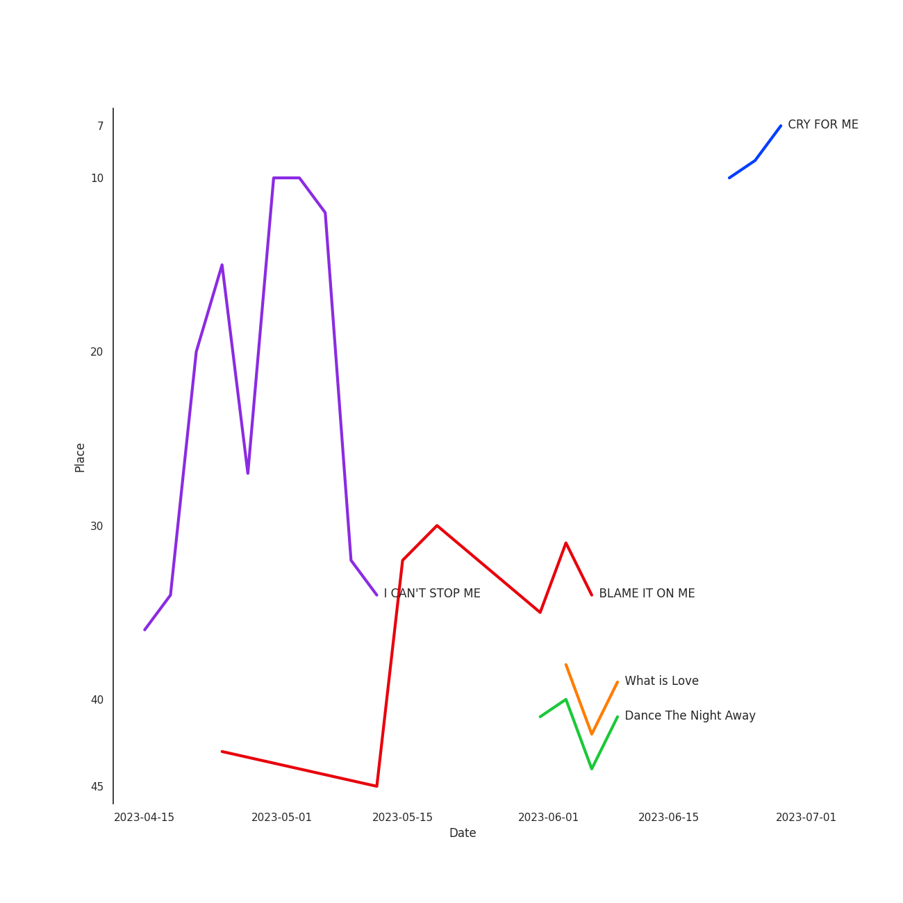

# TWICE

[See Track Features](audio_features.md)

[See Clusters](clusters/overview.md)

## Artist Rank
TWICE is currently:
- The #2 artist of all time
- The #5 artist of the last 6 months

## Top Tracks

- I CAN'T STOP ME is:
    - the #17 track of the last month
    - the #47 track of the last 6 months
    - the #17 track of all time
- The Feels is:
    - the #50 track of all time
- SET ME FREE is:
    - the #40 track of the last 6 months
- What is Love is:
    - the #45 track of the last 6 months

### Top tracks of all time over time

### Top tracks of the last 6 months over time

### Top tracks of the last month over time

## Featured on Playlists
| Art | Tracks | Playlist |
|:---|---:|:---|
|  | 41 | [K-Pop](../../playlists/k_pop/overview.md) |
|  | 12 | [Summer](../../playlists/summer/overview.md) |
|  | 12 | [Workout](../../playlists/workout/overview.md) |
|  | 10 | [Aegyo](../../playlists/aegyo/overview.md) |
|  | 9 | [K-Pop Favorites](../../playlists/k_pop_favorites/overview.md) |
|  | 3 | [Cursed English](../../playlists/cursed_english/overview.md) |
|  | 2 | [K-Memes](../../playlists/k_memes/overview.md) |
|  | 2 | [Chill](../../playlists/chill/overview.md) |
|  | 1 | [K-Pop 101](../../playlists/k_pop_101/overview.md) |
|  | 1 | [Sharon RPD](../../playlists/sharon_rpd/overview.md) |
|  | 1 | [Christmas](../../playlists/christmas/overview.md) |
## Top Albums

| Art | Tracks | 💚 | Album | Release Date | 🔗 |
|:---|---:|---:|:---|:---|:---|
|  | 8 | 6 | Formula of Love: O+T=<3 | 2021-11-12 | [🔗](https://open.spotify.com/album/5052Ip89wdW8EGdpjEpNeq) |
|  | 7 | 5 | READY TO BE | 2023-03-10 | [🔗](https://open.spotify.com/album/7hzP5i7StxYG4StECA0rrJ) |
|  | 3 | 3 | Taste of Love | 2021-06-11 | [🔗](https://open.spotify.com/album/00vb6sViDbJLmLLchfbRh4) |
|  | 3 | 2 | Eyes Wide Open | 2020-10-26 | [🔗](https://open.spotify.com/album/33jypnU7WULxPaVrjj4RXH) |
|  | 3 | 2 | BETWEEN 1&2 | 2022-08-26 | [🔗](https://open.spotify.com/album/3NZ94nQbqimcu2i71qhc4f) |
|  | 2 | 2 | Twicetagram | 2017-10-30 | [🔗](https://open.spotify.com/album/3hJXmK5gWN9P6jtZL0Lr2y) |
|  | 2 | 2 | Summer Nights | 2018-07-09 | [🔗](https://open.spotify.com/album/2GKTroaa4ysyhEdvzpvUoM) |
|  | 2 | 1 | Merry & Happy | 2017-12-11 | [🔗](https://open.spotify.com/album/0R7pj4tnmcoUulrZGPo6nw) |
|  | 2 | 1 | Feel Special | 2019-09-23 | [🔗](https://open.spotify.com/album/3NQBPabmRm3LzVcmtkTLfo) |
|  | 1 | 1 | YES or YES | 2018-11-05 | [🔗](https://open.spotify.com/album/25VunQEW0x2W6ALND2Mh4g) |

See all albums

| Art | Tracks | 💚 | Album | Release Date | 🔗 |
|:---|---:|---:|:---|:---|:---|
|  | 1 | 1 | Twicecoaster: Lane 1 | 2016-10-24 | [🔗](https://open.spotify.com/album/5zQhaDNbiXHRqd8Y51I4vy) |
|  | 1 | 1 | The Story Begins | 2015-10-20 | [🔗](https://open.spotify.com/album/72WWZVAx6GtSbEeGESwDLo) |
|  | 1 | 1 | SIGNAL | 2017-05-15 | [🔗](https://open.spotify.com/album/28PwDunFAR71toOCTYRvkf) |
|  | 1 | 1 | Perfect World | 2021-07-28 | [🔗](https://open.spotify.com/album/17rk8h2IU4wwSFXw9j2uR6) |
|  | 1 | 1 | Page Two | 2016-04-25 | [🔗](https://open.spotify.com/album/6q2oUEqL9uzVXHCeKoA8JV) |
|  | 1 | 1 | MORE & MORE | 2020-06-01 | [🔗](https://open.spotify.com/album/5KsduuDNWzt65TaHzmtciv) |
|  | 1 | 1 | FANCY YOU | 2019-04-22 | [🔗](https://open.spotify.com/album/3aLpWFejbsdyafODLXRqwF) |
|  | 1 | 1 | CRY FOR ME | 2020-12-18 | [🔗](https://open.spotify.com/album/2aRAPmBCEdo9pWimsI5l87) |
|  | 1 | 1 | Breakthrough | 2019-06-12 | [🔗](https://open.spotify.com/album/7LWfEiSeue9BXPbUOH34q6) |
|  | 1 | 0 | MORE & MORE (English Version) | 2020-08-21 | [🔗](https://open.spotify.com/album/4AXNnQf2SkyY8d4FQaBKo5) |
|  | 1 | 0 | I CAN'T STOP ME (English Version) | 2020-11-30 | [🔗](https://open.spotify.com/album/2KGNQmq4gpzmdaIcAgJdVe) |
|  | 1 | 0 | ALL OUT | 2020-11-06 | [🔗](https://open.spotify.com/album/26IdRjba8f8DNa7c0FwfQb) |

## Top Record Labels

| Tracks | 💚 | Label |
|---:|---:|:---|
| 42 | 32 | [Republic Records](../../labels/republic_records/overview.md) |
| 2 | 2 | WM Japan |
| 1 | 0 | Riot Games |

## Genres

- [k-pop](../../genres/k_pop)
- [k-pop girl group](../../genres/k_pop_girl_group)
- [pop](../../genres/pop)

## Tracks

| Art | Track | Album | Artists | Label | 💚 | 🔗 |
|:---|:---|:---|:---|:---|:---|:---|
|  | I'LL SHOW YOU | ALL OUT | K/DA, [TWICE](overview.md), Bekuh Boom, Annika Wells, League of Legends | Riot Games | | [🔗](https://open.spotify.com/track/6LDIVpVNBRy7LCw7jIdci6) |
|  | Like Ooh-Ahh | The Story Begins | [TWICE](overview.md) | [Republic Records](../../labels/republic_records) | 💚 | [🔗](https://open.spotify.com/track/3c0CJ0DBgsGZ7I79lyx02Z) |
|  | CHEER UP | Page Two | [TWICE](overview.md) | [Republic Records](../../labels/republic_records) | 💚 | [🔗](https://open.spotify.com/track/7lB4rxNVc7vm33ZSZXVRAQ) |
|  | TT | Twicecoaster: Lane 1 | [TWICE](overview.md) | [Republic Records](../../labels/republic_records) | 💚 | [🔗](https://open.spotify.com/track/60jFaQV7Z4boGC4ob5B5c6) |
|  | Signal | SIGNAL | [TWICE](overview.md) | [Republic Records](../../labels/republic_records) | 💚 | [🔗](https://open.spotify.com/track/15rX80MpEJ2OqW3dPunQvI) |
|  | Likey | Twicetagram | [TWICE](overview.md) | [Republic Records](../../labels/republic_records) | 💚 | [🔗](https://open.spotify.com/track/0IEVKWduAaMcZepZQVr80T) |
|  | Turtle | Twicetagram | [TWICE](overview.md) | [Republic Records](../../labels/republic_records) | 💚 | [🔗](https://open.spotify.com/track/1LQtxz9fIrZskoqDSbhKd3) |
|  | Heart Shaker | Merry & Happy | [TWICE](overview.md) | [Republic Records](../../labels/republic_records) | 💚 | [🔗](https://open.spotify.com/track/52FCAZn0YEkZfF0BtiAUMW) |
|  | Merry & Happy | Merry & Happy | [TWICE](overview.md) | [Republic Records](../../labels/republic_records) | | [🔗](https://open.spotify.com/track/59TGiILFEI1NYSFcxyFiUZ) |
|  | Dance The Night Away | Summer Nights | [TWICE](overview.md) | [Republic Records](../../labels/republic_records) | 💚 | [🔗](https://open.spotify.com/track/4DYIDSMIB5y2UmZFv9fxeX) |

See all tracks

| Art | Track | Album | Artists | Label | 💚 | 🔗 |
|:---|:---|:---|:---|:---|:---|:---|
|  | What is Love | Summer Nights | [TWICE](overview.md) | [Republic Records](../../labels/republic_records) | 💚 | [🔗](https://open.spotify.com/track/3zhbXKFjUDw40pTYyCgt1Y) |
|  | YES or YES | YES or YES | [TWICE](overview.md) | [Republic Records](../../labels/republic_records) | 💚 | [🔗](https://open.spotify.com/track/26OVhEqFDQH0Ij77QtmGP9) |
|  | FANCY | FANCY YOU | [TWICE](overview.md) | [Republic Records](../../labels/republic_records) | 💚 | [🔗](https://open.spotify.com/track/2qQpFbqqkLOGySgNK8wBXt) |
|  | Breakthrough | Breakthrough | [TWICE](overview.md) | WM Japan | 💚 | [🔗](https://open.spotify.com/track/5COO2JgOmHIJ2jsXFwflz8) |
|  | Feel Special | Feel Special | [TWICE](overview.md) | [Republic Records](../../labels/republic_records) | 💚 | [🔗](https://open.spotify.com/track/3Hz3tTQwOdM6XkA0ALB2G9) |
|  | LOVE FOOLISH | Feel Special | [TWICE](overview.md) | [Republic Records](../../labels/republic_records) | | [🔗](https://open.spotify.com/track/1MdEg2lk4EakgWnCvFUGEZ) |
|  | MORE & MORE | MORE & MORE | [TWICE](overview.md) | [Republic Records](../../labels/republic_records) | 💚 | [🔗](https://open.spotify.com/track/3omvXShuRPM3zbDpWYqf5g) |
|  | MORE & MORE (English Version) | MORE & MORE (English Version) | [TWICE](overview.md) | [Republic Records](../../labels/republic_records) | | [🔗](https://open.spotify.com/track/03wvlNaxFKB9sge4U6vyPE) |
|  | HELL IN HEAVEN | Eyes Wide Open | [TWICE](overview.md) | [Republic Records](../../labels/republic_records) | 💚 | [🔗](https://open.spotify.com/track/3KCreWc88InXH3XuL54C5a) |
|  | I CAN'T STOP ME | Eyes Wide Open | [TWICE](overview.md) | [Republic Records](../../labels/republic_records) | 💚 | [🔗](https://open.spotify.com/track/37ZtpRBkHcaq6hHy0X98zn) |
|  | SAY SOMETHING | Eyes Wide Open | [TWICE](overview.md) | [Republic Records](../../labels/republic_records) | | [🔗](https://open.spotify.com/track/2gagYYY4R8QimbnFqd96ST) |
|  | I CAN'T STOP ME (English Version) | I CAN'T STOP ME (English Version) | [TWICE](overview.md) | [Republic Records](../../labels/republic_records) | | [🔗](https://open.spotify.com/track/4viLaKGdHwhW8LkZB3mRFC) |
|  | CRY FOR ME | CRY FOR ME | [TWICE](overview.md) | [Republic Records](../../labels/republic_records) | 💚 | [🔗](https://open.spotify.com/track/2xtP8RNbo2BEMzLX7tK7aq) |
|  | Alcohol-Free | Taste of Love | [TWICE](overview.md) | [Republic Records](../../labels/republic_records) | 💚 | [🔗](https://open.spotify.com/track/0BTaaKT4RMbs5M73tOHX5Y) |
|  | First Time | Taste of Love | [TWICE](overview.md) | [Republic Records](../../labels/republic_records) | 💚 | [🔗](https://open.spotify.com/track/3YdqewCLgGsFhruA3EhILy) |
|  | Scandal | Taste of Love | [TWICE](overview.md) | [Republic Records](../../labels/republic_records) | 💚 | [🔗](https://open.spotify.com/track/2fluM1mE0tKQ6rvM77Vr11) |
|  | Perfect World | Perfect World | [TWICE](overview.md) | WM Japan | 💚 | [🔗](https://open.spotify.com/track/0iuZMy88H6vxDA2oaJNhJg) |
|  | 1, 3, 2 (JEONGYEON, MINA, TZUYU) | Formula of Love: O+T=<3 | [TWICE](overview.md) | [Republic Records](../../labels/republic_records) | 💚 | [🔗](https://open.spotify.com/track/6bS9w12VuyaqkbNKnw5zZE) |
|  | CRUEL | Formula of Love: O+T=<3 | [TWICE](overview.md) | [Republic Records](../../labels/republic_records) | 💚 | [🔗](https://open.spotify.com/track/139JUU8fJkQoeHl9nABk9C) |
|  | F.I.L.A (Fall In Love Again) | Formula of Love: O+T=<3 | [TWICE](overview.md) | [Republic Records](../../labels/republic_records) | | [🔗](https://open.spotify.com/track/4O1WbQwMV0W6Y2dUCvwoBx) |
|  | ICON | Formula of Love: O+T=<3 | [TWICE](overview.md) | [Republic Records](../../labels/republic_records) | 💚 | [🔗](https://open.spotify.com/track/2VdU1ksBKcETBr8BYRHUvB) |
|  | LAST WALTZ | Formula of Love: O+T=<3 | [TWICE](overview.md) | [Republic Records](../../labels/republic_records) | 💚 | [🔗](https://open.spotify.com/track/39kH6C2twlYjyssIW02sbr) |
|  | PUSH & PULL (JIHYO, SANA, DAHYUN) | Formula of Love: O+T=<3 | [TWICE](overview.md) | [Republic Records](../../labels/republic_records) | | [🔗](https://open.spotify.com/track/7kbOwsTp2Uqm1scjRPiVt4) |
|  | SCIENTIST | Formula of Love: O+T=<3 | [TWICE](overview.md) | [Republic Records](../../labels/republic_records) | 💚 | [🔗](https://open.spotify.com/track/0BJMgVrnWIvgYsjq8KaPeh) |
|  | The Feels | Formula of Love: O+T=<3 | [TWICE](overview.md) | [Republic Records](../../labels/republic_records) | 💚 | [🔗](https://open.spotify.com/track/308Ir17KlNdlrbVLHWhlLe) |
|  | Basics | BETWEEN 1&2 | [TWICE](overview.md) | [Republic Records](../../labels/republic_records) | 💚 | [🔗](https://open.spotify.com/track/63mL1DdcSFfxVJ9XGnSRQz) |
|  | Brave | BETWEEN 1&2 | [TWICE](overview.md) | [Republic Records](../../labels/republic_records) | | [🔗](https://open.spotify.com/track/2peoFPokM6eYAIwLm9IQ8E) |
|  | Talk that Talk | BETWEEN 1&2 | [TWICE](overview.md) | [Republic Records](../../labels/republic_records) | 💚 | [🔗](https://open.spotify.com/track/0RDqNCRBGrSegk16Avfzuq) |
|  | BLAME IT ON ME | READY TO BE | [TWICE](overview.md) | [Republic Records](../../labels/republic_records) | 💚 | [🔗](https://open.spotify.com/track/2hQdmjAhYEuMuqNWZCsz1J) |
|  | CRAZY STUPID LOVE | READY TO BE | [TWICE](overview.md) | [Republic Records](../../labels/republic_records) | 💚 | [🔗](https://open.spotify.com/track/0jn8sYeWOdYHjdF2cBmF75) |
|  | GOT THE THRILLS | READY TO BE | [TWICE](overview.md) | [Republic Records](../../labels/republic_records) | | [🔗](https://open.spotify.com/track/1RVsbqAP1WFFXPiBXQYIah) |
|  | MOONLIGHT SUNRISE | READY TO BE | [TWICE](overview.md) | [Republic Records](../../labels/republic_records) | 💚 | [🔗](https://open.spotify.com/track/5IN9W6eUfk3014My9awagX) |
|  | SET ME FREE | READY TO BE | [TWICE](overview.md) | [Republic Records](../../labels/republic_records) | 💚 | [🔗](https://open.spotify.com/track/4OtVQ2ZxS7yigIjGz5yKg1) |
|  | SET ME FREE (ENG) | READY TO BE | [TWICE](overview.md) | [Republic Records](../../labels/republic_records) | | [🔗](https://open.spotify.com/track/6bkTxw6m6vl8Oc3xtKBXN0) |
|  | WALLFLOWER | READY TO BE | [TWICE](overview.md) | [Republic Records](../../labels/republic_records) | 💚 | [🔗](https://open.spotify.com/track/6EGkbPJrb88STcdfMu1j1y) |

