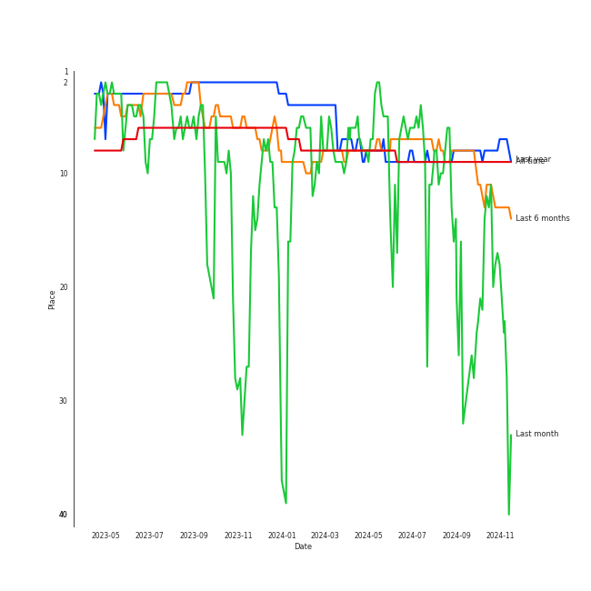
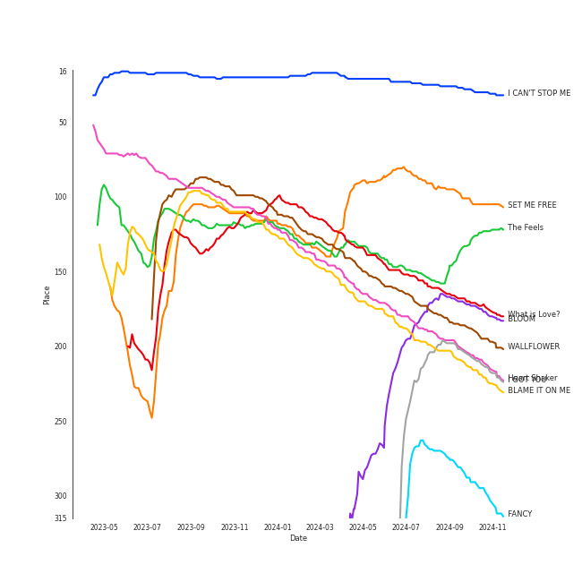
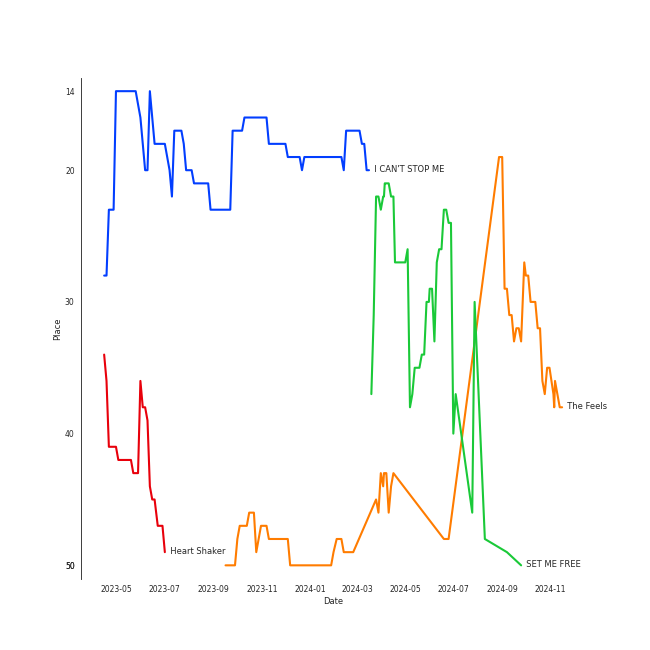
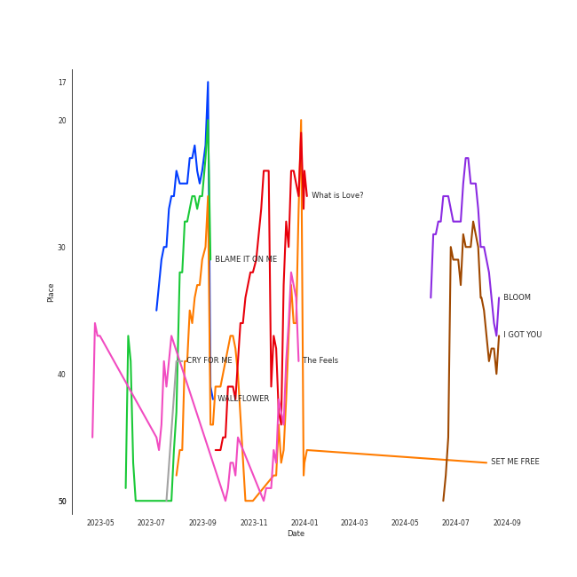
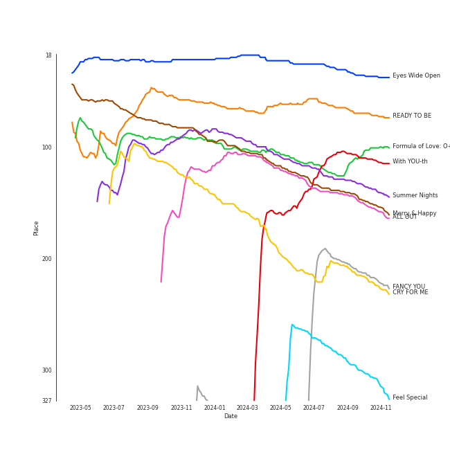
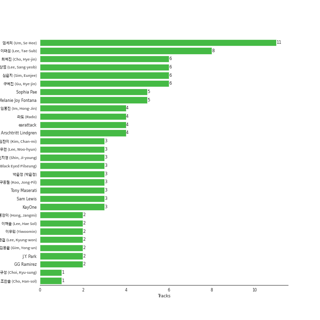

# TWICE

[See Track Features](audio_features.md)

[See Clusters](clusters/overview.md)

## Relationships

TWICE:
- has member TZUYU
- has member 平井もも (Hirai, Momo)
- has member JIHYO
- has member 김다현 (Kim, Da-hyun)
- has member 名井南 (Myoui, Mina)
- has member NAYEON
- has member SANA
- has member 손채영 (Son, Chae-young)
- has member 유정연 (Yoo, Jeong-yeon)
- has the subgroup MISAMO

## Artist Rank
TWICE is currently:
- The #8 artist of the last 6 months
- The #8 artist of the last year
- The #9 artist of all time

## Top Tracks

### Top tracks of all time

Top tracks of the last year over time

Top tracks of the last 6 months over time

## Top Albums

| Art | Rank | Tracks | 💚 | Album | Release Date | 🔗 |
|:---|---:|---:|---:|:---|:---|:---|
|  | 107 | 8 | 6 | Formula of Love: O+T=<3 | 2021-11-12 | [🔗](https://open.spotify.com/album/5052Ip89wdW8EGdpjEpNeq) |
|  | 70 | 7 | 5 | READY TO BE | 2023-03-10 | [🔗](https://open.spotify.com/album/7hzP5i7StxYG4StECA0rrJ) |
|  | 109 | 3 | 3 | With YOU-th | 2024-02-23 | [🔗](https://open.spotify.com/album/575TQDOQqc0MAheeEeKWUR) |
|  | 311 | 3 | 3 | Taste of Love | 2021-06-11 | [🔗](https://open.spotify.com/album/00vb6sViDbJLmLLchfbRh4) |
|  | 36 | 3 | 3 | Eyes Wide Open | 2020-10-26 | [🔗](https://open.spotify.com/album/33jypnU7WULxPaVrjj4RXH) |
|  | 640 | 3 | 2 | BETWEEN 1&2 | 2022-08-26 | [🔗](https://open.spotify.com/album/3NZ94nQbqimcu2i71qhc4f) |
|  | 132 | 2 | 2 | Summer Nights | 2018-07-09 | [🔗](https://open.spotify.com/album/2GKTroaa4ysyhEdvzpvUoM) |
|  | 625 | 2 | 1 | Twicetagram | 2017-10-30 | [🔗](https://open.spotify.com/album/3hJXmK5gWN9P6jtZL0Lr2y) |
|  | 142 | 2 | 1 | Merry & Happy | 2017-12-11 | [🔗](https://open.spotify.com/album/0R7pj4tnmcoUulrZGPo6nw) |
|  | 300 | 2 | 1 | Feel Special | 2019-09-23 | [🔗](https://open.spotify.com/album/3NQBPabmRm3LzVcmtkTLfo) |

See all albums

| Art | Rank | Tracks | 💚 | Album | Release Date | 🔗 |
|:---|---:|---:|---:|:---|:---|:---|
|  | 640 | 1 | 1 | YES or YES | 2018-11-05 | [🔗](https://open.spotify.com/album/25VunQEW0x2W6ALND2Mh4g) |
|  | 640 | 1 | 1 | Twicecoaster: Lane 1 | 2016-10-24 | [🔗](https://open.spotify.com/album/5zQhaDNbiXHRqd8Y51I4vy) |
|  | 430 | 1 | 1 | The Story Begins | 2015-10-20 | [🔗](https://open.spotify.com/album/72WWZVAx6GtSbEeGESwDLo) |
|  | 640 | 1 | 1 | SIGNAL | 2017-05-15 | [🔗](https://open.spotify.com/album/28PwDunFAR71toOCTYRvkf) |
|  | 640 | 1 | 1 | Page Two | 2016-04-25 | [🔗](https://open.spotify.com/album/6q2oUEqL9uzVXHCeKoA8JV) |
|  | 215 | 1 | 1 | FANCY YOU | 2019-04-22 | [🔗](https://open.spotify.com/album/3aLpWFejbsdyafODLXRqwF) |
|  | 213 | 1 | 1 | CRY FOR ME | 2020-12-18 | [🔗](https://open.spotify.com/album/2aRAPmBCEdo9pWimsI5l87) |
|  | 640 | 1 | 1 | Breakthrough | 2019-06-12 | [🔗](https://open.spotify.com/album/7LWfEiSeue9BXPbUOH34q6) |
|  | 552 | 1 | 0 | Perfect World | 2021-07-28 | [🔗](https://open.spotify.com/album/17rk8h2IU4wwSFXw9j2uR6) |
|  | 640 | 1 | 0 | MORE & MORE (English Version) | 2020-08-21 | [🔗](https://open.spotify.com/album/4AXNnQf2SkyY8d4FQaBKo5) |
|  | 640 | 1 | 0 | MORE & MORE | 2020-06-01 | [🔗](https://open.spotify.com/album/5KsduuDNWzt65TaHzmtciv) |
|  | 640 | 1 | 0 | I CAN'T STOP ME (English Version) | 2020-11-30 | [🔗](https://open.spotify.com/album/2KGNQmq4gpzmdaIcAgJdVe) |
|  | 145 | 1 | 0 | ALL OUT | 2020-11-06 | [🔗](https://open.spotify.com/album/26IdRjba8f8DNa7c0FwfQb) |

## Featured on Playlists
| Art | Tracks | Playlist |
|:---|---:|:---|
|  | 44 | [K-Pop](../../playlists/k-pop/overview.md) |
|  | 12 | [Summer](../../playlists/summer/overview.md) |
|  | 12 | [Workout](../../playlists/workout/overview.md) |
|  | 10 | [애교！](../../playlists/애교！/overview.md) |
|  | 9 | [K-Pop Favorites](../../playlists/k-pop_favorites/overview.md) |
|  | 8 | [Your Top Songs 2022](../../playlists/your_top_songs_2022/overview.md) |
|  | 6 | [Your Top Songs 2023](../../playlists/your_top_songs_2023/overview.md) |
|  | 3 | [Cursed English](../../playlists/cursed_english/overview.md) |
|  | 2 | [Chill](../../playlists/chill/overview.md) |
|  | 2 | [Recommendations for Chris](../../playlists/recommendations_for_chris/overview.md) |
|  | 2 | [Funk](../../playlists/funk/overview.md) |
|  | 2 | [K-Memes](../../playlists/k-memes/overview.md) |
|  | 1 | [Recommendations for Jeff](../../playlists/recommendations_for_jeff/overview.md) |
|  | 1 | [Classical Samples](../../playlists/classical_samples/overview.md) |
|  | 1 | [Sharon RPD](../../playlists/sharon_rpd/overview.md) |
|  | 1 | [K-Pop 101](../../playlists/k-pop_101/overview.md) |
|  | 1 | [Christmas](../../playlists/christmas/overview.md) |

## Top Record Labels

| Tracks | 💚 | Label |
|---:|---:|:---|
| 45 | 34 | [Republic Records](../../labels/republic_records/overview.md) |
| 2 | 1 | [WM Japan](../../labels/wm_japan/overview.md) |
| 1 | 0 | Riot Games |

## Genres

- [k-pop](../../genres/k-pop/overview.md)
- [k-pop girl group](../../genres/k-pop_girl_group/overview.md)
- [pop](../../genres/pop/overview.md)

## Credits

### Credits by Type

| Credit Type | Tracks |
|:---|---:|
| Performer | 14 |

### Member Credits

| | JIHYO | NAYEON | SANA | TZUYU | 名井南 (Myoui, Mina) | 平井もも (Hirai, Momo) | 김다현 (Kim, Da-hyun) | 손채영 (Son, Chae-young) | 유정연 (Yoo, Jeong-yeon) |
|:---|---:|---:|---:|---:|---:|---:|---:|---:|---:|
| Lyricist | 0 | 0 | 0 | 0 | 0 | 0 | 1 | 1 | 1 |
| Vocal | 13 | 15 | 13 | 14 | 14 | 13 | 13 | 13 | 14 |
### Production Credits

| Art | Track | Members | Credit Types |
|:---|:---|:---|:---|
|  | CRUEL | 김다현 (Kim, Da-hyun) | Lyricist |
|  | Basics | 손채영 (Son, Chae-young) | Lyricist |
|  | BLOOM | 유정연 (Yoo, Jeong-yeon) | Lyricist |

## Top Producers

| Art | Producer | Tracks | Credit Types |
|:---|:---|---:|:---|
| | [엄세희 (Um, Se-Hee)](../../producers/엄세희_(um,_se-hee)/overview.md) | 11 | Producer |
| | [이태섭 (Lee, Tae-Sub)](../../producers/이태섭_(lee,_tae-sub)/overview.md) | 8 | Producer |
| | [심은지 (Sim, Eunjee)](../../producers/심은지_(sim,_eunjee)/overview.md) | 6 | Arranger, Lyricist, Producer, Songwriter |
| | 최혜진 (Cho, Hye-jin) | 6 | Producer |
| | [이상엽 (Lee, Sang-yeob)](../../producers/이상엽_(lee,_sang-yeob)/overview.md) | 6 | Producer |
| | [구혜진 (Gu, Hye-jin)](../../producers/구혜진_(gu,_hye-jin)/overview.md) | 6 | Producer |
| | Melanie Joy Fontana | 5 | Lyricist, Songwriter |
| | Sophia Pae | 5 | Arranger |
| | [라도 (Rado)](../../producers/라도_(rado)/overview.md) | 4 | Lyricist, Songwriter, Arranger, Producer |
| | [earattack](../../producers/earattack/overview.md) | 4 | Arranger, Producer, Songwriter, Lyricist |

View all

| Art | Producer | Tracks | Credit Types |
|:---|:---|---:|:---|
| | 임홍진 (Im, Hong-Jin) | 4 | Producer |
| | [Arschtritt Lindgren](../../producers/arschtritt_lindgren/overview.md) | 4 | Arranger, Songwriter, Producer |
| | [블랙아이드필승 (Black Eyed Pilseung)](../../producers/블랙아이드필승_(black_eyed_pilseung)/overview.md) | 3 | Songwriter, Lyricist |
| | KayOne | 3 | Producer |
| | [구종필 (Koo, Jong-Pil)](../../producers/구종필_(koo,_jong-pil)/overview.md) | 3 | Producer |
| | [Tony Maserati](../../producers/tony_maserati/overview.md) | 3 | Producer |
| | 이우현 (Lee, Woo-hyun) | 3 | Arranger, Songwriter, Lyricist, Producer |
| | 임찬미 (Kim, Chan-mi) | 3 | Producer |
| | 신지영 (Shin, Ji-young) | 3 | Producer |
| | Sam Lewis | 3 | Lyricist, Songwriter |
| | 박은정 (박은정) | 3 | Producer |
| | 이우민 (Yiwoomin) | 2 | Arranger, Lyricist, Producer, Songwriter |
| | 김용운 (Gim, Yong-un) | 2 | Producer |
| | 이해솔 (Lee, Hae Sol) | 2 | Arranger, Songwriter, Lyricist |
| | 이경원 (Lee, Kyung-won) | 2 | Producer |
|  | J.Y. Park | 2 | Lyricist |
| | 홍장미 (Hong, Jangmi) | 2 | Producer |
| | GG Ramirez | 2 | Lyricist, Songwriter |
| | Kyler Niko | 1 | Songwriter |
| | Boy Matthews | 1 | Lyricist |
| | Kelsey Klingensmith | 1 | Songwriter |
| | 손채영 (Son, Chae-young) | 1 | Lyricist |
| | 이기 (IGGY) | 1 | Arranger, Lyricist, Producer, Songwriter |
| | 정호현 (정호현) | 1 | Arranger, Lyricist, Songwriter |
| | Justin Reinstein | 1 | Arranger, Lyricist, Producer, Songwriter |
| | 김영현 (Kim, Young-hyun) | 1 | Producer |
| | Brooke Tomlinson | 1 | Songwriter |
| | Cutfather | 1 | Arranger |
| | Alma Goodman | 1 | Songwriter |
| | [Josh Gudwin](../../producers/josh_gudwin/overview.md) | 1 | Producer |
|  | Anne-Marie | 1 | Songwriter |
| | 서은일 (Seo, Eun-il) | 1 | Producer |
| | Gingerbread | 1 | Arranger, Producer |
| | Jonah Marais | 1 | Lyricist, Songwriter |
| | 72 | 1 | Songwriter |
| | dwilly | 1 | Arranger, Lyricist, Songwriter |
| | Kaedi Dalley | 1 | Lyricist, Songwriter |
| | Mich Hansen | 1 | Songwriter |
| | TBHits | 1 | Arranger, Songwriter |
| | Jeppe London Bilsby | 1 | Arranger, Songwriter |
| | 김다현 (Kim, Da-hyun) | 1 | Lyricist |
| | Musikality | 1 | Songwriter |
| | Marcus van Wattum | 1 | Arranger, Songwriter |
| | Barry Cohen | 1 | Songwriter |
| | EJAE | 1 | Songwriter |
|  | Zara Larsson | 1 | Songwriter |
|  | MRCH | 1 | Arranger, Producer, Songwriter |
| | Gray Trainer | 1 | Arranger, Songwriter |
|  | [BIBI](../bibi/overview.md) | 1 | Lyricist |
| | MNEK | 1 | Songwriter |
| | Daniel Seavey | 1 | Lyricist, Songwriter |
| | Nea | 1 | Songwriter |
| | Justin Tranter | 1 | Songwriter |
| | Anna Timgren | 1 | Lyricist, Songwriter |
| | Julia Michaels | 1 | Songwriter |
| | Mr. Franks | 1 | Arranger, Songwriter |
| | Lexxi Saal | 1 | Lyricist, Songwriter |
| | Nina Ann Nelson | 1 | Lyricist, Songwriter |
| | [danke](../../producers/danke/overview.md) | 1 | Lyricist |
| | Jake Torrey | 1 | Lyricist, Songwriter |
| | 윤원권 (Yoon, Won-kwon) | 1 | Producer |
| | Lauritz Emil Christiansen | 1 | Arranger, Songwriter |
| | Lauren Dyson | 1 | Arranger, Songwriter |
| | Alexander Pavelich | 1 | Arranger, Songwriter |
| | Paulina Cerrilla | 1 | Songwriter |
| | 유정연 (Yoo, Jeong-yeon) | 1 | Lyricist |
| | [John Hanes](../../producers/john_hanes/overview.md) | 1 | Producer |
| | 조한솔 (Cho, Han-sol) | 1 | Producer |
| | Jenson Vaughan | 1 | Arranger, Songwriter |
| | A. Wright | 1 | Songwriter |
| | 최규성 (Choi, Kyu-sung) | 1 | Lyricist, Songwriter |

## Tracks

| Art | Track | Album | Artists | Label | Rank | 💚 | 🔗 |
|:---|:---|:---|:---|:---|---:|:---|:---|
|  | I CAN'T STOP ME | Eyes Wide Open | [TWICE](overview.md) | [Republic Records](../../labels/republic_records) | 27 | 💚 | [🔗](https://open.spotify.com/track/37ZtpRBkHcaq6hHy0X98zn) |
|  | SET ME FREE | READY TO BE | [TWICE](overview.md) | [Republic Records](../../labels/republic_records) | 100 | 💚 | [🔗](https://open.spotify.com/track/4OtVQ2ZxS7yigIjGz5yKg1) |
|  | The Feels | Formula of Love: O+T=<3 | [TWICE](overview.md) | [Republic Records](../../labels/republic_records) | 133 | 💚 | [🔗](https://open.spotify.com/track/308Ir17KlNdlrbVLHWhlLe) |
|  | What is Love | Summer Nights | [TWICE](overview.md) | [Republic Records](../../labels/republic_records) | 170 | 💚 | [🔗](https://open.spotify.com/track/3zhbXKFjUDw40pTYyCgt1Y) |
|  | BLOOM | With YOU-th | [TWICE](overview.md) | [Republic Records](../../labels/republic_records) | 171 | 💚 | [🔗](https://open.spotify.com/track/4bheT1Drc2vyQgN5VTwr8W) |
|  | WALLFLOWER | READY TO BE | [TWICE](overview.md) | [Republic Records](../../labels/republic_records) | 186 | 💚 | [🔗](https://open.spotify.com/track/6EGkbPJrb88STcdfMu1j1y) |
|  | Heart Shaker | Merry & Happy | [TWICE](overview.md) | [Republic Records](../../labels/republic_records) | 197 | 💚 | [🔗](https://open.spotify.com/track/52FCAZn0YEkZfF0BtiAUMW) |
|  | I GOT YOU | With YOU-th | [TWICE](overview.md) | [Republic Records](../../labels/republic_records) | 200 | 💚 | [🔗](https://open.spotify.com/track/0mgveJEIGjcN51w4JIQtI6) |
|  | BLAME IT ON ME | READY TO BE | [TWICE](overview.md) | [Republic Records](../../labels/republic_records) | 202 | 💚 | [🔗](https://open.spotify.com/track/2hQdmjAhYEuMuqNWZCsz1J) |
|  | CRY FOR ME | CRY FOR ME | [TWICE](overview.md) | [Republic Records](../../labels/republic_records) | 288 | 💚 | [🔗](https://open.spotify.com/track/2xtP8RNbo2BEMzLX7tK7aq) |

See all tracks

| Art | Track | Album | Artists | Label | Rank | 💚 | 🔗 |
|:---|:---|:---|:---|:---|---:|:---|:---|
|  | FANCY | FANCY YOU | [TWICE](overview.md) | [Republic Records](../../labels/republic_records) | 293 | 💚 | [🔗](https://open.spotify.com/track/2qQpFbqqkLOGySgNK8wBXt) |
|  | Merry & Happy | Merry & Happy | [TWICE](overview.md) | [Republic Records](../../labels/republic_records) | 341 | | [🔗](https://open.spotify.com/track/59TGiILFEI1NYSFcxyFiUZ) |
|  | ONE SPARK | With YOU-th | [TWICE](overview.md) | [Republic Records](../../labels/republic_records) | 351 | 💚 | [🔗](https://open.spotify.com/track/7cIn67LEvk16v6komC8znS) |
|  | Feel Special | Feel Special | [TWICE](overview.md) | [Republic Records](../../labels/republic_records) | 427 | 💚 | [🔗](https://open.spotify.com/track/3Hz3tTQwOdM6XkA0ALB2G9) |
|  | First Time | Taste of Love | [TWICE](overview.md) | [Republic Records](../../labels/republic_records) | 444 | 💚 | [🔗](https://open.spotify.com/track/3YdqewCLgGsFhruA3EhILy) |
|  | Like Ooh-Ahh | The Story Begins | [TWICE](overview.md) | [Republic Records](../../labels/republic_records) | 639 | 💚 | [🔗](https://open.spotify.com/track/3c0CJ0DBgsGZ7I79lyx02Z) |
|  | Dance The Night Away | Summer Nights | [TWICE](overview.md) | [Republic Records](../../labels/republic_records) | 782 | 💚 | [🔗](https://open.spotify.com/track/4DYIDSMIB5y2UmZFv9fxeX) |
|  | CRAZY STUPID LOVE | READY TO BE | [TWICE](overview.md) | [Republic Records](../../labels/republic_records) | 803 | 💚 | [🔗](https://open.spotify.com/track/0jn8sYeWOdYHjdF2cBmF75) |
|  | Perfect World | Perfect World | [TWICE](overview.md) | [WM Japan](../../labels/wm_japan) | 829 | | [🔗](https://open.spotify.com/track/0iuZMy88H6vxDA2oaJNhJg) |
|  | MOONLIGHT SUNRISE | READY TO BE | [TWICE](overview.md) | [Republic Records](../../labels/republic_records) | 851 | 💚 | [🔗](https://open.spotify.com/track/5IN9W6eUfk3014My9awagX) |
|  | SCIENTIST | Formula of Love: O+T=<3 | [TWICE](overview.md) | [Republic Records](../../labels/republic_records) | 908 | 💚 | [🔗](https://open.spotify.com/track/0BJMgVrnWIvgYsjq8KaPeh) |
|  | Likey | Twicetagram | [TWICE](overview.md) | [Republic Records](../../labels/republic_records) | 949 | 💚 | [🔗](https://open.spotify.com/track/0IEVKWduAaMcZepZQVr80T) |
|  | CHEER UP | Page Two | [TWICE](overview.md) | [Republic Records](../../labels/republic_records) | 969 | 💚 | [🔗](https://open.spotify.com/track/7lB4rxNVc7vm33ZSZXVRAQ) |
|  | TT | Twicecoaster: Lane 1 | [TWICE](overview.md) | [Republic Records](../../labels/republic_records) | 969 | 💚 | [🔗](https://open.spotify.com/track/60jFaQV7Z4boGC4ob5B5c6) |
|  | Signal | SIGNAL | [TWICE](overview.md) | [Republic Records](../../labels/republic_records) | 969 | 💚 | [🔗](https://open.spotify.com/track/15rX80MpEJ2OqW3dPunQvI) |
|  | Turtle | Twicetagram | [TWICE](overview.md) | [Republic Records](../../labels/republic_records) | 969 | | [🔗](https://open.spotify.com/track/1LQtxz9fIrZskoqDSbhKd3) |
|  | YES or YES | YES or YES | [TWICE](overview.md) | [Republic Records](../../labels/republic_records) | 969 | 💚 | [🔗](https://open.spotify.com/track/26OVhEqFDQH0Ij77QtmGP9) |
|  | Breakthrough | Breakthrough | [TWICE](overview.md) | [WM Japan](../../labels/wm_japan) | 969 | 💚 | [🔗](https://open.spotify.com/track/5COO2JgOmHIJ2jsXFwflz8) |
|  | LOVE FOOLISH | Feel Special | [TWICE](overview.md) | [Republic Records](../../labels/republic_records) | 969 | | [🔗](https://open.spotify.com/track/1MdEg2lk4EakgWnCvFUGEZ) |
|  | MORE & MORE | MORE & MORE | [TWICE](overview.md) | [Republic Records](../../labels/republic_records) | 969 | | [🔗](https://open.spotify.com/track/3omvXShuRPM3zbDpWYqf5g) |
|  | MORE & MORE (English Version) | MORE & MORE (English Version) | [TWICE](overview.md) | [Republic Records](../../labels/republic_records) | 969 | | [🔗](https://open.spotify.com/track/03wvlNaxFKB9sge4U6vyPE) |
|  | HELL IN HEAVEN | Eyes Wide Open | [TWICE](overview.md) | [Republic Records](../../labels/republic_records) | 969 | 💚 | [🔗](https://open.spotify.com/track/3KCreWc88InXH3XuL54C5a) |
|  | SAY SOMETHING | Eyes Wide Open | [TWICE](overview.md) | [Republic Records](../../labels/republic_records) | 969 | 💚 | [🔗](https://open.spotify.com/track/2gagYYY4R8QimbnFqd96ST) |
|  | I'LL SHOW YOU | ALL OUT | K/DA, [TWICE](overview.md), Bekuh Boom, Annika Wells, League of Legends | Riot Games | 969 | | [🔗](https://open.spotify.com/track/6LDIVpVNBRy7LCw7jIdci6) |
|  | I CAN'T STOP ME (English Version) | I CAN'T STOP ME (English Version) | [TWICE](overview.md) | [Republic Records](../../labels/republic_records) | 969 | | [🔗](https://open.spotify.com/track/4viLaKGdHwhW8LkZB3mRFC) |
|  | Alcohol-Free | Taste of Love | [TWICE](overview.md) | [Republic Records](../../labels/republic_records) | 969 | 💚 | [🔗](https://open.spotify.com/track/0BTaaKT4RMbs5M73tOHX5Y) |
|  | Scandal | Taste of Love | [TWICE](overview.md) | [Republic Records](../../labels/republic_records) | 969 | 💚 | [🔗](https://open.spotify.com/track/2fluM1mE0tKQ6rvM77Vr11) |
|  | 1, 3, 2 (JEONGYEON, MINA, TZUYU) | Formula of Love: O+T=<3 | [TWICE](overview.md) | [Republic Records](../../labels/republic_records) | 969 | 💚 | [🔗](https://open.spotify.com/track/6bS9w12VuyaqkbNKnw5zZE) |
|  | CRUEL | Formula of Love: O+T=<3 | [TWICE](overview.md) | [Republic Records](../../labels/republic_records) | 969 | 💚 | [🔗](https://open.spotify.com/track/139JUU8fJkQoeHl9nABk9C) |
|  | F.I.L.A (Fall In Love Again) | Formula of Love: O+T=<3 | [TWICE](overview.md) | [Republic Records](../../labels/republic_records) | 969 | | [🔗](https://open.spotify.com/track/4O1WbQwMV0W6Y2dUCvwoBx) |
|  | ICON | Formula of Love: O+T=<3 | [TWICE](overview.md) | [Republic Records](../../labels/republic_records) | 969 | 💚 | [🔗](https://open.spotify.com/track/2VdU1ksBKcETBr8BYRHUvB) |
|  | LAST WALTZ | Formula of Love: O+T=<3 | [TWICE](overview.md) | [Republic Records](../../labels/republic_records) | 969 | 💚 | [🔗](https://open.spotify.com/track/39kH6C2twlYjyssIW02sbr) |
|  | PUSH & PULL (JIHYO, SANA, DAHYUN) | Formula of Love: O+T=<3 | [TWICE](overview.md) | [Republic Records](../../labels/republic_records) | 969 | | [🔗](https://open.spotify.com/track/7kbOwsTp2Uqm1scjRPiVt4) |
|  | Basics | BETWEEN 1&2 | [TWICE](overview.md) | [Republic Records](../../labels/republic_records) | 969 | 💚 | [🔗](https://open.spotify.com/track/63mL1DdcSFfxVJ9XGnSRQz) |
|  | Brave | BETWEEN 1&2 | [TWICE](overview.md) | [Republic Records](../../labels/republic_records) | 969 | | [🔗](https://open.spotify.com/track/2peoFPokM6eYAIwLm9IQ8E) |
|  | Talk that Talk | BETWEEN 1&2 | [TWICE](overview.md) | [Republic Records](../../labels/republic_records) | 969 | 💚 | [🔗](https://open.spotify.com/track/0RDqNCRBGrSegk16Avfzuq) |
|  | GOT THE THRILLS | READY TO BE | [TWICE](overview.md) | [Republic Records](../../labels/republic_records) | 969 | | [🔗](https://open.spotify.com/track/1RVsbqAP1WFFXPiBXQYIah) |
|  | SET ME FREE (ENG) | READY TO BE | [TWICE](overview.md) | [Republic Records](../../labels/republic_records) | 969 | | [🔗](https://open.spotify.com/track/6bkTxw6m6vl8Oc3xtKBXN0) |

