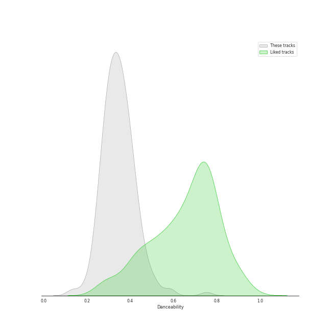
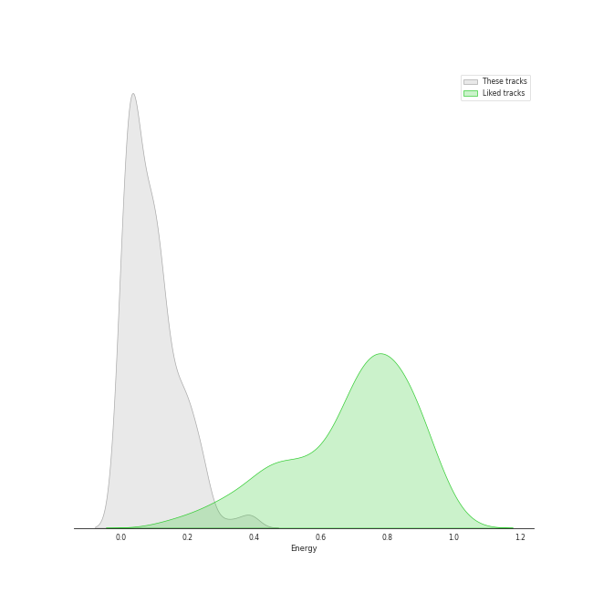
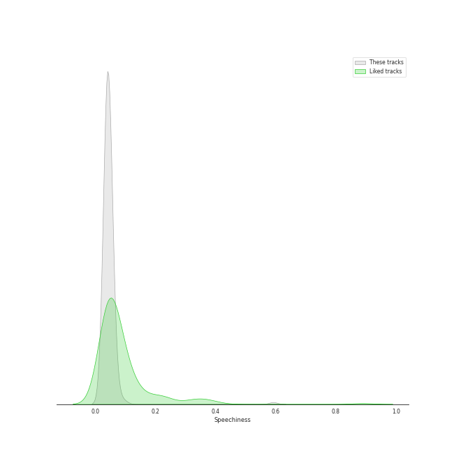
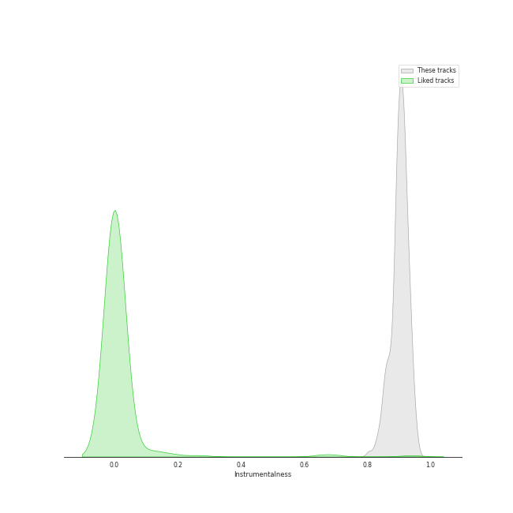
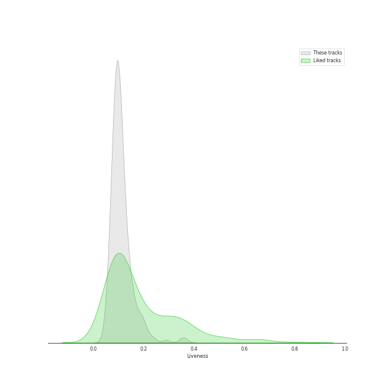
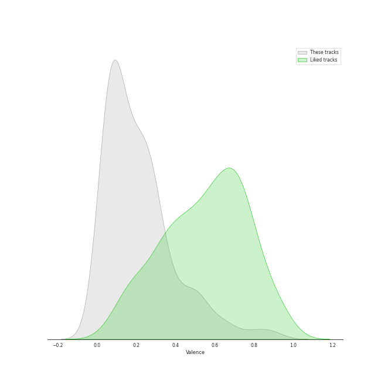
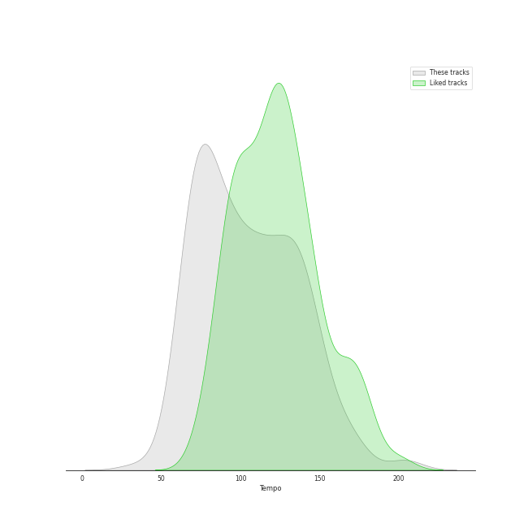

# Track Features for Vladimir Ashkenazy

## Danceability

| ​ | 10 most Danceable tracks | ​​ | 10 least Danceable tracks |
|:---|:---|:---|:---|
|  | 24 Préludes, Op. 28: No. 20 in C Minor: Largo (0.753) |  | 24 Préludes, Op. 28: No. 13 in F-Sharp Major: Lento (0.124) |
|  | 24 Préludes, Op. 28: No. 10 in C-Sharp Minor: Molto allegro (0.629) |  | 24 Préludes, Op. 28: No. 23 in F Major: Moderato (0.148) |
|  | Piano Sonata No. 12 in A flat, Op. 26: 3. Marcia funebre sulla morte d'un Eroe (0.584) |  | Etude in F minor, Op. posth. " Méthode des méthodes " (0.196) |
|  | 24 Préludes, Op. 28: No. 7 in A Major: Andantino (0.58) |  | 24 Préludes, Op. 28: No. 8 in F-Sharp Minor: Molto agitato (0.201) |
|  | Feuille d'album in E, Op. posth. (0.521) |  | Piano Sonata No. 10 in G Major, Op. 14 No. 2: 1. Allegro (0.204) |
|  | Piano Sonata No. 2 in A, Op. 2 No. 2: 3. Scherzo (Allegretto) (0.521) |  | Nocturne No. 3 in B Major, Op. 9 No. 3 (0.218) |
|  | Piano Sonata No. 14 in C-Sharp Minor, Op. 27 No. 2 "Moonlight": II. Allegretto (0.504) |  | Waltz No. 12 in F Minor, Op. 70 No. 2 (0.227) |
|  | Piano Sonata No. 5 in C minor, Op. 10 No. 1: 2. Adagio molto (0.49) |  | Piano Sonata No. 21 in C Major, Op. 53 "Waldstein": I. Allegro con brio (0.231) |
|  | Galop Marquis (0.489) |  | Etude in A flat, Op. posth. " Méthode des méthodes " (0.233) |
|  | Piano Sonata No. 4 in E flat, Op. 7: 2. Largo, con gran espressione (0.471) |  | Ballade No. 1 in G Minor, Op. 23 (0.241) |

## Energy

| ​ | 10 most Energetic tracks | ​​ | 10 least Energetic tracks |
|:---|:---|:---|:---|
|  | 24 Préludes, Op. 28: No. 22 in G Minor: Molto agitato (0.392) |  | Piano Sonata No. 21 in C Major, Op. 53 "Waldstein": II. Introduzione (Adagio molto) (0.00157) |
|  | Galop Marquis (0.389) |  | Piano Sonata No. 31 in A flat, Op. 110: 3. Adagio ma non troppo (0.00168) |
|  | Piano Sonata No. 6 in F, Op. 10 No. 2: 3. Presto (0.351) |  | 24 Préludes, Op. 28: No. 7 in A Major: Andantino (0.00174) |
|  | 24 Préludes, Op. 28: No. 24 in D Minor: Allegro appassionato (0.307) |  | 24 Préludes, Op. 28: No. 13 in F-Sharp Major: Lento (0.0019) |
|  | 24 Préludes, Op. 28: No. 12 in G-Sharp Minor: Presto (0.253) |  | 24 Préludes, Op. 28: No. 2 in A Minor: Lento (0.00223) |
|  | Fugue in A minor (0.251) |  | Piano Sonata No. 14 in C-Sharp Minor, Op. 27 No. 2 "Moonlight": I. Adagio sostenuto (0.0025) |
|  | 24 Préludes, Op. 28: No. 16 in B-Flat Minor: Presto con fuoco (0.249) |  | Piano Sonata No. 2 in A, Op. 2 No. 2: 2. Largo appassionato (0.00343) |
|  | 24 Préludes, Op. 28: No. 18 in F Minor: Molto allegro (0.248) |  | Piano Sonata No. 4 in E flat, Op. 7: 2. Largo, con gran espressione (0.00362) |
|  | Piano Sonata No. 13 in E flat, Op. 27 No. 1: 4. Allegro vivace - Tempo I - Presto (0.247) |  | 24 Préludes, Op. 28: No. 6 in B Minor: Lento assai (0.00399) |
|  | Piano Sonata No. 23 in F Minor, Op. 57 "Appassionata": III. Allegro ma non troppo (0.245) |  | Piano Sonata No. 25 in G, Op. 79: 2. Andante (0.00446) |

## Speechiness

| ​ | 10 most Speechy tracks | ​​ | 10 least Speechy tracks |
|:---|:---|:---|:---|
|  | 24 Préludes, Op. 28: No. 20 in C Minor: Largo (0.592) |  | Polonaise No. 6 in A flat, Op. 53 -"Heroic" (0.0308) |
|  | Piano Sonata No. 21 in C Major, Op. 53 "Waldstein": II. Introduzione (Adagio molto) (0.0974) |  | Piano Sonata No. 25 in G, Op. 79: 3. Vivace (0.0322) |
|  | Piano Sonata No. 19 in G minor, Op. 49 No. 1: 2. Rondo (Allegro) (0.0889) |  | Piano Sonata No. 12 in A flat, Op. 26: 4. Allegro (0.0323) |
|  | 24 Préludes, Op. 28: No. 10 in C-Sharp Minor: Molto allegro (0.081) |  | 24 Préludes, Op. 28: No. 24 in D Minor: Allegro appassionato (0.0325) |
|  | Piano Sonata No. 12 in A flat, Op. 26: 3. Marcia funebre sulla morte d'un Eroe (0.075) |  | Berceuse in D-Flat Major, Op. 57 (0.0327) |
|  | 24 Préludes, Op. 28: No. 7 in A Major: Andantino (0.0694) |  | Nocturne No. 16 in E-Flat Major, Op. 55 No. 2 (0.0338) |
|  | Piano Sonata No. 22 in F, Op. 54: 1. In Tempo d'un Menuetto (0.066) |  | Piano Sonata No. 22 in F, Op. 54: 2. Allegretto (0.034) |
|  | Piano Sonata No. 4 in E flat, Op. 7: 2. Largo, con gran espressione (0.0615) |  | 24 Préludes, Op. 28: No. 19 in E-Flat Major: Vivace (0.034) |
|  | 24 Préludes, Op. 28: No. 4 in E Minor: Largo (0.0613) |  | Piano Sonata No. 9 in E, Op. 14 No. 1: 3. Rondo (Allegro comodo) (0.0342) |
|  | 24 Préludes, Op. 28: No. 6 in B Minor: Lento assai (0.0605) |  | Polonaise No. 8 in D minor, Op. 71 No. 1 (0.0342) |

## Acousticness

| ​ | 10 most Acoustic tracks | ​​ | 10 least Acoustic tracks |
|:---|:---|:---|:---|
|  | Wiosna, B117 (arr. from Op. 74/2) (0.996) |  | 24 Préludes, Op. 28: No. 22 in G Minor: Molto agitato (0.915) |
|  | Feuille d'album in E, Op. posth. (0.995) |  | 24 Préludes, Op. 28: No. 24 in D Minor: Allegro appassionato (0.928) |
|  | Piano Sonata No. 25 in G, Op. 79: 2. Andante (0.995) |  | 24 Préludes, Op. 28: No. 14 in E-Flat Minor: Allegro (0.944) |
|  | Piano Sonata No. 19 in G minor, Op. 49 No. 1: 1. Andante (0.995) |  | Piano Sonata No. 32 in C minor, Op. 111: 1. Maestoso - Allegro con brio ed appassionato (0.958) |
|  | Piano Sonata No. 9 in E, Op. 14 No. 1: 2. Allegretto (0.995) |  | Piano Sonata No. 32 in C minor, Op. 111: 2. Arietta (Adagio molto semplice e cantabile) (0.959) |
|  | 24 Préludes, Op. 28: No. 6 in B Minor: Lento assai (0.995) |  | Piano Sonata No. 21 in C Major, Op. 53 "Waldstein": III. Rondo (Allegretto moderato - Prestissimo) (0.964) |
|  | Nocturne No. 11 in G minor, Op. 37 No. 1 (0.995) |  | Piano Sonata No. 17 in D minor, Op. 31 No. 2 -"Tempest": 3. Allegretto (0.965) |
|  | Nocturne No. 6 in G Minor, Op. 15 No. 3 (0.995) |  | Piano Sonata No. 17 in D minor, Op. 31 No. 2 -"Tempest": 1. Largo - Allegro (0.97) |
|  | Nocturne No. 10 in A-Flat Major, Op. 32 No. 2 (0.995) |  | Piano Sonata No. 21 in C Major, Op. 53 "Waldstein": I. Allegro con brio (0.97) |
|  | Piano Sonata No. 19 in G minor, Op. 49 No. 1: 2. Rondo (Allegro) (0.995) |  | Piano Sonata No. 29 in B flat, Op. 106 -"Hammerklavier": 1. Allegro (0.971) |

## Instrumentalness

| ​ | 10 most Instrumental tracks | ​​ | 10 least Instrumental tracks |
|:---|:---|:---|:---|
|  | 24 Préludes, Op. 28: No. 7 in A Major: Andantino (0.956) |  | 24 Préludes, Op. 28: No. 5 in D Major: Molto allegro (0.805) |
|  | 24 Préludes, Op. 28: No. 10 in C-Sharp Minor: Molto allegro (0.955) |  | 24 Préludes, Op. 28: No. 14 in E-Flat Minor: Allegro (0.824) |
|  | Nocturne No. 6 in G Minor, Op. 15 No. 3 (0.952) |  | 24 Préludes, Op. 28: No. 24 in D Minor: Allegro appassionato (0.831) |
|  | Waltz No. 15 in E Major, Op. posth. (0.949) |  | Piano Sonata No. 32 in C minor, Op. 111: 1. Maestoso - Allegro con brio ed appassionato (0.836) |
|  | Prélude No.26 in A Flat, Op.posth. (0.949) |  | Waltz No. 19 in A Minor, Op. Posth. (0.839) |
|  | 24 Préludes, Op. 28: No. 8 in F-Sharp Minor: Molto agitato (0.945) |  | Polonaise in G sharp minor, Op. posth. (0.84) |
|  | Ballade No. 1 in G Minor, Op. 23 (0.944) |  | 24 Préludes, Op. 28: No. 9 in E Major: Largo (0.849) |
|  | 24 Préludes, Op. 28: No. 16 in B-Flat Minor: Presto con fuoco (0.944) |  | Piano Sonata No. 19 in G minor, Op. 49 No. 1: 2. Rondo (Allegro) (0.849) |
|  | 24 Préludes, Op. 28: No. 6 in B Minor: Lento assai (0.942) |  | Etude in A flat, Op. posth. " Méthode des méthodes " (0.852) |
|  | Piano Sonata No. 9 in E, Op. 14 No. 1: 2. Allegretto (0.941) |  | Fugue in A minor (0.852) |

## Liveness

| ​ | 10 most Live tracks | ​​ | 10 least Live tracks |
|:---|:---|:---|:---|
|  | Piano Sonata No. 30 in E, Op. 109: 1. Vivace, ma non troppo - Adagio espressivo - Tempo I (0.362) |  | 24 Préludes, Op. 28: No. 7 in A Major: Andantino (0.0504) |
|  | Piano Sonata No. 25 in G, Op. 79: 3. Vivace (0.353) |  | Piano Sonata No. 32 in C minor, Op. 111: 2. Arietta (Adagio molto semplice e cantabile) (0.0511) |
|  | Piano Sonata No. 11 in B flat, Op. 22: 4. Rondo (Allegretto) (0.289) |  | Scherzo No. 1 In B Minor, Op. 20 (0.0569) |
|  | Piano Sonata No. 13 in E flat, Op. 27 No. 1: 3. Adagio con espressione (0.244) |  | Piano Sonata No. 8 in C Minor, Op. 13 "Pathétique": III. Rondo (Allegro) (0.0575) |
|  | Waltz No. 8 in A-Flat Major, Op. 64 No. 3 (0.24) |  | Nocturne No. 15 in F Minor, Op. 55 No. 1 (0.0584) |
|  | Piano Sonata No. 17 in D minor, Op. 31 No. 2 -"Tempest": 1. Largo - Allegro (0.227) |  | Piano Sonata No. 31 in A flat, Op. 110: 1. Moderato cantabile molto espressivo (0.0588) |
|  | 24 Préludes, Op. 28: No. 16 in B-Flat Minor: Presto con fuoco (0.208) |  | Piano Sonata No. 3 in C, Op. 2 No. 3: 4. Allegro assai (0.0615) |
|  | Polonaise in B flat, Op. posth. (0.201) |  | Piano Sonata No. 29 in B flat, Op. 106 -"Hammerklavier": 3. Adagio sostenuto (0.0616) |
|  | Waltz No. 6 in D-Flat, Op. 64, No. 1 "Minute" (0.2) |  | Piano Sonata No. 10 in G Major, Op. 14 No. 2: 1. Allegro (0.0645) |
|  | Piano Sonata No. 29 in B flat, Op. 106 -"Hammerklavier": 4. Largo - Allegro risoluto (0.198) |  | Piano Sonata No. 19 in G minor, Op. 49 No. 1: 2. Rondo (Allegro) (0.0668) |

## Valence

| ​ | 10 most Happy tracks | ​​ | 10 least Happy tracks |
|:---|:---|:---|:---|
|  | Galop Marquis (0.893) |  | 24 Préludes, Op. 28: No. 7 in A Major: Andantino (0.0) |
|  | Waltz No. 16 in A flat, Op. posth. (0.89) |  | 24 Préludes, Op. 28: No. 9 in E Major: Largo (0.0292) |
|  | Piano Sonata No. 6 in F, Op. 10 No. 2: 3. Presto (0.814) |  | 24 Préludes, Op. 28: No. 4 in E Minor: Largo (0.0354) |
|  | Piano Sonata No. 25 in G, Op. 79: 3. Vivace (0.791) |  | Piano Sonata No. 29 in B flat, Op. 106 -"Hammerklavier": 3. Adagio sostenuto (0.0356) |
|  | 24 Préludes, Op. 28: No. 11 in B Major: Vivace (0.701) |  | Etude in A flat, Op. posth. " Méthode des méthodes " (0.0362) |
|  | Fugue in A minor (0.657) |  | Ballade No. 2 in F Major, Op. 38 (0.0364) |
|  | Piano Sonata No. 12 in A flat, Op. 26: 4. Allegro (0.652) |  | Piano Sonata No. 31 in A flat, Op. 110: 3. Adagio ma non troppo (0.0367) |
|  | Tarantelle In A Flat, Op. 43 (0.639) |  | 24 Préludes, Op. 28: No. 8 in F-Sharp Minor: Molto agitato (0.0375) |
|  | 24 Préludes, Op. 28: No. 22 in G Minor: Molto agitato (0.611) |  | Nocturne No. 1 in B-Flat Minor, Op. 9 No. 1 (0.0381) |
|  | Piano Sonata No. 3 in C, Op. 2 No. 3: 3. Scherzo (Allegro) (0.574) |  | Nocturne No. 13 in C minor, Op. 48 No. 1 (0.0382) |

## Tempo

| ​ | 10 most Fast tracks | ​​ | 10 least Fast tracks |
|:---|:---|:---|:---|
|  | 24 Préludes, Op. 28: No. 6 in B Minor: Lento assai (203.905) |  | 24 Préludes, Op. 28: No. 20 in C Minor: Largo (34.105) |
|  | Piano Sonata No. 29 in B flat, Op. 106 -"Hammerklavier": 2. Scherzo (Assai vivace - Presto - Prestissimo - Tempo I) (203.867) |  | 24 Préludes, Op. 28: No. 8 in F-Sharp Minor: Molto agitato (53.925) |
|  | 24 Préludes, Op. 28: No. 19 in E-Flat Major: Vivace (174.421) |  | Waltz No. 11 in G-Flat Major, Op. 70 No. 1 (58.131) |
|  | Piano Sonata No. 9 in E, Op. 14 No. 1: 1. Allegro (172.047) |  | 24 Préludes, Op. 28: No. 7 in A Major: Andantino (59.272) |
|  | Waltz No. 12 in F Minor, Op. 70 No. 2 (170.339) |  | 24 Préludes, Op. 28: No. 18 in F Minor: Molto allegro (59.67) |
|  | Waltz No. 3 in A Minor, Op. 34 No. 2 (169.24) |  | Piano Sonata No. 13 in E flat, Op. 27 No. 1: 3. Adagio con espressione (60.671) |
|  | Piano Sonata No. 19 in G minor, Op. 49 No. 1: 2. Rondo (Allegro) (167.389) |  | Waltz No. 10 in B Minor, Op. 69 No. 2 (63.411) |
|  | Piano Sonata No. 6 in F, Op. 10 No. 2: 3. Presto (161.915) |  | Piano Sonata No. 22 in F, Op. 54: 1. In Tempo d'un Menuetto (64.303) |
|  | Piano Sonata No. 20 in G, Op. 49 No. 2: 1. Allegro ma non troppo (156.812) |  | Barcarolle in F-Sharp Major, Op. 60 (64.703) |
|  | Piano Sonata No. 25 in G, Op. 79: 3. Vivace (156.132) |  | Polonaise No. 1 in C sharp minor, Op. 26 No. 1 (64.705) |
