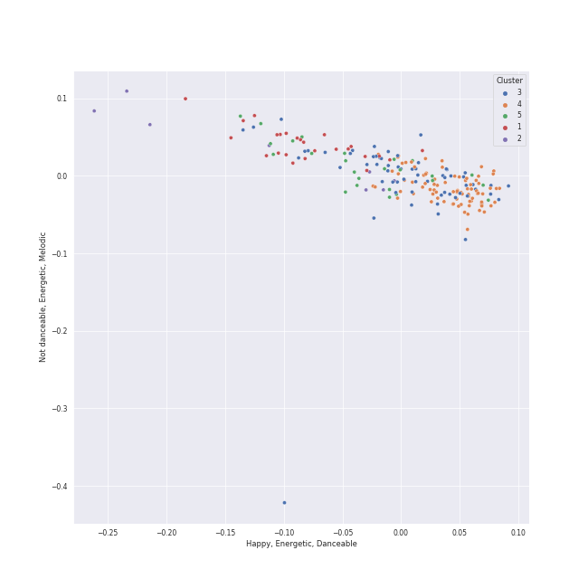

# Clusters in Vladimir Ashkenazy

## Cluster #1

25 tracks

| Art | Track | Album | Artists | Label | Rank | 💚 | 🔗 |
|:---|:---|:---|:---|:---|---:|:---|:---|
|  | Polonaise No. 2 in E flat minor, Op. 26 No. 2 | Chopin: Polonaises | [Frédéric Chopin](../../../frédéric_chopin/overview.md), [Vladimir Ashkenazy](../../overview.md) | [Decca Music Group Ltd.](../../../../labels/decca_music_group_ltd_) | 868 | | [🔗](https://open.spotify.com/track/3ydVMQUTvpVrF8dZrsl5Ev) |
|  | Allegro de concert in A, Op. 46 | Chopin: Polonaises | [Frédéric Chopin](../../../frédéric_chopin/overview.md), [Vladimir Ashkenazy](../../overview.md) | [Decca Music Group Ltd.](../../../../labels/decca_music_group_ltd_) | 868 | | [🔗](https://open.spotify.com/track/5HYXEEalWgkYTPCphTXRNY) |
|  | Piano Sonata No. 28 in A, Op. 101: 2. Lebhaft, marschmäßig (Vivace alla marcia) | Beethoven: The Piano Sonatas | [Ludwig van Beethoven](../../../ludwig_van_beethoven/overview.md), [Vladimir Ashkenazy](../../overview.md) | [Decca Music Group Ltd.](../../../../labels/decca_music_group_ltd_) | 868 | | [🔗](https://open.spotify.com/track/34mjwTLHXOlw8hkXThHtkG) |
|  | Piano Sonata No. 22 in F, Op. 54: 1. In Tempo d'un Menuetto | Beethoven: The Piano Sonatas | [Ludwig van Beethoven](../../../ludwig_van_beethoven/overview.md), [Vladimir Ashkenazy](../../overview.md) | [Decca Music Group Ltd.](../../../../labels/decca_music_group_ltd_) | 868 | | [🔗](https://open.spotify.com/track/3by3Ot4t6qvbM5m8aARcnU) |
|  | Piano Sonata No. 13 in E flat, Op. 27 No. 1: 4. Allegro vivace - Tempo I - Presto | Beethoven: The Piano Sonatas | [Ludwig van Beethoven](../../../ludwig_van_beethoven/overview.md), [Vladimir Ashkenazy](../../overview.md) | [Decca Music Group Ltd.](../../../../labels/decca_music_group_ltd_) | 868 | | [🔗](https://open.spotify.com/track/3dK10JRS2TarLCLWZbo27R) |
|  | Piano Sonata No. 13 in E flat, Op. 27, No. 1: 2. Allegro molto e vivace | Beethoven: The Piano Sonatas | [Ludwig van Beethoven](../../../ludwig_van_beethoven/overview.md), [Vladimir Ashkenazy](../../overview.md) | [Decca Music Group Ltd.](../../../../labels/decca_music_group_ltd_) | 868 | | [🔗](https://open.spotify.com/track/5TooCaJdIpM4PSFIAKpqOx) |
|  | Piano Sonata No. 21 in C Major, Op. 53 "Waldstein": I. Allegro con brio | Beethoven: The Piano Sonatas | [Ludwig van Beethoven](../../../ludwig_van_beethoven/overview.md), [Vladimir Ashkenazy](../../overview.md) | [Decca Music Group Ltd.](../../../../labels/decca_music_group_ltd_) | 868 | | [🔗](https://open.spotify.com/track/6mhZMduiw9NIIRk75k9WVy) |
|  | Piano Sonata No. 29 in B flat, Op. 106 -"Hammerklavier": 1. Allegro | Beethoven: The Piano Sonatas | [Ludwig van Beethoven](../../../ludwig_van_beethoven/overview.md), [Vladimir Ashkenazy](../../overview.md) | [Decca Music Group Ltd.](../../../../labels/decca_music_group_ltd_) | 868 | | [🔗](https://open.spotify.com/track/7HuiaLJAKmUDZSSe5gsPBb) |
|  | Piano Sonata No. 8 in C Minor, Op. 13 "Pathétique": I. Grave - Allegro di molto e con brio | Beethoven: Piano Sonatas "Moonlight"; "Appassionata"; "Pathétique" | [Ludwig van Beethoven](../../../ludwig_van_beethoven/overview.md), [Vladimir Ashkenazy](../../overview.md) | [Decca Music Group Ltd.](../../../../labels/decca_music_group_ltd_) | 868 | | [🔗](https://open.spotify.com/track/1BBoow3jdOQDYqUUSVHcqt) |
|  | Piano Sonata No. 23 in F Minor, Op. 57 "Appassionata": III. Allegro ma non troppo | Beethoven: Piano Sonatas "Moonlight"; "Appassionata"; "Pathétique" | [Ludwig van Beethoven](../../../ludwig_van_beethoven/overview.md), [Vladimir Ashkenazy](../../overview.md) | [Decca Music Group Ltd.](../../../../labels/decca_music_group_ltd_) | 868 | | [🔗](https://open.spotify.com/track/3sDfDzDuu3n8eK0onbAXwA) |
## Cluster #2

9 tracks

| Art | Track | Album | Artists | Label | Rank | 💚 | 🔗 |
|:---|:---|:---|:---|:---|---:|:---|:---|
|  | 24 Préludes, Op. 28: No. 11 in B Major: Vivace | Chopin: Waltzes; 4 Scherzos; 26 Preludes | [Frédéric Chopin](../../../frédéric_chopin/overview.md), [Vladimir Ashkenazy](../../overview.md) | [Decca Music Group Ltd.](../../../../labels/decca_music_group_ltd_) | 868 | | [🔗](https://open.spotify.com/track/3YhQthjnOeJquPn2f1c93j) |
|  | 24 Préludes, Op. 28: No. 22 in G Minor: Molto agitato | Chopin: Waltzes; 4 Scherzos; 26 Preludes | [Frédéric Chopin](../../../frédéric_chopin/overview.md), [Vladimir Ashkenazy](../../overview.md) | [Decca Music Group Ltd.](../../../../labels/decca_music_group_ltd_) | 868 | | [🔗](https://open.spotify.com/track/4Iua163lGhHg173SzY7g45) |
|  | Waltz No. 16 in A flat, Op. posth. | Chopin: Waltzes; 4 Scherzos; 26 Preludes | [Frédéric Chopin](../../../frédéric_chopin/overview.md), [Vladimir Ashkenazy](../../overview.md) | [Decca Music Group Ltd.](../../../../labels/decca_music_group_ltd_) | 868 | | [🔗](https://open.spotify.com/track/4bjAq5Ve39zaErDRO0rhsH) |
|  | Galop Marquis | Chopin: Polonaises | [Frédéric Chopin](../../../frédéric_chopin/overview.md), [Vladimir Ashkenazy](../../overview.md) | [Decca Music Group Ltd.](../../../../labels/decca_music_group_ltd_) | 868 | | [🔗](https://open.spotify.com/track/0CeyjRUCfoltQmSTVL1h3M) |
|  | Tarantelle In A Flat, Op. 43 | Chopin: Polonaises | [Frédéric Chopin](../../../frédéric_chopin/overview.md), [Vladimir Ashkenazy](../../overview.md) | [Decca Music Group Ltd.](../../../../labels/decca_music_group_ltd_) | 868 | | [🔗](https://open.spotify.com/track/0Dy23NaykLsmz6VM0lUJ9e) |
|  | Fugue in A minor | Chopin: Polonaises | [Frédéric Chopin](../../../frédéric_chopin/overview.md), [Vladimir Ashkenazy](../../overview.md) | [Decca Music Group Ltd.](../../../../labels/decca_music_group_ltd_) | 868 | | [🔗](https://open.spotify.com/track/31dHappgsBbViaFb5O26AD) |
|  | Piano Sonata No. 25 in G, Op. 79: 3. Vivace | Beethoven: The Piano Sonatas | [Ludwig van Beethoven](../../../ludwig_van_beethoven/overview.md), [Vladimir Ashkenazy](../../overview.md) | [Decca Music Group Ltd.](../../../../labels/decca_music_group_ltd_) | 868 | | [🔗](https://open.spotify.com/track/0mUGRc6gLkHcgOIR8sabE0) |
|  | Piano Sonata No. 12 in A flat, Op. 26: 4. Allegro | Beethoven: The Piano Sonatas | [Ludwig van Beethoven](../../../ludwig_van_beethoven/overview.md), [Vladimir Ashkenazy](../../overview.md) | [Decca Music Group Ltd.](../../../../labels/decca_music_group_ltd_) | 868 | | [🔗](https://open.spotify.com/track/31AZdDNdlQCUezidrDWH47) |
|  | Piano Sonata No. 6 in F, Op. 10 No. 2: 3. Presto | Beethoven: The Piano Sonatas | [Ludwig van Beethoven](../../../ludwig_van_beethoven/overview.md), [Vladimir Ashkenazy](../../overview.md) | [Decca Music Group Ltd.](../../../../labels/decca_music_group_ltd_) | 868 | | [🔗](https://open.spotify.com/track/5QjudrRTfGuFlouT4LcV2j) |
## Cluster #3

62 tracks

| Art | Track | Album | Artists | Label | Rank | 💚 | 🔗 |
|:---|:---|:---|:---|:---|---:|:---|:---|
|  | Waltz No. 4 in F Major, Op. 34 No. 3 | Chopin: Waltzes; 4 Scherzos; 26 Preludes | [Frédéric Chopin](../../../frédéric_chopin/overview.md), [Vladimir Ashkenazy](../../overview.md) | [Decca Music Group Ltd.](../../../../labels/decca_music_group_ltd_) | 868 | | [🔗](https://open.spotify.com/track/663LMA5z3qtBuiFLhnjvvI) |
|  | Polonaise No. 8 in D minor, Op. 71 No. 1 | Chopin: Polonaises | [Frédéric Chopin](../../../frédéric_chopin/overview.md), [Vladimir Ashkenazy](../../overview.md) | [Decca Music Group Ltd.](../../../../labels/decca_music_group_ltd_) | 868 | | [🔗](https://open.spotify.com/track/6KLB4fl8olgi63Ou1rCk6G) |
|  | Piano Sonata No. 11 in B flat, Op. 22: 1. Allegro con brio | Beethoven: The Piano Sonatas | [Ludwig van Beethoven](../../../ludwig_van_beethoven/overview.md), [Vladimir Ashkenazy](../../overview.md) | [Decca Music Group Ltd.](../../../../labels/decca_music_group_ltd_) | 868 | | [🔗](https://open.spotify.com/track/0JGm7LxCumF7nRrUlF5QIt) |
|  | Piano Sonata No. 2 in A, Op. 2 No. 2: 4. Rondo (Grazioso) | Beethoven: The Piano Sonatas | [Ludwig van Beethoven](../../../ludwig_van_beethoven/overview.md), [Vladimir Ashkenazy](../../overview.md) | [Decca Music Group Ltd.](../../../../labels/decca_music_group_ltd_) | 868 | | [🔗](https://open.spotify.com/track/1Lv1DwrC0wphiUnlhDczkK) |
|  | Piano Sonata No. 1 in F minor, Op. 2 No. 1: 4. Prestissimo | Beethoven: The Piano Sonatas | [Ludwig van Beethoven](../../../ludwig_van_beethoven/overview.md), [Vladimir Ashkenazy](../../overview.md) | [Decca Music Group Ltd.](../../../../labels/decca_music_group_ltd_) | 868 | | [🔗](https://open.spotify.com/track/1Wrn95wC9svYqRRPovuW8x) |
|  | Piano Sonata No. 4 in E flat, Op. 7: 4. Rondo (Poco allegretto e grazioso) | Beethoven: The Piano Sonatas | [Ludwig van Beethoven](../../../ludwig_van_beethoven/overview.md), [Vladimir Ashkenazy](../../overview.md) | [Decca Music Group Ltd.](../../../../labels/decca_music_group_ltd_) | 868 | | [🔗](https://open.spotify.com/track/1f64W90KNdGhGzoElkVy3G) |
|  | Piano Sonata No. 1 in F minor, Op. 2 No. 1: 1. Allegro | Beethoven: The Piano Sonatas | [Ludwig van Beethoven](../../../ludwig_van_beethoven/overview.md), [Vladimir Ashkenazy](../../overview.md) | [Decca Music Group Ltd.](../../../../labels/decca_music_group_ltd_) | 868 | | [🔗](https://open.spotify.com/track/2E0Q7KZ2b6wTMsuDA8lRhz) |
|  | Piano Sonata No. 9 in E, Op. 14 No. 1: 1. Allegro | Beethoven: The Piano Sonatas | [Ludwig van Beethoven](../../../ludwig_van_beethoven/overview.md), [Vladimir Ashkenazy](../../overview.md) | [Decca Music Group Ltd.](../../../../labels/decca_music_group_ltd_) | 868 | | [🔗](https://open.spotify.com/track/3dijT40beX4KWeV7rUqLOP) |
|  | Piano Sonata No. 16 in G, Op. 31 No. 1: 1. Allegro vivace | Beethoven: The Piano Sonatas | [Ludwig van Beethoven](../../../ludwig_van_beethoven/overview.md), [Vladimir Ashkenazy](../../overview.md) | [Decca Music Group Ltd.](../../../../labels/decca_music_group_ltd_) | 868 | | [🔗](https://open.spotify.com/track/5r3qjqRLBS0SsLkuuBVntw) |
|  | Piano Sonata No. 4 in E flat, Op. 7: 3. Allegro | Beethoven: The Piano Sonatas | [Ludwig van Beethoven](../../../ludwig_van_beethoven/overview.md), [Vladimir Ashkenazy](../../overview.md) | [Decca Music Group Ltd.](../../../../labels/decca_music_group_ltd_) | 868 | | [🔗](https://open.spotify.com/track/7mjP1zIbYt98zXkL5HUIBs) |
## Cluster #4

84 tracks

| Art | Track | Album | Artists | Label | Rank | 💚 | 🔗 |
|:---|:---|:---|:---|:---|---:|:---|:---|
|  | Scherzo No. 2 in B Flat Minor, Op. 31 | Chopin: Waltzes; 4 Scherzos; 26 Preludes | [Frédéric Chopin](../../../frédéric_chopin/overview.md), [Vladimir Ashkenazy](../../overview.md) | [Decca Music Group Ltd.](../../../../labels/decca_music_group_ltd_) | 868 | | [🔗](https://open.spotify.com/track/3O2O8b69mNozAOATbfbKDP) |
|  | Nocturne No. 9 in B Major, Op. 32 No. 1 | Chopin: Nocturnes; Four Ballades | [Frédéric Chopin](../../../frédéric_chopin/overview.md), [Vladimir Ashkenazy](../../overview.md) | [Decca Music Group Ltd.](../../../../labels/decca_music_group_ltd_) | 868 | | [🔗](https://open.spotify.com/track/08GWfq6GjYQ63lPKTrTMOb) |
|  | Nocturne in C Minor, B. 108 | Chopin: Nocturnes; Four Ballades | [Frédéric Chopin](../../../frédéric_chopin/overview.md), [Vladimir Ashkenazy](../../overview.md) | [Decca Music Group Ltd.](../../../../labels/decca_music_group_ltd_) | 868 | | [🔗](https://open.spotify.com/track/0Wy1PVVtoKXI259E43Hivl) |
|  | Nocturne No. 3 in B Major, Op. 9 No. 3 | Chopin: Nocturnes; Four Ballades | [Frédéric Chopin](../../../frédéric_chopin/overview.md), [Vladimir Ashkenazy](../../overview.md) | [Decca Music Group Ltd.](../../../../labels/decca_music_group_ltd_) | 868 | | [🔗](https://open.spotify.com/track/6hkWg7ZomgbZNI26ZuXl5E) |
|  | Piano Sonata No. 15 in D, Op. 28 -"Pastorale": 1. Allegro | Beethoven: The Piano Sonatas | [Ludwig van Beethoven](../../../ludwig_van_beethoven/overview.md), [Vladimir Ashkenazy](../../overview.md) | [Decca Music Group Ltd.](../../../../labels/decca_music_group_ltd_) | 868 | | [🔗](https://open.spotify.com/track/3eiAUStWjc93DBuEPlEBSP) |
|  | Piano Sonata No. 13 in E flat, Op. 27 No. 1: 1. Andante - Allegro - Tempo I | Beethoven: The Piano Sonatas | [Ludwig van Beethoven](../../../ludwig_van_beethoven/overview.md), [Vladimir Ashkenazy](../../overview.md) | [Decca Music Group Ltd.](../../../../labels/decca_music_group_ltd_) | 868 | | [🔗](https://open.spotify.com/track/3sEMnEwMLitPryhuGxgQpV) |
|  | Piano Sonata No. 6 in F, Op. 10 No. 2: 2. Allegretto | Beethoven: The Piano Sonatas | [Ludwig van Beethoven](../../../ludwig_van_beethoven/overview.md), [Vladimir Ashkenazy](../../overview.md) | [Decca Music Group Ltd.](../../../../labels/decca_music_group_ltd_) | 868 | | [🔗](https://open.spotify.com/track/4gThvgaLCcABLJIFFKTlig) |
|  | Piano Sonata No. 16 in G, Op. 31 No. 1: 2. Adagio grazioso | Beethoven: The Piano Sonatas | [Ludwig van Beethoven](../../../ludwig_van_beethoven/overview.md), [Vladimir Ashkenazy](../../overview.md) | [Decca Music Group Ltd.](../../../../labels/decca_music_group_ltd_) | 868 | | [🔗](https://open.spotify.com/track/55X24BGkDWD7lsHNsmGSY3) |
|  | Piano Sonata No. 27 in E minor, Op. 90: 1. Mit Lebhaftigkeit und durchaus mit Empfindung und Ausdruck | Beethoven: The Piano Sonatas | [Ludwig van Beethoven](../../../ludwig_van_beethoven/overview.md), [Vladimir Ashkenazy](../../overview.md) | [Decca Music Group Ltd.](../../../../labels/decca_music_group_ltd_) | 868 | | [🔗](https://open.spotify.com/track/6DY6DT8yFhYMLzawndbTLn) |
|  | Andante favori in F Major, WoO 57 | Beethoven: The Piano Sonatas | [Ludwig van Beethoven](../../../ludwig_van_beethoven/overview.md), [Vladimir Ashkenazy](../../overview.md) | [Decca Music Group Ltd.](../../../../labels/decca_music_group_ltd_) | 868 | | [🔗](https://open.spotify.com/track/6XvANHX6bfvmhYyvYwUQih) |
## Cluster #5

25 tracks

| Art | Track | Album | Artists | Label | Rank | 💚 | 🔗 |
|:---|:---|:---|:---|:---|---:|:---|:---|
|  | 24 Préludes, Op. 28: No. 19 in E-Flat Major: Vivace | Chopin: Waltzes; 4 Scherzos; 26 Preludes | [Frédéric Chopin](../../../frédéric_chopin/overview.md), [Vladimir Ashkenazy](../../overview.md) | [Decca Music Group Ltd.](../../../../labels/decca_music_group_ltd_) | 868 | | [🔗](https://open.spotify.com/track/2LFJqmTpIBmUa86o2bq3OI) |
|  | 24 Préludes, Op. 28: No. 3 in G Major: Vivace | Chopin: Waltzes; 4 Scherzos; 26 Preludes | [Frédéric Chopin](../../../frédéric_chopin/overview.md), [Vladimir Ashkenazy](../../overview.md) | [Decca Music Group Ltd.](../../../../labels/decca_music_group_ltd_) | 868 | | [🔗](https://open.spotify.com/track/3rXRGfUKRxuX0jdnBXeFk6) |
|  | 24 Préludes, Op. 28: No. 10 in C-Sharp Minor: Molto allegro | Chopin: Waltzes; 4 Scherzos; 26 Preludes | [Frédéric Chopin](../../../frédéric_chopin/overview.md), [Vladimir Ashkenazy](../../overview.md) | [Decca Music Group Ltd.](../../../../labels/decca_music_group_ltd_) | 868 | | [🔗](https://open.spotify.com/track/76L7FXkwv4SnOdH9KLNp8T) |
|  | Etude in D flat, Op. posth. " Méthode des méthodes " | Chopin: Polonaises | [Frédéric Chopin](../../../frédéric_chopin/overview.md), [Vladimir Ashkenazy](../../overview.md) | [Decca Music Group Ltd.](../../../../labels/decca_music_group_ltd_) | 868 | | [🔗](https://open.spotify.com/track/0banlptk443bq1tLPFcy0f) |
|  | Piano Sonata No. 10 in G Major, Op. 14 No. 2: 3. Scherzo. Allegro assai | Beethoven: The Piano Sonatas | [Ludwig van Beethoven](../../../ludwig_van_beethoven/overview.md), [Vladimir Ashkenazy](../../overview.md) | [Decca Music Group Ltd.](../../../../labels/decca_music_group_ltd_) | 868 | | [🔗](https://open.spotify.com/track/0VEufDhQQQvz863wJ7unXm) |
|  | Piano Sonata No. 2 in A, Op. 2 No. 2: 1. Allegro vivace | Beethoven: The Piano Sonatas | [Ludwig van Beethoven](../../../ludwig_van_beethoven/overview.md), [Vladimir Ashkenazy](../../overview.md) | [Decca Music Group Ltd.](../../../../labels/decca_music_group_ltd_) | 868 | | [🔗](https://open.spotify.com/track/0j6XoSUHbf3aj487ZOn6t6) |
|  | Piano Sonata No. 12 in A flat, Op. 26: 2. Scherzo (Allegro molto) | Beethoven: The Piano Sonatas | [Ludwig van Beethoven](../../../ludwig_van_beethoven/overview.md), [Vladimir Ashkenazy](../../overview.md) | [Decca Music Group Ltd.](../../../../labels/decca_music_group_ltd_) | 868 | | [🔗](https://open.spotify.com/track/1ceRZjxysooUhNqjsvetIF) |
|  | Piano Sonata No. 31 in A flat, Op. 110: 2. Allegro molto | Beethoven: The Piano Sonatas | [Ludwig van Beethoven](../../../ludwig_van_beethoven/overview.md), [Vladimir Ashkenazy](../../overview.md) | [Decca Music Group Ltd.](../../../../labels/decca_music_group_ltd_) | 868 | | [🔗](https://open.spotify.com/track/3UfHf3OZVwTS9bip0AQykg) |
|  | Piano Sonata No. 25 in G, Op. 79: 1. Presto alla tedesca | Beethoven: The Piano Sonatas | [Ludwig van Beethoven](../../../ludwig_van_beethoven/overview.md), [Vladimir Ashkenazy](../../overview.md) | [Decca Music Group Ltd.](../../../../labels/decca_music_group_ltd_) | 868 | | [🔗](https://open.spotify.com/track/51etNICsNf6ltMHZ4I0i2q) |
|  | Piano Sonata No. 20 in G, Op. 49 No. 2: 1. Allegro ma non troppo | Beethoven: The Piano Sonatas | [Ludwig van Beethoven](../../../ludwig_van_beethoven/overview.md), [Vladimir Ashkenazy](../../overview.md) | [Decca Music Group Ltd.](../../../../labels/decca_music_group_ltd_) | 868 | | [🔗](https://open.spotify.com/track/7onetNzttpXOktzvYhHjEE) |