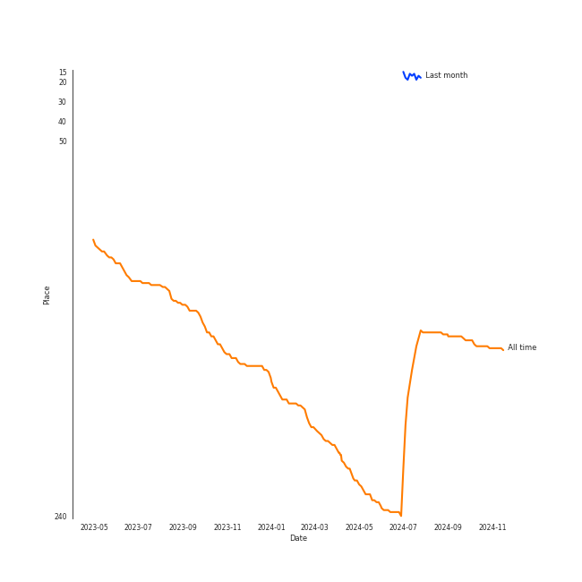

# Vladimir Ashkenazy

[See Track Features](audio_features.md)

[See Clusters](clusters/overview.md)

## Artist Rank
- The #150 artist of all time

## Top Albums

| Art | Rank | Tracks | 💚 | Album | Release Date | 🔗 |
|:---|---:|---:|---:|:---|:---|:---|
|  | 642 | 94 | 0 | Beethoven: The Piano Sonatas | 1995-01-01 | [🔗](https://open.spotify.com/album/7xbsSOswKgms1fUFuwKArz) |
|  | 642 | 49 | 0 | Chopin: Waltzes; 4 Scherzos; 26 Preludes | 1999-01-01 | [🔗](https://open.spotify.com/album/0yCrQ6dCqiI6ldqI8LPqWB) |
|  | 642 | 28 | 0 | Chopin: Polonaises | 1996-01-01 | [🔗](https://open.spotify.com/album/19ofW4fqCAR2uQJKVWw6L6) |
|  | 642 | 25 | 0 | Chopin: Nocturnes; Four Ballades | 1997-01-01 | [🔗](https://open.spotify.com/album/0lrM7kR5o7iqkajLKIlzRg) |
|  | 642 | 9 | 0 | Beethoven: Piano Sonatas "Moonlight"; "Appassionata"; "Pathétique" | 1983-01-01 | [🔗](https://open.spotify.com/album/0RCfE1YhkdrjnM3kXT3YLl) |

## Featured on Playlists
| Art | Tracks | Playlist |
|:---|---:|:---|
|  | 103 | [Beethoven](../../playlists/beethoven/overview.md) |
|  | 102 | [Chopin](../../playlists/chopin/overview.md) |

## Top Record Labels

| Tracks | 💚 | Label |
|---:|---:|:---|
| 205 | 0 | [Decca Music Group Ltd.](../../labels/decca_music_group_ltd_/overview.md) |

## Genres

- [classical](../../genres/classical/overview.md)
- classical performance
- russian classical piano

## Tracks

| Art | Track | Album | Artists | Label | Rank | 💚 | 🔗 |
|:---|:---|:---|:---|:---|---:|:---|:---|
|  | Piano Sonata No. 14 in C-Sharp Minor, Op. 27 No. 2 "Moonlight": I. Adagio sostenuto | Beethoven: Piano Sonatas "Moonlight"; "Appassionata"; "Pathétique" | [Ludwig van Beethoven](../ludwig_van_beethoven/overview.md), [Vladimir Ashkenazy](overview.md) | [Decca Music Group Ltd.](../../labels/decca_music_group_ltd_) | 971 | | [🔗](https://open.spotify.com/track/7rv8C5AxTZ5cLjin8nto2m) |
|  | Piano Sonata No. 14 in C-Sharp Minor, Op. 27 No. 2 "Moonlight": II. Allegretto | Beethoven: Piano Sonatas "Moonlight"; "Appassionata"; "Pathétique" | [Ludwig van Beethoven](../ludwig_van_beethoven/overview.md), [Vladimir Ashkenazy](overview.md) | [Decca Music Group Ltd.](../../labels/decca_music_group_ltd_) | 971 | | [🔗](https://open.spotify.com/track/12LjzYWPDVmq2YVn7ABByJ) |
|  | Piano Sonata No. 14 in C-Sharp Minor, Op. 27 No. 2 "Moonlight": III. Presto agitato | Beethoven: Piano Sonatas "Moonlight"; "Appassionata"; "Pathétique" | [Ludwig van Beethoven](../ludwig_van_beethoven/overview.md), [Vladimir Ashkenazy](overview.md) | [Decca Music Group Ltd.](../../labels/decca_music_group_ltd_) | 971 | | [🔗](https://open.spotify.com/track/65EtDy80IN2jnroVPhiOtx) |
|  | Piano Sonata No. 23 in F Minor, Op. 57 "Appassionata": I. Allegro assai | Beethoven: Piano Sonatas "Moonlight"; "Appassionata"; "Pathétique" | [Ludwig van Beethoven](../ludwig_van_beethoven/overview.md), [Vladimir Ashkenazy](overview.md) | [Decca Music Group Ltd.](../../labels/decca_music_group_ltd_) | 971 | | [🔗](https://open.spotify.com/track/7oLMwmDiSJjZBNaX8LV2t9) |
|  | Piano Sonata No. 23 in F Minor, Op. 57 "Appassionata": II. Andante con moto | Beethoven: Piano Sonatas "Moonlight"; "Appassionata"; "Pathétique" | [Ludwig van Beethoven](../ludwig_van_beethoven/overview.md), [Vladimir Ashkenazy](overview.md) | [Decca Music Group Ltd.](../../labels/decca_music_group_ltd_) | 971 | | [🔗](https://open.spotify.com/track/1UwzIpBrQQfYGlG8h7Aux4) |
|  | Piano Sonata No. 23 in F Minor, Op. 57 "Appassionata": III. Allegro ma non troppo | Beethoven: Piano Sonatas "Moonlight"; "Appassionata"; "Pathétique" | [Ludwig van Beethoven](../ludwig_van_beethoven/overview.md), [Vladimir Ashkenazy](overview.md) | [Decca Music Group Ltd.](../../labels/decca_music_group_ltd_) | 971 | | [🔗](https://open.spotify.com/track/3sDfDzDuu3n8eK0onbAXwA) |
|  | Piano Sonata No. 8 in C Minor, Op. 13 "Pathétique": I. Grave - Allegro di molto e con brio | Beethoven: Piano Sonatas "Moonlight"; "Appassionata"; "Pathétique" | [Ludwig van Beethoven](../ludwig_van_beethoven/overview.md), [Vladimir Ashkenazy](overview.md) | [Decca Music Group Ltd.](../../labels/decca_music_group_ltd_) | 971 | | [🔗](https://open.spotify.com/track/1BBoow3jdOQDYqUUSVHcqt) |
|  | Piano Sonata No. 8 in C Minor, Op. 13 "Pathétique": II. Adagio cantabile | Beethoven: Piano Sonatas "Moonlight"; "Appassionata"; "Pathétique" | [Ludwig van Beethoven](../ludwig_van_beethoven/overview.md), [Vladimir Ashkenazy](overview.md) | [Decca Music Group Ltd.](../../labels/decca_music_group_ltd_) | 971 | | [🔗](https://open.spotify.com/track/29lgND5UlmYysapjjplX1k) |
|  | Piano Sonata No. 8 in C Minor, Op. 13 "Pathétique": III. Rondo (Allegro) | Beethoven: Piano Sonatas "Moonlight"; "Appassionata"; "Pathétique" | [Ludwig van Beethoven](../ludwig_van_beethoven/overview.md), [Vladimir Ashkenazy](overview.md) | [Decca Music Group Ltd.](../../labels/decca_music_group_ltd_) | 971 | | [🔗](https://open.spotify.com/track/26VXjT62aGxdMVDPwAQL4a) |
|  | Andante favori in F Major, WoO 57 | Beethoven: The Piano Sonatas | [Ludwig van Beethoven](../ludwig_van_beethoven/overview.md), [Vladimir Ashkenazy](overview.md) | [Decca Music Group Ltd.](../../labels/decca_music_group_ltd_) | 971 | | [🔗](https://open.spotify.com/track/6XvANHX6bfvmhYyvYwUQih) |

See all tracks

| Art | Track | Album | Artists | Label | Rank | 💚 | 🔗 |
|:---|:---|:---|:---|:---|---:|:---|:---|
|  | Piano Sonata No. 1 in F minor, Op. 2 No. 1: 1. Allegro | Beethoven: The Piano Sonatas | [Ludwig van Beethoven](../ludwig_van_beethoven/overview.md), [Vladimir Ashkenazy](overview.md) | [Decca Music Group Ltd.](../../labels/decca_music_group_ltd_) | 971 | | [🔗](https://open.spotify.com/track/2E0Q7KZ2b6wTMsuDA8lRhz) |
|  | Piano Sonata No. 1 in F minor, Op. 2 No. 1: 2. Adagio | Beethoven: The Piano Sonatas | [Ludwig van Beethoven](../ludwig_van_beethoven/overview.md), [Vladimir Ashkenazy](overview.md) | [Decca Music Group Ltd.](../../labels/decca_music_group_ltd_) | 971 | | [🔗](https://open.spotify.com/track/4PpdgsxpYNn7VJBQJX4jy2) |
|  | Piano Sonata No. 1 in F minor, Op. 2 No. 1: 3. Menuetto (Allegretto) | Beethoven: The Piano Sonatas | [Ludwig van Beethoven](../ludwig_van_beethoven/overview.md), [Vladimir Ashkenazy](overview.md) | [Decca Music Group Ltd.](../../labels/decca_music_group_ltd_) | 971 | | [🔗](https://open.spotify.com/track/67SOOKfcONBy6SdpoVz2bL) |
|  | Piano Sonata No. 1 in F minor, Op. 2 No. 1: 4. Prestissimo | Beethoven: The Piano Sonatas | [Ludwig van Beethoven](../ludwig_van_beethoven/overview.md), [Vladimir Ashkenazy](overview.md) | [Decca Music Group Ltd.](../../labels/decca_music_group_ltd_) | 971 | | [🔗](https://open.spotify.com/track/1Wrn95wC9svYqRRPovuW8x) |
|  | Piano Sonata No. 10 in G Major, Op. 14 No. 2: 1. Allegro | Beethoven: The Piano Sonatas | [Ludwig van Beethoven](../ludwig_van_beethoven/overview.md), [Vladimir Ashkenazy](overview.md) | [Decca Music Group Ltd.](../../labels/decca_music_group_ltd_) | 971 | | [🔗](https://open.spotify.com/track/2gamjD7tMdIsxVpYBC86I2) |
|  | Piano Sonata No. 10 in G Major, Op. 14 No. 2: 2. Andante | Beethoven: The Piano Sonatas | [Ludwig van Beethoven](../ludwig_van_beethoven/overview.md), [Vladimir Ashkenazy](overview.md) | [Decca Music Group Ltd.](../../labels/decca_music_group_ltd_) | 971 | | [🔗](https://open.spotify.com/track/6F6k480dc0Xm5VAsdotoGp) |
|  | Piano Sonata No. 10 in G Major, Op. 14 No. 2: 3. Scherzo. Allegro assai | Beethoven: The Piano Sonatas | [Ludwig van Beethoven](../ludwig_van_beethoven/overview.md), [Vladimir Ashkenazy](overview.md) | [Decca Music Group Ltd.](../../labels/decca_music_group_ltd_) | 971 | | [🔗](https://open.spotify.com/track/0VEufDhQQQvz863wJ7unXm) |
|  | Piano Sonata No. 11 in B flat, Op. 22: 1. Allegro con brio | Beethoven: The Piano Sonatas | [Ludwig van Beethoven](../ludwig_van_beethoven/overview.md), [Vladimir Ashkenazy](overview.md) | [Decca Music Group Ltd.](../../labels/decca_music_group_ltd_) | 971 | | [🔗](https://open.spotify.com/track/0JGm7LxCumF7nRrUlF5QIt) |
|  | Piano Sonata No. 11 in B flat, Op. 22: 2. Adagio con molto espressione | Beethoven: The Piano Sonatas | [Ludwig van Beethoven](../ludwig_van_beethoven/overview.md), [Vladimir Ashkenazy](overview.md) | [Decca Music Group Ltd.](../../labels/decca_music_group_ltd_) | 971 | | [🔗](https://open.spotify.com/track/6tB9IboWrHcn2gu1yPkN18) |
|  | Piano Sonata No. 11 in B flat, Op. 22: 3. Menuetto | Beethoven: The Piano Sonatas | [Ludwig van Beethoven](../ludwig_van_beethoven/overview.md), [Vladimir Ashkenazy](overview.md) | [Decca Music Group Ltd.](../../labels/decca_music_group_ltd_) | 971 | | [🔗](https://open.spotify.com/track/6Cf92UVZEP2X4IVG96Rxlx) |
|  | Piano Sonata No. 11 in B flat, Op. 22: 4. Rondo (Allegretto) | Beethoven: The Piano Sonatas | [Ludwig van Beethoven](../ludwig_van_beethoven/overview.md), [Vladimir Ashkenazy](overview.md) | [Decca Music Group Ltd.](../../labels/decca_music_group_ltd_) | 971 | | [🔗](https://open.spotify.com/track/09TzZIZStFNY1Kza5CEgRr) |
|  | Piano Sonata No. 12 in A flat, Op. 26: 1. Andante con variazioni | Beethoven: The Piano Sonatas | [Ludwig van Beethoven](../ludwig_van_beethoven/overview.md), [Vladimir Ashkenazy](overview.md) | [Decca Music Group Ltd.](../../labels/decca_music_group_ltd_) | 971 | | [🔗](https://open.spotify.com/track/0jZpofwQyc0pgFCLISZyqH) |
|  | Piano Sonata No. 12 in A flat, Op. 26: 2. Scherzo (Allegro molto) | Beethoven: The Piano Sonatas | [Ludwig van Beethoven](../ludwig_van_beethoven/overview.md), [Vladimir Ashkenazy](overview.md) | [Decca Music Group Ltd.](../../labels/decca_music_group_ltd_) | 971 | | [🔗](https://open.spotify.com/track/1ceRZjxysooUhNqjsvetIF) |
|  | Piano Sonata No. 12 in A flat, Op. 26: 3. Marcia funebre sulla morte d'un Eroe | Beethoven: The Piano Sonatas | [Ludwig van Beethoven](../ludwig_van_beethoven/overview.md), [Vladimir Ashkenazy](overview.md) | [Decca Music Group Ltd.](../../labels/decca_music_group_ltd_) | 971 | | [🔗](https://open.spotify.com/track/3ao7nFG8rHS8OYbCvA0Cuo) |
|  | Piano Sonata No. 12 in A flat, Op. 26: 4. Allegro | Beethoven: The Piano Sonatas | [Ludwig van Beethoven](../ludwig_van_beethoven/overview.md), [Vladimir Ashkenazy](overview.md) | [Decca Music Group Ltd.](../../labels/decca_music_group_ltd_) | 971 | | [🔗](https://open.spotify.com/track/31AZdDNdlQCUezidrDWH47) |
|  | Piano Sonata No. 13 in E flat, Op. 27 No. 1: 1. Andante - Allegro - Tempo I | Beethoven: The Piano Sonatas | [Ludwig van Beethoven](../ludwig_van_beethoven/overview.md), [Vladimir Ashkenazy](overview.md) | [Decca Music Group Ltd.](../../labels/decca_music_group_ltd_) | 971 | | [🔗](https://open.spotify.com/track/3sEMnEwMLitPryhuGxgQpV) |
|  | Piano Sonata No. 13 in E flat, Op. 27 No. 1: 3. Adagio con espressione | Beethoven: The Piano Sonatas | [Ludwig van Beethoven](../ludwig_van_beethoven/overview.md), [Vladimir Ashkenazy](overview.md) | [Decca Music Group Ltd.](../../labels/decca_music_group_ltd_) | 971 | | [🔗](https://open.spotify.com/track/69FbfBxdOQ46TrFPBcUnYZ) |
|  | Piano Sonata No. 13 in E flat, Op. 27 No. 1: 4. Allegro vivace - Tempo I - Presto | Beethoven: The Piano Sonatas | [Ludwig van Beethoven](../ludwig_van_beethoven/overview.md), [Vladimir Ashkenazy](overview.md) | [Decca Music Group Ltd.](../../labels/decca_music_group_ltd_) | 971 | | [🔗](https://open.spotify.com/track/3dK10JRS2TarLCLWZbo27R) |
|  | Piano Sonata No. 13 in E flat, Op. 27, No. 1: 2. Allegro molto e vivace | Beethoven: The Piano Sonatas | [Ludwig van Beethoven](../ludwig_van_beethoven/overview.md), [Vladimir Ashkenazy](overview.md) | [Decca Music Group Ltd.](../../labels/decca_music_group_ltd_) | 971 | | [🔗](https://open.spotify.com/track/5TooCaJdIpM4PSFIAKpqOx) |
|  | Piano Sonata No. 15 in D, Op. 28 -"Pastorale": 1. Allegro | Beethoven: The Piano Sonatas | [Ludwig van Beethoven](../ludwig_van_beethoven/overview.md), [Vladimir Ashkenazy](overview.md) | [Decca Music Group Ltd.](../../labels/decca_music_group_ltd_) | 971 | | [🔗](https://open.spotify.com/track/3eiAUStWjc93DBuEPlEBSP) |
|  | Piano Sonata No. 15 in D, Op. 28 -"Pastorale": 2. Andante | Beethoven: The Piano Sonatas | [Ludwig van Beethoven](../ludwig_van_beethoven/overview.md), [Vladimir Ashkenazy](overview.md) | [Decca Music Group Ltd.](../../labels/decca_music_group_ltd_) | 971 | | [🔗](https://open.spotify.com/track/5xydghdYPMMVdQJTVX2ZPX) |
|  | Piano Sonata No. 15 in D, Op. 28 -"Pastorale": 3. Scherzo (Allegro assai) | Beethoven: The Piano Sonatas | [Ludwig van Beethoven](../ludwig_van_beethoven/overview.md), [Vladimir Ashkenazy](overview.md) | [Decca Music Group Ltd.](../../labels/decca_music_group_ltd_) | 971 | | [🔗](https://open.spotify.com/track/3PzrgxokeKboRe1MyMkAsz) |
|  | Piano Sonata No. 15 in D, Op. 28 -"Pastorale": 4. Rondo. Allegro ma non troppo | Beethoven: The Piano Sonatas | [Ludwig van Beethoven](../ludwig_van_beethoven/overview.md), [Vladimir Ashkenazy](overview.md) | [Decca Music Group Ltd.](../../labels/decca_music_group_ltd_) | 971 | | [🔗](https://open.spotify.com/track/32ohdHhdVPpZtRKlZv6dS5) |
|  | Piano Sonata No. 16 in G, Op. 31 No. 1: 1. Allegro vivace | Beethoven: The Piano Sonatas | [Ludwig van Beethoven](../ludwig_van_beethoven/overview.md), [Vladimir Ashkenazy](overview.md) | [Decca Music Group Ltd.](../../labels/decca_music_group_ltd_) | 971 | | [🔗](https://open.spotify.com/track/5r3qjqRLBS0SsLkuuBVntw) |
|  | Piano Sonata No. 16 in G, Op. 31 No. 1: 2. Adagio grazioso | Beethoven: The Piano Sonatas | [Ludwig van Beethoven](../ludwig_van_beethoven/overview.md), [Vladimir Ashkenazy](overview.md) | [Decca Music Group Ltd.](../../labels/decca_music_group_ltd_) | 971 | | [🔗](https://open.spotify.com/track/55X24BGkDWD7lsHNsmGSY3) |
|  | Piano Sonata No. 16 in G, Op. 31 No. 1: 3. Rondo (Allegretto) | Beethoven: The Piano Sonatas | [Ludwig van Beethoven](../ludwig_van_beethoven/overview.md), [Vladimir Ashkenazy](overview.md) | [Decca Music Group Ltd.](../../labels/decca_music_group_ltd_) | 971 | | [🔗](https://open.spotify.com/track/4QpCaoTElARQj31WH2lPAx) |
|  | Piano Sonata No. 17 in D minor, Op. 31 No. 2 -"Tempest": 1. Largo - Allegro | Beethoven: The Piano Sonatas | [Ludwig van Beethoven](../ludwig_van_beethoven/overview.md), [Vladimir Ashkenazy](overview.md) | [Decca Music Group Ltd.](../../labels/decca_music_group_ltd_) | 971 | | [🔗](https://open.spotify.com/track/4mduuj01b4mVak85MrC7OF) |
|  | Piano Sonata No. 17 in D minor, Op. 31 No. 2 -"Tempest": 2. Adagio | Beethoven: The Piano Sonatas | [Ludwig van Beethoven](../ludwig_van_beethoven/overview.md), [Vladimir Ashkenazy](overview.md) | [Decca Music Group Ltd.](../../labels/decca_music_group_ltd_) | 971 | | [🔗](https://open.spotify.com/track/3HtCNpL6JQ5k5Mqtee3kWc) |
|  | Piano Sonata No. 17 in D minor, Op. 31 No. 2 -"Tempest": 3. Allegretto | Beethoven: The Piano Sonatas | [Ludwig van Beethoven](../ludwig_van_beethoven/overview.md), [Vladimir Ashkenazy](overview.md) | [Decca Music Group Ltd.](../../labels/decca_music_group_ltd_) | 971 | | [🔗](https://open.spotify.com/track/6hSk9N1dglIFXwSGVZW3XC) |
|  | Piano Sonata No. 18 in E flat, Op. 31 No. 3 -"The Hunt": 1. Allegro | Beethoven: The Piano Sonatas | [Ludwig van Beethoven](../ludwig_van_beethoven/overview.md), [Vladimir Ashkenazy](overview.md) | [Decca Music Group Ltd.](../../labels/decca_music_group_ltd_) | 971 | | [🔗](https://open.spotify.com/track/06WBwk3ploTpWPjgM2jdF0) |
|  | Piano Sonata No. 18 in E flat, Op. 31 No. 3 -"The Hunt": 2. Scherzo (Allegretto vivace) | Beethoven: The Piano Sonatas | [Ludwig van Beethoven](../ludwig_van_beethoven/overview.md), [Vladimir Ashkenazy](overview.md) | [Decca Music Group Ltd.](../../labels/decca_music_group_ltd_) | 971 | | [🔗](https://open.spotify.com/track/6ghMfD0tM3XxGxhTLQ1ilI) |
|  | Piano Sonata No. 18 in E flat, Op. 31 No. 3 -"The Hunt": 3. Menuetto (Moderato e grazioso) | Beethoven: The Piano Sonatas | [Ludwig van Beethoven](../ludwig_van_beethoven/overview.md), [Vladimir Ashkenazy](overview.md) | [Decca Music Group Ltd.](../../labels/decca_music_group_ltd_) | 971 | | [🔗](https://open.spotify.com/track/0Ug52ip9Z9uCWXhicp3lb7) |
|  | Piano Sonata No. 18 in E flat, Op. 31 No. 3 -"The Hunt": 4. Presto con fuoco | Beethoven: The Piano Sonatas | [Ludwig van Beethoven](../ludwig_van_beethoven/overview.md), [Vladimir Ashkenazy](overview.md) | [Decca Music Group Ltd.](../../labels/decca_music_group_ltd_) | 971 | | [🔗](https://open.spotify.com/track/4G1SNHok5v4z8EhG4dsZBi) |
|  | Piano Sonata No. 19 in G minor, Op. 49 No. 1: 1. Andante | Beethoven: The Piano Sonatas | [Ludwig van Beethoven](../ludwig_van_beethoven/overview.md), [Vladimir Ashkenazy](overview.md) | [Decca Music Group Ltd.](../../labels/decca_music_group_ltd_) | 971 | | [🔗](https://open.spotify.com/track/6fnnJxQzSmNrgZubGxEfoR) |
|  | Piano Sonata No. 19 in G minor, Op. 49 No. 1: 2. Rondo (Allegro) | Beethoven: The Piano Sonatas | [Ludwig van Beethoven](../ludwig_van_beethoven/overview.md), [Vladimir Ashkenazy](overview.md) | [Decca Music Group Ltd.](../../labels/decca_music_group_ltd_) | 971 | | [🔗](https://open.spotify.com/track/2yYoMpdah6zLxZakpCFs9I) |
|  | Piano Sonata No. 2 in A, Op. 2 No. 2: 1. Allegro vivace | Beethoven: The Piano Sonatas | [Ludwig van Beethoven](../ludwig_van_beethoven/overview.md), [Vladimir Ashkenazy](overview.md) | [Decca Music Group Ltd.](../../labels/decca_music_group_ltd_) | 971 | | [🔗](https://open.spotify.com/track/0j6XoSUHbf3aj487ZOn6t6) |
|  | Piano Sonata No. 2 in A, Op. 2 No. 2: 2. Largo appassionato | Beethoven: The Piano Sonatas | [Ludwig van Beethoven](../ludwig_van_beethoven/overview.md), [Vladimir Ashkenazy](overview.md) | [Decca Music Group Ltd.](../../labels/decca_music_group_ltd_) | 971 | | [🔗](https://open.spotify.com/track/0wAtZN1NyyFr85GOz4IoZK) |
|  | Piano Sonata No. 2 in A, Op. 2 No. 2: 3. Scherzo (Allegretto) | Beethoven: The Piano Sonatas | [Ludwig van Beethoven](../ludwig_van_beethoven/overview.md), [Vladimir Ashkenazy](overview.md) | [Decca Music Group Ltd.](../../labels/decca_music_group_ltd_) | 971 | | [🔗](https://open.spotify.com/track/0cN0dCON1MqFJmDG2TYD07) |
|  | Piano Sonata No. 2 in A, Op. 2 No. 2: 4. Rondo (Grazioso) | Beethoven: The Piano Sonatas | [Ludwig van Beethoven](../ludwig_van_beethoven/overview.md), [Vladimir Ashkenazy](overview.md) | [Decca Music Group Ltd.](../../labels/decca_music_group_ltd_) | 971 | | [🔗](https://open.spotify.com/track/1Lv1DwrC0wphiUnlhDczkK) |
|  | Piano Sonata No. 20 in G, Op. 49 No. 2: 1. Allegro ma non troppo | Beethoven: The Piano Sonatas | [Ludwig van Beethoven](../ludwig_van_beethoven/overview.md), [Vladimir Ashkenazy](overview.md) | [Decca Music Group Ltd.](../../labels/decca_music_group_ltd_) | 971 | | [🔗](https://open.spotify.com/track/7onetNzttpXOktzvYhHjEE) |
|  | Piano Sonata No. 20 in G, Op. 49 No. 2: 2. Tempo di Menuetto | Beethoven: The Piano Sonatas | [Ludwig van Beethoven](../ludwig_van_beethoven/overview.md), [Vladimir Ashkenazy](overview.md) | [Decca Music Group Ltd.](../../labels/decca_music_group_ltd_) | 971 | | [🔗](https://open.spotify.com/track/34c7zY3bo50nlq6x69nfNc) |
|  | Piano Sonata No. 21 in C Major, Op. 53 "Waldstein": I. Allegro con brio | Beethoven: The Piano Sonatas | [Ludwig van Beethoven](../ludwig_van_beethoven/overview.md), [Vladimir Ashkenazy](overview.md) | [Decca Music Group Ltd.](../../labels/decca_music_group_ltd_) | 971 | | [🔗](https://open.spotify.com/track/6mhZMduiw9NIIRk75k9WVy) |
|  | Piano Sonata No. 21 in C Major, Op. 53 "Waldstein": II. Introduzione (Adagio molto) | Beethoven: The Piano Sonatas | [Ludwig van Beethoven](../ludwig_van_beethoven/overview.md), [Vladimir Ashkenazy](overview.md) | [Decca Music Group Ltd.](../../labels/decca_music_group_ltd_) | 971 | | [🔗](https://open.spotify.com/track/3BtD1leAlPIEwzBbddVbu3) |
|  | Piano Sonata No. 21 in C Major, Op. 53 "Waldstein": III. Rondo (Allegretto moderato - Prestissimo) | Beethoven: The Piano Sonatas | [Ludwig van Beethoven](../ludwig_van_beethoven/overview.md), [Vladimir Ashkenazy](overview.md) | [Decca Music Group Ltd.](../../labels/decca_music_group_ltd_) | 971 | | [🔗](https://open.spotify.com/track/3yIWNNQnAQeCmPgjEZ8UwX) |
|  | Piano Sonata No. 22 in F, Op. 54: 1. In Tempo d'un Menuetto | Beethoven: The Piano Sonatas | [Ludwig van Beethoven](../ludwig_van_beethoven/overview.md), [Vladimir Ashkenazy](overview.md) | [Decca Music Group Ltd.](../../labels/decca_music_group_ltd_) | 971 | | [🔗](https://open.spotify.com/track/3by3Ot4t6qvbM5m8aARcnU) |
|  | Piano Sonata No. 22 in F, Op. 54: 2. Allegretto | Beethoven: The Piano Sonatas | [Ludwig van Beethoven](../ludwig_van_beethoven/overview.md), [Vladimir Ashkenazy](overview.md) | [Decca Music Group Ltd.](../../labels/decca_music_group_ltd_) | 971 | | [🔗](https://open.spotify.com/track/0ZlOZ8gvrSamzfceD9frmQ) |
|  | Piano Sonata No. 24 in F-Sharp Major, Op. 78 "For Therese": 1. Adagio cantabile - Allegro ma non troppo | Beethoven: The Piano Sonatas | [Ludwig van Beethoven](../ludwig_van_beethoven/overview.md), [Vladimir Ashkenazy](overview.md) | [Decca Music Group Ltd.](../../labels/decca_music_group_ltd_) | 971 | | [🔗](https://open.spotify.com/track/26CdQ7JMFDD8kSjpebz2eu) |
|  | Piano Sonata No. 24 in F-Sharp Major, Op. 78 "For Therese": 2. Allegro vivace | Beethoven: The Piano Sonatas | [Ludwig van Beethoven](../ludwig_van_beethoven/overview.md), [Vladimir Ashkenazy](overview.md) | [Decca Music Group Ltd.](../../labels/decca_music_group_ltd_) | 971 | | [🔗](https://open.spotify.com/track/4KTOl5qB3uTITHsRUnStDT) |
|  | Piano Sonata No. 25 in G, Op. 79: 1. Presto alla tedesca | Beethoven: The Piano Sonatas | [Ludwig van Beethoven](../ludwig_van_beethoven/overview.md), [Vladimir Ashkenazy](overview.md) | [Decca Music Group Ltd.](../../labels/decca_music_group_ltd_) | 971 | | [🔗](https://open.spotify.com/track/51etNICsNf6ltMHZ4I0i2q) |
|  | Piano Sonata No. 25 in G, Op. 79: 2. Andante | Beethoven: The Piano Sonatas | [Ludwig van Beethoven](../ludwig_van_beethoven/overview.md), [Vladimir Ashkenazy](overview.md) | [Decca Music Group Ltd.](../../labels/decca_music_group_ltd_) | 971 | | [🔗](https://open.spotify.com/track/7BRXe9ZmWqgdnsYTYh6imx) |
|  | Piano Sonata No. 25 in G, Op. 79: 3. Vivace | Beethoven: The Piano Sonatas | [Ludwig van Beethoven](../ludwig_van_beethoven/overview.md), [Vladimir Ashkenazy](overview.md) | [Decca Music Group Ltd.](../../labels/decca_music_group_ltd_) | 971 | | [🔗](https://open.spotify.com/track/0mUGRc6gLkHcgOIR8sabE0) |
|  | Piano Sonata No. 26 in E-Flat Major, Op. 81a "Les Adieux": I. Das Lebewohl (Adagio - Allegro) | Beethoven: The Piano Sonatas | [Ludwig van Beethoven](../ludwig_van_beethoven/overview.md), [Vladimir Ashkenazy](overview.md) | [Decca Music Group Ltd.](../../labels/decca_music_group_ltd_) | 971 | | [🔗](https://open.spotify.com/track/76915vyJFSFWrz8AYVMN2p) |
|  | Piano Sonata No. 26 in E-Flat Major, Op. 81a "Les Adieux": II. Abwesendheit (Andante espressivo) | Beethoven: The Piano Sonatas | [Ludwig van Beethoven](../ludwig_van_beethoven/overview.md), [Vladimir Ashkenazy](overview.md) | [Decca Music Group Ltd.](../../labels/decca_music_group_ltd_) | 971 | | [🔗](https://open.spotify.com/track/5GbOl9pbHEzSYSUGlmScAG) |
|  | Piano Sonata No. 26 in E-Flat Major, Op. 81a "Les Adieux": III. Das Wiedersehn (Vivacissimamente) | Beethoven: The Piano Sonatas | [Ludwig van Beethoven](../ludwig_van_beethoven/overview.md), [Vladimir Ashkenazy](overview.md) | [Decca Music Group Ltd.](../../labels/decca_music_group_ltd_) | 971 | | [🔗](https://open.spotify.com/track/4BxkxmC4faMNZnyfC93vPj) |
|  | Piano Sonata No. 27 in E minor, Op. 90: 1. Mit Lebhaftigkeit und durchaus mit Empfindung und Ausdruck | Beethoven: The Piano Sonatas | [Ludwig van Beethoven](../ludwig_van_beethoven/overview.md), [Vladimir Ashkenazy](overview.md) | [Decca Music Group Ltd.](../../labels/decca_music_group_ltd_) | 971 | | [🔗](https://open.spotify.com/track/6DY6DT8yFhYMLzawndbTLn) |
|  | Piano Sonata No. 27 in E minor, Op. 90: 2. Nicht zu geschwind und sehr singbar vorgetragen | Beethoven: The Piano Sonatas | [Ludwig van Beethoven](../ludwig_van_beethoven/overview.md), [Vladimir Ashkenazy](overview.md) | [Decca Music Group Ltd.](../../labels/decca_music_group_ltd_) | 971 | | [🔗](https://open.spotify.com/track/5WOSo1bZ4XCBXOPaXchqum) |
|  | Piano Sonata No. 28 in A, Op. 101: 1. Etwas lebhaft und mit der innigsten Empfindung (Allegretto ma non troppo) | Beethoven: The Piano Sonatas | [Ludwig van Beethoven](../ludwig_van_beethoven/overview.md), [Vladimir Ashkenazy](overview.md) | [Decca Music Group Ltd.](../../labels/decca_music_group_ltd_) | 971 | | [🔗](https://open.spotify.com/track/1joDzsy0rLrltCMjf8hIZk) |
|  | Piano Sonata No. 28 in A, Op. 101: 2. Lebhaft, marschmäßig (Vivace alla marcia) | Beethoven: The Piano Sonatas | [Ludwig van Beethoven](../ludwig_van_beethoven/overview.md), [Vladimir Ashkenazy](overview.md) | [Decca Music Group Ltd.](../../labels/decca_music_group_ltd_) | 971 | | [🔗](https://open.spotify.com/track/34mjwTLHXOlw8hkXThHtkG) |
|  | Piano Sonata No. 28 in A, Op. 101: 3. Langsam und sehnsuchtsvoll (Adagio ma non troppo, con affetto) | Beethoven: The Piano Sonatas | [Ludwig van Beethoven](../ludwig_van_beethoven/overview.md), [Vladimir Ashkenazy](overview.md) | [Decca Music Group Ltd.](../../labels/decca_music_group_ltd_) | 971 | | [🔗](https://open.spotify.com/track/0Enb2uwLWzhszdFVvXR9GN) |
|  | Piano Sonata No. 29 in B flat, Op. 106 -"Hammerklavier": 1. Allegro | Beethoven: The Piano Sonatas | [Ludwig van Beethoven](../ludwig_van_beethoven/overview.md), [Vladimir Ashkenazy](overview.md) | [Decca Music Group Ltd.](../../labels/decca_music_group_ltd_) | 971 | | [🔗](https://open.spotify.com/track/7HuiaLJAKmUDZSSe5gsPBb) |
|  | Piano Sonata No. 29 in B flat, Op. 106 -"Hammerklavier": 2. Scherzo (Assai vivace - Presto - Prestissimo - Tempo I) | Beethoven: The Piano Sonatas | [Ludwig van Beethoven](../ludwig_van_beethoven/overview.md), [Vladimir Ashkenazy](overview.md) | [Decca Music Group Ltd.](../../labels/decca_music_group_ltd_) | 971 | | [🔗](https://open.spotify.com/track/0p7MucNl42X928zuT1iZCX) |
|  | Piano Sonata No. 29 in B flat, Op. 106 -"Hammerklavier": 3. Adagio sostenuto | Beethoven: The Piano Sonatas | [Ludwig van Beethoven](../ludwig_van_beethoven/overview.md), [Vladimir Ashkenazy](overview.md) | [Decca Music Group Ltd.](../../labels/decca_music_group_ltd_) | 971 | | [🔗](https://open.spotify.com/track/1e41zTu6iZWK8dnqCdU4fd) |
|  | Piano Sonata No. 29 in B flat, Op. 106 -"Hammerklavier": 4. Largo - Allegro risoluto | Beethoven: The Piano Sonatas | [Ludwig van Beethoven](../ludwig_van_beethoven/overview.md), [Vladimir Ashkenazy](overview.md) | [Decca Music Group Ltd.](../../labels/decca_music_group_ltd_) | 971 | | [🔗](https://open.spotify.com/track/6D2m6JYhKjzz3gVmvjZTAg) |
|  | Piano Sonata No. 3 in C, Op. 2 No. 3: 1. Allegro con brio | Beethoven: The Piano Sonatas | [Ludwig van Beethoven](../ludwig_van_beethoven/overview.md), [Vladimir Ashkenazy](overview.md) | [Decca Music Group Ltd.](../../labels/decca_music_group_ltd_) | 971 | | [🔗](https://open.spotify.com/track/6E4pjpSYbSHc3DRnLSnYcE) |
|  | Piano Sonata No. 3 in C, Op. 2 No. 3: 2. Adagio | Beethoven: The Piano Sonatas | [Ludwig van Beethoven](../ludwig_van_beethoven/overview.md), [Vladimir Ashkenazy](overview.md) | [Decca Music Group Ltd.](../../labels/decca_music_group_ltd_) | 971 | | [🔗](https://open.spotify.com/track/62qDWPZpDnLJqL85aWZs2E) |
|  | Piano Sonata No. 3 in C, Op. 2 No. 3: 3. Scherzo (Allegro) | Beethoven: The Piano Sonatas | [Ludwig van Beethoven](../ludwig_van_beethoven/overview.md), [Vladimir Ashkenazy](overview.md) | [Decca Music Group Ltd.](../../labels/decca_music_group_ltd_) | 971 | | [🔗](https://open.spotify.com/track/0cG1eHAxX9qgBoHkmJMEhl) |
|  | Piano Sonata No. 3 in C, Op. 2 No. 3: 4. Allegro assai | Beethoven: The Piano Sonatas | [Ludwig van Beethoven](../ludwig_van_beethoven/overview.md), [Vladimir Ashkenazy](overview.md) | [Decca Music Group Ltd.](../../labels/decca_music_group_ltd_) | 971 | | [🔗](https://open.spotify.com/track/1ATiYARYMDX7OMTX4RrFlw) |
|  | Piano Sonata No. 30 in E, Op. 109: 1. Vivace, ma non troppo - Adagio espressivo - Tempo I | Beethoven: The Piano Sonatas | [Ludwig van Beethoven](../ludwig_van_beethoven/overview.md), [Vladimir Ashkenazy](overview.md) | [Decca Music Group Ltd.](../../labels/decca_music_group_ltd_) | 971 | | [🔗](https://open.spotify.com/track/1hjFqmh8TZi7qTOoOpWQIi) |
|  | Piano Sonata No. 30 in E, Op. 109: 2. Prestissimo | Beethoven: The Piano Sonatas | [Ludwig van Beethoven](../ludwig_van_beethoven/overview.md), [Vladimir Ashkenazy](overview.md) | [Decca Music Group Ltd.](../../labels/decca_music_group_ltd_) | 971 | | [🔗](https://open.spotify.com/track/0ZIhFlc89d2jvgfcgfKpwN) |
|  | Piano Sonata No. 30 in E, Op. 109: 3. Gesangvoll, mit innigster Empfindung (Andante molto cantabile ed espressivo) | Beethoven: The Piano Sonatas | [Ludwig van Beethoven](../ludwig_van_beethoven/overview.md), [Vladimir Ashkenazy](overview.md) | [Decca Music Group Ltd.](../../labels/decca_music_group_ltd_) | 971 | | [🔗](https://open.spotify.com/track/6i4hjBqCkGirJ0EHRfmbBk) |
|  | Piano Sonata No. 31 in A flat, Op. 110: 1. Moderato cantabile molto espressivo | Beethoven: The Piano Sonatas | [Ludwig van Beethoven](../ludwig_van_beethoven/overview.md), [Vladimir Ashkenazy](overview.md) | [Decca Music Group Ltd.](../../labels/decca_music_group_ltd_) | 971 | | [🔗](https://open.spotify.com/track/6sgoLkP077c0bE7TYqvUAV) |
|  | Piano Sonata No. 31 in A flat, Op. 110: 2. Allegro molto | Beethoven: The Piano Sonatas | [Ludwig van Beethoven](../ludwig_van_beethoven/overview.md), [Vladimir Ashkenazy](overview.md) | [Decca Music Group Ltd.](../../labels/decca_music_group_ltd_) | 971 | | [🔗](https://open.spotify.com/track/3UfHf3OZVwTS9bip0AQykg) |
|  | Piano Sonata No. 31 in A flat, Op. 110: 3. Adagio ma non troppo | Beethoven: The Piano Sonatas | [Ludwig van Beethoven](../ludwig_van_beethoven/overview.md), [Vladimir Ashkenazy](overview.md) | [Decca Music Group Ltd.](../../labels/decca_music_group_ltd_) | 971 | | [🔗](https://open.spotify.com/track/07D7JKZN8FtTneq1ffuNis) |
|  | Piano Sonata No. 31 in A flat, Op. 110: 3b. Fuga (Allegro ma non troppo) | Beethoven: The Piano Sonatas | [Ludwig van Beethoven](../ludwig_van_beethoven/overview.md), [Vladimir Ashkenazy](overview.md) | [Decca Music Group Ltd.](../../labels/decca_music_group_ltd_) | 971 | | [🔗](https://open.spotify.com/track/1v3vMPC0nMLJ3pqTfIfSfE) |
|  | Piano Sonata No. 32 in C minor, Op. 111: 1. Maestoso - Allegro con brio ed appassionato | Beethoven: The Piano Sonatas | [Ludwig van Beethoven](../ludwig_van_beethoven/overview.md), [Vladimir Ashkenazy](overview.md) | [Decca Music Group Ltd.](../../labels/decca_music_group_ltd_) | 971 | | [🔗](https://open.spotify.com/track/6w2fQ88TfbV5p22zJXaBon) |
|  | Piano Sonata No. 32 in C minor, Op. 111: 2. Arietta (Adagio molto semplice e cantabile) | Beethoven: The Piano Sonatas | [Ludwig van Beethoven](../ludwig_van_beethoven/overview.md), [Vladimir Ashkenazy](overview.md) | [Decca Music Group Ltd.](../../labels/decca_music_group_ltd_) | 971 | | [🔗](https://open.spotify.com/track/5z8Ci3BEYcJE74WS5c2Xtg) |
|  | Piano Sonata No. 4 in E flat, Op. 7: 1. Allegro molto e con brio | Beethoven: The Piano Sonatas | [Ludwig van Beethoven](../ludwig_van_beethoven/overview.md), [Vladimir Ashkenazy](overview.md) | [Decca Music Group Ltd.](../../labels/decca_music_group_ltd_) | 971 | | [🔗](https://open.spotify.com/track/7bqW46yJPC7pGVOksJibHX) |
|  | Piano Sonata No. 4 in E flat, Op. 7: 2. Largo, con gran espressione | Beethoven: The Piano Sonatas | [Ludwig van Beethoven](../ludwig_van_beethoven/overview.md), [Vladimir Ashkenazy](overview.md) | [Decca Music Group Ltd.](../../labels/decca_music_group_ltd_) | 971 | | [🔗](https://open.spotify.com/track/6YPms7CZ0jhRd9BtpIiLBs) |
|  | Piano Sonata No. 4 in E flat, Op. 7: 3. Allegro | Beethoven: The Piano Sonatas | [Ludwig van Beethoven](../ludwig_van_beethoven/overview.md), [Vladimir Ashkenazy](overview.md) | [Decca Music Group Ltd.](../../labels/decca_music_group_ltd_) | 971 | | [🔗](https://open.spotify.com/track/7mjP1zIbYt98zXkL5HUIBs) |
|  | Piano Sonata No. 4 in E flat, Op. 7: 4. Rondo (Poco allegretto e grazioso) | Beethoven: The Piano Sonatas | [Ludwig van Beethoven](../ludwig_van_beethoven/overview.md), [Vladimir Ashkenazy](overview.md) | [Decca Music Group Ltd.](../../labels/decca_music_group_ltd_) | 971 | | [🔗](https://open.spotify.com/track/1f64W90KNdGhGzoElkVy3G) |
|  | Piano Sonata No. 5 in C minor, Op. 10 No. 1: 1. Allegro molto e con brio | Beethoven: The Piano Sonatas | [Ludwig van Beethoven](../ludwig_van_beethoven/overview.md), [Vladimir Ashkenazy](overview.md) | [Decca Music Group Ltd.](../../labels/decca_music_group_ltd_) | 971 | | [🔗](https://open.spotify.com/track/23esxSOldUXZFyucgRXauX) |
|  | Piano Sonata No. 5 in C minor, Op. 10 No. 1: 2. Adagio molto | Beethoven: The Piano Sonatas | [Ludwig van Beethoven](../ludwig_van_beethoven/overview.md), [Vladimir Ashkenazy](overview.md) | [Decca Music Group Ltd.](../../labels/decca_music_group_ltd_) | 971 | | [🔗](https://open.spotify.com/track/3N0s6pKEKkV7xqFgt4L4Xq) |
|  | Piano Sonata No. 5 in C minor, Op. 10 No. 1: 3. Finale (Prestissimo) | Beethoven: The Piano Sonatas | [Ludwig van Beethoven](../ludwig_van_beethoven/overview.md), [Vladimir Ashkenazy](overview.md) | [Decca Music Group Ltd.](../../labels/decca_music_group_ltd_) | 971 | | [🔗](https://open.spotify.com/track/2jCWcL2WI97EZU9Im0xVrd) |
|  | Piano Sonata No. 6 in F, Op. 10 No. 2: 1. Allegro | Beethoven: The Piano Sonatas | [Ludwig van Beethoven](../ludwig_van_beethoven/overview.md), [Vladimir Ashkenazy](overview.md) | [Decca Music Group Ltd.](../../labels/decca_music_group_ltd_) | 971 | | [🔗](https://open.spotify.com/track/66Jfdc0nO0rGPxOQN6yfXz) |
|  | Piano Sonata No. 6 in F, Op. 10 No. 2: 2. Allegretto | Beethoven: The Piano Sonatas | [Ludwig van Beethoven](../ludwig_van_beethoven/overview.md), [Vladimir Ashkenazy](overview.md) | [Decca Music Group Ltd.](../../labels/decca_music_group_ltd_) | 971 | | [🔗](https://open.spotify.com/track/4gThvgaLCcABLJIFFKTlig) |
|  | Piano Sonata No. 6 in F, Op. 10 No. 2: 3. Presto | Beethoven: The Piano Sonatas | [Ludwig van Beethoven](../ludwig_van_beethoven/overview.md), [Vladimir Ashkenazy](overview.md) | [Decca Music Group Ltd.](../../labels/decca_music_group_ltd_) | 971 | | [🔗](https://open.spotify.com/track/5QjudrRTfGuFlouT4LcV2j) |
|  | Piano Sonata No. 7 in D, Op. 10 No. 3: 1. Presto | Beethoven: The Piano Sonatas | [Ludwig van Beethoven](../ludwig_van_beethoven/overview.md), [Vladimir Ashkenazy](overview.md) | [Decca Music Group Ltd.](../../labels/decca_music_group_ltd_) | 971 | | [🔗](https://open.spotify.com/track/5bydS2TjR8Ac2P72MDC5Wr) |
|  | Piano Sonata No. 7 in D, Op. 10 No. 3: 2. Largo e mesto | Beethoven: The Piano Sonatas | [Ludwig van Beethoven](../ludwig_van_beethoven/overview.md), [Vladimir Ashkenazy](overview.md) | [Decca Music Group Ltd.](../../labels/decca_music_group_ltd_) | 971 | | [🔗](https://open.spotify.com/track/29GJWMhsi9PL4QecBU9gSe) |
|  | Piano Sonata No. 7 in D, Op. 10 No. 3: 3. Menuetto (Allegro) | Beethoven: The Piano Sonatas | [Ludwig van Beethoven](../ludwig_van_beethoven/overview.md), [Vladimir Ashkenazy](overview.md) | [Decca Music Group Ltd.](../../labels/decca_music_group_ltd_) | 971 | | [🔗](https://open.spotify.com/track/5QUg8sW1xAK7ENDQNfRsZk) |
|  | Piano Sonata No. 7 in D, Op. 10 No. 3: 4. Rondo (Allegro) | Beethoven: The Piano Sonatas | [Ludwig van Beethoven](../ludwig_van_beethoven/overview.md), [Vladimir Ashkenazy](overview.md) | [Decca Music Group Ltd.](../../labels/decca_music_group_ltd_) | 971 | | [🔗](https://open.spotify.com/track/6Dhas016rdWQd49cGPeeor) |
|  | Piano Sonata No. 9 in E, Op. 14 No. 1: 1. Allegro | Beethoven: The Piano Sonatas | [Ludwig van Beethoven](../ludwig_van_beethoven/overview.md), [Vladimir Ashkenazy](overview.md) | [Decca Music Group Ltd.](../../labels/decca_music_group_ltd_) | 971 | | [🔗](https://open.spotify.com/track/3dijT40beX4KWeV7rUqLOP) |
|  | Piano Sonata No. 9 in E, Op. 14 No. 1: 2. Allegretto | Beethoven: The Piano Sonatas | [Ludwig van Beethoven](../ludwig_van_beethoven/overview.md), [Vladimir Ashkenazy](overview.md) | [Decca Music Group Ltd.](../../labels/decca_music_group_ltd_) | 971 | | [🔗](https://open.spotify.com/track/6Jg6KshLjhoSZw3J9IKl4X) |
|  | Piano Sonata No. 9 in E, Op. 14 No. 1: 3. Rondo (Allegro comodo) | Beethoven: The Piano Sonatas | [Ludwig van Beethoven](../ludwig_van_beethoven/overview.md), [Vladimir Ashkenazy](overview.md) | [Decca Music Group Ltd.](../../labels/decca_music_group_ltd_) | 971 | | [🔗](https://open.spotify.com/track/2xIQfni4ohls4aDybQLdWn) |
|  | 2 Bourrees, B160b | Chopin: Polonaises | [Frédéric Chopin](../frédéric_chopin/overview.md), [Vladimir Ashkenazy](overview.md) | [Decca Music Group Ltd.](../../labels/decca_music_group_ltd_) | 971 | | [🔗](https://open.spotify.com/track/0NQBcvME4NKAruNFixVDa8) |
|  | Allegro de concert in A, Op. 46 | Chopin: Polonaises | [Frédéric Chopin](../frédéric_chopin/overview.md), [Vladimir Ashkenazy](overview.md) | [Decca Music Group Ltd.](../../labels/decca_music_group_ltd_) | 971 | | [🔗](https://open.spotify.com/track/5HYXEEalWgkYTPCphTXRNY) |
|  | Barcarolle in F-Sharp Major, Op. 60 | Chopin: Polonaises | [Frédéric Chopin](../frédéric_chopin/overview.md), [Vladimir Ashkenazy](overview.md) | [Decca Music Group Ltd.](../../labels/decca_music_group_ltd_) | 971 | | [🔗](https://open.spotify.com/track/5XYA3OqUUlTwmd68LoRZ41) |
|  | Berceuse in D-Flat Major, Op. 57 | Chopin: Polonaises | [Frédéric Chopin](../frédéric_chopin/overview.md), [Vladimir Ashkenazy](overview.md) | [Decca Music Group Ltd.](../../labels/decca_music_group_ltd_) | 971 | | [🔗](https://open.spotify.com/track/5MTSnTHRueOmkRKxZl5cnD) |
|  | Etude in A flat, Op. posth. " Méthode des méthodes " | Chopin: Polonaises | [Frédéric Chopin](../frédéric_chopin/overview.md), [Vladimir Ashkenazy](overview.md) | [Decca Music Group Ltd.](../../labels/decca_music_group_ltd_) | 971 | | [🔗](https://open.spotify.com/track/13F1AunNkOPDFNx4qU45Yi) |
|  | Etude in D flat, Op. posth. " Méthode des méthodes " | Chopin: Polonaises | [Frédéric Chopin](../frédéric_chopin/overview.md), [Vladimir Ashkenazy](overview.md) | [Decca Music Group Ltd.](../../labels/decca_music_group_ltd_) | 971 | | [🔗](https://open.spotify.com/track/0banlptk443bq1tLPFcy0f) |
|  | Etude in F minor, Op. posth. " Méthode des méthodes " | Chopin: Polonaises | [Frédéric Chopin](../frédéric_chopin/overview.md), [Vladimir Ashkenazy](overview.md) | [Decca Music Group Ltd.](../../labels/decca_music_group_ltd_) | 971 | | [🔗](https://open.spotify.com/track/32nPG1lcFo1yMLAvxkqJMI) |
|  | Feuille d'album in E, Op. posth. | Chopin: Polonaises | [Frédéric Chopin](../frédéric_chopin/overview.md), [Vladimir Ashkenazy](overview.md) | [Decca Music Group Ltd.](../../labels/decca_music_group_ltd_) | 971 | | [🔗](https://open.spotify.com/track/7kI2IrXahE6gVUIiRmQSLE) |
|  | Fugue in A minor | Chopin: Polonaises | [Frédéric Chopin](../frédéric_chopin/overview.md), [Vladimir Ashkenazy](overview.md) | [Decca Music Group Ltd.](../../labels/decca_music_group_ltd_) | 971 | | [🔗](https://open.spotify.com/track/31dHappgsBbViaFb5O26AD) |
|  | Galop Marquis | Chopin: Polonaises | [Frédéric Chopin](../frédéric_chopin/overview.md), [Vladimir Ashkenazy](overview.md) | [Decca Music Group Ltd.](../../labels/decca_music_group_ltd_) | 971 | | [🔗](https://open.spotify.com/track/0CeyjRUCfoltQmSTVL1h3M) |
|  | Polonaise No. 1 in C sharp minor, Op. 26 No. 1 | Chopin: Polonaises | [Frédéric Chopin](../frédéric_chopin/overview.md), [Vladimir Ashkenazy](overview.md) | [Decca Music Group Ltd.](../../labels/decca_music_group_ltd_) | 971 | | [🔗](https://open.spotify.com/track/1OCezcm1Sy4qHouo4S5pYp) |
|  | Polonaise No. 10 in F Minor, Op. 71 No. 3 | Chopin: Polonaises | [Frédéric Chopin](../frédéric_chopin/overview.md), [Vladimir Ashkenazy](overview.md) | [Decca Music Group Ltd.](../../labels/decca_music_group_ltd_) | 971 | | [🔗](https://open.spotify.com/track/4Z1UxWGoY904w8k9mszKM7) |
|  | Polonaise No. 2 in E flat minor, Op. 26 No. 2 | Chopin: Polonaises | [Frédéric Chopin](../frédéric_chopin/overview.md), [Vladimir Ashkenazy](overview.md) | [Decca Music Group Ltd.](../../labels/decca_music_group_ltd_) | 971 | | [🔗](https://open.spotify.com/track/3ydVMQUTvpVrF8dZrsl5Ev) |
|  | Polonaise No. 3 in A, Op. 40 No. 1 - "Military" | Chopin: Polonaises | [Frédéric Chopin](../frédéric_chopin/overview.md), [Vladimir Ashkenazy](overview.md) | [Decca Music Group Ltd.](../../labels/decca_music_group_ltd_) | 971 | | [🔗](https://open.spotify.com/track/0gVQEJjqUsi90RxWqVbgwh) |
|  | Polonaise No. 4 in C minor, Op. 40 No. 2 | Chopin: Polonaises | [Frédéric Chopin](../frédéric_chopin/overview.md), [Vladimir Ashkenazy](overview.md) | [Decca Music Group Ltd.](../../labels/decca_music_group_ltd_) | 971 | | [🔗](https://open.spotify.com/track/2GNjTKljmnTuM1u1JybqWo) |
|  | Polonaise No. 6 in A flat, Op. 53 -"Heroic" | Chopin: Polonaises | [Frédéric Chopin](../frédéric_chopin/overview.md), [Vladimir Ashkenazy](overview.md) | [Decca Music Group Ltd.](../../labels/decca_music_group_ltd_) | 971 | | [🔗](https://open.spotify.com/track/3yfUKhwg1Z3EQ9JDuD4IcK) |
|  | Polonaise No. 7 in A-Flat Major, Op. 61 "Polonaise-Fantaisie" | Chopin: Polonaises | [Frédéric Chopin](../frédéric_chopin/overview.md), [Vladimir Ashkenazy](overview.md) | [Decca Music Group Ltd.](../../labels/decca_music_group_ltd_) | 971 | | [🔗](https://open.spotify.com/track/6Ww7NRbAZVhujfpzbxDwT1) |
|  | Polonaise No. 8 in D minor, Op. 71 No. 1 | Chopin: Polonaises | [Frédéric Chopin](../frédéric_chopin/overview.md), [Vladimir Ashkenazy](overview.md) | [Decca Music Group Ltd.](../../labels/decca_music_group_ltd_) | 971 | | [🔗](https://open.spotify.com/track/6KLB4fl8olgi63Ou1rCk6G) |
|  | Polonaise No. 9 in B flat, Op. 71 No. 2 | Chopin: Polonaises | [Frédéric Chopin](../frédéric_chopin/overview.md), [Vladimir Ashkenazy](overview.md) | [Decca Music Group Ltd.](../../labels/decca_music_group_ltd_) | 971 | | [🔗](https://open.spotify.com/track/1Zn73d2gGlicKht8Gy2dEC) |
|  | Polonaise No.5 in F sharp minor, Op.44 | Chopin: Polonaises | [Frédéric Chopin](../frédéric_chopin/overview.md), [Vladimir Ashkenazy](overview.md) | [Decca Music Group Ltd.](../../labels/decca_music_group_ltd_) | 971 | | [🔗](https://open.spotify.com/track/2zspeAzgqAGGXCqMRToZA9) |
|  | Polonaise in A flat, Op. posth. | Chopin: Polonaises | [Frédéric Chopin](../frédéric_chopin/overview.md), [Vladimir Ashkenazy](overview.md) | [Decca Music Group Ltd.](../../labels/decca_music_group_ltd_) | 971 | | [🔗](https://open.spotify.com/track/5ggAFuPO4UTnwTyQvsXKrH) |
|  | Polonaise in B flat minor, "Adieu" Op. posth. | Chopin: Polonaises | [Frédéric Chopin](../frédéric_chopin/overview.md), [Vladimir Ashkenazy](overview.md) | [Decca Music Group Ltd.](../../labels/decca_music_group_ltd_) | 971 | | [🔗](https://open.spotify.com/track/4wSnRMekUb9HNqBVb7n2YB) |
|  | Polonaise in B flat, Op. posth. | Chopin: Polonaises | [Frédéric Chopin](../frédéric_chopin/overview.md), [Vladimir Ashkenazy](overview.md) | [Decca Music Group Ltd.](../../labels/decca_music_group_ltd_) | 971 | | [🔗](https://open.spotify.com/track/5deo7Ft5wjFnOHDiW70nID) |
|  | Polonaise in G minor, Op. posth. | Chopin: Polonaises | [Frédéric Chopin](../frédéric_chopin/overview.md), [Vladimir Ashkenazy](overview.md) | [Decca Music Group Ltd.](../../labels/decca_music_group_ltd_) | 971 | | [🔗](https://open.spotify.com/track/4JXQYuYn9NLqe9iVVAl21T) |
|  | Polonaise in G sharp minor, Op. posth. | Chopin: Polonaises | [Frédéric Chopin](../frédéric_chopin/overview.md), [Vladimir Ashkenazy](overview.md) | [Decca Music Group Ltd.](../../labels/decca_music_group_ltd_) | 971 | | [🔗](https://open.spotify.com/track/5QNMePqrnx2LEGIBnT7gEt) |
|  | Polonaise in G-Flat Major, Op. posth. | Chopin: Polonaises | [Frédéric Chopin](../frédéric_chopin/overview.md), [Vladimir Ashkenazy](overview.md) | [Decca Music Group Ltd.](../../labels/decca_music_group_ltd_) | 971 | | [🔗](https://open.spotify.com/track/1K1wiCI72t7woE8VfrJg2K) |
|  | Tarantelle In A Flat, Op. 43 | Chopin: Polonaises | [Frédéric Chopin](../frédéric_chopin/overview.md), [Vladimir Ashkenazy](overview.md) | [Decca Music Group Ltd.](../../labels/decca_music_group_ltd_) | 971 | | [🔗](https://open.spotify.com/track/0Dy23NaykLsmz6VM0lUJ9e) |
|  | Wiosna, B117 (arr. from Op. 74/2) | Chopin: Polonaises | [Frédéric Chopin](../frédéric_chopin/overview.md), [Vladimir Ashkenazy](overview.md) | [Decca Music Group Ltd.](../../labels/decca_music_group_ltd_) | 971 | | [🔗](https://open.spotify.com/track/43ImiMGkllrumEdG03D0nX) |
|  | Ballade No. 1 in G Minor, Op. 23 | Chopin: Nocturnes; Four Ballades | [Frédéric Chopin](../frédéric_chopin/overview.md), [Vladimir Ashkenazy](overview.md) | [Decca Music Group Ltd.](../../labels/decca_music_group_ltd_) | 971 | | [🔗](https://open.spotify.com/track/1r2DD0vabJ1pnNHIIizopr) |
|  | Ballade No. 2 in F Major, Op. 38 | Chopin: Nocturnes; Four Ballades | [Frédéric Chopin](../frédéric_chopin/overview.md), [Vladimir Ashkenazy](overview.md) | [Decca Music Group Ltd.](../../labels/decca_music_group_ltd_) | 971 | | [🔗](https://open.spotify.com/track/0zmxqIjwAYlgcN8EewlGgB) |
|  | Ballade No. 3 in A flat major, Op. 47 | Chopin: Nocturnes; Four Ballades | [Frédéric Chopin](../frédéric_chopin/overview.md), [Vladimir Ashkenazy](overview.md) | [Decca Music Group Ltd.](../../labels/decca_music_group_ltd_) | 971 | | [🔗](https://open.spotify.com/track/756fuQpfcXJQdTqy7MAvhy) |
|  | Ballade No. 4 in F minor, Op. 52 | Chopin: Nocturnes; Four Ballades | [Frédéric Chopin](../frédéric_chopin/overview.md), [Vladimir Ashkenazy](overview.md) | [Decca Music Group Ltd.](../../labels/decca_music_group_ltd_) | 971 | | [🔗](https://open.spotify.com/track/6luoY7uOnbePEDaDOVwqoy) |
|  | Nocturne No. 1 in B-Flat Minor, Op. 9 No. 1 | Chopin: Nocturnes; Four Ballades | [Frédéric Chopin](../frédéric_chopin/overview.md), [Vladimir Ashkenazy](overview.md) | [Decca Music Group Ltd.](../../labels/decca_music_group_ltd_) | 971 | | [🔗](https://open.spotify.com/track/08wPzTIkAGQ8GdCmVQxvIE) |
|  | Nocturne No. 10 in A-Flat Major, Op. 32 No. 2 | Chopin: Nocturnes; Four Ballades | [Frédéric Chopin](../frédéric_chopin/overview.md), [Vladimir Ashkenazy](overview.md) | [Decca Music Group Ltd.](../../labels/decca_music_group_ltd_) | 971 | | [🔗](https://open.spotify.com/track/48yLOxQazsbzSdz3Rq8qev) |
|  | Nocturne No. 11 in G minor, Op. 37 No. 1 | Chopin: Nocturnes; Four Ballades | [Frédéric Chopin](../frédéric_chopin/overview.md), [Vladimir Ashkenazy](overview.md) | [Decca Music Group Ltd.](../../labels/decca_music_group_ltd_) | 971 | | [🔗](https://open.spotify.com/track/55pyAtpmb5fH2pYCK1wxBH) |
|  | Nocturne No. 12 in G Major, Op. 37 No. 2 | Chopin: Nocturnes; Four Ballades | [Frédéric Chopin](../frédéric_chopin/overview.md), [Vladimir Ashkenazy](overview.md) | [Decca Music Group Ltd.](../../labels/decca_music_group_ltd_) | 971 | | [🔗](https://open.spotify.com/track/1ZT4T8ftv5PHgpNvpEzKHp) |
|  | Nocturne No. 13 in C minor, Op. 48 No. 1 | Chopin: Nocturnes; Four Ballades | [Frédéric Chopin](../frédéric_chopin/overview.md), [Vladimir Ashkenazy](overview.md) | [Decca Music Group Ltd.](../../labels/decca_music_group_ltd_) | 971 | | [🔗](https://open.spotify.com/track/58u2dDw3sh2yW4ESZHEPPO) |
|  | Nocturne No. 14 in F sharp minor, Op. 48 No. 2 | Chopin: Nocturnes; Four Ballades | [Frédéric Chopin](../frédéric_chopin/overview.md), [Vladimir Ashkenazy](overview.md) | [Decca Music Group Ltd.](../../labels/decca_music_group_ltd_) | 971 | | [🔗](https://open.spotify.com/track/21V4PYCwr3bPUQ3g2MRiVi) |
|  | Nocturne No. 15 in F Minor, Op. 55 No. 1 | Chopin: Nocturnes; Four Ballades | [Frédéric Chopin](../frédéric_chopin/overview.md), [Vladimir Ashkenazy](overview.md) | [Decca Music Group Ltd.](../../labels/decca_music_group_ltd_) | 971 | | [🔗](https://open.spotify.com/track/1neavdmcTYipmJqCNlwhRo) |
|  | Nocturne No. 16 in E-Flat Major, Op. 55 No. 2 | Chopin: Nocturnes; Four Ballades | [Frédéric Chopin](../frédéric_chopin/overview.md), [Vladimir Ashkenazy](overview.md) | [Decca Music Group Ltd.](../../labels/decca_music_group_ltd_) | 971 | | [🔗](https://open.spotify.com/track/2VxVfSgqjiUq0Lo6wdqfTT) |
|  | Nocturne No. 17 in B Major, Op. 62 No. 1 | Chopin: Nocturnes; Four Ballades | [Frédéric Chopin](../frédéric_chopin/overview.md), [Vladimir Ashkenazy](overview.md) | [Decca Music Group Ltd.](../../labels/decca_music_group_ltd_) | 971 | | [🔗](https://open.spotify.com/track/5E97lO1DOegAaoXFo9Ydeb) |
|  | Nocturne No. 18 in E Major, Op. 62 No. 2 | Chopin: Nocturnes; Four Ballades | [Frédéric Chopin](../frédéric_chopin/overview.md), [Vladimir Ashkenazy](overview.md) | [Decca Music Group Ltd.](../../labels/decca_music_group_ltd_) | 971 | | [🔗](https://open.spotify.com/track/6la3MMpUCkvxN2HgoQWvf3) |
|  | Nocturne No. 19 in E minor, Op. 72, No 1 | Chopin: Nocturnes; Four Ballades | [Frédéric Chopin](../frédéric_chopin/overview.md), [Vladimir Ashkenazy](overview.md) | [Decca Music Group Ltd.](../../labels/decca_music_group_ltd_) | 971 | | [🔗](https://open.spotify.com/track/7h2K4Wo1fd8mQI35Xo6Pax) |
|  | Nocturne No. 2 in E-Flat Major, Op. 9 No. 2 | Chopin: Nocturnes; Four Ballades | [Frédéric Chopin](../frédéric_chopin/overview.md), [Vladimir Ashkenazy](overview.md) | [Decca Music Group Ltd.](../../labels/decca_music_group_ltd_) | 971 | | [🔗](https://open.spotify.com/track/6Y6TlK3fa3P2lGvHAM5yLq) |
|  | Nocturne No. 20 in C sharp minor, Op. posth. | Chopin: Nocturnes; Four Ballades | [Frédéric Chopin](../frédéric_chopin/overview.md), [Vladimir Ashkenazy](overview.md) | [Decca Music Group Ltd.](../../labels/decca_music_group_ltd_) | 971 | | [🔗](https://open.spotify.com/track/70cbObAWIBqFMDdFQYBRuz) |
|  | Nocturne No. 3 in B Major, Op. 9 No. 3 | Chopin: Nocturnes; Four Ballades | [Frédéric Chopin](../frédéric_chopin/overview.md), [Vladimir Ashkenazy](overview.md) | [Decca Music Group Ltd.](../../labels/decca_music_group_ltd_) | 971 | | [🔗](https://open.spotify.com/track/6hkWg7ZomgbZNI26ZuXl5E) |
|  | Nocturne No. 4 in F Major, Op. 15 No. 1 | Chopin: Nocturnes; Four Ballades | [Frédéric Chopin](../frédéric_chopin/overview.md), [Vladimir Ashkenazy](overview.md) | [Decca Music Group Ltd.](../../labels/decca_music_group_ltd_) | 971 | | [🔗](https://open.spotify.com/track/72lRISk2ktnJAFCXqD8efJ) |
|  | Nocturne No. 5 in F-Sharp Major, Op. 15 No. 2 | Chopin: Nocturnes; Four Ballades | [Frédéric Chopin](../frédéric_chopin/overview.md), [Vladimir Ashkenazy](overview.md) | [Decca Music Group Ltd.](../../labels/decca_music_group_ltd_) | 971 | | [🔗](https://open.spotify.com/track/3pMMV07c8cnoEq4cCPwZnV) |
|  | Nocturne No. 6 in G Minor, Op. 15 No. 3 | Chopin: Nocturnes; Four Ballades | [Frédéric Chopin](../frédéric_chopin/overview.md), [Vladimir Ashkenazy](overview.md) | [Decca Music Group Ltd.](../../labels/decca_music_group_ltd_) | 971 | | [🔗](https://open.spotify.com/track/4oJ0kJqH0cxo6KA9aUu6O7) |
|  | Nocturne No. 7 in C-Sharp Minor, Op. 27 No. 1 | Chopin: Nocturnes; Four Ballades | [Frédéric Chopin](../frédéric_chopin/overview.md), [Vladimir Ashkenazy](overview.md) | [Decca Music Group Ltd.](../../labels/decca_music_group_ltd_) | 971 | | [🔗](https://open.spotify.com/track/6TkDRZTjNLZZcrSQyjUSZZ) |
|  | Nocturne No. 8 in D-Flat Major, Op. 27 No. 2 | Chopin: Nocturnes; Four Ballades | [Frédéric Chopin](../frédéric_chopin/overview.md), [Vladimir Ashkenazy](overview.md) | [Decca Music Group Ltd.](../../labels/decca_music_group_ltd_) | 971 | | [🔗](https://open.spotify.com/track/4HJa04mR7oM1E1QfBQnJOe) |
|  | Nocturne No. 9 in B Major, Op. 32 No. 1 | Chopin: Nocturnes; Four Ballades | [Frédéric Chopin](../frédéric_chopin/overview.md), [Vladimir Ashkenazy](overview.md) | [Decca Music Group Ltd.](../../labels/decca_music_group_ltd_) | 971 | | [🔗](https://open.spotify.com/track/08GWfq6GjYQ63lPKTrTMOb) |
|  | Nocturne in C Minor, B. 108 | Chopin: Nocturnes; Four Ballades | [Frédéric Chopin](../frédéric_chopin/overview.md), [Vladimir Ashkenazy](overview.md) | [Decca Music Group Ltd.](../../labels/decca_music_group_ltd_) | 971 | | [🔗](https://open.spotify.com/track/0Wy1PVVtoKXI259E43Hivl) |
|  | 24 Préludes, Op. 28: No. 1 in C Major: Agitato | Chopin: Waltzes; 4 Scherzos; 26 Preludes | [Frédéric Chopin](../frédéric_chopin/overview.md), [Vladimir Ashkenazy](overview.md) | [Decca Music Group Ltd.](../../labels/decca_music_group_ltd_) | 971 | | [🔗](https://open.spotify.com/track/2Yf9vmbIP7T5ePTWJBRHLB) |
|  | 24 Préludes, Op. 28: No. 10 in C-Sharp Minor: Molto allegro | Chopin: Waltzes; 4 Scherzos; 26 Preludes | [Frédéric Chopin](../frédéric_chopin/overview.md), [Vladimir Ashkenazy](overview.md) | [Decca Music Group Ltd.](../../labels/decca_music_group_ltd_) | 971 | | [🔗](https://open.spotify.com/track/76L7FXkwv4SnOdH9KLNp8T) |
|  | 24 Préludes, Op. 28: No. 11 in B Major: Vivace | Chopin: Waltzes; 4 Scherzos; 26 Preludes | [Frédéric Chopin](../frédéric_chopin/overview.md), [Vladimir Ashkenazy](overview.md) | [Decca Music Group Ltd.](../../labels/decca_music_group_ltd_) | 971 | | [🔗](https://open.spotify.com/track/3YhQthjnOeJquPn2f1c93j) |
|  | 24 Préludes, Op. 28: No. 12 in G-Sharp Minor: Presto | Chopin: Waltzes; 4 Scherzos; 26 Preludes | [Frédéric Chopin](../frédéric_chopin/overview.md), [Vladimir Ashkenazy](overview.md) | [Decca Music Group Ltd.](../../labels/decca_music_group_ltd_) | 971 | | [🔗](https://open.spotify.com/track/1ChXCn8eqUoqMsGxeYEIEH) |
|  | 24 Préludes, Op. 28: No. 13 in F-Sharp Major: Lento | Chopin: Waltzes; 4 Scherzos; 26 Preludes | [Frédéric Chopin](../frédéric_chopin/overview.md), [Vladimir Ashkenazy](overview.md) | [Decca Music Group Ltd.](../../labels/decca_music_group_ltd_) | 971 | | [🔗](https://open.spotify.com/track/2iXNlTDvEMN274pMhS5jxm) |
|  | 24 Préludes, Op. 28: No. 14 in E-Flat Minor: Allegro | Chopin: Waltzes; 4 Scherzos; 26 Preludes | [Frédéric Chopin](../frédéric_chopin/overview.md), [Vladimir Ashkenazy](overview.md) | [Decca Music Group Ltd.](../../labels/decca_music_group_ltd_) | 971 | | [🔗](https://open.spotify.com/track/6d65ovjlVL7EUfufK4ucrM) |
|  | 24 Préludes, Op. 28: No. 15 in D-Flat Major: Sostenuto "Raindrop" | Chopin: Waltzes; 4 Scherzos; 26 Preludes | [Frédéric Chopin](../frédéric_chopin/overview.md), [Vladimir Ashkenazy](overview.md) | [Decca Music Group Ltd.](../../labels/decca_music_group_ltd_) | 971 | | [🔗](https://open.spotify.com/track/6XE1ggsXC79s3EbG5pSI8u) |
|  | 24 Préludes, Op. 28: No. 16 in B-Flat Minor: Presto con fuoco | Chopin: Waltzes; 4 Scherzos; 26 Preludes | [Frédéric Chopin](../frédéric_chopin/overview.md), [Vladimir Ashkenazy](overview.md) | [Decca Music Group Ltd.](../../labels/decca_music_group_ltd_) | 971 | | [🔗](https://open.spotify.com/track/1KZYPGDt5PQGVekS9jpLG6) |
|  | 24 Préludes, Op. 28: No. 17 in A-Flat Major: Allegretto | Chopin: Waltzes; 4 Scherzos; 26 Preludes | [Frédéric Chopin](../frédéric_chopin/overview.md), [Vladimir Ashkenazy](overview.md) | [Decca Music Group Ltd.](../../labels/decca_music_group_ltd_) | 971 | | [🔗](https://open.spotify.com/track/7lj0ohQG36OFH7KEQ8ZPmy) |
|  | 24 Préludes, Op. 28: No. 18 in F Minor: Molto allegro | Chopin: Waltzes; 4 Scherzos; 26 Preludes | [Frédéric Chopin](../frédéric_chopin/overview.md), [Vladimir Ashkenazy](overview.md) | [Decca Music Group Ltd.](../../labels/decca_music_group_ltd_) | 971 | | [🔗](https://open.spotify.com/track/4XHyY3bzqsR7sa2C7RPxVb) |
|  | 24 Préludes, Op. 28: No. 19 in E-Flat Major: Vivace | Chopin: Waltzes; 4 Scherzos; 26 Preludes | [Frédéric Chopin](../frédéric_chopin/overview.md), [Vladimir Ashkenazy](overview.md) | [Decca Music Group Ltd.](../../labels/decca_music_group_ltd_) | 971 | | [🔗](https://open.spotify.com/track/2LFJqmTpIBmUa86o2bq3OI) |
|  | 24 Préludes, Op. 28: No. 2 in A Minor: Lento | Chopin: Waltzes; 4 Scherzos; 26 Preludes | [Frédéric Chopin](../frédéric_chopin/overview.md), [Vladimir Ashkenazy](overview.md) | [Decca Music Group Ltd.](../../labels/decca_music_group_ltd_) | 971 | | [🔗](https://open.spotify.com/track/6ZvnB9Y7OuGJ3FvqlGTRrw) |
|  | 24 Préludes, Op. 28: No. 20 in C Minor: Largo | Chopin: Waltzes; 4 Scherzos; 26 Preludes | [Frédéric Chopin](../frédéric_chopin/overview.md), [Vladimir Ashkenazy](overview.md) | [Decca Music Group Ltd.](../../labels/decca_music_group_ltd_) | 971 | | [🔗](https://open.spotify.com/track/12zOHuvvti8pDCJPiAKR6X) |
|  | 24 Préludes, Op. 28: No. 21 in B-Flat Major: Cantabile | Chopin: Waltzes; 4 Scherzos; 26 Preludes | [Frédéric Chopin](../frédéric_chopin/overview.md), [Vladimir Ashkenazy](overview.md) | [Decca Music Group Ltd.](../../labels/decca_music_group_ltd_) | 971 | | [🔗](https://open.spotify.com/track/3WCamrmSMc9lwnY7GygErR) |
|  | 24 Préludes, Op. 28: No. 22 in G Minor: Molto agitato | Chopin: Waltzes; 4 Scherzos; 26 Preludes | [Frédéric Chopin](../frédéric_chopin/overview.md), [Vladimir Ashkenazy](overview.md) | [Decca Music Group Ltd.](../../labels/decca_music_group_ltd_) | 971 | | [🔗](https://open.spotify.com/track/4Iua163lGhHg173SzY7g45) |
|  | 24 Préludes, Op. 28: No. 23 in F Major: Moderato | Chopin: Waltzes; 4 Scherzos; 26 Preludes | [Frédéric Chopin](../frédéric_chopin/overview.md), [Vladimir Ashkenazy](overview.md) | [Decca Music Group Ltd.](../../labels/decca_music_group_ltd_) | 971 | | [🔗](https://open.spotify.com/track/1iiQOsAUa2NGmktnvzxaGB) |
|  | 24 Préludes, Op. 28: No. 24 in D Minor: Allegro appassionato | Chopin: Waltzes; 4 Scherzos; 26 Preludes | [Frédéric Chopin](../frédéric_chopin/overview.md), [Vladimir Ashkenazy](overview.md) | [Decca Music Group Ltd.](../../labels/decca_music_group_ltd_) | 971 | | [🔗](https://open.spotify.com/track/5z4MlxrfIQY1a21LBoFUCF) |
|  | 24 Préludes, Op. 28: No. 3 in G Major: Vivace | Chopin: Waltzes; 4 Scherzos; 26 Preludes | [Frédéric Chopin](../frédéric_chopin/overview.md), [Vladimir Ashkenazy](overview.md) | [Decca Music Group Ltd.](../../labels/decca_music_group_ltd_) | 971 | | [🔗](https://open.spotify.com/track/3rXRGfUKRxuX0jdnBXeFk6) |
|  | 24 Préludes, Op. 28: No. 4 in E Minor: Largo | Chopin: Waltzes; 4 Scherzos; 26 Preludes | [Frédéric Chopin](../frédéric_chopin/overview.md), [Vladimir Ashkenazy](overview.md) | [Decca Music Group Ltd.](../../labels/decca_music_group_ltd_) | 971 | | [🔗](https://open.spotify.com/track/0NiH4ZI1WYYDCAuIcbifpq) |
|  | 24 Préludes, Op. 28: No. 5 in D Major: Molto allegro | Chopin: Waltzes; 4 Scherzos; 26 Preludes | [Frédéric Chopin](../frédéric_chopin/overview.md), [Vladimir Ashkenazy](overview.md) | [Decca Music Group Ltd.](../../labels/decca_music_group_ltd_) | 971 | | [🔗](https://open.spotify.com/track/6b3DvXhS7LRdvA3X3zvMMm) |
|  | 24 Préludes, Op. 28: No. 6 in B Minor: Lento assai | Chopin: Waltzes; 4 Scherzos; 26 Preludes | [Frédéric Chopin](../frédéric_chopin/overview.md), [Vladimir Ashkenazy](overview.md) | [Decca Music Group Ltd.](../../labels/decca_music_group_ltd_) | 971 | | [🔗](https://open.spotify.com/track/5oACKmPZvv5I3yMSMuGviS) |
|  | 24 Préludes, Op. 28: No. 7 in A Major: Andantino | Chopin: Waltzes; 4 Scherzos; 26 Preludes | [Frédéric Chopin](../frédéric_chopin/overview.md), [Vladimir Ashkenazy](overview.md) | [Decca Music Group Ltd.](../../labels/decca_music_group_ltd_) | 971 | | [🔗](https://open.spotify.com/track/6ovXIfxp02uGFKIfsQKM8J) |
|  | 24 Préludes, Op. 28: No. 8 in F-Sharp Minor: Molto agitato | Chopin: Waltzes; 4 Scherzos; 26 Preludes | [Frédéric Chopin](../frédéric_chopin/overview.md), [Vladimir Ashkenazy](overview.md) | [Decca Music Group Ltd.](../../labels/decca_music_group_ltd_) | 971 | | [🔗](https://open.spotify.com/track/2ZMvwoZWmfzB8GbdkS1zQT) |
|  | 24 Préludes, Op. 28: No. 9 in E Major: Largo | Chopin: Waltzes; 4 Scherzos; 26 Preludes | [Frédéric Chopin](../frédéric_chopin/overview.md), [Vladimir Ashkenazy](overview.md) | [Decca Music Group Ltd.](../../labels/decca_music_group_ltd_) | 971 | | [🔗](https://open.spotify.com/track/14JWHz7zXhEjcDmOnTJgPu) |
|  | Prélude No. 25 in C sharp minor, Op. 45 | Chopin: Waltzes; 4 Scherzos; 26 Preludes | [Frédéric Chopin](../frédéric_chopin/overview.md), [Vladimir Ashkenazy](overview.md) | [Decca Music Group Ltd.](../../labels/decca_music_group_ltd_) | 971 | | [🔗](https://open.spotify.com/track/3j5cVlrOLcjWRUZCVxXP43) |
|  | Prélude No.26 in A Flat, Op.posth. | Chopin: Waltzes; 4 Scherzos; 26 Preludes | [Frédéric Chopin](../frédéric_chopin/overview.md), [Vladimir Ashkenazy](overview.md) | [Decca Music Group Ltd.](../../labels/decca_music_group_ltd_) | 971 | | [🔗](https://open.spotify.com/track/0TQZ0MQ7DBUD1am9Hm9xqZ) |
|  | Scherzo No. 1 In B Minor, Op. 20 | Chopin: Waltzes; 4 Scherzos; 26 Preludes | [Frédéric Chopin](../frédéric_chopin/overview.md), [Vladimir Ashkenazy](overview.md) | [Decca Music Group Ltd.](../../labels/decca_music_group_ltd_) | 971 | | [🔗](https://open.spotify.com/track/3sSqxCSGPFSnYgSpTO2Z3z) |
|  | Scherzo No. 2 in B Flat Minor, Op. 31 | Chopin: Waltzes; 4 Scherzos; 26 Preludes | [Frédéric Chopin](../frédéric_chopin/overview.md), [Vladimir Ashkenazy](overview.md) | [Decca Music Group Ltd.](../../labels/decca_music_group_ltd_) | 971 | | [🔗](https://open.spotify.com/track/3O2O8b69mNozAOATbfbKDP) |
|  | Scherzo No. 3 in C sharp minor, Op. 39 | Chopin: Waltzes; 4 Scherzos; 26 Preludes | [Frédéric Chopin](../frédéric_chopin/overview.md), [Vladimir Ashkenazy](overview.md) | [Decca Music Group Ltd.](../../labels/decca_music_group_ltd_) | 971 | | [🔗](https://open.spotify.com/track/1hbuMBVYa6QoqqnqZP7YJN) |
|  | Scherzo No. 4 in E, Op. 54 | Chopin: Waltzes; 4 Scherzos; 26 Preludes | [Frédéric Chopin](../frédéric_chopin/overview.md), [Vladimir Ashkenazy](overview.md) | [Decca Music Group Ltd.](../../labels/decca_music_group_ltd_) | 971 | | [🔗](https://open.spotify.com/track/515kT5o43krCwzFt8FzB8i) |
|  | Waltz No. 1 in E-Flat Major, Op. 18 "Grande valse brillante" | Chopin: Waltzes; 4 Scherzos; 26 Preludes | [Frédéric Chopin](../frédéric_chopin/overview.md), [Vladimir Ashkenazy](overview.md) | [Decca Music Group Ltd.](../../labels/decca_music_group_ltd_) | 971 | | [🔗](https://open.spotify.com/track/1vWAWChbVffjnpl6PPzUA4) |
|  | Waltz No. 10 in B Minor, Op. 69 No. 2 | Chopin: Waltzes; 4 Scherzos; 26 Preludes | [Frédéric Chopin](../frédéric_chopin/overview.md), [Vladimir Ashkenazy](overview.md) | [Decca Music Group Ltd.](../../labels/decca_music_group_ltd_) | 971 | | [🔗](https://open.spotify.com/track/0r97HhdPS2gmxlC8VlY40s) |
|  | Waltz No. 11 in G-Flat Major, Op. 70 No. 1 | Chopin: Waltzes; 4 Scherzos; 26 Preludes | [Frédéric Chopin](../frédéric_chopin/overview.md), [Vladimir Ashkenazy](overview.md) | [Decca Music Group Ltd.](../../labels/decca_music_group_ltd_) | 971 | | [🔗](https://open.spotify.com/track/2laGhdw5dctzR2MM6NghJ0) |
|  | Waltz No. 12 in F Minor, Op. 70 No. 2 | Chopin: Waltzes; 4 Scherzos; 26 Preludes | [Frédéric Chopin](../frédéric_chopin/overview.md), [Vladimir Ashkenazy](overview.md) | [Decca Music Group Ltd.](../../labels/decca_music_group_ltd_) | 971 | | [🔗](https://open.spotify.com/track/2TDN9o95jGXHlFFKdf6Eoq) |
|  | Waltz No. 13 in D-Flat Major, Op. 70 No. 3 | Chopin: Waltzes; 4 Scherzos; 26 Preludes | [Frédéric Chopin](../frédéric_chopin/overview.md), [Vladimir Ashkenazy](overview.md) | [Decca Music Group Ltd.](../../labels/decca_music_group_ltd_) | 971 | | [🔗](https://open.spotify.com/track/581cgS1NDR4ccoyJ8Mlumr) |
|  | Waltz No. 14 in E Minor, Op. posth. | Chopin: Waltzes; 4 Scherzos; 26 Preludes | [Frédéric Chopin](../frédéric_chopin/overview.md), [Vladimir Ashkenazy](overview.md) | [Decca Music Group Ltd.](../../labels/decca_music_group_ltd_) | 971 | | [🔗](https://open.spotify.com/track/6tr9C1mh55dkKIXRjhpa5p) |
|  | Waltz No. 15 in E Major, Op. posth. | Chopin: Waltzes; 4 Scherzos; 26 Preludes | [Frédéric Chopin](../frédéric_chopin/overview.md), [Vladimir Ashkenazy](overview.md) | [Decca Music Group Ltd.](../../labels/decca_music_group_ltd_) | 971 | | [🔗](https://open.spotify.com/track/5sbIyLgUYKMPD0RdpAdeUf) |
|  | Waltz No. 16 in A flat, Op. posth. | Chopin: Waltzes; 4 Scherzos; 26 Preludes | [Frédéric Chopin](../frédéric_chopin/overview.md), [Vladimir Ashkenazy](overview.md) | [Decca Music Group Ltd.](../../labels/decca_music_group_ltd_) | 971 | | [🔗](https://open.spotify.com/track/4bjAq5Ve39zaErDRO0rhsH) |
|  | Waltz No. 17 in E flat, Op. posth. | Chopin: Waltzes; 4 Scherzos; 26 Preludes | [Frédéric Chopin](../frédéric_chopin/overview.md), [Vladimir Ashkenazy](overview.md) | [Decca Music Group Ltd.](../../labels/decca_music_group_ltd_) | 971 | | [🔗](https://open.spotify.com/track/4Mly8lJA2TBdN10JDgMCZm) |
|  | Waltz No. 18 in E flat, Op. posth. | Chopin: Waltzes; 4 Scherzos; 26 Preludes | [Frédéric Chopin](../frédéric_chopin/overview.md), [Vladimir Ashkenazy](overview.md) | [Decca Music Group Ltd.](../../labels/decca_music_group_ltd_) | 971 | | [🔗](https://open.spotify.com/track/06NH4UeSKzEL6zRl1u07wC) |
|  | Waltz No. 19 in A Minor, Op. Posth. | Chopin: Waltzes; 4 Scherzos; 26 Preludes | [Frédéric Chopin](../frédéric_chopin/overview.md), [Vladimir Ashkenazy](overview.md) | [Decca Music Group Ltd.](../../labels/decca_music_group_ltd_) | 971 | | [🔗](https://open.spotify.com/track/6l1s5Sy414xGPEsF0qf4tK) |
|  | Waltz No. 2 in A flat major, Op. 34 No. 1 "Valse brillante" | Chopin: Waltzes; 4 Scherzos; 26 Preludes | [Frédéric Chopin](../frédéric_chopin/overview.md), [Vladimir Ashkenazy](overview.md) | [Decca Music Group Ltd.](../../labels/decca_music_group_ltd_) | 971 | | [🔗](https://open.spotify.com/track/6rNiQAbUis4ZH4kALwJzK2) |
|  | Waltz No. 3 in A Minor, Op. 34 No. 2 | Chopin: Waltzes; 4 Scherzos; 26 Preludes | [Frédéric Chopin](../frédéric_chopin/overview.md), [Vladimir Ashkenazy](overview.md) | [Decca Music Group Ltd.](../../labels/decca_music_group_ltd_) | 971 | | [🔗](https://open.spotify.com/track/6HNNTVNlggNdn82uVfhnv6) |
|  | Waltz No. 4 in F Major, Op. 34 No. 3 | Chopin: Waltzes; 4 Scherzos; 26 Preludes | [Frédéric Chopin](../frédéric_chopin/overview.md), [Vladimir Ashkenazy](overview.md) | [Decca Music Group Ltd.](../../labels/decca_music_group_ltd_) | 971 | | [🔗](https://open.spotify.com/track/663LMA5z3qtBuiFLhnjvvI) |
|  | Waltz No. 5 in A-Flat Major, Op. 42 | Chopin: Waltzes; 4 Scherzos; 26 Preludes | [Frédéric Chopin](../frédéric_chopin/overview.md), [Vladimir Ashkenazy](overview.md) | [Decca Music Group Ltd.](../../labels/decca_music_group_ltd_) | 971 | | [🔗](https://open.spotify.com/track/0GxccwYQdYlL6dtaIjQZbk) |
|  | Waltz No. 6 in D-Flat, Op. 64, No. 1 "Minute" | Chopin: Waltzes; 4 Scherzos; 26 Preludes | [Frédéric Chopin](../frédéric_chopin/overview.md), [Vladimir Ashkenazy](overview.md) | [Decca Music Group Ltd.](../../labels/decca_music_group_ltd_) | 971 | | [🔗](https://open.spotify.com/track/2PqNqkIsqlnjZELHdTGHhE) |
|  | Waltz No. 7 in C-Sharp Minor, Op. 64 No. 2 | Chopin: Waltzes; 4 Scherzos; 26 Preludes | [Frédéric Chopin](../frédéric_chopin/overview.md), [Vladimir Ashkenazy](overview.md) | [Decca Music Group Ltd.](../../labels/decca_music_group_ltd_) | 971 | | [🔗](https://open.spotify.com/track/2NGHds6014uNVH9H63arzc) |
|  | Waltz No. 8 in A-Flat Major, Op. 64 No. 3 | Chopin: Waltzes; 4 Scherzos; 26 Preludes | [Frédéric Chopin](../frédéric_chopin/overview.md), [Vladimir Ashkenazy](overview.md) | [Decca Music Group Ltd.](../../labels/decca_music_group_ltd_) | 971 | | [🔗](https://open.spotify.com/track/03VKTfzUvj7dzWHn5vmbH4) |
|  | Waltz No. 9 in A-Flat Major, Op. 69 No. 1 "Farewell" | Chopin: Waltzes; 4 Scherzos; 26 Preludes | [Frédéric Chopin](../frédéric_chopin/overview.md), [Vladimir Ashkenazy](overview.md) | [Decca Music Group Ltd.](../../labels/decca_music_group_ltd_) | 971 | | [🔗](https://open.spotify.com/track/0ocCjUcB5H67QPuvrykcnY) |

