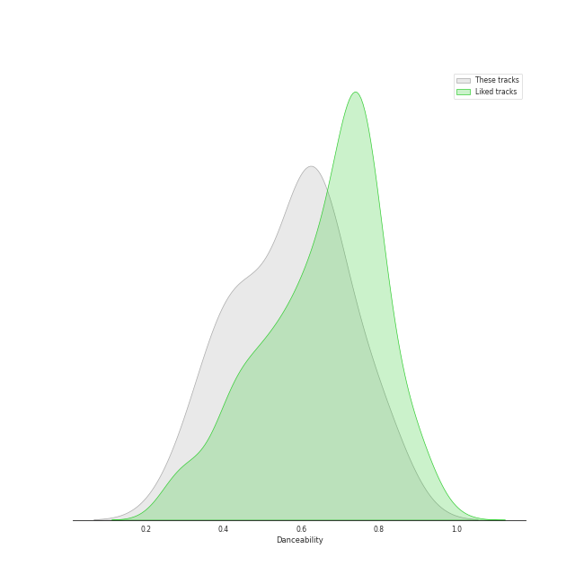
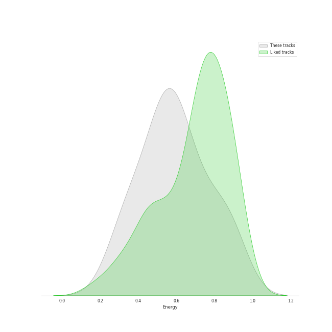
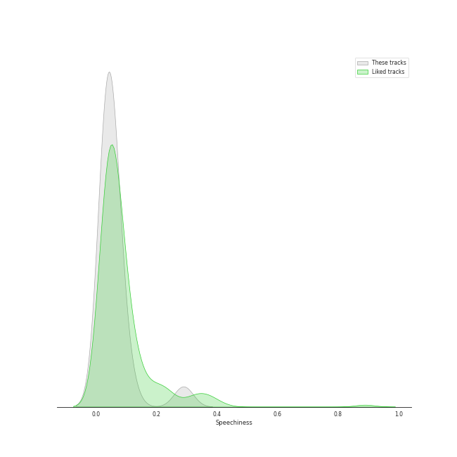
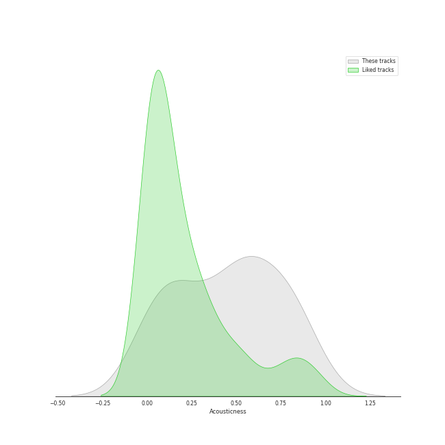
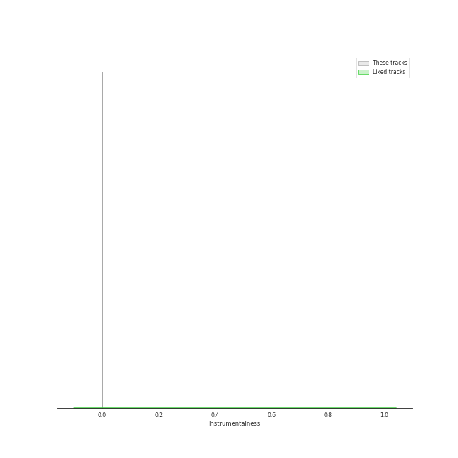
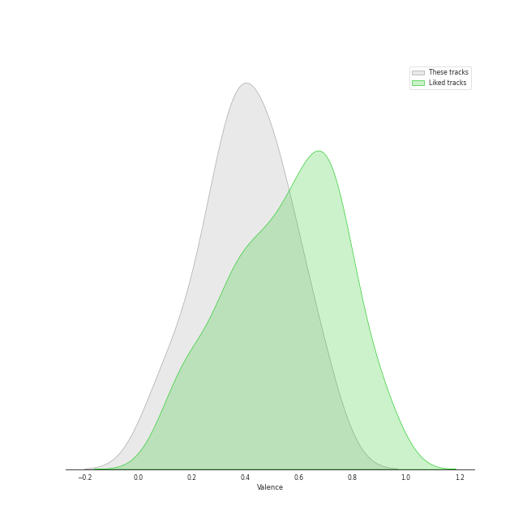

# Audio Features for WENDY

## Danceability

| 10 most Danceable tracks | 10 least Danceable tracks |
|:---|:---|
| 봄인가 봐 Spring Love (0.68) | Miracle (0.302) |
| Why Can't You Love Me? (0.644) | Like Water (0.365) |
| When This Rain Stops (0.624) | Have Yourself A Merry Little Christmas (0.408) |
| Written In The Stars (0.612) | Time After Time (0.415) |
| The Road (0.565) | Doll (0.429) |
| My Day Is Full Of You (0.557) | Goodbye (0.46) |
| Best Friend (with SEULGI) (0.48) | Best Friend (with SEULGI) (0.48) |
| Goodbye (0.46) | My Day Is Full Of You (0.557) |
| Doll (0.429) | The Road (0.565) |
| Time After Time (0.415) | Written In The Stars (0.612) |

## Energy

| 10 most Energetic tracks | 10 least Energetic tracks |
|:---|:---|
| Why Can't You Love Me? (0.879) | Have Yourself A Merry Little Christmas (0.292) |
| The Road (0.628) | Goodbye (0.316) |
| Like Water (0.626) | Miracle (0.385) |
| My Day Is Full Of You (0.59) | 봄인가 봐 Spring Love (0.391) |
| Best Friend (with SEULGI) (0.584) | Written In The Stars (0.519) |
| Doll (0.55) | When This Rain Stops (0.521) |
| Time After Time (0.532) | Time After Time (0.532) |
| When This Rain Stops (0.521) | Doll (0.55) |
| Written In The Stars (0.519) | Best Friend (with SEULGI) (0.584) |
| 봄인가 봐 Spring Love (0.391) | My Day Is Full Of You (0.59) |

## Speechiness

| 10 most Speechy tracks | 10 least Speechy tracks |
|:---|:---|
| Why Can't You Love Me? (0.0689) | Doll (0.0304) |
| Have Yourself A Merry Little Christmas (0.0577) | The Road (0.0307) |
| Best Friend (with SEULGI) (0.0441) | Goodbye (0.0317) |
| Written In The Stars (0.0391) | Miracle (0.0319) |
| Like Water (0.0374) | My Day Is Full Of You (0.034) |
| Time After Time (0.037) | 봄인가 봐 Spring Love (0.0357) |
| When This Rain Stops (0.0365) | When This Rain Stops (0.0365) |
| 봄인가 봐 Spring Love (0.0357) | Time After Time (0.037) |
| My Day Is Full Of You (0.034) | Like Water (0.0374) |
| Miracle (0.0319) | Written In The Stars (0.0391) |

## Acousticness

| 10 most Acoustic tracks | 10 least Acoustic tracks |
|:---|:---|
| Goodbye (0.861) | Why Can't You Love Me? (0.136) |
| Miracle (0.846) | Time After Time (0.253) |
| When This Rain Stops (0.805) | Doll (0.455) |
| Have Yourself A Merry Little Christmas (0.786) | Written In The Stars (0.478) |
| 봄인가 봐 Spring Love (0.723) | The Road (0.529) |
| Like Water (0.648) | My Day Is Full Of You (0.532) |
| Best Friend (with SEULGI) (0.606) | Best Friend (with SEULGI) (0.606) |
| My Day Is Full Of You (0.532) | Like Water (0.648) |
| The Road (0.529) | 봄인가 봐 Spring Love (0.723) |
| Written In The Stars (0.478) | Have Yourself A Merry Little Christmas (0.786) |

## Instrumentalness

| 10 most Instrumental tracks | 10 least Instrumental tracks |
|:---|:---|
| Like Water (6.06e-06) | Miracle (0.0) |
| Have Yourself A Merry Little Christmas (5.83e-06) | Why Can't You Love Me? (0.0) |
| The Road (0.0) | Best Friend (with SEULGI) (0.0) |
| When This Rain Stops (0.0) | My Day Is Full Of You (0.0) |
| 봄인가 봐 Spring Love (0.0) | Goodbye (0.0) |
| Written In The Stars (0.0) | Doll (0.0) |
| Time After Time (0.0) | Time After Time (0.0) |
| Doll (0.0) | Written In The Stars (0.0) |
| Goodbye (0.0) | 봄인가 봐 Spring Love (0.0) |
| My Day Is Full Of You (0.0) | When This Rain Stops (0.0) |

## Liveness

| 10 most Live tracks | 10 least Live tracks |
|:---|:---|
| Time After Time (0.344) | Miracle (0.0808) |
| Doll (0.204) | 봄인가 봐 Spring Love (0.107) |
| Best Friend (with SEULGI) (0.203) | Goodbye (0.111) |
| Written In The Stars (0.189) | The Road (0.111) |
| Why Can't You Love Me? (0.164) | When This Rain Stops (0.112) |
| My Day Is Full Of You (0.133) | Like Water (0.115) |
| Have Yourself A Merry Little Christmas (0.117) | Have Yourself A Merry Little Christmas (0.117) |
| Like Water (0.115) | My Day Is Full Of You (0.133) |
| When This Rain Stops (0.112) | Why Can't You Love Me? (0.164) |
| The Road (0.111) | Written In The Stars (0.189) |

## Valence

| 10 most Happy tracks | 10 least Happy tracks |
|:---|:---|
| Why Can't You Love Me? (0.658) | The Road (0.073) |
| Written In The Stars (0.537) | Time After Time (0.123) |
| Goodbye (0.51) | Have Yourself A Merry Little Christmas (0.232) |
| 봄인가 봐 Spring Love (0.419) | Like Water (0.249) |
| My Day Is Full Of You (0.39) | Doll (0.259) |
| When This Rain Stops (0.382) | Best Friend (with SEULGI) (0.349) |
| Miracle (0.351) | Miracle (0.351) |
| Best Friend (with SEULGI) (0.349) | When This Rain Stops (0.382) |
| Doll (0.259) | My Day Is Full Of You (0.39) |
| Like Water (0.249) | 봄인가 봐 Spring Love (0.419) |

## Tempo

| 10 most Fast tracks | 10 least Fast tracks |
|:---|:---|
| Time After Time (188.781) | My Day Is Full Of You (77.815) |
| Miracle (168.222) | Written In The Stars (80.882) |
| When This Rain Stops (151.759) | Why Can't You Love Me? (81.025) |
| Doll (139.664) | 봄인가 봐 Spring Love (82.861) |
| Goodbye (128.913) | Like Water (83.823) |
| Best Friend (with SEULGI) (115.879) | Have Yourself A Merry Little Christmas (84.846) |
| The Road (97.489) | The Road (97.489) |
| Have Yourself A Merry Little Christmas (84.846) | Best Friend (with SEULGI) (115.879) |
| Like Water (83.823) | Goodbye (128.913) |
| 봄인가 봐 Spring Love (82.861) | Doll (139.664) |
