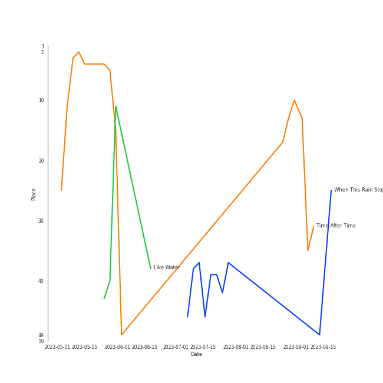

# WENDY

[See Track Features](audio_features.md)

[See Clusters](clusters/overview.md)

## Artist Rank
WENDY is currently:
- The #31 artist of all time
- The #45 artist of the last 6 months
- The #19 artist of the last month

## Top Tracks

- When This Rain Stops is:
    - the #25 track of all time
- Like Water is:
    - the #34 track of the last 6 months
    - the #41 track of all time
- Time After Time is:
    - the #5 track of the last 6 months

### Top tracks of all time over time

### Top tracks of the last 6 months over time

### Top tracks of the last month over time

## Featured on Playlists
| Art | Tracks | Playlist |
|:---|---:|:---|
|  | 7 | [K-Pop](../../playlists/k_pop/overview.md) |
|  | 7 | [Chill](../../playlists/chill/overview.md) |
|  | 3 | [K-Pop Favorites](../../playlists/k_pop_favorites/overview.md) |
|  | 3 | [K-R&B](../../playlists/k_r_b/overview.md) |
|  | 2 | [K-OST](../../playlists/k_ost/overview.md) |
|  | 1 | [K-Pop-Adjacent](../../playlists/k_pop_adjacent/overview.md) |
|  | 1 | [Christmas](../../playlists/christmas/overview.md) |
## Top Albums

| Art | Tracks | 💚 | Album | Release Date | 🔗 |
|:---|---:|---:|:---|:---|:---|
|  | 5 | 5 | Like Water - The 1st Mini Album | 2021-04-05 | [🔗](https://open.spotify.com/album/1Ao5vWPO13f4l0ldwxOKL7) |
|  | 1 | 1 | Written In The Stars | 2018-10-11 | [🔗](https://open.spotify.com/album/08z3DsL7P6RpBR3FgNMSvN) |
|  | 1 | 1 | The Beauty Inside Pt. 6 (Original Television Soundtrack) | 2018-11-06 | [🔗](https://open.spotify.com/album/6w3jg4xGMI5LLr5DEL3zWY) |
|  | 1 | 1 | 2022 Winter SMTOWN : SMCU PALACE | 2022-12-26 | [🔗](https://open.spotify.com/album/1HwnXJfZx8N8qDfzwUbxcw) |
|  | 1 | 0 | 봄인가 봐 Spring Love - SM STATION | 2016-03-04 | [🔗](https://open.spotify.com/album/1DzMyEZcFmD72jdkp4O73D) |
|  | 1 | 0 | The King: Eternal Monarch (Original Television Soundtrack), Pt. 10 | 2020-05-16 | [🔗](https://open.spotify.com/album/02zl7wdcgbI0URRfMbzmF5) |
|  | 1 | 0 | Miracle - SM STATION | 2023-01-26 | [🔗](https://open.spotify.com/album/54O0kItm5ej0HThVMIv5hF) |
|  | 1 | 0 | Have Yourself A Merry Little Christmas - SM STATION | 2016-12-23 | [🔗](https://open.spotify.com/album/3bxhc60UWLrymlDVA21vy2) |
|  | 1 | 0 | Doll - SM STATION | 2017-10-27 | [🔗](https://open.spotify.com/album/6YHteiOLrZ7gfQEqq2TeRM) |

## Top Record Labels

| Tracks | 💚 | Label |
|---:|---:|:---|
| 11 | 7 | [SM Entertainment](../../labels/sm_entertainment/overview.md) |
| 1 | 1 | 스튜디오앤뉴 |
| 1 | 1 | 뮤직앤뉴 |
| 1 | 0 | [Stone Music Entertainment](../../labels/stone_music_entertainment/overview.md) |
| 1 | 0 | [Genie Music Corporation](../../labels/genie_music_corporation/overview.md) |

## Genres

- [k-pop](../../genres/k_pop)
- korean pop

## Tracks

| Art | Track | Album | Artists | Label | 💚 | 🔗 |
|:---|:---|:---|:---|:---|:---|:---|
|  | Time After Time | 2022 Winter SMTOWN : SMCU PALACE | [WENDY](overview.md), [BoA](../boa/overview.md), NINGNING | [SM Entertainment](../../labels/sm_entertainment) | 💚 | [🔗](https://open.spotify.com/track/6LGcOydwjfaquaRgJwlPkK) |
|  | Have Yourself A Merry Little Christmas | Have Yourself A Merry Little Christmas - SM STATION | [WENDY](overview.md), Jay JungJae Moon, Nile Lee | [SM Entertainment](../../labels/sm_entertainment) | | [🔗](https://open.spotify.com/track/6SmFhQAavuPzBm3OUH1Kzs) |
|  | 봄인가 봐 Spring Love | 봄인가 봐 Spring Love - SM STATION | [WENDY](overview.md), Eric Nam | [SM Entertainment](../../labels/sm_entertainment) | | [🔗](https://open.spotify.com/track/6YOXdy9jShw66iOnBzQMKv) |
|  | Doll | Doll - SM STATION | [WENDY](overview.md), [SEULGI](../seulgi/overview.md), KANGTA | [SM Entertainment](../../labels/sm_entertainment) | | [🔗](https://open.spotify.com/track/5Iy48VE6KN7Ywml5hlOd9u) |
|  | Written In The Stars | Written In The Stars | [WENDY](overview.md), John Legend | [SM Entertainment](../../labels/sm_entertainment) | 💚 | [🔗](https://open.spotify.com/track/6SLMyJPRTh2zCX9SJJHTZQ) |
|  | Goodbye | The Beauty Inside Pt. 6 (Original Television Soundtrack) | [WENDY](overview.md) | 뮤직앤뉴, 스튜디오앤뉴 | 💚 | [🔗](https://open.spotify.com/track/2ogfEqGNv9LAzkPY6rjfsi) |
|  | Best Friend (with SEULGI) | Like Water - The 1st Mini Album | [WENDY](overview.md) | [SM Entertainment](../../labels/sm_entertainment) | 💚 | [🔗](https://open.spotify.com/track/0F9Xy6OTbkqOv94pklkwKu) |
|  | Like Water | Like Water - The 1st Mini Album | [WENDY](overview.md) | [SM Entertainment](../../labels/sm_entertainment) | 💚 | [🔗](https://open.spotify.com/track/37LhFxchiyAJVop5JgRZgY) |
|  | The Road | Like Water - The 1st Mini Album | [WENDY](overview.md) | [SM Entertainment](../../labels/sm_entertainment) | 💚 | [🔗](https://open.spotify.com/track/7cXJOM8t8pftyFgYp5Sm1N) |
|  | When This Rain Stops | Like Water - The 1st Mini Album | [WENDY](overview.md) | [SM Entertainment](../../labels/sm_entertainment) | 💚 | [🔗](https://open.spotify.com/track/6mavVLsxaa4YcPje9qZKcf) |

See all tracks

| Art | Track | Album | Artists | Label | 💚 | 🔗 |
|:---|:---|:---|:---|:---|:---|:---|
|  | Why Can't You Love Me? | Like Water - The 1st Mini Album | [WENDY](overview.md) | [SM Entertainment](../../labels/sm_entertainment) | 💚 | [🔗](https://open.spotify.com/track/0CyydmXI4QhgUWrZsPOTXA) |
|  | Miracle | Miracle - SM STATION | [WENDY](overview.md), MeloMance | [SM Entertainment](../../labels/sm_entertainment) | | [🔗](https://open.spotify.com/track/03foRBkthqRkysYT7FxWZV) |
|  | My Day Is Full Of You | The King: Eternal Monarch (Original Television Soundtrack), Pt. 10 | [WENDY](overview.md), ZICO | [Genie Music Corporation](../../labels/genie_music_corporation), [Stone Music Entertainment](../../labels/stone_music_entertainment) | | [🔗](https://open.spotify.com/track/2QWa5RjnIGFwraHDPqlhFh) |

