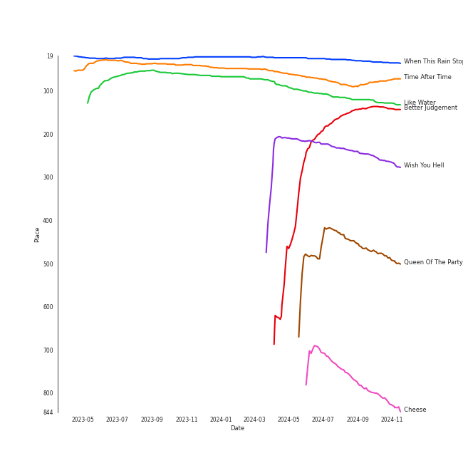
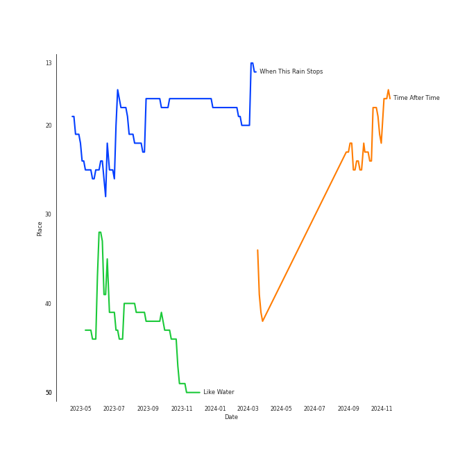
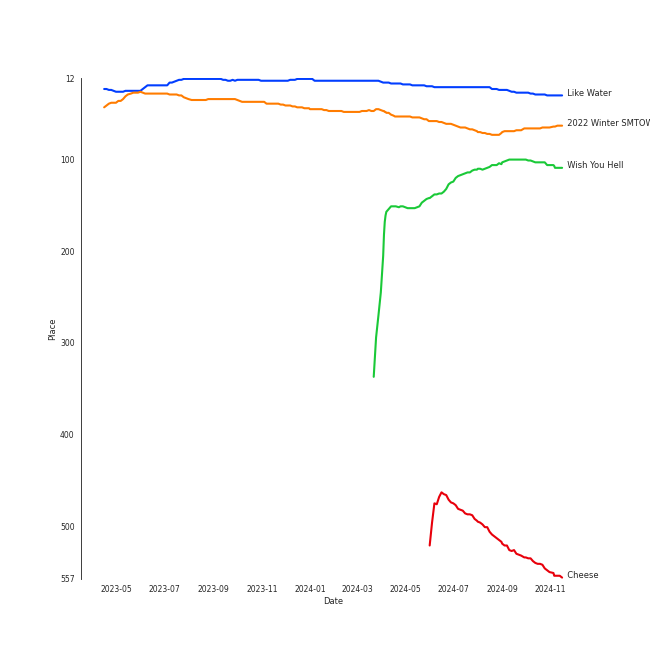

# WENDY

[See Track Features](audio_features.md)

[See Clusters](clusters/overview.md)

## Relationships

WENDY:
- is a member of [GOT the beat](../got_the_beat/overview.md)
- is a member of [Red Velvet](../red_velvet/overview.md)

## Artist Rank
WENDY is currently:
- The #14 artist of the last month
- The #21 artist of the last 6 months
- The #33 artist of the last year
- The #28 artist of all time

## Top Tracks

### Top tracks of all time

Top tracks of the last year over time

Top tracks of the last 6 months over time

## Top Albums

| Art | Rank | Tracks | 💚 | Album | Release Date | 🔗 |
|:---|---:|---:|---:|:---|:---|:---|
|  | 20 | 5 | 5 | Like Water - The 1st Mini Album | 2021-04-05 | [🔗](https://open.spotify.com/album/1Ao5vWPO13f4l0ldwxOKL7) |
|  | 126 | 5 | 4 | Wish You Hell - The 2nd Mini Album | 2024-03-12 | [🔗](https://open.spotify.com/album/3f8n88uX0tNvA8HTROgSkr) |
|  | 592 | 1 | 1 | Written In The Stars | 2018-10-11 | [🔗](https://open.spotify.com/album/08z3DsL7P6RpBR3FgNMSvN) |
|  | 592 | 1 | 1 | The Beauty Inside Pt. 6 (Original Television Soundtrack) | 2018-11-06 | [🔗](https://open.spotify.com/album/6w3jg4xGMI5LLr5DEL3zWY) |
|  | 483 | 1 | 1 | Cheese | 2024-05-20 | [🔗](https://open.spotify.com/album/7qx75T9tAxkomFYsmFADV1) |
|  | 63 | 1 | 1 | 2022 Winter SMTOWN : SMCU PALACE | 2022-12-26 | [🔗](https://open.spotify.com/album/1HwnXJfZx8N8qDfzwUbxcw) |
|  | 592 | 1 | 0 | 봄인가 봐 Spring Love - SM STATION | 2016-03-04 | [🔗](https://open.spotify.com/album/1DzMyEZcFmD72jdkp4O73D) |
|  | 592 | 1 | 0 | The King : Eternal Monarch, Pt. 10 (Original Television Soundtrack) | 2020-05-16 | [🔗](https://open.spotify.com/album/02zl7wdcgbI0URRfMbzmF5) |
|  | 592 | 1 | 0 | Miracle - SM STATION | 2023-01-26 | [🔗](https://open.spotify.com/album/54O0kItm5ej0HThVMIv5hF) |
|  | 592 | 1 | 0 | Have Yourself A Merry Little Christmas - SM STATION | 2016-12-23 | [🔗](https://open.spotify.com/album/3bxhc60UWLrymlDVA21vy2) |

See all albums

| Art | Rank | Tracks | 💚 | Album | Release Date | 🔗 |
|:---|---:|---:|---:|:---|:---|:---|
|  | 592 | 1 | 0 | Doll - SM STATION | 2017-10-27 | [🔗](https://open.spotify.com/album/6YHteiOLrZ7gfQEqq2TeRM) |

## Featured on Playlists
| Art | Tracks | Playlist |
|:---|---:|:---|
|  | 13 | [K-Pop](../../playlists/k-pop/overview.md) |
|  | 6 | [Chill](../../playlists/chill/overview.md) |
|  | 4 | [Relax](../../playlists/relax/overview.md) |
|  | 3 | [K-Pop-Adjacent](../../playlists/k-pop-adjacent/overview.md) |
|  | 2 | [K-Pop Favorites](../../playlists/k-pop_favorites/overview.md) |
|  | 2 | [K-OST](../../playlists/k-ost/overview.md) |
|  | 1 | [Recent Comebacks](../../playlists/recent_comebacks/overview.md) |
|  | 1 | [Your Top Songs 2022](../../playlists/your_top_songs_2022/overview.md) |
|  | 1 | [Your Top Songs 2023](../../playlists/your_top_songs_2023/overview.md) |
|  | 1 | [Not K-Pop](../../playlists/not_k-pop/overview.md) |
|  | 1 | [Recommendations for Jeff](../../playlists/recommendations_for_jeff/overview.md) |
|  | 1 | [Recommendations for Chris](../../playlists/recommendations_for_chris/overview.md) |
|  | 1 | [Christmas](../../playlists/christmas/overview.md) |

## Top Record Labels

| Tracks | 💚 | Label |
|---:|---:|:---|
| 17 | 12 | [SM Entertainment](../../labels/sm_entertainment/overview.md) |
| 1 | 1 | 스튜디오앤뉴 |
| 1 | 1 | 뮤직앤뉴 |
| 1 | 0 | [Stone Music Entertainment](../../labels/stone_music_entertainment/overview.md) |
| 1 | 0 | [Genie Music Corporation](../../labels/genie_music_corporation/overview.md) |

## Genres

- [k-pop](../../genres/k-pop/overview.md)
- [korean pop](../../genres/korean_pop/overview.md)

## Credits

### Credits by Type

| Credit Type | Tracks |
|:---|---:|
| Vocal | 16 |

## Tracks

| Art | Track | Album | Artists | Label | Rank | 💚 | 🔗 |
|:---|:---|:---|:---|:---|---:|:---|:---|
|  | When This Rain Stops | Like Water - The 1st Mini Album | [WENDY](overview.md) | [SM Entertainment](../../labels/sm_entertainment) | 25 | 💚 | [🔗](https://open.spotify.com/track/6mavVLsxaa4YcPje9qZKcf) |
|  | Time After Time | 2022 Winter SMTOWN : SMCU PALACE | [BoA](../boa/overview.md), [WENDY](overview.md), NINGNING | [SM Entertainment](../../labels/sm_entertainment) | 76 | 💚 | [🔗](https://open.spotify.com/track/6LGcOydwjfaquaRgJwlPkK) |
|  | Like Water | Like Water - The 1st Mini Album | [WENDY](overview.md) | [SM Entertainment](../../labels/sm_entertainment) | 107 | 💚 | [🔗](https://open.spotify.com/track/37LhFxchiyAJVop5JgRZgY) |
|  | Better Judgement | Wish You Hell - The 2nd Mini Album | [WENDY](overview.md) | [SM Entertainment](../../labels/sm_entertainment) | 180 | 💚 | [🔗](https://open.spotify.com/track/0CjGCpqs4qBqZi7ibYyZLi) |
|  | Wish You Hell | Wish You Hell - The 2nd Mini Album | [WENDY](overview.md) | [SM Entertainment](../../labels/sm_entertainment) | 234 | 💚 | [🔗](https://open.spotify.com/track/7b8SkcdeiTuo6FQXdPgPWW) |
|  | Queen Of The Party | Wish You Hell - The 2nd Mini Album | [WENDY](overview.md) | [SM Entertainment](../../labels/sm_entertainment) | 380 | 💚 | [🔗](https://open.spotify.com/track/7owXmiwfpFAZW24qNPyYfr) |
|  | Cheese | Cheese | SUHO, [WENDY](overview.md) | [SM Entertainment](../../labels/sm_entertainment) | 715 | 💚 | [🔗](https://open.spotify.com/track/6x5mCFqbpUfjAq6Egyjl2c) |
|  | 봄인가 봐 Spring Love | 봄인가 봐 Spring Love - SM STATION | [WENDY](overview.md), Eric Nam | [SM Entertainment](../../labels/sm_entertainment) | 882 | | [🔗](https://open.spotify.com/track/6YOXdy9jShw66iOnBzQMKv) |
|  | Have Yourself A Merry Little Christmas | Have Yourself A Merry Little Christmas - SM STATION | Jay JungJae Moon, [WENDY](overview.md), Nile Lee | [SM Entertainment](../../labels/sm_entertainment) | 882 | | [🔗](https://open.spotify.com/track/6SmFhQAavuPzBm3OUH1Kzs) |
|  | Doll | Doll - SM STATION | [WENDY](overview.md), [SEULGI](../seulgi/overview.md), KANGTA | [SM Entertainment](../../labels/sm_entertainment) | 882 | | [🔗](https://open.spotify.com/track/5Iy48VE6KN7Ywml5hlOd9u) |

See all tracks

| Art | Track | Album | Artists | Label | Rank | 💚 | 🔗 |
|:---|:---|:---|:---|:---|---:|:---|:---|
|  | Written In The Stars | Written In The Stars | [WENDY](overview.md), John Legend | [SM Entertainment](../../labels/sm_entertainment) | 882 | 💚 | [🔗](https://open.spotify.com/track/6SLMyJPRTh2zCX9SJJHTZQ) |
|  | Goodbye | The Beauty Inside Pt. 6 (Original Television Soundtrack) | [WENDY](overview.md) | 뮤직앤뉴, 스튜디오앤뉴 | 882 | 💚 | [🔗](https://open.spotify.com/track/2ogfEqGNv9LAzkPY6rjfsi) |
|  | My Day Is Full Of You | The King : Eternal Monarch, Pt. 10 (Original Television Soundtrack) | ZICO, [WENDY](overview.md) | [Genie Music Corporation](../../labels/genie_music_corporation), [Stone Music Entertainment](../../labels/stone_music_entertainment) | 882 | | [🔗](https://open.spotify.com/track/2QWa5RjnIGFwraHDPqlhFh) |
|  | Best Friend (with SEULGI) | Like Water - The 1st Mini Album | [WENDY](overview.md) | [SM Entertainment](../../labels/sm_entertainment) | 882 | 💚 | [🔗](https://open.spotify.com/track/0F9Xy6OTbkqOv94pklkwKu) |
|  | The Road | Like Water - The 1st Mini Album | [WENDY](overview.md) | [SM Entertainment](../../labels/sm_entertainment) | 882 | 💚 | [🔗](https://open.spotify.com/track/7cXJOM8t8pftyFgYp5Sm1N) |
|  | Why Can't You Love Me? | Like Water - The 1st Mini Album | [WENDY](overview.md) | [SM Entertainment](../../labels/sm_entertainment) | 882 | 💚 | [🔗](https://open.spotify.com/track/0CyydmXI4QhgUWrZsPOTXA) |
|  | Miracle | Miracle - SM STATION | [WENDY](overview.md), MeloMance | [SM Entertainment](../../labels/sm_entertainment) | 882 | | [🔗](https://open.spotify.com/track/03foRBkthqRkysYT7FxWZV) |
|  | His Car Isn't Yours | Wish You Hell - The 2nd Mini Album | [WENDY](overview.md) | [SM Entertainment](../../labels/sm_entertainment) | 882 | 💚 | [🔗](https://open.spotify.com/track/5cvwFPDokfdI6T7O0HgzuM) |
|  | Vermilion | Wish You Hell - The 2nd Mini Album | [WENDY](overview.md) | [SM Entertainment](../../labels/sm_entertainment) | 882 | | [🔗](https://open.spotify.com/track/3Oo9zqlxcXNEaINhiXOrBm) |

