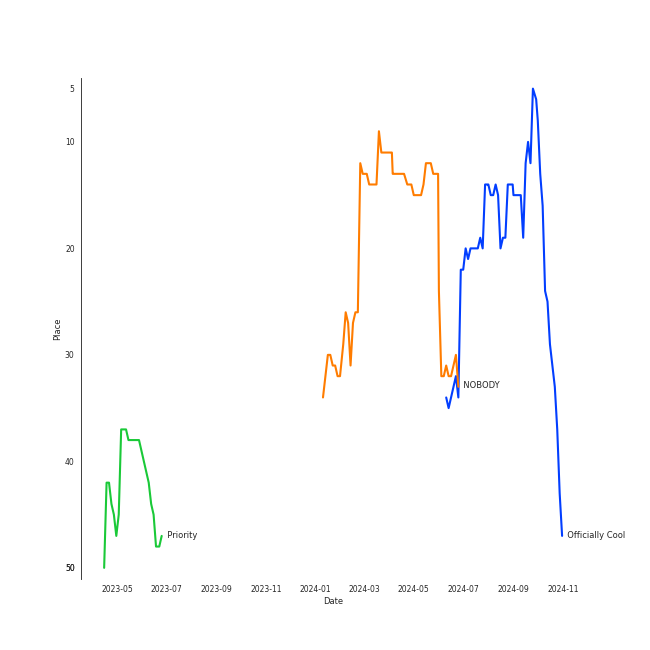

# WINTER

## Relationships

WINTER:
- is a member of [GOT the beat](../got_the_beat/overview.md)
- is a member of [aespa](../aespa/overview.md)

## Artist Rank

## Top Tracks

### Top tracks of the last 6 months over time

## Featured on Playlists
| Art | Tracks | Playlist |
|:---|---:|:---|
|  | 4 | [K-Pop](../../playlists/k-pop/overview.md) |
|  | 3 | [K-OST](../../playlists/k-ost/overview.md) |
|  | 3 | [Chill](../../playlists/chill/overview.md) |
|  | 1 | [K-Pop Favorites](../../playlists/k-pop_favorites/overview.md) |
|  | 1 | [Recent Comebacks](../../playlists/recent_comebacks/overview.md) |

## Top Albums

| Art | Tracks | 💚 | Album | Release Date | 🔗 |
|:---|---:|---:|:---|:---|:---|
|  | 2 | 1 | 2022 Winter SMTOWN : SMCU PALACE | 2022-12-26 | [🔗](https://open.spotify.com/album/1HwnXJfZx8N8qDfzwUbxcw) |
|  | 1 | 1 | Our Blues, Pt. 10 (Original Television Soundtrack) | 2022-05-22 | [🔗](https://open.spotify.com/album/0mP330aRyX4P4ZjarRKnXO) |
|  | 1 | 1 | NOBODY | 2023-11-16 | [🔗](https://open.spotify.com/album/1Y48ZHmfvedT16bNakv13v) |
|  | 1 | 1 | Floral Sense - The 1st Album (Special Version) | 2023-02-27 | [🔗](https://open.spotify.com/album/3GiIDO4BTLwJuZWQszk4Tg) |
|  | 1 | 1 | CASTAWAY DIVA OST Part.8 | 2023-11-19 | [🔗](https://open.spotify.com/album/5nV389t1fA2IIlIxflp4EK) |
|  | 1 | 0 | WINTER of aespa X MY DEMON | 2023-12-08 | [🔗](https://open.spotify.com/album/7EXrNMKKkkE3hRBpeZcT6y) |

## Top Record Labels

| Tracks | 💚 | Label |
|---:|---:|:---|
| 3 | 2 | [SM Entertainment](../../labels/sm_entertainment/overview.md) |
| 1 | 1 | Studio Beyond |
| 1 | 1 | [Stone Music Entertainment](../../labels/stone_music_entertainment/overview.md) |
| 1 | 1 | Music Buddy |
| 1 | 1 | [Genie Music Corporation](../../labels/genie_music_corporation/overview.md) |
| 1 | 0 | SBS Contents Hub Co. |

## Credits

### Credits by Type

| Credit Type | Tracks |
|:---|---:|
| Vocal | 1 |

## Top Producers

| Art | Producer | Tracks | Credit Types |
|:---|:---|---:|:---|
| | Maria Marcus | 1 | Songwriter |
| | 최우석 (Choi, Wooseok) | 1 | Producer |
| | 권유진 (Kwon, Eu-gene) | 1 | Producer |
| | 박근태 (Park, Keun-Tae) | 1 | Songwriter |
| | VENDORS | 1 | Arranger, Songwriter |
| | 서지음 (Seo, Ji Eum) | 1 | Lyricist |
| | Jang Yi-jeong | 1 | Arranger, Songwriter |
| | 정의석 (Jung, Euisuk) | 1 | Producer |
| | 신재빈 (Shin, Jae Bin) | 1 | Producer |
| | 우민정 (Umin, Je-ong) | 1 | Producer |

## Tracks

| Art | Track | Album | Artists | Label | 💚 | 🔗 |
|:---|:---|:---|:---|:---|:---|:---|
|  | Jet | 2022 Winter SMTOWN : SMCU PALACE | EUNHYUK, HYO, TAEYONG, JAEMIN, SUNGCHAN, [WINTER](overview.md), GISELLE | [SM Entertainment](../../labels/sm_entertainment) | | [🔗](https://open.spotify.com/track/7F0KfW5f4rWm503sbAuVeW) |
|  | NOBODY | NOBODY | [JEON SOYEON](../jeon_soyeon/overview.md), [WINTER](overview.md), LIZ (IVE) | Studio Beyond | 💚 | [🔗](https://open.spotify.com/track/4loUHO28CuvSbEiZXId1BD) |
|  | Priority | 2022 Winter SMTOWN : SMCU PALACE | MAX CHANGMIN, [TAEYEON](../taeyeon/overview.md), [WINTER](overview.md) | [SM Entertainment](../../labels/sm_entertainment) | 💚 | [🔗](https://open.spotify.com/track/79musoVrfPaVxoMSBFJYuc) |
|  | ONCE AGAIN | Our Blues, Pt. 10 (Original Television Soundtrack) | [WINTER](overview.md), NINGNING | [Genie Music Corporation](../../labels/genie_music_corporation), [Stone Music Entertainment](../../labels/stone_music_entertainment) | 💚 | [🔗](https://open.spotify.com/track/5vsjD4VbQzkUUlvwFOhppn) |
|  | Voyage | CASTAWAY DIVA OST Part.8 | [WINTER](overview.md) | Music Buddy | 💚 | [🔗](https://open.spotify.com/track/3NAHK3gLOVmkOVoSmMJvOu) |
|  | With You | WINTER of aespa X MY DEMON | [WINTER](overview.md) | SBS Contents Hub Co., Ltd. | | [🔗](https://open.spotify.com/track/4yZAAPTLlEb60Ny7bhepqx) |
|  | Floral Sense | Floral Sense - The 1st Album (Special Version) | YESUNG, [WINTER](overview.md) | [SM Entertainment](../../labels/sm_entertainment) | 💚 | [🔗](https://open.spotify.com/track/7kqCeZ0OmIWDXoo6h9GMpw) |
