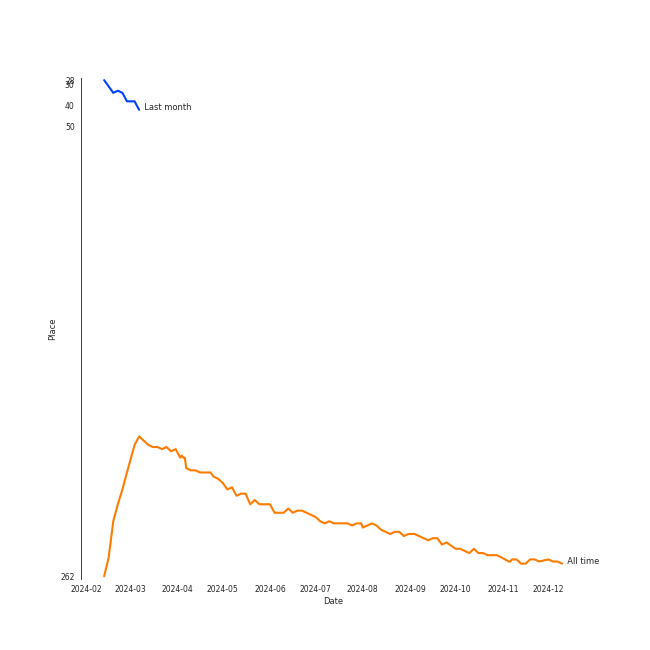
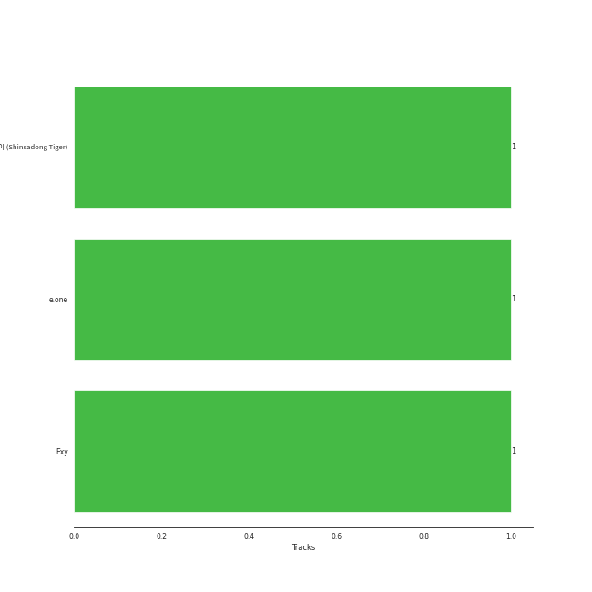

# WJSN

## Relationships

WJSN:
- has member 보나 (Bona)
- has member 程潇 (Cheng, Xiao)
- has member 다원 (Dawon)
- has member 다영 (Dayoung)
- has member 은서 (Eunseo)
- has member Exy
- has member 루다 (Luda)
- has member 孟美岐 (Meng, Mei Qi)
- has member 설아 (SeolA)
- has member 수빈 (Soobin)
- has member 吴宣仪 (Wu, Xuan Yi)
- has member 여름 (Yeoreum)
- has member 유연정 (Yoo, Yeon-jung)

## Artist Rank
- The #256 artist of all time

## Top Albums

| Art | Rank | Tracks | 💚 | Album | Release Date | 🔗 |
|:---|---:|---:|---:|:---|:---|:---|
|  | 690 | 1 | 1 | UNNATURAL | 2021-03-31 | [🔗](https://open.spotify.com/album/0uD1Chx5ZsnZM4kS8yK0S8) |
|  | 690 | 1 | 1 | THE SECRET | 2016-08-17 | [🔗](https://open.spotify.com/album/0usNbLkckzIo34wUPehZdh) |
|  | 690 | 1 | 1 | Sequence | 2022-07-05 | [🔗](https://open.spotify.com/album/2Cv3xionHF2O7QL8p6MbCT) |
|  | 690 | 1 | 1 | Neverland | 2020-06-09 | [🔗](https://open.spotify.com/album/5DHseF14USVgIZ6AzsX9bi) |
|  | 690 | 1 | 1 | HAPPY MOMENT (1) | 2017-06-07 | [🔗](https://open.spotify.com/album/4nnyYQGOKRU090FK7sfunL) |
|  | 690 | 1 | 1 | <Queendom2> FINAL | 2022-05-27 | [🔗](https://open.spotify.com/album/5ZorEUDqewnEygf4FAOjhm) |

## Featured on Playlists
| Art | Tracks | Playlist |
|:---|---:|:---|
|  | 6 | [K-Pop](../../playlists/k-pop/overview.md) |
|  | 1 | [Summer](../../playlists/summer/overview.md) |
|  | 1 | [K-Pop 101](../../playlists/k-pop_101/overview.md) |
|  | 1 | [K-Pop Favorites](../../playlists/k-pop_favorites/overview.md) |
|  | 1 | [애교！](../../playlists/애교！/overview.md) |

## Top Record Labels

| Tracks | 💚 | Label |
|---:|---:|:---|
| 5 | 5 | [Starship Entertainment](../../labels/starship_entertainment/overview.md) |
| 1 | 1 | [Genie Music Corporation](../../labels/genie_music_corporation/overview.md) |

## Genres

- [k-pop](../../genres/k-pop/overview.md)
- [k-pop girl group](../../genres/k-pop_girl_group/overview.md)

## Credits

### Member Credits

| | Exy |
|:---|---:|
| Lyricist | 2 |
### Production Credits

| Art | Track | Members | Credit Types |
|:---|:---|:---|:---|
|  | Secret | Exy | Lyricist |
|  | Lips | Exy | Lyricist |

## Top Producers

| Art | Producer | Tracks | Credit Types |
|:---|:---|---:|:---|
| | 신사동호랭이 (Shinsadong Tiger) | 1 | Arranger |
| | e.one | 1 | Arranger, Lyricist, Songwriter |
| | Exy | 1 | Lyricist |

## Tracks

| Art | Track | Album | Artists | Label | Rank | 💚 | 🔗 |
|:---|:---|:---|:---|:---|---:|:---|:---|
|  | Secret | THE SECRET | [WJSN](overview.md) | [Starship Entertainment](../../labels/starship_entertainment) | 1054 | 💚 | [🔗](https://open.spotify.com/track/1OIb1AalkGikhzCRbWgchd) |
|  | Babyface | HAPPY MOMENT (1) | [WJSN](overview.md) | [Starship Entertainment](../../labels/starship_entertainment) | 1054 | 💚 | [🔗](https://open.spotify.com/track/6l6sytFAfe0esA5DYLwqhE) |
|  | Pantomime | Neverland | [WJSN](overview.md) | [STARSHIP ENTERTAINMENT](../../labels/starship_entertainment) | 1054 | 💚 | [🔗](https://open.spotify.com/track/4lPsBlof2cjAIArw0nOGvQ) |
|  | UNNATURAL | UNNATURAL | [WJSN](overview.md) | [STARSHIP ENTERTAINMENT](../../labels/starship_entertainment) | 1054 | 💚 | [🔗](https://open.spotify.com/track/1eykKBqxHgasGHwjOQIvbt) |
|  | AURA | <Queendom2> FINAL | [WJSN](overview.md) | [Genie Music Corporation](../../labels/genie_music_corporation) | 1054 | 💚 | [🔗](https://open.spotify.com/track/4jP982FpZoDv729D0X8BiN) |
|  | Last Sequence | Sequence | [WJSN](overview.md) | [STARSHIP ENTERTAINMENT](../../labels/starship_entertainment) | 1054 | 💚 | [🔗](https://open.spotify.com/track/0lNPjT58llQGlycRA2mea4) |
